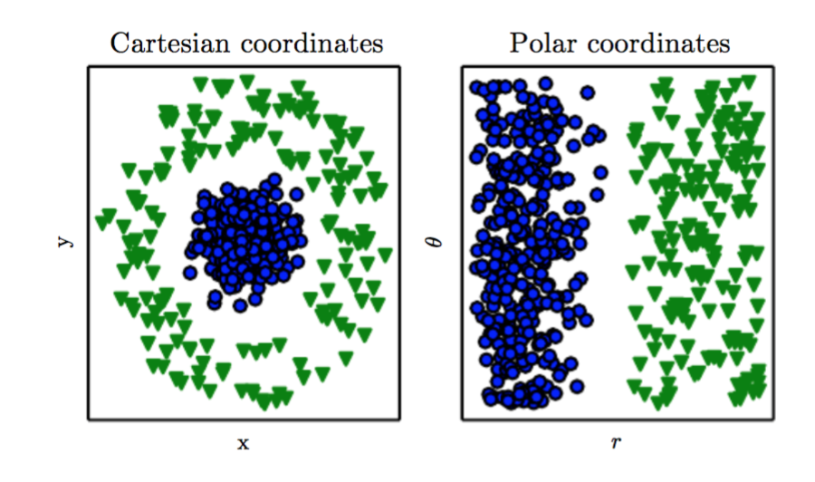
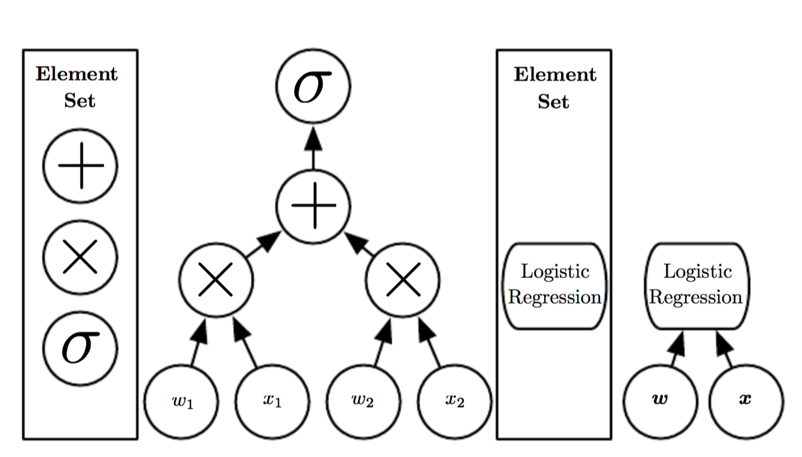
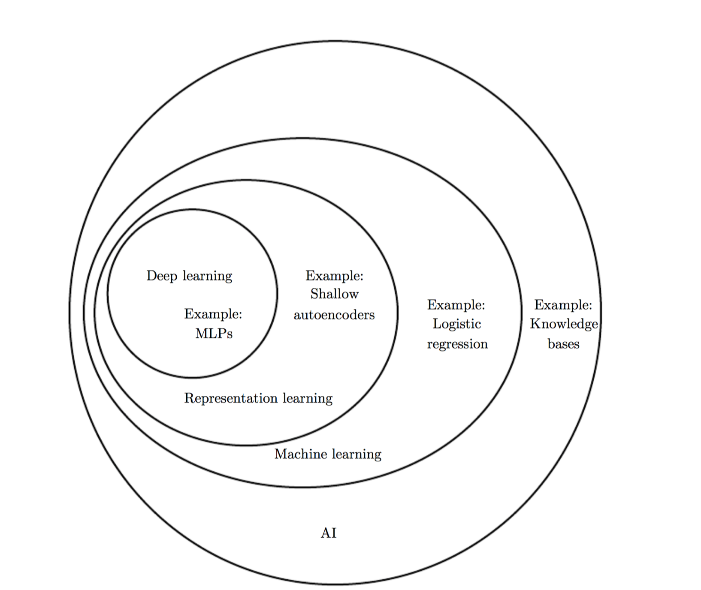
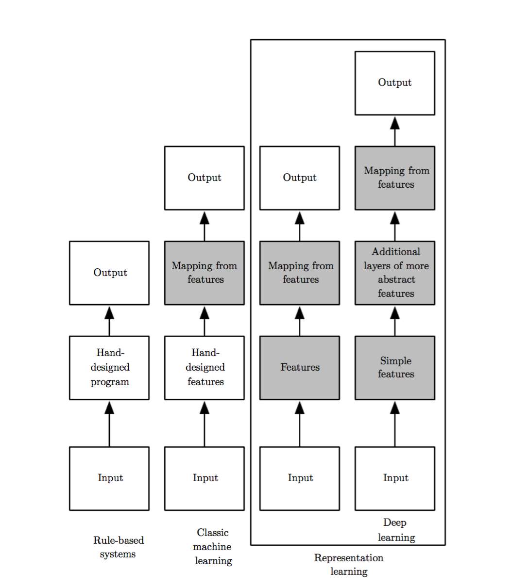
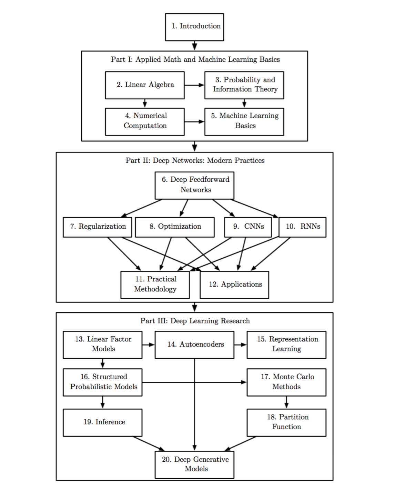
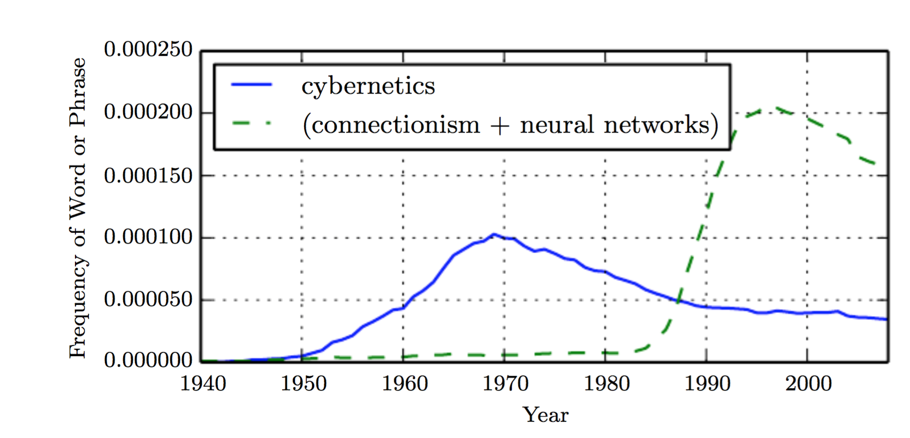

# Chapter 1 Introduction

长久以来，发明家们都期望着能够发明一台可以思考的机器。从古希腊时期人们就开始有了这样一个愿望。神话中的人物皮格马利翁，代达罗斯，火神赫菲斯托斯都可以被当做这种神奇的发明家，他们所创造的伽拉忒亚，塔洛斯，潘多拉都可以被当做是人造的生命。(Ovid and Martin, 2004;Sparkes,1996;Tandy, 1997).

当可编程的计算机被发明以来，人们就在好奇，他们是否会变得智能，经过了100多年的发展（Lovelace,1842）.现在，人工智能（AI）已经变成了一个不可忽视的领域，有很多实用的方法以及活跃的研究领域。我们可以看到，已经有一些智能软件可以自动的处理日常劳动，理解语音或者图像，进行医学诊断，为一些基础科学研究提供支持。

在人工智能的早期，这个领域快速的发展，并解决了很多对于人类而言都会有些困难的问题不过这些问˜题都和计算机是强相关的，这些问题可以被描述为一组规则化的数学公式。但是，人工智能的难点在于解决哪些人类很轻松就理解，但是却难以被正规化的问题--那些我们靠直觉解决的问题，那种自动的感觉，就像识别说出的单词，或者图像中的脸。

本书主要是为了解决这种更加靠直觉解决的问题。这种解决方法使得计算机可以从经验中进行学习，并且以一种分层的概念的形式去理解世界，而每一个概念又都依赖于更加简单的概念。通过从经验中学习知识，就省去了人类对“知识的操作”--格式化以便使电脑接收。层级的概念结构使得电脑可以根据小的概念去学习复杂的概念。如果我们要图形化表示这些概念的结构的话，那么这个图会很深，有很多层。基于这个原因，我们把这种尝试实现AI的方法称为deep learning。

很多早期的成功的AI都是应用于相对干净，格式化的环境中，不需要电脑有着很多的现实的知识。比如，IBM的深蓝，曾在1997年击败了世界象棋冠军Garry Kasparov（Hsu,202）。象棋当然是一个很简单的小世界，仅仅有64个位置和32个棋子，这些棋子又必须按照固定的路走。设计一个成功的象棋策略是很了不起的，不过难点并不在于描述想起环境和可能的行动。象棋的规则可以的通过一些规则来进行完整的描述，这对于程序员来说很简单。

不过讽刺的是，抽象的，格式化的任务是人类在电脑上实现智能的一个难题。电脑很早以前就在象棋上击败人类的世界冠军，但是近年来才能在某些比赛中达到人类图像识别和语音识别的平均水平。一个人的日常生活中就需要大量的关于世界的知识。这些知识大多数都是主观的，凭借只觉得，因此，也就很难去构建成格式化的。电脑需要去捕获这些知识才能够得到一些智能的行为。所以人工智能一个的重要挑战就是让这些信息知识被电脑所接受。

一些人工智能的项目致力于将世界的信息知识以一种形式化的语言，硬编码。电脑就可以使用一些逻辑规则去自动的接受这些知识。这种尝试实现AI的方法被称为“基于知识的方法”。这些项目没能取得重大的成功。其中很著名的一个叫做Cyc（Lenat and Guha, 1989）。Cyc是一个推理引擎，也是一个状态型数据库，使用CycL语言。他的状态都是由人的监督下进行输入的。这是一个很复杂的过程。人们也在构建能足够完善的准确描述出现实世界的规则上陷入了挣扎。比如Cyc并不能理解一个讲述了“一个叫Fred的人在早上刮胡子”的故事（Linde, 1992）。推理引擎发现了故事中一些前后矛盾的事情，他认为，人类是没有带电的，但是因为Fred拿了一个电动刮胡刀，他就认为“FredWhileShaving”。包含了带电的部分。因此就开始疑惑，在刮胡子的时候Fred是否是一个人，

这些依赖于硬编码的系统的例子告诉我们，一个AI系统需要有从原始数据中抽取知识的的能力。这种能力也被称为机器学习。机器学习的引入允许计算机处理那些包括现实世界的知识，需要主观判断的问题。一个简单的机器学习算法“逻辑回归”可以用来推荐是否进行剖腹产手术（Mor-Yosef et al.,1990）。另一种简单的机器学习算法，朴素贝叶斯，可以判断邮件是正常的邮件还是垃圾邮件。

这些简单的机器学习算法非常的依赖于数据的表示。比如当使用逻辑回归用来进行剖腹产推荐的时候，AI系统并不会直接检查病人，相反的，医生告诉系统一些有关信息，比如子宫疤痕的大小，等等。表示中的每一条数据被称为特征。逻辑回归用来学习这些特征是怎么和那些不同的结果之间关联的。不过它不能从任何角度对这些特征进行影响。如果我们将病人的核磁共振图像输入到逻辑回归，而不是医生处理过后的数据，它就并不能进行有效的预测。核磁共振扫描图像的每一个像素都对剖腹产是否会发生意外有着微妙的影响。

这种对于表示的依赖在计算机科学和日常生活中普遍存在着。在计算机科学中，比如搜索这种操作，如果数据是结构化的，有着良好的索引的，那么搜索的处理速度就会很快。人们在计算阿拉伯数字的时候很快，但是如果计算罗马数字那就有些耗时了。所以，选择合适的数据表达形式对于机器学习算法效果有着巨大的影响。比如一个简单的可视化的例子，如下图。
 
fig1.1 :关于数据表示的例子：假设我们想要在两种数据的分布图中画一条线将两种数据分类。在左边的图中，我们使用笛卡尔坐标来表示数据，这个任务就不可能做到了。但是在右边的图中，我们使用极坐标，这个时候我们就可以通过一条直线很轻易地能够完成分类任务。（数据来自David Warde-Farley）

 很多人工智能的任务其实都可以通过对任务进行良好的特征抽取，将这些特征输入到简单的机器学习算法中解决。比如在说话人识别中一个很有用的特征就是讲话人的声道。这是分辨男人，女人还是孩子的一个很有用的线索。

 然而，对于很多任务，很难说去确定哪些特征应该被抽取。比如，假设我们想要写一个程序来识别照片中的车辆。我们知道，汽车有轮子，所以，我们想用轮子的出现作为车辆的特征。不幸的是，我们却很难用像素来描述车轮到底是什么样的。轮子有着简单的几何形状，但是在照片中，却可能因为有车轮的影子，阳光照射，挡泥板，轮毂等其他在车轮周围的物品所影响，而显得很复杂。

解决这个问题(数据的表示对于结果的影响)的一个方法是使用机器学习方法去学习数据的表示，而不仅仅是学习从数据的表示到输出结果的映射。这种方法被称为“表示学习”。这种学习出来的表示往往能比人工“硬设计”的表示得到更好的结果。这种方法同样可以使得人工智能系统在最小的人工干预下能够迅速的应用到新的任务上一个表示学习算法可以在几分钟内就能得到一个简单任务的不错的特征集合，而对于复杂任务也可以在几个小时或者几个月内得到。人工手动的设计特征的话，复杂任务会消耗大量的时间和努力，会占用几十个或者一整个社区的研究者。

一个典型的特征学习算法就是“autoencoder”（aka自动编码器），一个自动编码器包含一个编码“encoder”函数，这个函数将输入转化成不同的特征表示，和一个解码“decoder”函数，将新的特征表示转换回原有的格式。自动编码器的训练会尽可能的将数据通过编码器和解码器后保留信息，同时也会使得新的数据有着良好的性质。不同的自动编码器希望得到不同的性质。

当设计一个学习特征的算法或是特征的时候，我们的目标通常是希望能够分离出“主要的变量”来解释观察到的数据。在这种情境下，我们使用“factor”这个词来简单的表示独立的，不同的影响力来源；这些“factor”之间通常不会是关联的。这些“factor”大多数也不会是能够被直接观察到的。相反的，他们会存在在那些不易观测的对象上，或者以一种难以察觉的方式来影响现实世界中那些能被观察到的现象。他们同样会存在于人类的思维中，是人们对于现实世界或者观测到的数据的简化或是推理。他们会是概念或者抽象，来帮助我们建立对于数据的多样理解。当对讲话录音进行分析时，“factor”会是讲话者的年龄，性别，口音，以及他们所说的单词。当对一幅车的图片进行分析时“factor”会包含车的位置，颜色，阳光的角度以及强度。

在很多现实世界的人工智能应用中，主要的困难，来源于很多特征可能仅仅影响我们的观测数据的一小部分。一个关于红色骑车的照片上的像素点，有可能会很接近黑色。而车的轮廓往往取决于看的角度。所以，在很多应用中，都需要我们去清理这些“factor”，忽略那些我们不在意的。

当然了，从原始数据中抽取这种高度抽象的特征是很难的。很多数据的“factor”比如讲话者的口音，都需要高级的，近乎人类的对数据的理解才能抽离出。所以，当这种特征表示抽取的难度和解决原始问题的难度很接近的时候，表示学习看起来对我们就没什么帮助了。

深度学习通过对简单的表示的组合，组合成高级的表示来解决这个表示学习的核心问题。深度学习使得计算机可以依据简单的概念构建复杂的概念。图1.2展示了一个深度学习系统如何通过对“角”，“边”的学习，得到对照片中的人的概念的学习。

fig1.2 :这是一个深度学习模型的流程。对于计算机而言，很难去理解原始数据的意义，这里是一个由像素值组成的图像。将一个像素的集合映射到物体的识别上是很复杂的。学习或者评估这个映射，是很难直接处理的。深度学习通过将这个复杂的过程拆分成一系列简单的映射，每种映射都由网络中得以层来进行。图像的输入是可见层，因为他的变量是我们能够看到的。然后就是一系列的隐藏层，在处理图像中越来越抽象的特征。这些层被称为隐藏层，因为他们的输入并不是我们提供的，相反的这些层是自己去探查哪些概念是有用的，能够处理可观测数据的关系的。图像在这里是一种可视化的特征，被每一个隐藏神经元表示。第一层隐藏神经元可以轻易的从给的像素中，通过比较亮度以及相邻的像素识别出边。第二层隐藏神经元又可以从第一层给出的边中识别出角以及轮廓。第三层神经元又可以从第二层给出的边和轮廓中通过寻找相应的组合从而识别出特定物体。最后，这个网络就可以用来识别图像中的物体了。

深度学习模型的一个典型例子就是深度前馈网络，或者说多层感知机multilayer perceptorn。一个多层感知机其实就是一种数学映射，将输入的值映射到输出的值上。整个函数其实就是通过很多简单的函数组成的。我们可以认为每种不同的数学函数其实都提供了对输入的新的表示。

学习数据的正确表达是深度学习的一种视角。另一种关于深度学习的观点是他的深度使得计算机能够学习一种“multi-step”的计算机程序。每层的表示都可以认为是一种计算机在执行其他并行的执行指令集合的时候的内存状态。有着更深的神经网络可以执行更多的指令。序列化的指令提供了强有力的支持，使得后面的指令可以表示前面的指令结果。通过这种表示深度学习的视角来看并不是每一层的所有激活值的信息都是解释输入的有意义的encode factor。这些信息也有可能是存储着那些理解输入的程序的状态信息。他对于输入并没有任何特别的贡献，但是却能够帮助模型组织处理过程。

有两种主要的方法来衡量一个模型的深度。第一种是基于评估架构的时候有多少序列指令必须被执行，我们可以把这当做是从输入到输出，数据流所经过的最大长度的路径。就像是两个等价的电脑程序会因为所使用的不同编程语言而有不同的长度一样，一个算法可能有多个深度的流程图，这取决于它所依赖的独立的功能。图1.3就说明了当用不同的语言描述同一个架构的时候，可能会导致的不同的测量结果。

fig1.3：计算机指令的图形化表示，讲一个输入映射到一个输出，其中每一个节点都是一种操作。深度是从输入到输出的最长路径，不过依赖于关于这里面的组件的定义。这里描绘的是一个逻辑回归模型，$\sigma(w^Tx)$,这里$\sigma$是逻辑sigmoid函数。如果我们使用加法，乘法，以及逻辑sigmoid作为我们的计算机语言的每一项，那么这个模型的深度就是3，但是如果我们使用逻辑回归直接作为我们计算机语言的一项，那么，这个模型的深度就是1。

另一种方法，就是使用深度概率图，并不是将一个模型的深度当做是他的计算图的深度，而是当做另一种图的深度，一种描述一个概念是如何的和其他的概念间依赖关系的图。在这种情况下，一个运算的流程图就需要去计算，表示每一个概念，这就会让这个图比概念本身深很多。这是因为当系统得到了更多的，更复杂的上下文信息的时候，系统对于简单概念的抽象会发生改变。比如，一个AI系统观察图片中的脸的时候，如果这个脸的一个眼睛在阴影中，那么系统在最开始的时候仅仅会看到一只眼睛。当经过探查发现这是一个脸的时候，那么这个系统就可以推断，另一只眼睛应该也会出现。这种情况下，这个图的概念仅仅包括两层--一层是眼睛，一层是脸--但是当我们对于每一个概念评估n次的时候，图的计算却会包含2n层。

其实很多时候我们并不能清楚地区分这两种视角--计算图的深度或者是概率模型图的深度--他们是很相关的，并且，不同的人会选择不同的集合来构建他们的图，所以关于架构的深度，并不存在一个唯一的正确的答案。更不会说有明确的定义，一个模型有多深的时候才能称之为“深”。不过深度学习的模型，因为包含了很多很多的学习函数的组件和学习到的概念，相对于传统的机器学习而言，深度学习还是可以被称为是“深”的。

总结一下，深度学习，本书的主题，是一种尝试实现AI的方法。他特指一类机器学习，这一类方法可以使得计算机系统通过经验和数据而改进。根据本书作者的观点，机器学习仅仅是一种有希望在复杂的现实环境下实现AI的方法。而深度学习是机器学习中的一种，他更加有力也更加灵活，它学习以一种层级的概念来表示这个世界，每一个概念都被更简单的概念所定义，更加抽象的概念都依赖于相对具体的概念，图1.4是AI中不同概念的相对关系，1.5是这些概念都是怎么实现的。

fig1.4：这是一个文氏图，表示了深度学习其实是表示学习的一种，而表示学习又是机器学习的一种，机器学习呢又是众多实现AI的方法中的一种。文氏图中的每一部分都是AI技术的一个例子

fig1.5：这个流程图表示了不同的AI系统中都有一部分是属于别的AI方法的，带阴影的部分表示这些组件可以从数据中学习。

## 1.1 谁适合看这本书

本书适合很多人看，不过我们主要是想有两种目标人群。一是学习机器学习的大学生（毕业的或者没毕业的）包括在人工智能或者机器学习开始职业生涯的研究者。另一种是软件工程师，那些没有机器学习和统计背景的人，但是想要快速的在他们的平台或者软件中使用深度学习技术的。深度学习在很多软件应用中都证明是很有用的，包括计算视觉，语音/声音处理，自然语言处理，机器人，生物学，化学，电视游戏，搜索引擎，在线广告和金融。

为了照顾不同的读者，本书分成了三大部分。第一大部分介绍了基本的数学工具以及机器学习概念，第二大部分是那些已经得到认可的深度学习算法以及他们的本质。第三大部分是一些推测性的思想，这些思想被认为是深度学习未来的研究方向。

读者们可以根据自己的兴趣或者知识跳过任一部分，如果熟悉概率论，线代，基本的机器学习概念，那就可以跳过第一大部分，那些仅仅关注于实现系统的，可以跳过第二部分。为了帮助读者挑选哪些章节去阅读，我们的图1.6提供了一些关于本书的大概的流程图。

我们假设，所有的读者都有CS北京，我们假设读者都熟悉编程，有基本的计算表现的理解，有入门级的代数知识和一些图论的术语。

## 1.2 深度学习中的历史驱动

在历史环境下是很容易去理解深度学习的。相对于提供完整的深度学习的历史细节，我们简单的说一些关键的趋势：
1. 深度学习有丰富的历史，但是因为不同的名称，不同的观点，有很多都不再流行了。
2.  随着可用的训练数据的增加，深度学习变得越来越有用。
3.  深度学习模型的发展是伴随着深度学习的计算机硬件和软件结构的改进的。
4.  随着时间的发展深度学习正在越来越复杂的领域中得到应用。

### 1.2.1  神经网络的很多别名和不断改变的命运

我们猜很多本书的读者听到深度学习的时候都认为这是一个令人激动地新技术，然后看到我们所说的“历史”会感到很震惊。实际上深度学习的历史可以追溯到上个世纪40年代。深度学习仅仅是看起来很新，因为在很长一段时间，他并不是很流行，在最近一段时间才变得流行，而且，在历史中他有很多不同的名字，仅仅在最近一段时间被称为“深度学习”。整个领域被重塑了很多遍，收到了不同的研究者和观点的影响。

整个深度学习的历史是超过本书的范围的。然而了解一些基本的历史环境还是对于理解深度学习有帮助的。大体上讲有三波深度学习发展的热潮：在上个世纪40到60年代被称为“cybernetics”，80到90年代是“connectionism”，从2006年期被称为深度学习。图1.7是整个发展的量化指示。

fig1.7：这图通过统计google books中“cybernetics”，“connectionism”和“neural networks”出现的频率，展示了三次神经网络的历史浪潮中的两次，（第三次在最近的卢文忠出现的太多了，就不说了）第一次浪潮起源于1940-1960年代，伴随着仿生学习的理论发展( McCulloch and Pits,1943;Heb,1949)以及第一种模型，比如感知机（Rosenblatt,1958）是的单一神经元的训练得以实现。第二次浪潮在1980-1995年代，伴随着联结理论的星期诸如反向传播算法（Rosenblat et al.1986a）可以训练一层或者两层的隐藏层。最近的第三次深度学习浪潮，开始于2006年（Hinton et al,2006;Bengio et al,2007;Ranzato et al,2007a）直到现在（2016）还在继续，而前两次的浪潮相对而言，成书的介绍都是在对应的科学活跃之后才产生的。

一些早期的学习算法在今天被我们认为是一种仿生学习的计算机模型，比如关于学习是如何发生的模型以及是否会发生在大脑中。以最与，深度学习的一个名字就被称为人工神经网络（ANNs）。对应的在深度学习模型中的表现就是这种工程化的系统是仿照生物大脑的（无论是人类的还是别的动物的）、同时这些用于机器学习的神经网络同时也被用来理解大脑的工作机制（Hinton and Shallice,1991），不过他们并不会设计那种很逼真的生物功能。深度学习中的神经元的观察角度主要有两种思想驱动。一种思想是大脑是智能行为可行性的例子，并且，从概念上构建智能系统，其实就是逆向的解构出大脑的计算规则，并且工程化的重现它。另一种观点则将注意力集中在理解大脑的本质和人类智能，是的机器学习模型可以阐明基础的科学问题中的那些有用的，并用他们来解决工程应用中的问题。

现代的称呼“深度学习”构建在神经科学之上，以此构建出机器学习模型。希望可以有一种更加通用的规则，能够学习“多层的组件概念”，这样应用在机器学习框架上，而不是完全的依赖于神经学。

现在深度学习最早期的模型是简单的线性模型，这是被神经科学的观点所激发的。这些模型设计是接受一组输入值，一共有$\mathbb n$个，分别是$\mathbb x_1,.....x_n$然后将他们关联到一个输出$\mathbb y$上。这些模型会学到一个权重的集合$\mathbb w_1,.....w_n$，然后根据这些权重计算输出$\mathbb f(x,w) = x_1w_1+...+x_nw_n$。这就是第一代的神将啊网络浪潮中的研究，就像图1.7所示的“cybernetics”。

McCulloch-Pitts 神经元（McCulloch and Pitts,1943）是一个早期的脑功能模型。这个线性模型可以通过检验输入对应的输出值$\mathbb f(x,w)$的正负来处理二分类问题。当然了，对于这个模型，想要得到正确的定义的类别需要权重设置正确。这些权重可以通过人工设置。在上个世纪50年代感知机(Rosenblatt,1958,1962)成为
第一中可以根据输入的训练数据的分类结果来学习权重的模型。“自适应线性单元”（ADALINE），也在同期出现，仅仅是简单的返回了$\mathbb f(x)$来预测一个实数（Widrow and Hoff,1960），这个同样可以用来从数据中进行预测。

这些简单的学习算法对于现代机器学习有着巨大的影响。ADALINE的权重训练算法其实是随机梯度下降算法的一种特殊情况。对于随机梯度下降算法的简单的修改版本依旧是现在深度学习的主要算法。

基于$\mathbb f(x,w)$的在感知机以及ADALINE中使用的模型被称为是线性模型。这些模型依旧是现在机器学习中广泛使用的模型。虽然在很多时候他们的训练方法和最初的训练方法差了很多。

线性模型有很多局限性。最著名的就是他们不能学习XOR(异或)函数，就是$\mathbb f([0,1],w) = 1, f([1,0],w) = 1 , f([1,1],w) = 0, f([0,0],w) = 0$。一些批评这么观察到了这些线性模型的缺陷，于是强烈反对这种通用的仿生学习（Minsky and Papert,1969）。这就是神经网络流行中的第一次衰败。

现在，神经科学依旧是深度学习研究者的重要的灵感来源，不过并不是这个领域中的主导地位了。

这种神经科学在深度学习研究中地位的下降仅仅是因为我们还是缺乏足够的脑科学的研究。为了得到对于大脑中实际应用的算法的深度理解，我们需要同时观察至少上万个互相连接的神经元的活动。因为我们还做不到这一点，我们距离理解最简单，最容易学习的脑功能部分还有着很大的差距。(Olshausen and Field, 2005)

神经科学给了我们一个理由去相信一个简单的深度学习算法可以解决很多不同的任务。神经科学发现雪貂可以使用大脑中原本是接受，处理听觉信号的不为来处理视觉信号(Von Melchner et al, 2000).这就佐证了很多哺乳动物的大脑可以使用单一算法来解决不同的任务。在这个假设之前，机器学习研究相对更加碎片化一些，不同的研究者社区在研究自然语言处理，视觉，运动识别和语音识别。现在，这些应用的社团还是独立的，但是他们背后的深度学习研究却几乎都是一样的。

我们可以大致的描绘出神经科学对于深度学习的指引。最基本的思想，通过很多计算组件的相互连接组成智能这是通过对于大脑的研究所激发的灵感。“新认知机”（Fukushima,1980）引入了一种有力的模型结构来处理图像，这是被哺乳动物的视觉系统研究所激发的灵感，后来这就发展成了现代卷机神经网络（LeCun et al,1998b）,我们会在第9.10节看到这个。现在绝大多数的神经网络都在使用一种叫做线性修正单元的神经元。
