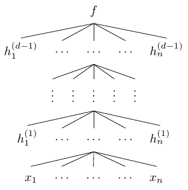
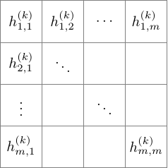

# 简介：一种不太严谨的角度来讨论深度学习
  Lecture1的绝大多数内容可能会从一种不太严谨的角度来讨论深度学习；我们将围绕着Goodfellow，Bengio和Courville的Deep Learning进行讨论（后文简称为GBC）。
  首先，我们从最常见的“前馈深度学习模型”开始：前馈深度网络（GBC的第6章）。

## 1.前馈深度网络
从统计学的角度，我们首先定义一个函数$f$;数据集由$<X_i,f(X_I)>$中得到，这里$X_i$是一个典型的高维向量，$f(X_i)$在集合$\{0,1\}$中，或是一个属于实数集$\mathbb{R}$的实数。我们的目标是找到一个函数$f^*$能够在给定数据集上得到的结果尽可能的接近函数$f$,这样才能得到一个准确的预测。

在深度学习中，这总体上（by-and-large）就是参数统计的一个子集，我们有一个函数族：
  $f(X;\theta)$
这里，$X$是输入$\theta$是参数(通常是高阶矩阵)。目标是找到$\theta^*$使得$f(X;\theta^*)$尽可能的接近$f$.

在本文，本章中，$\theta$就是神经网络。网络由$d$个函数组成：
$f^{(d)}(\cdot,\theta)\circ\cdots\circ f^{(1)}(\cdot,\theta)$,
这其中的绝大部分都会是高维的。将网络图形化的表示出来如下所示：

这里$h^{(i)}_1, \ldots ,h^{(i)}_n$是向量值函数$f^{(i)}$的分量，函数$f^{(i)}$也是网络的第$i$层，同时，这里每一个$h^{(i)}_j$都是关于$h^{(i-1)}_1, \ldots ,h^{(i-1)}_n$的函数。再上图中，每一个$f^{(i)}$的分量个数（这个分量个数通常被称作是第$i$层的宽度）都是一样的，但实际上，每层的宽度通常都是大不相同的。再上图中，我们将$d$称为神经网络的深度。需要说明的是，第$d$层的宽度和前面的那些层是不一样的，通常该层宽度为1，即$f=f^{(d)}$是一个标量。

对统计学家而言，他们最喜欢的函数是线性函数。如果我们规定（stipulate）网络中的函数$f^{(i)}$是线性函数，那么由所有的$f^{(i)}$组成的函数$f$也是一个线性函数，这样就让我们的多层网络变得没有意义。因此，我们需要函数$f^{(i)}$是一个非线性函数。

常见的激活函数设计是由神经科学模型所启发的，神经科学中，一个细胞接受多个信号，根据这些信号，该细胞决定是否激活，以及激活值的大小。当假设输入为$x_1,\ldots,x_n \in \mathbb{R}_+$，此时模型的输出为：
$f(x)=g(\sum{a_ix_i+c})$
对于一些非线性函数g，通过上面的例子我们可以定义：
$h^{(i)} = g^{\otimes}({W^{(i)}} ^Tx+b^{(i)})$
这里$g^{\otimes}$表示将非线性函数$g$的坐标系下应用。

我们应当如何选择$g$呢？通常情况下，人们希望$g$是“最不非线性”的函数，因此，人们常用RELU，其他的一些常见选择还有逻辑回归函数：
$g(z)=\frac{1}{1+e^{-2\beta z}}$
双曲正切函数：
$g(z)=tanh(z)=\frac{e^z-e^{-z}}{e^z+e^{-z}}$
这两个函数的优点都是有界的(这一点和RELU函数不一样)

我们在之前说过，最上一层(输出层)和之前的层是不一样的。首先，通常这一层的值都是标量。其次，这些值都会有一些统计意义$h^{(d-1)}_1, \ldots ,h^{(d-1)}_n$经常会被认为是经典统计模型的参数，并且作为最后一层的输入。输出层激活函数的一个例子是使用线性函数$y = W^Th+b$,这里是将输出作为高斯分布的条件均值。另一个例子是$\sigma(w^Th+b)$，这里$\sigma$表示sigmoid函数$x \mapsto \frac{1}{1+e^x}$;这种思想认为输出是概率$P(y)$是$exp(yz)$的伯努利分布,这里$z=w^Th+b$。

更广泛一点的还有softmax
$softmax(z)_i=\frac{exp(z_i)}{\sum_j exp(z_j)}$
这里$z=w^Th+b$。$z$的分量和可能的输出值相对应，$softmax(z)_i$ 代表输出值为$i$的概率。例如输入图像到神经网络，而输出$（softmax(z)_1,softmax(z)_2,softmax(z)_3$则可以解释为不同类别（如猫、狗、狼）的概率。

后面，我们会关注于下面的问题：1）这样的函数组合来估计真实情况的效果能有多好。2）深度和宽度会带来怎么样的能力。

## 2.卷积神经网络
卷积神经网络(GBC书中第9章所介绍的)，是一种含有线性操作的网络，具体一点说就是局部卷积操作使用了一些隐式的几何网格。比如我们可以假设一个网络第$k$层是一个$m\times m$的网格。

随后，我们定义第$k+1$层的函数$h^{(k+1)}_{i,j}$是由上一层的一个$2\times 2$的网格进行卷积之后应用非线性函数g得到的：
$h^{(k+1)}_{i,j} = g( a^{(k)}h^{(k)}_{i,j} + b^{(k)}h^{(k)}_{i+1,j} + c^{(k)}h^{(k)}_{i,j+1} d^{(k)}h^{(k)}_{i+1,j+1} )$
这里的参数$a^{(k)},b^{(k)},c^{(k)},d^{(k)}$仅仅依赖于所处的层，而不针对于特定的方格$i,j$(该约束并不是严格的被广泛定义的，但是却是在诸如计算视觉等领域很合理的约束)除了上述的参数共享的优点外，这样的网络同样的因为函数$h$的定义而拥有结果稀疏的特点。

卷积神经网络中另一个常用的部分是池化，池化操作是在卷积之后用来
