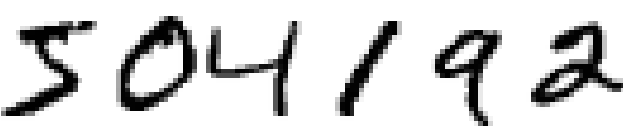
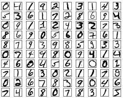
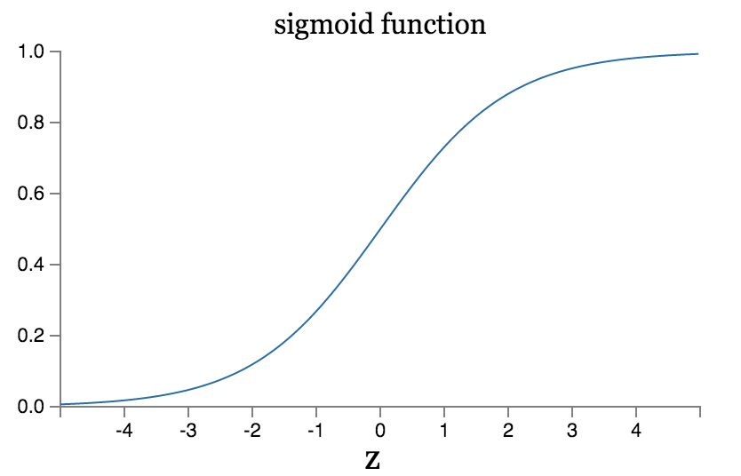
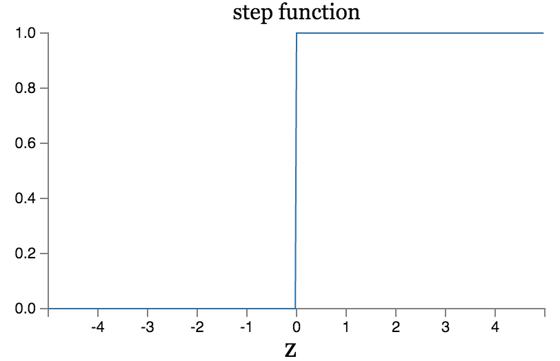
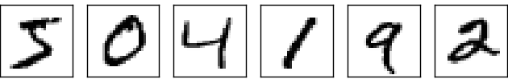
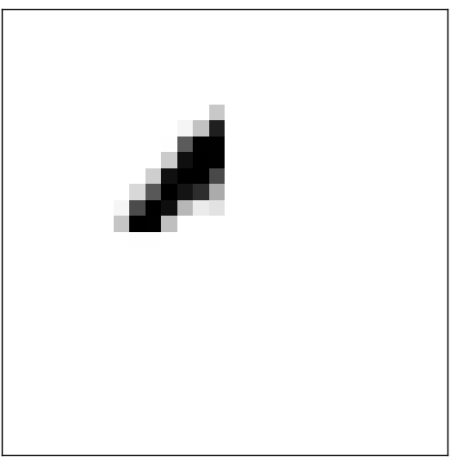
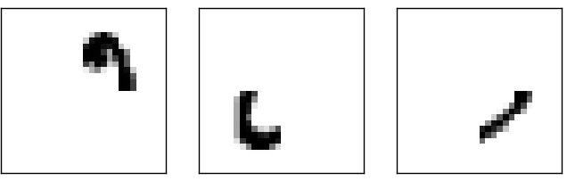
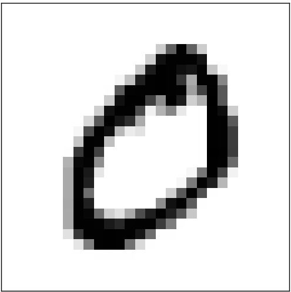

# Ch1.使用神经网络识别手写数字
人类的视觉系统是真实世界中的一个奇迹。我们来看一下下面的手写数字大多数人都可以轻易地认出这是504192。这个过程看似简单，其实不然。在每一个人的大脑半球中都有一个被叫做V1的初级视觉皮层，其中包含1.4亿个神经元，包含上百亿的神经元连接。并且人类的视觉系统中除了v1之外还包含一系列的视觉皮层，v2,v3,v4以及v5，用来处理更加复杂的图像处理。我们的大脑就像一台超级计算机，经过了数亿年的进化，才可以适应，理解一个视觉的世界。识别手写数字并不简单，不过，我们的大脑及其善于理解眼睛看到的信息，这都是在我们没有意识到的情境下下发生的。所以我们并不会认视觉系统所解决的问题有多么的困难。

当你尝试使用计算机程序来识别手写数字(就像上面的图片中的那些数字)，你就会意识到视觉模式识别的困难。这样一个对人类来说看似简单的事情突然之间就变得很困难了。人类识别这样的图像时，最简单的直觉就像一个“9”就是：一个圆圈，右下方一个竖线”，但是这种直觉其实很难用算法表示。当你试图去构建这样的识别规则时就会被很多的特例所困扰。真是让人绝望。

神经网络可以通过另一种思路来解决这个问题。方法就是收集大量的手写数字，把他们作为训练样本（如下）：

然后构建一个可以从训练样本中学习的系统。换句话说，神经网络使用这些样本来自动的生成识别手写数字的规则。并且，随着我们增加训练样本的数量，神经网络可以从中学习到更多规则，并以此来增加学习的准确率。在上图，我们仅仅看到了一百个训练数据，但是很有可能，我们可以通过使用上千甚至上百万的训练样本来构建一个更好的手写识别系统。

在本章，我们会写一个程序，来实现一个使用神经网络来学习识别手写数字的功能。这个程序仅有74行，也不会使用第三方的神经网络库。但是这个短小的程序，在不进行人工干预的情况下手写数字识别的准确率可以达到96%。并且，在后续的章节中，我们会实现一些算法，使得准确率可以达到99%。实际上最好的商业神经网络系统能够让银行用来处理发票，或者邮局用来识别地址。

我们关注于手写数字识别，是因为通常在学习神经网络的时候这是一个很好地示范。作为一个范例，它拥有很多”甜蜜点”：富有挑战，识别手写数字并不是一个简单地工程；但是还没有那么难，并不需要一个极其复杂的解决方案，或者强大的计算能力。更好的是，这是一个很好的方法来学习，实现更好的技术，比如，深度学习。所以手写数字识别问题会贯穿本书。在本书的的后半部分，我们会讨论如何将这些想法实现，应用在诸如计算视觉，语音，自然语言处理，以及其他领域。

当然，如果本章仅仅是写一个程序，来识别手写数字，我们并不需要这么大的篇幅。但是在本章中我们会形成一些关于神经网络的关键思想，包括两种主要的神经元(artificial neuron)——感知机(the perceptron neuroun)和sigmoid，以及神经网络的一些常用算法-随机梯度下降。在本书中，我们关注于为什么问题会被这样解决，同时我们会培养有关神经网络的直觉，相对于我们仅仅展现这些基本的原理，这需要更加冗长的篇幅，但是这一切都是很值得的。关于这些的收获就是在最后，我们会理解什么是深度学习，并且理解为什么他会起作用。

### 感知机
什么是神经网络？开始讨论这个话题，我们会介绍一种人造神经元——感知机。感知机在20世纪50到60年代由科学家Frank Rosenblatt基于早先的warren mcculloch 以及walter pitts的工作发明。发展到现在我们通常使用的其他的人造神经元模型——本书中以及大多数现代神经网络，主要使用的神经元模型是sigmoid 神经元。我们很快就会学习sigmoid神经元，但是为了理解为什么sigmoid神经元被这样定义，我们最好先来理解感知机。

所以，感知机是怎么工作的呢？一个感知机有一些二进制的输入$\mathbb x_1,x_2...$，以及一个二进制的输出。图形化的表示就是下面的样子：

在这个例子中我们有三个输入，$x_1,x_2,x_3$。当然在实际情况下我们会有多点或者少点的输入。Rosenblatt提出了一个简单的计算输出的规则。它引入了权重，$w_1,w_2,w_3...$,这是一些实数，用来表示相应的输入对输出的重要程度，神经元的输出，是0还是1，就是是通过这些输入的加权和$\Sigma_j x_jw_j$,大于或者是小于某个给定阈值决定的。就像权值一样阈值也是一个实数，同时是神经元的一个参数。用一种更加数学的表示方式如下:
$\begin{eqnarray}
  \mbox{output} & = & \left\{ \begin{array}{ll}
      0 & \mbox{if } \sum_j w_j x_j \leq \mbox{ threshold} \\
      1 & \mbox{if } \sum_j w_j x_j > \mbox{ threshold}
      \end{array} \right.
\tag{1}\end{eqnarray}$

一个感知机的工作过程就是这么简单。

这就是感知机的基本工作原理，你可以把他当做一个设备，一个通过计算已知数据得到结果的设备。下面我们举个栗子，一个不严肃不严谨的栗子，但是这很好理解，别着急，我们很快就会有更严谨的栗子。假设，周末就要来了，而且在你所在的城市会有一个奶酪节。你喜欢奶酪，所以在考虑要不要去奶酪节。你会通过衡量三个因素来决定你是否要去：
  1. 天气好不？
  2. 你对象去不？
  3. 这个奶酪节的举办地是否在一个公交站附近（你没车）

我们可以用三个二进制变量$x_1,x_2,x_3$来表示这三个因素，举例说明一下，$x_1$=1 表示天气好，$x_1$=0表示天气不好，同样的$x_2$=1表示对象会去，$x_2$ = 0表示不去，对于$x_3$也是这个样子。

现在，假设你真的很喜欢奶酪，喜欢到不在乎对象去不去，也不在乎交通是否方便，但是，天气太差了，差到你根本没办法过去。你可以使用感知机来模型化你的决策过程。一种方案是将天气的权重$w_1$设置为6，剩下的两个置为2。较大的权重值表示天气对你的影响很大，大于你对象，也大于公交。最后，你把阈值设为5的话，这样，这个感知机就构建起了一个决策模型，只要天气好就输出1，天气不好就是0，与此同时呢，天气和你对象就都没有影响了。

通过设置不同的权重以及阈值，我们就可以得到不同的决策模型。举个栗子，假设我们把阈值设置为3，那么，即使天气不好，只要你的对象愿意和你一起去，而且交通足够便利，那么你就会去。换言之，这就是一个不同的决策模型。在这个模型下，降低阈值，就表示你去参加奶酪节的意愿更强烈。

显然，相对于人类的决策模型而言感知机并不是一个复杂的模型。但是这个例子说明了一个感知机如何对不同的影响因素进行加权计算，并得出结论的，并且，通过组合感知机我们可以得到一个复杂的网络做出更加细致的决策。

在这个网络中，第一行的感知机——我们称之为第一层的感知机，会通过对输入的加权处理进行处理得到三个简单的决策。那第二层的感知机呢？每一个感知机都会通过对第一层的感知机输出进行加权处理做决策。这样，第二层的感知机就可以在一个相对于第一层的感知机，更加复杂，抽象的级别上做出决策。同样，第三层的感知机就可以做出更加复杂的决定。通过这种方式一个多层的感知机网络就可以做出更加精确地决策。

需要说明的是，当我们在定义感知机的时候我们说一个感知机仅有一个输出，在上面的感知机网络中，一个感知机看似有多个输出。实际上，他们仅仅有一个输出，多个输出的箭头仅仅是为了表示一个感知机的输出可以被多个感知机所利用，如果我们把它画成一个输出，分裂成很多箭头，那就有点，，，分裂了。

我们来简化一下对于感知机的描述$\Sigma_j w_jx_j>threshold$这个条件看起来是很笨拙的。我们可以通过两种新的写法来简化我们的表示。首先，通过将$\Sigma_j w_jx_j$改写成点乘法$w\cdot x \equiv \Sigma_j w_jx_j$,这里面$w$和$x$是向量他们的元素分别表示对应的权重和输入。第二个改变是将阈值移动到等式的另一边，我们用感知机的偏移量（bias）来替代它 $b$ = 负的阈值。使用偏移量来代替阈值，感知机可以被重写成如
下的样子：
$\begin{eqnarray}
  \mbox{output} = \left\{
    \begin{array}{ll}
      0 & \mbox{if } w\cdot x + b \leq 0 \\
      1 & \mbox{if } w\cdot x + b > 0
    \end{array}
  \right.
\tag{2}\end{eqnarray}$

你可以将感知机的偏移量看做衡量让感知机输出1的容易程度。或者我们用一个更加生物的角度来讨论这件事情，偏移量是用来衡量一个神经元有多容易被激活。对于一个感知机而言他的偏移量越大，就表示他的输出就越容易为1。但是，如果这个偏移量越小，那么他的输出就很难是1。显然，引入偏移量这个概念使我们在描述感知机过程中一个很小的改动，不过稍后，我们会对他进行进一步的改进。基于此，在本书剩下的部分中，我们会使用偏移量来代替阈值。

直到目前为止我们将感知机描述成通过权衡evidence来作出决策的方法。其实，感知机还可以用来做一些初等的逻辑运算,与（AND）或（OR）以及与非（NAND）。举个栗子，假设我们有个感知机，有两个输入，他们的权重都是-2，总体偏移量是3，这个感知机就如下所示：

那么，当我们的输入是0，0时，输出就是1，因为$（-2）* 0 +（-2）* 0 + 3 = 3$是正数。在这里我们使用\*这个符号显示的表达了这个表达式。类似的对于0,1，1,0输入，输出都是1，但是对入11的结果就是0，因为$-2*1+(-2)*1+3=-1$，结果是负数。这样我们就可以通过感知机实现了一个与非门。

这个与非门的例子表明我们可以使用感知机来进行简单的逻辑运算。实际上我们可以使用感知机网络来进行任何逻辑运算，因为与非门是通用的，我们就可以使用与非门进行组合构建任意的逻辑运算。比如，我们可以使用与非门构建一个电路来计算两个比特$x_1,x_2$之和。这需要计算$x_1 \oplus x_2$，以及进位$x_1x_2$：

为了得到一个等价的感知机网络，我们可以将对应的与非门电路替换成拥有两个权重都为-2的输入，偏移量为3的感知机。然后我们就可以得到一个如下的网络。要注意的是，我们将右下角的与非门对应的感知机左移了一点，为了画图能够方便一点：

值得注意的是在这个感知机网络中最左边的感知机的输出被作为最下方的感知机的输入重复使用了两次。当我们在定义感知机模型的时候，我们并没有对这种情况进行过说明。实际上，这并没有什么影响。如果我们不想看到这样的东西，那就简单的把两个输入合并一下变成一个权重为-4的输入，以此来替换两个权重为-2的一样的输入（如果你没能理解，那你需要停下来，理解一下他）。通过这种改变，这个网络就变成了下面的样子，没有标注的权重都是-2，所有感知机的偏移量都是3，还有一个唯一的权重为-4的输入：

到目前为止我们都将x1,x2作为两个变量画在了我们的感知机网络最左边。但是实际上，我们比较喜欢使用另外一层感知机-输入层，来表示整个网络的输入：

这种对感知机的表示意味着这个感知机只有一个输出，没有输入，但是这只是一个特例。他并不意味着一个感知机可以没有输入。为了证明这一点，假设我们有一个没有输入的感知机，他的加权和$\Sigma x_jw_j$必定恒为0，这样的情况下，感知机的输出之和偏移量有关，如果b>0,那么输出就是1，如果b<=0那么输出就是0。这样我们的感知机只能得到固定的输出值，而不是我们所期望的（例如x1），所以最好仅仅是把输入感知机理解为一个特殊单元，而不是一个真正的感知机，他可以输出任何我们想要得到的值，比如$x_1,x_2,....$

上面这个例子展示了一个感知机网络如何用来模拟一个包含很多与非门的电路，并且，因为与非门在计算中是通用的，所以感知机也是可以在计算中通用的。感知机的通用性让人开心又失望，开心的原因是因为他可以和所有的计算设备一样强大。但是让人沮丧的是这好像和普通的与非门没什么区别，不是什么了不得的事情。

无论如何，这个情况还是比较乐观的。我们可以设计一个学习算法，来自动的调整网络中的人工神经元的权重和偏移量。这种调整可以对外部刺激做出响应，而不用程序员们人工干涉。这些学习算法可以让我们一种与传统逻辑门根本不同的方法来使用人工神经元。我们并不需要显式的布置出与非门或者其他的门电路，我们的神经网络可以通过简单地学习来解决这些问题，通常，这些问题很难用设计电路的方式来解决。

### S型神经元
学习算法看起来高大上，但是我们如何设计一个作用于神经网络的学习算法？假设，我们有一个感知机网络我们想要用它来学习解决某些问题。举个栗子，网络的输入是手写数字扫描图像的未经处理的像素数据。我们想要这个网络去学习权重和偏移量，以此，让这个网络可以得到正确的分类输出。我们来看一下学习是如何生效的，假设我们对网络中的权重（或者对偏移量）做一些小的调整。我们期望的是这些对于权重的小的调整，会为网络的输出带来相应的改变（也是小的改变）。我们会在后面看到，这样的性质才使得学习变的可能。下面的图片是我们想要看到的（显然，这个网络还是很简单，还不能被用来识别手写数字）

如果对于权值（或者偏移量）的小的改变仅仅引起输出的小的变化，那么我们可以使用这个性质来改变权重和偏移量，让我们的网络的表现更接近我们想要的。例如，假设网络将一个本来应该是9的图片分类成了8。我们可以对权重以及偏移量做出小的调整，以使分类的结果更向9靠近。我们会重复这样的行为来得到更好的输出。这个网络就可以学习了。

但是问题在于，只要我们的网络中含有感知机，这个良好的特性就会出现问题了。实际上，对于网络中的任何一个感知机的权重和偏移量做一点改动，有时都会使得感知机的输出完全颠覆，例如从0变成1。这种颠覆可能会引起剩余的网络的行为发生复杂的改变。所以有可能当你能够识别“9”正确时，但是别的图像的结果有可能会发生无法控制的改动，这会使得我们通过改变权重和偏移量来使网络的行为接近预期变得很困难。可能会有一些天才的方法可以帮助我们绕开这个问题。但是对于这种由感知机构成的网络，他们的学习算法也不是轻易就能发现的。我们可以通过引入一种新的人工神经元——sigmoid神经元来解决这个问题。

sigmoid神经元和感知机很像，但是有一些改变，使得对于权重和偏移量的微小改变仅仅对输出有着轻微的调整。这个至关重要的特性使得sigmoid神经元的学习成为可能。

Ok，现在让我们来描述一下sigmoid神经元。我们会仿照描述感知机的形式来描述sigmoid神经元：

类似于感知机，sigmoid神经元有一些输入，$x_1,x_2,x_3,,,,,$但是sigmoid神经元的输入并不是二元的0，1，sigmoid神经元的输入可以使0到1之间的任何值，例如0.63....这是一个sigmoid神经元的有效输入。同样的和感知机一样sigmoid神经元对于每个输入都有一个对应的权重$w_1,w_2,….$，并且有一个总体偏移量，b。但是输入并不是0或者1。输出是$\sigma (w⋅x+b),\sigma$ 被称为sigmoid函数，他的定义是：（多说一句,$\sigma$也被称为逻辑函数，这种神经元也会被成为逻辑神经元，很多做神经网络的人都会称之为逻辑神经元，但是在本书中，我们还是称之为sigmoid）
$\begin{eqnarray}
  \sigma(z) \equiv \frac{1}{1+e^{-z}}.
\tag{3}\end{eqnarray}$
讲的更直白一些,对于sigmoid神经元有着输入$x_1,x_2,x_3,,,,,$，权重$w_1,w_2,….$，以及偏移量b这个神经元的数学表达就是：
$\begin{eqnarray}
  \frac{1}{1+\exp(-\sum_j w_j x_j-b)}.
\tag{4}\end{eqnarray}$

一眼看上去，sigmoid神经元和感知机有很大的不同。如果你对这并不熟悉，sigmoid神经元的代数表达式会让你觉得晦涩难懂。实际上，感知机和sigmoid神经元有很多相似之处，sigmoid神经元的代数表达仅仅是为了展现他的技术细节，而不是为了阻止我们去了解他。为了去理解sigmoid神经元和感知机的相似之处。我们假设$z=w⋅x+b$ 是一个很大的正数。那么$e^{-z} \approx 0$这时$\sigma (z) =  1$,换言之当$z=w⋅x+b$是一个很大的正数时我们的sigmoid神经元的输出与感知机类似就很接近于1。假设$z=w⋅x+b$是一个绝对值很大的负数时，那么$e^{-z} \rightarrow +\infty$，这样，所以当$z=w⋅x+b$ 是一个绝对值很大的负数时，sigmoid神经元的行为就会和感知机的类似，输出为0.只有当$w·x+b$的绝对值并不是很大时，sigmoid神经元的行为才会和感知机的有所区别。

那么$\sigma $的代数形式是什么？我们要如何理解他？

实际上$\sigma$的确切形式并不是那么的重要——但是他的图像很重要：

这个图形其实可以看做是平滑版的阶梯函数：

如果$\sigma $实际上是一个阶梯函数，那么sigmoid神经元就变成了一个感知机。因为输出是0还是1，仅仅取决于$w·x+b$是正数还是负数。（实际上当w·x+b=0时感知机的输出是0，但是阶梯函数的结果是1，所以，严格来讲如果让他们一样的话我们还需要对阶梯函数在一个点上进行修改，但是，你明白就行了）。如上所述，当我们使用sigmoid神经元时我们就得到了一个平滑的感知机。而且sigmoid函数的平滑性是关键的地方，而不是它的具体形式。平滑的sigmoid函数意味着权重或者偏移量的小的改变$\Delta w，\Delta b$,仅会对神经元的输出的结果造成一个很小的影响$\Delta output$。事实上，通过计算我们可以得出
$\begin{eqnarray}
  \Delta \mbox{output} \approx \sum_j \frac{\partial \, \mbox{output}}{\partial w_j}
  \Delta w_j + \frac{\partial \, \mbox{output}}{\partial b} \Delta b,
\tag{5}\end{eqnarray}$

其中求和运算是将所有的权值$w_j$相加，$\partial{ output} / \partial{ w_j}$和$\partial{ 、output} / \partial{b}$表示分别求$output$对$w_j$和$b$的偏导如果你不喜欢偏导的话，别闹心，表达式虽然看起来很复杂，但是其中的偏微分其实很好理解（真是个好消息）：$\Delta output$是关于权值和偏移的改变量$\Delta wj$和$\Delta b$的线性函数（linear function）。这种良好的线性关系使得通过对权重以及偏移量的小的改变来逼近想要的结果（通过对于输出造成小的影响）变得很简单。所以，虽然sigmoid神经元与感知机有着相似的行为，但是sigmoid也使描述「输出怎样随权值和偏移的改变而改变」这一问题变得简单。

如果sigmoid函数的图形是至关重要的，而不是他的准确表达，那么我们为什么还要在公式（3）中把它指定成那种特殊的形式呢？事实上，在本书的稍后部分我们也会偶尔提到一些在输出是$f(w·x+b)$的时候使用别的激活函数（activation function）$f(·)$。当我们使用不同的激活函数时，改变最大的是公式（5）中的偏微分值。在后面，我们计算偏导的时候，使用sigmoid函数会简化代数表示，因为指数函数在求导的时候具有良好的性质。在大多数情况下，sigmoid函数是最通用的，在本书中也是使用最频繁的。

我们应该如何解释sigmoid神经元的输出呢？显然，感知机和sigmoid神经元的最大的不同就是sigmoid神经元并不是仅仅的输出0或者1，他可以输出0和1之间的所有实数，比如0.173，0.689.....这些都是合理的输出。这其实是很有用的，例如我们希望使用输出的值来表示像素图像输入的平均灰度时。但是有时候这也不是那么让人欣慰。假设我们想要一个神经网络的输出是一个明确的信息“这个图片是9”或者“这个图片不是9”。显然，最简单的处理是输出为0，1的情况。不过，在实践过程中，我们可以设置一个约定来解决这个问题，比如，当输出大于等于0.5的时候表示输入图片为9，其他情况表示输入图片不是9。在后面每次使用到这样的约定的时候我们都会说明。

#### 练习
  1. sigmoid神经元模拟感知机，第一部分
  假设，我们把感知机网络中的所有权重和偏移量都乘以一个常量c,c>0。证明网络的行为不会改变
  ans：感知机的数学表达$w·x+b$乘上常量以后 $c(w·x+b)$ 结果是判断正负所以并不会对输出造成影响
  2. sigmoid神经元模拟感知机，第二部分
  假设我们有和上一个问题一样的初始条件——一个感知机网络。假设全局的输入已经选定好了。我们不需要确切的值仅仅要求输入的值是固定的。假设权重和偏移量会使得对于网络中所有的输入都会使得$w·x+b \ne 0$.现在将网络中所有的感知机都替换为sigmoid神经元，然后将所有的权值，偏移量都乘上一个常数C>0.证明，在极限$C \to \infty$情况下下，这个由sigmoid神经元构成的网络与感知机构成的网络行为相同。同时想想当$w⋅x+b=0$时为何不是如此？
  ans:如果，感知机结果为0那么根据sigmoid函数形式可知结果为1/2。

### 神经网络的结构
在下一个小节中，我们会介绍一个神经网络，他可以在识别手写数字上有良好的表现。在这之前我们需要做一些准备，我们很有必要来解释一下网络中的不同部分的术语。假设我们有一个网络：

就像之前所说的，网络中最左侧的一层，被称为输入层，输入层中的神经元，被称为输入神经元。网络中最右侧的一层成为输出层，包含输出神经元，或者，在这个情况下，只有一个输出神经元,中间的那一层被称为隐藏层，因为这一层里面的神经元既不是输入的也不是输出的。“隐藏”这个单词可能看起来有点神秘—我第一次看到这个词的时候我以为它必然包含有很深层次的哲学或者数学含义—但是，他仅仅表示“不是输入也不是输出”。上面的网络仅仅包含有一个隐藏层，但是对于一些网络，我们可能有多个隐藏层。例如，下面的一个四层的网络有两个隐藏层：

有一些可能让人困惑的地方，我们要先指出来，由于一些历史原因，对于这样的多层网络我们会称之为多层感知机，或者MLPs,虽然我们的网络是通过sigmoid神经元而不是感知机组成的。由于这会给人们带来困惑，所以本书中我们不会使用MLPs来称呼，但是还是要提醒你有这么个事情。

神经网络的输入输出层的设计是很直接的。举个栗子，假设我们想要去确定一个手写数字图像是不是“9”。通常我们会将像素的灰度值（intensities）放到输入神经元中。如果图像是由64阶灰度组成的，那么我们就会有4096=64*64个输入神经元，通过0到1之间的值来表示灰度。输出层会仅含有一个神经元，通过输出一个小于0.5的值来表示这个图片不是9，通过输出一个大于0.5的值来表示这个图片是9.

虽然我们对于输入和输入层的设计很直白，但是对于隐藏层的设计是一种艺术。要注意，单纯的把一些简单规则结合在一起是不对的。事实上，有众多的神经网络学者建立了对于隐藏层的启发式（heuristics）设计规则，来帮助人们建立符合他们预期行为的神经网络。举个栗子，一些启发式规则可以帮助我们在神经网络隐藏层的层数和训练时间中找到平衡。在本书后面我们就会看到一些启发式设计。

目前为止，我们所讨论的神经网络都是将一层的输出作为下一层的输入，这网络被我们称之为前馈神经网络（feedforward）。这意味着，网络之中是不存在回路的——信息一直都是向前传播的，从来没有回馈。如果我们存在回路呢？那么我们的sigmoid函数的输入就会依赖于他的输出，这是很没有道理的，我们不允许存在这种情况。

但是呢，有一些别的人工神经网络模型允许网络中存在反馈回路。这种模型被称为递归神经网络(recurrent neural networks）。这种模型的设计思想是将一些神经元在变为非激活状态前保持一定时间的激活状态，这种激活状态会对其他的神经元产生激励，被激励的神经元在随后的一段时间也会保持激活状态。这样，就会有更多的神经元被激活，一段时间之后，我们就会得到一个级联（cascade）的神经元激活系统，这种回路不会为模型带来问题，因为输出并不会立即的对输入产生影响，而是在稍后影响。

相对于前馈神经网络而言，递归神经网络的影响稍微小一点。一部分原因是递归神经网络的学习算法并不如前馈神经网络有效（就目前而言）。但是递归神经网络依然很有意思，相对于前馈神经网络，递归神经网络和人脑的工作方式更为类似。递归神经网络很有可能解决一些用前馈神经网络很难解决的问题。然而因为篇幅原因，我们还是将主要精力放在对使用更广泛的前馈神经网络的讲述上。

### 一个简单地识别手写数字的网络
在定义了神经网络之后，我们回到手写数字识别的问题上。我们将识别手写数字划分成两个子问题。首先，我们将整个图像划分成几个独立的图片，每一个都只包含一个数字。举个栗子，我们将：划分成六个独立的图像：。

这个划分问题对于人类而言是很简单的，但是对于机器却是一个挑战，一旦我们完成了划分，程序就需要对这些独立的图片进行分类。举个栗子，我们会希望程序来识别上文中第一个小图片这个“5”。

我们会将精力集中在通过coding解决第二个问题——对于独立的图片进行分类。我们这么做是因为一旦我们有了一个好的对于独立图片的识别算法，划分图片其实并不困难。有很多方法可以用来解决划分问题。一个方法是尝试多种划分方法，然后用我们的识别算法来对每种划分进行打分，最好的划分方法得分最高，如果我们的分类算法在一个或者多个片段下遇到麻烦，那么相应的划分算法的得分就很低。这个思路是我们认为如果分类算法遇到了问题，很有可能是因为我们选择了错误的划分算法。这种思路和别的一些变种可以帮助我们很好地解决划分问题，所以我们还是将主要的精力放在如何建立一个神经网络来解决更有趣，更困难的问题——手写数字的识别上来。

为了识别这些分割后的的图片，我们会使用一个三层的神经网络：

这个网络的输入层神经元用来对输入的图像像素编码。在下一章中我们会说道网络的训练数据包含很多28\*28像素的手写数字的扫描图片，所以输入层包含有784=28*28个神经元，但是你也知道，我们不太可能在上面的图片中画出来那么多神经元，所以我们就是表示这么个意思。神经元的输入表示的是对应的像素点的灰度值，0.0表示的是白色，1.0表示的是黑色，中间的数字就表示不同的灰度。

神经网络的第二层是一个隐藏层，我们把隐藏层的神经元个数记为n，我们会实验不同的n值。在上面的示例图中我们有个小的隐藏层，n值为15，就是我们使用了一个具有15个神经元的隐藏层。

我们的输出层有10个神经元，假设，第一个神经元被激活了，比如说输出约等于1，那么这就说明了我们的神经网络认为这个数字是0，类似的，如果第二个神经元被激活，那么网络就会认为数字是1，等等。更精确一点的描述是我们将输出神经元标记为0到9，并且试图找出那个神经元具有最高的激活值。如果6号神经元说它有最高的激活值，那么我们神经网络的输出就是认为输入图像是6.对于其他的神经元也是一样的。

你可能会好奇，为什么我们使用10个输出神经元。毕竟，我们想要让网络来从输入图片中识别十个数字。看起来最自然的方法是，（其实在看到这里的时候我是觉得应该一个神经元就行了，输出0~9呗，不过后面会有这么一个类似的小练习，其实相对于现在的这个模型其实就是把输出层当做一个隐藏层，然后最外面再加一个输出层就好了。）我们仅仅使用4个输出神经元就可以了，每个神经元表示二进制的一位。4个输出神经元足够使用2进制来表示10个数字了。为什么我们要用10个输出神经元，这不会变的很低效么?我们做这样的决定，其实是讲道理的：我们可以尝试这两种网络设计，结果会证明有十个输出神经元的网络对于手写数字的识别会比只有四个的效果好。但是这并不能告诉我们为什么10隔得比四个的好？会不会有一些启发性的思考来告诉我们，让我们可以知道十个输出神经元相对于四个输出神经元有什么优点？

从本质上思考，研究这个神经网络，是可以帮助我们理解为什么10个比4个好。先来看看我们最初的选择，使用10个输出神经元。首先考虑第一个输出神经元，这个神经元通过对从隐藏层传来的数据加权，计算来判断一个图像是否为0.那么隐藏层的神经元做什么呢？我们先假设第一个神经元是来判断一个图像是不是和下面的一样：

它通过赋予图中像素点相应位置的输入神经元较大的权值，其余部分分配较小的权值来做到这样的判别。同样的，我们假设第二个，第三个和第四个隐藏层神经元是用来判断对应的部分和下面的图片是否吻合：

这个时候你可能已经想到了，这四个图像一起可以组成一个“0”，一个和我们之前看到的手写数字中的一个类似的“0”
 

所以呢，如果这四个神经元都被激活了，那么我们就可以推测，这个输入图像就是“0”。当然了，这绝不是我们判断一个图像是不是“0”的唯一方式，还有很多很多的方法（比如说，通过上述的图像转变，或者别的形式，变形）。但是，在这个情况下，我们已经很确信，输入就是“0”.

假设我们的神经网络通过这种方式运行，那么，我们为什么使用10个输出神经元而不是4个就很明显了。如果我们有4个输出神经元，那么第一个输出神经元将被用来判断数字的最高有效位。将图像和数字的比特位联系在一起绝对不是什么简单的事情了。很难想象，将最高有效位和数字的形状联系在一起，，这么做实在是有点没道理。

我们虽然说了很多，但是这些都只是启发性质的。没有人说三层神经网络一定要向我们在上面描述的那样——隐藏层神经元仅仅通过对数字图像的形状的判断。可能一个聪明的学习算法会学习出一些合适的参数（权重），可以让输出层仅有4个神经元的情况下良好工作。但是作为一个启发性质的学习，我们所表述的这种结构和假设已经足够了，而且可以节约很多时间，可以设计出一个良好的神经网络结构。

#### 练习
其实，我们可以在上文中我们说到的三层神经网络模型添加一层，这样就可以让我们的输出变成通过比特位表示的。这个新的输出层会将前面一层的输出转化成相应的二进制表示，就像下面的插图所表示的一样。找到一个新的输出层的权重和偏移量的设置。假设最初的三层网络在输出层（就是图中的old output layer）的输出为1的激活值至少为0.99，为0的激活值至多为0.01。

