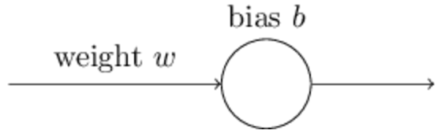
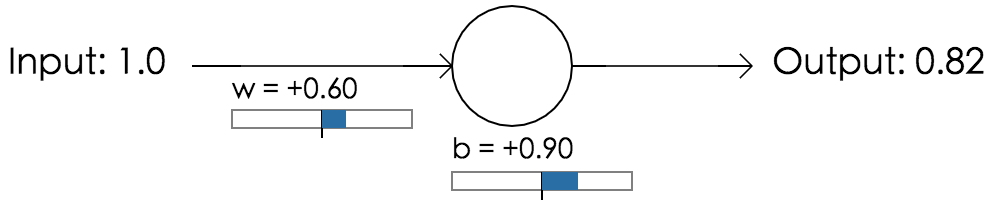
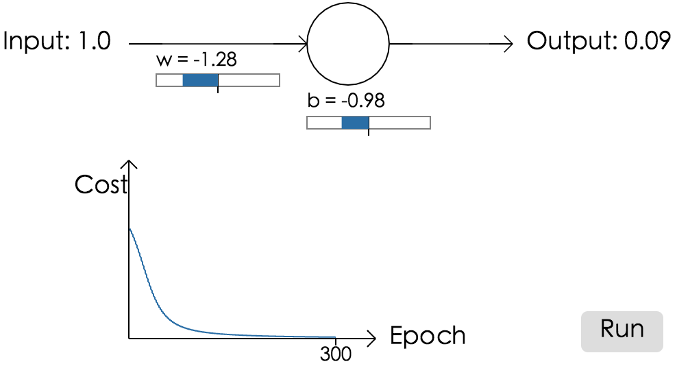
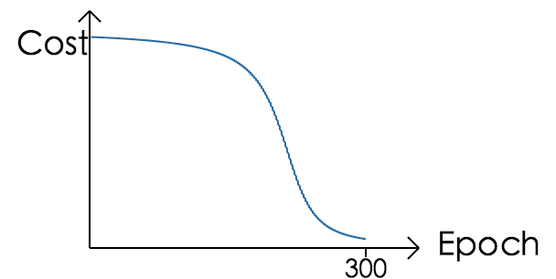
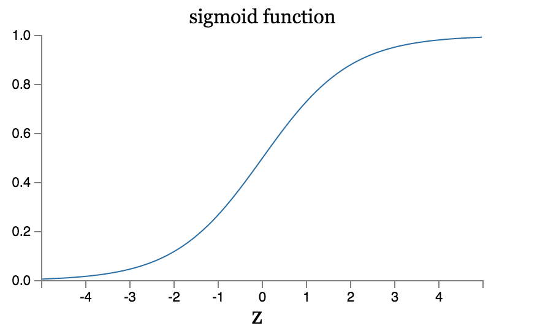
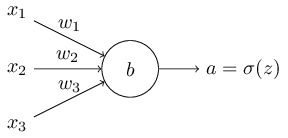
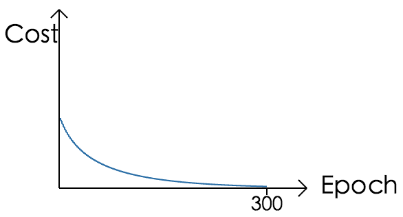
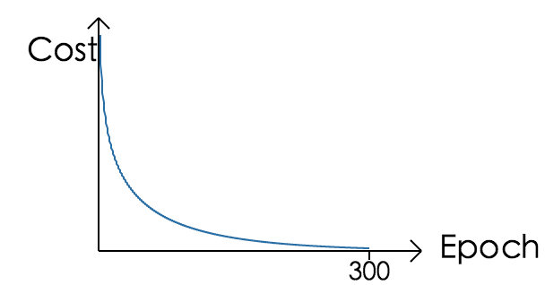

# Ch3 改进神经网络的学习方法
当一个高尔夫球员刚开始学习高尔夫时，他们会花费很多的时间去练习基本的挥杆。然后逐渐的去开始击球，削球等等高难度的动作，而这些高级的动作都还是通过对最基本的挥杆的一些改进完成的。同样的，我们对于反向传播的理解也就是我们的’挥杆’，学习神经网络最基本的东西。在本章中我们会介绍一系列的方法，这些方法可以改进我们最基本的反向传播的实现，以此来改进我们神经网络的学习。

本章中我们所介绍的方法有：更好的代价函数——交叉熵代价函数；四种正则化方法（L1，L2，dropout和artificial expansion of the training data），可以让我们的网络有更好的扩展性；还有一系列的启发式方法，可以让我们更好地去选择超参数。同时，我们还会简单的讲一些其他的技术，这些讨论基本上都是独立的，所以如果你愿意的话，也可以先跳过去。我们还也会用代码来实现这些技术，并用这些技术来改进我们第一章中识别手写数字的问题。

当然了，我们仅仅是讲了很多技术中的一小部分。因为我们认为与其很简单的介绍很多东西，不如专注于一些重要的。精通于这些技术不仅仅在使用他们的时候有帮助，同时也会加深你对神经网络的理解。同时也对你快速掌握别的技术很有帮助。


## 交叉熵代价函数
大多数的时候我们都会对错误感到不爽。在刚学钢琴不久的时候，我在观众面前进行了第一次的演出。我很紧张，将一个音弹得低了八度，我感到很困惑，直到有人指出了我的错误演出才继续下去。错误让人感到尴尬，虽然很不爽，但是我们往往能很快地从错误中吸取教训，你可以确信，下一次我不会在这个音上出问题了。但是，当我们的错误并不是那么的明显的时候我们的学习就会慢许多。

理想情况下，我们希望，我们的神经网络可以很快的从他们的错误中学习。实际上是什么样的呢？为了回答这个问题，我们来看个小例子。这个例子包含一个神经元和一个输入：

我们会训练神经元做一个很简单的事情：将输入1变成输出0。当然了这实在是太简单了，我们都可以手动的去选择权重和偏移量，而不使用任何的学习算法。但是，这也可以作为一种启发，我们还是用梯度下降来尝试对权重和偏移量进行学习。所以，让我们看一下这个神经元是怎么学习的吧。

为了让事情更加明确一点，我们将权重初始化为0.6，偏移量初始化为0.9.这是比较常用的初始化，而不是将它设置成一些特殊值。神经元的初始输出为0.82，看起来，我们还要经过很久的学习才能让我们的神经元达到我们的期望输出0.0附近。

使用第一章中介绍的二次代价函数，学习速率为0.15，这时我们可以得到代价函数和迭代次数(300次迭代)之间的函数图像：

我们可以看到，神经元在快速的学习权重和偏移量，快速的降低代价函数的值，最后得到的输出结果是0.09.虽然并不是我们的期望输出0.0，但是，已经很好了。假设，我们把权重和偏移量都设置成2.0，在这个例子里，我们的初始化输出为0.98，这个就很不好了，这个时候代价函数和迭代次数(300次迭代)之间的函数图像：

虽然，我们还用了一样的学习速率（0.15），但是可以看到在开始的时候学习速度是很慢的。实际上在前150次迭代中，我们的权重和偏移量并没有改变很多，然后，学习的速度才加快，和我们第一个例子中很像，神经元的输出快速的接近到0.0。

相比于人类的学习的过程。就像我在本节开头说的那样，当错误十分明显的时候，我们总是能学习的非常快。不过我们也看到了，我们的人工神经元在错误很大的时候和我们人类的行为有着明显的区别。实际上，这种行为并不仅仅在这个实验的神经元上是这样，在别的通用的神经元中，行为也是类似的。为什么学习变得这么慢呢？我们可以找到一些方法来避免这种减速么？

为了理解这个问题的本质，我们可以认为神经元是通过按照由代价函数相对于权重和偏移量的偏导数作为速度来改变权重和偏移量的值，那么，当我们说学习速度很慢时，其实也就是在说这两个偏导数很小。我们需要去理解，为什么他们会变小。为了理解这个，我们要计算这些偏导数，回忆一下，之前我们使用过的二次代价函数的形式如下：
$C = \frac{(y-a)^2}{2} \tag{54}$
这里，a是神经元对于训练的输入数据$x = 1$对应的输出，$y = 0$是期望输出。为了把他们表示的更加准确一点，我们把$a$拆解开，使用权重和偏移量进行表示$a = \sigma(z),z=wx+b$，回忆一下这里，对于w和b分别使用链式法则，我们可以得到：
$
  \frac{\partial C}{\partial w} =(a-y)\sigma'(z) x = a \sigma'(z) \tag{55}
  $
  $
  \frac{\partial C}{\partial b} = (a-y)\sigma'(z) = a \sigma'(z),
\tag{56}
$
在这里，自然是$x=1,y=0$。我们继续来分析这些表达式的行为，为了能够理解$\sigma'(z)$，回想一下$\sigma(z)$的函数图像。

我们可以看到当函数值接近于1的时候曲线会变得非常平缓，也就是$\sigma'(z)$的值此时是非常小的，我们通过方程（55）和（56）就可以看到$\partial C/ \partial w$和$\partial C/ \partial b$变得非常的小。而这也就是学习速度下降的本质原因。所以，我们也可以推测出这个问题不仅仅是在我们这个小例子中会发生，而在所有的神经网络中都会出现：

### 交叉熵函数简介：
我们要怎么解决这个学习速度下降的问题呢？实验证明，我们可以用其他的代价函数（交叉熵）替代二次代价函数从而解决这个问题。为了理解交叉熵函数，我们从上面的小例子稍微进一步。现在，假设我们要训练的神经元有多个输入x1,x2,…对应的权重是w1,w2…，还有一个偏移量b：

这个神经元的输出，应该就是$a=\sigma(z)$这里$z=\sum_jw_jx_j+b$是所有输入的加权和，
定义交叉熵代价函数为：
$\begin{eqnarray}
  C = -\frac{1}{n} \sum_x \left[y \ln a + (1-y ) \ln (1-a) \right],
\tag{57}\end{eqnarray}$
这里n是所有的训练样本总数，y是对应的x的期望输出。

现在看上去57并没有解决学习速度降低的问题。实际上，看起来这根本不是一个代价函数啊。在开始解决我们的学习速度下降问题之前，我们还是先来看看，交叉熵是如何被理解成代价函数的。

交叉熵函数有两点特性使得他可以成为一个代价函数。首先，因为他是非负的，也就是C>0. 为了说明这一点，要注意：(a)，方程57中求和部分的每一项都是负数，因为a和y的值都是在0到1之间的；(b)在求和之后我们乘了一个负数。所以它的结果是非负的。

第二点，如果神经元的输出接近于我们的期望输出y那么交叉熵就应该是接近于0的(为了证明这一点，我们需要假设期望输出y是0或1，在分类时这个经常会发生的，或者在计算一些布尔函数的时候，为了理解我们为什么做这样一个假设，你可以看看本章最后的那个问题。) 假设在某些输入x的时候我们的期望输出y = 0，实际输出a约等于0，也就是神经元在输入为x的时候表现相当好，这个时候方程中求和的第一项就消失了，因为y = 0，第二项只剩$-\ln(1-a) \approx 0$，同样的，当y = 1，a 约等于1的时候，也是会有这样的结果的。所以C可以用来表示我们的实际输出和期望输出的差距。

总结一下，交叉熵是正数，并且当神经元的输出接近于期望输出y的时候交叉熵的结果趋近于0.这就是我们对于代价函数所有的期望的特性。同样的我们的二次代价函数也满足这样两点。而且交叉熵代价函数也有别的优点，和二次代价函数不一样，他会避免学习速度下降。为了说明这一点，让我们计算一下交叉熵代价函数对于权重的偏导数。我们将$a=\sigma(z)$带入方程57然后使用链式法则，会得到：
$\begin{eqnarray}
  \frac{\partial C}{\partial w_j} & = & -\frac{1}{n} \sum_x \left(
    \frac{y }{\sigma(z)} -\frac{(1-y)}{1-\sigma(z)} \right)
  \frac{\partial \sigma}{\partial w_j} \tag{58}\\
 & = & -\frac{1}{n} \sum_x \left(
    \frac{y}{\sigma(z)}
    -\frac{(1-y)}{1-\sigma(z)} \right)\sigma'(z) x_j.
\tag{59}\end{eqnarray}$
进行通分和化简我们可以得到：
$\begin{eqnarray}
  \frac{\partial C}{\partial w_j} & = & \frac{1}{n}
  \sum_x \frac{\sigma'(z) x_j}{\sigma(z) (1-\sigma(z))}
  (\sigma(z)-y).
\tag{60}\end{eqnarray}$
这里，我们的sigmoid函数$\sigma(z) =
1/(1+e^{-z})$使用一点点的代数知识我们就可以得出：$\sigma'(z) =
\sigma(z)(1-\sigma(z))$，在下面的练习中我们会希望你证明这一点，但是现在我们先这么用着。我们把这个等式带入，就会得到：
$\begin{eqnarray}
  \frac{\partial C}{\partial w_j} =  \frac{1}{n} \sum_x x_j(\sigma(z)-y).
\tag{61}\end{eqnarray}$
这是一个漂亮的等式。他告诉了我们权重的学习速度由$\sigma(z) - y$来控制。也就是我们的实际输出和真实输出之间的误差。误差越大，神经元学习的也就越快。这是我们看出来的结果。实际上他是在函数中抵消掉了$\sigma'(z)$项，像（55）二次代价函数的偏导中却依然保留着这一项：$\begin{eqnarray}
  \frac{\partial C}{\partial w} & = & (a-y)\sigma'(z) x = a \sigma'(z)  \nonumber\end{eqnarray}$
当我们使用交叉熵函数的时候$\sigma'(z)$被抵消掉了，我们就不需要去担心在误差很大的时候学习速度很小了。这个抵消简直就是一个交叉熵函数创造的奇迹啊。实际上，这也不是一个什么真正的奇迹。后面我们会看到，我们使用交叉熵代价函数，正是因为它具有这个特性。

类似的，对于偏移量，我们有：
$\begin{eqnarray}
  \frac{\partial C}{\partial b} = \frac{1}{n} \sum_x (\sigma(z)-y).
\tag{62}\end{eqnarray}$
同样的，这里也通过避免$\sigma'(z)$项来避免了学习速度的衰减。

### 练习
证明$\sigma'(z)=\sigma(z)(1-\sigma(z))$

我们回到上面的小玩具神经元中，来看看当我们使用交叉熵代价函数取代二次代价函数的时候会发生什么改变：

权重初始化为0.6，偏移量为0.9

和预料之中一样的，我们的神经元的学习的非常的好，和之前用二次代价函数的时候差不多，现在，让我们看看之前二次代价函数受挫的那个例子（w和b初始化为2）：

非常成功，这一次我们的神经元的学习和我们希望的一样迅速。我们可以看到在开始的时候我们的代价函数下降的是很快的，交叉熵代价函数因为他的特殊性质让我们避免了在使用sigmoid神经元的时候错误很大的时候速度却很慢的尴尬境地。

我们并没有对于学习速度加以说明，在早些时候，使用二次代价函数的时候，我们使用的学习速度是0.15，在新的例子中我们也要是先用一样的学习速度么？实际上,我们对代价函数进行改变并不意味着我们要使用一样的学习速度。在这两个代价函数的例子中我们仅仅是从实验中挑选了两个学习速度，使得我们能够看到究竟发生了什么。如果你很好奇的话，在使用交叉熵代价函数的时候我们使用的学习速度是0.005.

你可能会有一些异议，认为学习速度的改变使得上面的图像没有意义。谁会在意神经元学习的快慢啊，当我们的学习速度的选择这么武断？这个反对的观点忽略了一点，就是我们的图像其实并不是绝对的学习速度。而仅仅是学习结果改变的速度。实际上，当我们使用二次代价函数的时候，在最开始我们学习的时候（错的很大）学习速度要比后面的慢了很多，包括在神经元的输出要接近正确值的时候，但是对于交叉熵代价函数，我们的学习速度在错误很大的时候是很快的。这个结论和我们的学习速度的大小是无关的。

我们已经学习了对于一个神经元的交叉熵代价函数。其实，将这个扩展至多层多个神经元也是很简单的。假设 y = y1,y2,…是输出神经元的期望输出（就是输出层的，最后一层的神经元的），$a^L_1,a^L_2,....$是实际输出。那么我们可以定义交叉熵代价函数为：
$\begin{eqnarray}  C = -\frac{1}{n} \sum_x
  \sum_j \left[y_j \ln a^L_j + (1-y_j) \ln (1-a^L_j) \right].
\tag{63}\end{eqnarray}$
这和我们之前的表达式（57）$C = -\frac{1}{n} \sum_x \left[y \ln a + (1-y ) \ln (1-a) \right] $
其实是一样的，除了这里我们多了一个对于输出层中所有神经元的求和。我们不会进行推导，但是这看起来也是可以在多元神经网络中避免学习速度下降的。如果你感兴趣，你可以在下面的问题中推导他。

什么时候我们应该使用交叉熵来替代二次代价函数呢？实际上在输出为sigmoid神经元的时候，交叉熵在多数情况下都比二次代价函数要好。为什么呢？考虑到在初始化神经网络的时候我们通常都是使用的随机值作为权重和偏移量的。这样，有的时候在初始化的时候对于有些输入我们的偏差会很大--就是输出结果为1但是实际上应该是0，反之亦然。如果我们使用二次代价函数，就会让我们的学习速度很低。虽然因为别的输入的存在，这不会让我们的学习停止，但还是会减慢我们的学习速度，这显然不是我们想要的结果。

### 练习
在刚刚看到交叉熵函数的时候最困难的是去分别$y_s$和$a_s$代表着什么，而且很容易记错，把表达式记成$-[a \ln y + (1-a) \ln (1-y)]$对于第二个表达式，当y为0或1的时候会发生什么？为什么？

在本章最开始，对于一个神经元的讨论中，我们曾经说过过当$\sigma(z) \approx y$的时候，交叉熵代价函数会很小。这个仅仅是针对于y为0或1的时候的，在处理分类问题的时候基本上都是这样的(y是0或者是1)，但是对于其他的问题（比如回归问题）y有的时候会是0，1之间的值，这个时候交叉熵函数依然对于所有的训练样本在$\sigma(z) = y$的时候取得极小值。这个时候交叉熵函数就有了这样的形式：

$
\begin{eqnarray}
    C = -\frac{1}{n} \sum_x [y \ln y+(1-y) \ln(1-y)].
  \tag{64}\end{eqnarray}$
其中$-[y \ln y+(1-y)\ln(1-y)]$有时候会被称为 [binary entropy](https://en.wikipedia.org/wiki/Binary_entropy_function)（二元熵）。

### 问题
###### 多层，多元神经网络：
在上一章的最后的记号介绍中，我们说了，对于二次代价函数对于输出层的权重的偏导数为：
$\begin{eqnarray}
      \frac{\partial C}{\partial w^L_{jk}} & = & \frac{1}{n}
      \sum_x a^{L-1}_k  (a^L_j-y_j) \sigma'(z^L_j).
  \tag{65}\end{eqnarray}$
正是因为$\sigma'(z^L_j)$导致了当输出神经元的错误很大学习的速度却很慢，对于交叉熵代价函数来说，单一训练样本x的误差为：
$\delta^L = a^L-y \tag{66}$
这个时候交叉熵函数对于输出层权重的偏导数为：
$\begin{eqnarray}
      \frac{\partial C}{\partial w^L_{jk}} & = & \frac{1}{n} \sum_x
      a^{L-1}_k  (a^L_j-y_j).
  \tag{67}\end{eqnarray}$
$\sigma'(z^L_j)$项消失了，这个时候交叉熵代价函数就避免了学习速度低的问题了。这不仅仅是对于一个神经元的会有效，对于多层多神经元网络也是有效的。同样的，对于偏移量也是一样的。如果这对你来说不是那么显而易见，那么你要自己练习去试一下。

当我们的输出层是线性神经元的时候使用二次代价函数：假设我们有一个多层多元神经网络，假设最后一层，输出层，的神经元都是线性神经元，也就是不使用sigmoid激活函数，就是$a^L_j = z^L_j$。如果我们使用二次代价函数，那么对于单一输入x的输出误差就是：
$\delta^L=a^L-y$
和之前一样，我们看一下使用这个表达式的时候我们的代价函数对于权重和偏移量的偏导数就是：
$\begin{eqnarray}
      \frac{\partial C}{\partial w^L_{jk}} & = & \frac{1}{n} \sum_x
      a^{L-1}_k  (a^L_j-y_j) \tag{69}\\
      \frac{\partial C}{\partial b^L_{j}} & = & \frac{1}{n} \sum_x
      (a^L_j-y_j).
  \tag{70}\end{eqnarray}$
这也就是说如果输出神经元是线性的话，那么二次代价函数并不会带来上面的那种学习速度的衰减。在这种情况下二次代价函数实际上是一种好的代价函数。


## 使用交叉熵对MNIST数字分类
交叉熵作为代价函数，使用梯度下降以及反向传播，是很容易实现的。我们会在本章稍后一点的地方介绍。我们会改良之前的network.py，新的程序我们称之为network2.py，这个程序不仅仅会实现交叉熵代价函数，还会实现很多章节后面要介绍的技术。现在，我们先看看这个代码在mnist上的分类效果。和我们第一章中一样，我们使用有30个隐藏神经元的网络，我们会使用mini-batch，大小为10。我们将学习速度设为0.5(在第一章中，我们使用的学习速度是3，和我们之前讨论的一样，我们不太可能说对于不一样的代价函数使用一样的学习速度。相对于对应的参数，我们通过实验找出最优的学习速度。要顺带说一下，对于交叉熵代价函数和二次代价函数的学习速度，其实是有一些粗略的联系的，就像我们在之前看到的，二次代价函数的梯度项中有$\sigma'=\sigma(1-\sigma)$。假设我们对$\sigma$求均值，那么就有$\int_0^1 d\sigma \sigma(1-\sigma) = 1/6$，我们可以看到二次代价函数对于一样的学习速度大概慢了6倍。这个了我们一个看似合理的指导，在交叉熵作为代价函数开始的时候我们应该把二次代价函数的学习速度除以6.当然了这就是个大概而已，很不精确的，也不应该很认真的看待，不过在开始的时候，这个想法有的时候还是会有点用的。) 迭代次数为30次。相对于network.py我们的network2.py的接口稍微有一点不一样，但是还是很清晰，明确的。而且，你也可以通过在py shell里面输入help(network2.Network.SGD)来获得相应的帮助文档。
```python
import mnist_loader
training_data, validation_data, test_data =  mnist_loader.load_data_wrapper()
import network2
net = network2.Network([784, 30, 10], cost=network2.CrossEntropyCost)
net.large_weight_initializer()
net.SGD(training_data, 30, 10, 0.5, evaluation_data=test_data,monitor_evaluation_accuracy=True)
```
这里，net.large_weight_initializer()命令是用来初始化权重和偏移量的，这个和我们在第一章中描述的一样。这里，我们需要单独的执行以下初始化是因为我们在network2中的初始化时，权重和偏移量的默认初始化和network有点不一样的。上面这段代码结果的准确率大概是95.49%。这个结果和我们第一章中的使用二次代价函数的结果95.42%相差并不大。

我们来看一下当我们使用100个隐藏神经元的时候会发生什么？其他的参数保持不动，在这里我们会得到大概96.82%的准确率。这对于我们第一章中96.59%的提升，他的改进还是挺可观的。准确率的改动看起来是有点小，但是考虑到错误率从3.41%降到了3.18%。也就是说，我们提升了14分之一，这还是一个很好的结果的。

这个结果还是不错的，我们看到交叉熵代价函数相对于二次代价函数给了我们相似的或者更好的结果。因为我们在超参数的设置上有了一点点的努力。为了让改进更加有说服力，我们需要更加努力的优化那些超参数。不过结果还是很喜人的，也进一步的证明了我们之前说的，选择交叉熵作为代价函数要比二次代价函数好。

这是我们本章中的通用模式，也是本书的。我们会不断地发现新方法，实现它，然后得到一个更好的结果。当然了改进的还要是肉眼可见的改进。但是想要证明这些改进总是有些困难的。只有在我们经过反复的，不断地优化超参数，我们才能看到一个有说服力的改进。这需要大量的工作，大量的计算时间，我们不准备在这里多做这样的研究。我们会做一些像上面一样的非正式的小测试。不过，你要知道，这些小测试并不是严谨的证明。

目前为止，我们已经用很长的篇幅去讨论交叉熵函数了。为什么在这个对于我们的结果没有太大的改进的方法上讲这么多？在本章的后面我们会看到很多其他的技术，尤其是正则化，这会给我们的结果带来很大的提升，那为什么介绍交叉熵这么久呢？一部分原因是这是一个用途很广的代价函数，值得我们说这么多。还有更重要的原因是，神经元的饱和度是神经网络中重要的问题，我们会一再的在书中展示饱和问题，所以，我们说这么多关于交叉熵是因为他对于神经元的饱和度有着很好的说明。


## 交叉熵意味着什么，从哪里来？
我们关于交叉熵的讨论主要关注于代数分析和实现，这是很有用的，但是还有一些概念性的问题我们没有说：交叉熵到底代表着什么？有没有什么比较直观的方式让我们去思考交叉熵？最初的时候是怎么创造交叉熵的？

让我们从最后一个问题开始看起：是什么促使我们想到交叉熵的呢？假设，我们遇到了上面描述的学习速度降低的问题，并且也发现了是原因是方程$ \frac{\partial C}{\partial w} = (a-y)\sigma'(z) x = a \sigma'(z) $和$\frac{\partial C}{\partial b} = (a-y)\sigma'(z) = a \sigma'(z) $中的$\sigma'(z)$的函数特性引起的。在看了一会儿这个方程以后，我们就开始思考我们有没有办法去选择别的代价函数让项消失呢？这个时候，对于单个训练样本x，代价函数$C=C_x$满足
$\frac{\partial C}{\partial w_j} = x_j(a-y) \tag{71}$
$\frac{\partial C}{\partial b } = (a-y)\tag{72}$
如果我们能够选择使得上面方程成立的代价函数，那么从直观上看，他们就会满足，当初始错误越大，神经元的学习速度也就越快。也不会存在学习速度衰减的问题。实际上，从这些方程里面，通过一些简单的数学知识，我们就可以推导出交叉熵函数。
$\begin{eqnarray}
  \frac{\partial C}{\partial b} = \frac{\partial C}{\partial a}
  \sigma'(z).
\tag{73}\end{eqnarray}$
把$\sigma'(z) = \sigma(z)(1-\sigma(z)) = a(1-a)$带入上面的方程中我们就可以得到
$\begin{eqnarray}
  \frac{\partial C}{\partial b} = \frac{\partial C}{\partial a}
  a(1-a).
\tag{74}\end{eqnarray}$
和方程72$\frac{\partial C}{\partial b }= (a-y)$进行对比，我们就能得出：
$\begin{eqnarray}
  \frac{\partial C}{\partial a} = \frac{a-y}{a(1-a)}.
\tag{75}\end{eqnarray}$
求积分就能得到：
$\begin{eqnarray}
  C = -[y \ln a + (1-y) \ln (1-a)]+ {\rm constant},
\tag{76}\end{eqnarray}$
当然了，这仅仅是一个训练样本的，为了求出所有的对于所有训练数据的代价，就要在整个训练样本上求均值：
$\begin{eqnarray}
  C = -\frac{1}{n} \sum_x [y \ln a +(1-y) \ln(1-a)] + {\rm constant},
\tag{77}\end{eqnarray}$
这里的constant是对所有训练样本的constant的平均值。这样，我们能看到方程71，72可以确定独一无二的代价函数的形式，就是交叉熵，加上一个常量。交叉熵并不是凭空而来的，相反的，而是通过这样的方式很自然的推导出来的。

交叉熵的意义是什么，我们应该如何看待它呢？解释这些会让我们走得太远。不过还是要说一下，交叉熵在信息理论中可以的得到良好的解释。简单点说，交叉熵是用来测量不确定性的。我们的神经元是用来计算$x \rightarrow y = y(x)$的，或者我们使用更加神经元的表达方式来说就是$x \rightarrow a = a(x)$。假设我们把a看做是对y=1的概率的估计，那么1-a就是y=0的概率的估计。这时我们的交叉熵就是用来计算我们学习y的值中的不确定性。如果y很接近我们的输出值，那么不确定性就小，否则不确定性就大。我们还没有解释什么是不确定性，这可能看起来有点空洞，但是在信息论中是有明确定义的，不过我们不在这里深究，如果你有兴趣的话，那么你可以看看[brief summary](https://en.wikipedia.org/wiki/Cross_entropy#Motivation)，这会让你开始步入正轨。然后再看看[Cover and Thomas](http://books.google.ca/books?id=VWq5GG6ycxMC)。

### 问题
我们已经讨论过，当输出神经元饱和的时候，在使用二次代价函数进行训练的时候学习速度会下降。还有一个会对学习造成阻碍的是方程61的$\frac{\partial C}{\partial w_j} =  \frac{1}{n} \sum_x x_j(\sigma(z)-y)$因为这里面存在$x_j$因为这一项的存在导致学习的速度会依赖于$x_j$的取值，当它的值为0或者接近于0的时候这个$w_j$的学习就会变得很慢，那么为什么我们不去想办法抵消$x_j$来改进我们的学习算法呢？
`因为加权的形式导致求导后w肯定是要乘上x的，不过这个解释是有披露的，应该按照上面推导交叉熵的形式推导`


## Softmax
本章中，我们主要用交叉熵来解决学习速度减慢的问题。然而，我们还是先简要介绍一些别的方法—softmax层神经元。我们并不会在本章中用到这个，所以如果你很着急，可以跳过这里。但是softmax还是值得去学习的因为它很有趣，二姐在第六章我们讨论深度神经网络的时候我们还会用到softmax层。

softmax的想法是在我们的神经网络中定义一种新的输出层，第一步和sigmoid层一样，我们对输入进行加权$z^L_j = \sum_{k} w^L_{jk} a^{L-1}_k + b^L_j$(在讲softmax的时候我们会经常用到上一章中我们使用过的记号。)不过我们并不在这之后使用sigmoid函数，我们对$z^L_j$使用softmax函数。那么第j个神经元的激活值$a^L_j$就是:
$\begin{eqnarray}
  a^L_j = \frac{e^{z^L_j}}{\sum_k e^{z^L_k}},
\tag{78}\end{eqnarray}$
如果你对softmax函数并不熟悉。方程78可能会看起来非常的难懂。我们为什么要选择使用它的原因也不是很明显。而且，也不太看得出他可以帮助我们解决学习速度下降的问题。为了更好地理解方程78，假设我们有一个神经网络具有4个输出神经元，这四个输出神经元的对应的加权输入我们记为$z^L_1,z^L_2,z^L_3,z^L_4$。[这里，原文中](http://neuralnetworksanddeeplearning.com/chap3.html#softmax)是一个可视化的例子，你可以拖动来改变对应的值。我们先从调整$z^L_4$开始。

如果你增加$z^L_4$你会看到对应的激活值，$a^L_4$也在增加，而其他的神经元的激活值在减小。同样的，当你减小$z^L_4$时$a^L_4$也会随着减小，而其他神经元的激活值会增大。实际上，如果你看的仔细一点，你会发现，在这两种情况下，其他的神经元改变的值的总和等于$a^L_4$改变的值。这是因为我们这四个神经元的和保证为1，通过对于方程78 $a^L_j = \frac{e^{z^L_j}}{\sum_k e^{z^L_k}}$做一些简单的代数运算就能证明这一点。
$\begin{eqnarray}
  \sum_j a^L_j & = & \frac{\sum_j e^{z^L_j}}{\sum_k e^{z^L_k}} = 1.
\tag{79}\end{eqnarray}$
如果$a^L_4$增加了，那么别的神经元会总共减少一样的值，来保证所有的神经元的激活值总和为1.当然了，如果其他的神经元有所改变的话，效果是一样的。

方程(78)也说明了所有的输出的激活值都是正的。因为我们的e为底的指数函数永远是正的。总结一下，我们的softmax层的输出是一些和为1的正数。换言之，softmax层的输出，其实可以被看做是一种概率分布。

这种呈概率分布的输出是很好的。在很多问题上，我们把激活值$a^L_j$看作是网络对于结果为j的概率的计算是很有道理的。举个例子，在MNIST分类问题中，我们可以将$a^L_j$看作是网络认为这个数字是j的概率。

相比之下，如果使用sigmoid神经元，那么我们就没有办法假设输出神经元的激活值是以一种概率分布的形式。这里我们就不多做解释了，就是看起来大概就是这样了，而且sigmoid输出层并不能带来这种简单的解释。

### 练习
举例说明sigmoid输出层的激活值的和并不总是1.

我们已经开始建立了对于softmax函数的一些感觉，以及一些softmax的行为。回顾一下我们所了解到的东西：方程78保证了所有的输出层的激活值都是整数。同时也保证了输出的激活值的和为1。这些特定的形式保证了输出的激活值其实是服从某种概率分布的，你可以将softmax当做是$z^L_j$的一种调整，并且把它们压缩到概率分布上。

### 练习
###### softmax的单调性：
证明当j=k的时候$\partial a^L_j/ \partial z^L_k$是正数，当$j \ne k$的时候是负的。(这个求导就可以了)这个结果就是$z^L_j$的增加会增加对应的神经元的激活值，同时也会减少其他神经元的激活值。我们在前面已经看到了，就是现在差一个严谨的证明。
###### softmax的非局域性：
sigmoid层的一个优点是输出，是对应的加权输入的函数。解释一下为什么softmax就不是呢？（因为他和别的神经元的输出还相关）

### 问题
逆推softmax层。假设我们有一个神经网络，输出层是softmax，激活值$a^L_j$已知。证明对于加权输入有$z^L_j=lna^L_j+C$这里常量C与j无关。

###### 学习速度下降问题:
现在我们已经对于softmax层的神经元有了比较深入的了解。但是我们还没有看到softmax层是如何帮助我们解决学习速度下降问题。首先，我们要定义一个对数似然代价函数(log_likelihood)我们使用x表示网络的训练输入，用y表示对应的期望输出，那么我们的对数似然代价函数就是：
$C \equiv -\ln a^L_y \tag{80}$
所以，对于这种情况，如果我们训练MNIST图片，然后输入一个图片，对应的是数字7，那么我们的对数似然代价函数就是$-\ln a^L_7$。为了更好地理解，我们先看看当网络的结果很好，也就是确信，输入为7，那么，相应的概率值$a^L_7$就很接近1，这时$-\ln a^L_7$会很小。相反的，如果网络的结果并不是很好，那么$a^L_7$就会非常小，这时$-\ln a^L_7$就会很大。所以说对数似然代价函数的行为很符合我们对于代价函数的期望。

那学习速度下降问题呢？为了分析这个问题，我们要回顾一下，学习速度下降是因为$\partial C / \partial w^L_{jk}$和$\partial C/ \partial b^L_j$的行为，而是用softmax作为激活函数，使用对数似然代价函数时，这两个对于梯度最关键的元素如下，我们并不会完全的对这个求导过程进行推导，在后面的问题中，我们会要求你去做这个，但是我们会提供一些小的帮助，你就可以证明了(注意到我们在这里有一点点滥用符号了，这里的y和上一段中的y有一点点不同，上一段中我们使用y来表示网络的期望输出，也就是说当我们说y=7的时候表示的是网络的输出意味着网络认为这个图片是7，但是在下面的方程中，我们用y来表示的是一个向量，向量的元素是输出的激活值，如果网络的输出是7的话，那么我们的y就是只有第7项为1其余均为0.)
$\begin{eqnarray}
  \frac{\partial C}{\partial b^L_j} & = & a^L_j-y_j  \tag{81}\\
  \frac{\partial C}{\partial w^L_{jk}} & = & a^{L-1}_k (a^L_j-y_j)
\tag{82}\end{eqnarray}$
这两个方程实际上和我们之前在分析交叉熵的时候长得很像很像。比如$\frac{\partial C}{\partial w^L_{jk}} = a^{L-1}_k (a^L_j-y_j)$和$\frac{\partial C}{\partial w^L_{jk}} = \frac{1}{n} \sum_x a^{L-1}_k  (a^L_j-y_j)$.其实是一样的，尽管多了一个求平均值的地方。这和我们之前分析的一样，我们就不会遇到学习速度在误差很大的情况下反而很慢的问题了，实际上我们可以认为输出层为softmax的具有对数似然代价函数和输出层为sigmoid的具有交叉熵代价函数的效果很类似。

有了这样的近似，那我们是使用输出层为softmax的具有对数似然代价函数还是输出层为sigmoid的具有交叉熵代价函数的网络呢？实际上，很多情况下两个方法都很好。在本章后面的部分我们会使用sigmoid输出层，和交叉熵代价函数。不过在第六章，有的时候我们就会使用softmax输出层和对数似然代价函数。交换的原因是为了让我们的网络结构可以和一些很有影响力的paper一样。更加通用的观点是，softmax函数加上对数似然代价函数更适合用在输出的激活值服从概率分布的时候。有一个约定俗成的规矩，虽然没有严格的证明但是很多时候在多元分类的时候(比如MNIST分类问题)softmax会好一些。


### 练习
###### 推导方程81，82：
$\begin{eqnarray}
  \frac{\partial C}{\partial b^L_j} & = & a^L_j-y_j  \tag{81}\\
  \frac{\partial C}{\partial w^L_{jk}} & = & a^{L-1}_k (a^L_j-y_j)
\tag{82}\end{eqnarray}$

###### softmax名字是怎么来的：
假设我们把softmax函数稍微改一下，$\begin{eqnarray}
  a^L_j = \frac{e^{c z^L_j}}{\sum_k e^{c z^L_k}},
\tag{83}\end{eqnarray}$这里c是一个正的常量，当c=1的时候这就是标准的softmax函数了，但是如果我们使用不同的C的话，那么我们就得到不同的函数但是本指上还是softmax函数。实际上，如果都用来做激活函数的话，这也可以得到和softmax类似的概率分布。假设我们让C变得非常大，比如说$C \rightarrow \infty$，那么我们的激活值$a^L_j$的极限是什么呢？如果整明白这个那么你也就会理解其实当C=1的时候这就是一个函数最大值的"软化版"，也就是softmax。

###### 反向传播和softmax，对数似然代价函数。
在上一节中我们推到了对于具有sigmoid层的神经网络的反向传播，为了让反向传播也能应用在softmax上，我们需要知道最后一层的误差$\delta^L_j= \partial C / \partial a^L_j$。证明：
$\delta^L_j = a^L_j -y_j$
当得知了关于最后一层的误差计算方法我们就可以将反向传播应用到具有softmax和对数似然代价函数的网络上。


## 过拟合和正则化
物理诺贝尔奖得主，费曼曾经询问过他的同事们提出的一个用来解决物理难题的数学模型。这个模型在实验上的效果非常好，但是费曼有点疑问，他问同事这个模型中到底有多少个自由参数呢？’4’是答案，费曼重复道：‘我记得我的同事风诺依曼曾经说过，有四个参数，我可以画一个大象，如果有五个，我可以让他扭动鼻子。’(这个典故你可以在这里看到)

这个故事的观点是用来指明，如果有大量的自由参数，我们可以描述出很多很好玩的现象。虽然这样的模型对于已有的数据表示的很好，但是这并不代表这是一个好的模型。它仅仅意味着这个模型有足够的自由度，可以让他来描述很多给定大小下的数据集，但并没有真正的理解现象本身。当它发生的时候这个模型对于一致的数据工作的很好，但是对于新的情况却没有足够的繁华能力。对一个模型真正的测试是看他对于未知数据的预测。

费曼和风诺依曼曾经怀疑过有4个参数的模型。我们的具有30个隐藏节点的用于分类MNIST的神经网络具有将近24000个参数，这真是很多参数啊，我们的有100个隐藏节点的神经元具有近8万个参数，并且我们的深度神经网络含有上百万甚至上千万的参数。我们应该相信这结果么？

我们来凸显一下我们的问题，假设我们的网络的泛化能力很差。我们使用那个具有30个隐藏节点的神经网络，有23860个参数，但是我们不会使用所有的5000个MNIST训练图片。相反的，我们仅仅使用1000个训练图片。使用这个受限的数据集会让泛化问题很明显。我们会使用和以前一样的方法来训练，使用学习速度为0.5的，mini-batch为10，以及交叉熵代价函数的网络。然而，我们的迭代次数回事400次，这相对于以前而言是一个很大的数了，因为我们没有使用那么多的训练样本。我们用network2来看一下代价函数的样子
