## 过拟合与正则化（接上一篇）
### 为什么正则化可以帮助解决过拟合问题
我们通过上面的几次实验已经看到了正则化有助于减小过拟合。这很激动人心，但是，不幸的是为什么正则化会帮助减小过拟合，并不是那么的显而易见。一个比较通用的解释方法是遵循以下几点：更小的权重，某些地方更敏感，对数据提供了一个更简单但是有力的解释，因此更好用。这是一个好的简短的说明。不过还是有点含糊，显得有点神秘。让我们对这个故事进行展开说明。首先，假设我们有一个很简单的数据集让我们来进行建模：
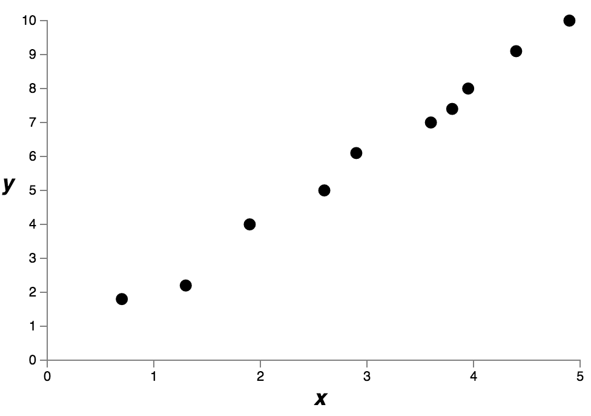

简单点说，我们在研究真实世界的某些现象，x和y表示的是真实世界的数据。我们的目标是建立一个模型，帮助我们预测y究竟是x的怎样的一个函数。我们会尝试使用神经网络来建立这样的一个模型，但是我们先用一个简单点的例子：使用多项式作为模型，我们这么做（用多项式来替代神经网络是因为使用多项式会使得事情变得更加透明）。一旦我们理解了多项式的例子，我们会转到神经网络。现在这里有图像上的10个点，也就是说我们可以找到一个9次多项式，这可以精确地描述出我们的数据。(我们不会展示各个系数，因为使用Numpy的polyfit并不会展示出来确切的系数，不过要确认这些系数其实很简单，如果你对这些系数好奇的话你可以查看一下下面那个图像的[源码](http://neuralnetworksanddeeplearning.cjs/polynomial_model.js)，这个源码中的函数`p(x)`就是下面的那个多项式的确切形式)
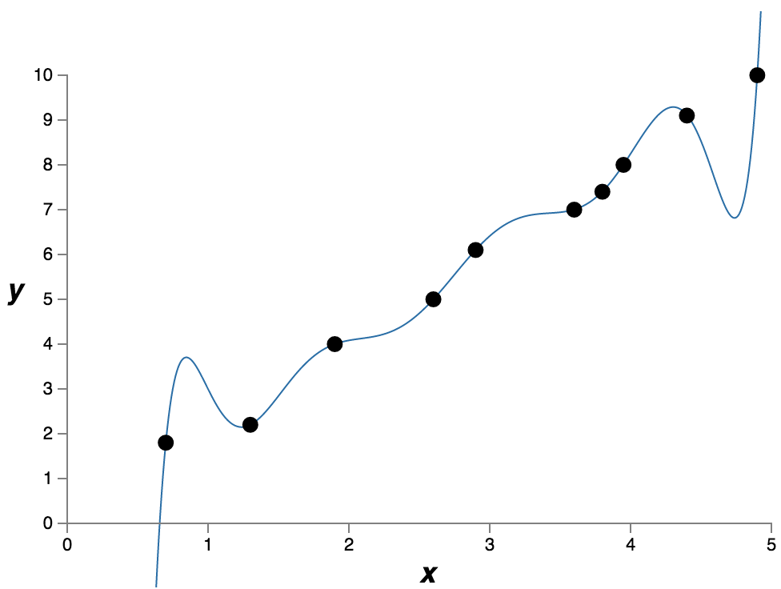
这是一个很准确的拟合，但是我们也可以使用一个很简单的线性模型y=2x做出一个不错的拟合：
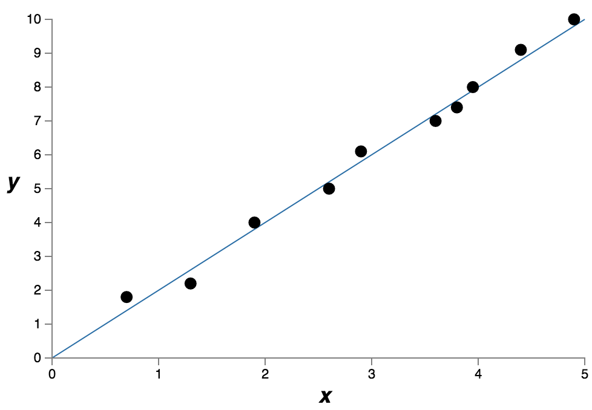
到底哪个是更好的模型呢？哪个是更真实的情况呢？哪个模型可以对真实的现象的泛化结果更好呢？

事实是对于上面这些问题，因为缺少足够的信息，我们无法做出准确的回答，不过我们可以做两个假设，然后分情况看一下：(1)9次多项式是对真实世界的一种描述，因此它的泛化能力很好；(2)实际情况是y=2x，但是因为一些噪声的存在使得拟合结果不是那么的准确。

其实并不存在一些先验的知识告诉我们这两个可能中哪个是正确的。（有可能存在第三种可能）。逻辑上看，每一个都有可能是真的。而且这里面的差别很大。虽然在现在的数据上我们看到的是两种情况的拟合结果相差很小，但是假设我们想要去在更多的数据上进行预测，比我们看到的数据多的多的数据上预测。如果我们真的这么做的话，两个模型之间的差别会变得很大，9次多项式模型会被$x^9$项所控制，而线性模型，，还是原来的那个线性模型。

有一个观点是，在科学探索中除了必要的时候我们倾向于选择更为简单的观点。当我们找到了一个简单的模型可以去解释我们的数据的时候，我们就可以大喊’Eureka’(阿基米德在发现浮力定律的时候喊得)。毕竟简单的解释看起来并不是巧合。我们认为模型应该建立在真实情况和现象之上。在上面的例子中，y=2x+noise看起来要比9次多项式简单得多。因为y=2x+noise如果是巧合的话会让我们很惊讶的。在这种观点下，9次多项式模型实际上是被那些局部的噪声所影响了。所以9次多项式虽然可以很好的拟合已有的数据点，但是对于未知数据的泛化问题却无能为了，而简单的线性模型却显得很好。(奥卡姆剃刀)

我们来看一下这种观点对于神经网络有什么影响，假设我们的网络中的权重都比较小，这经常发生在正则化的网络中。小的权重意味着当我们随机的改变了一些输入的时候，网络的行为不会发生太大的改动。这就是说正则化的网络在训练的时候比较不容易受到一些数据中局部噪声的影响。我们可以认为这是一种保证局部的异常不会对于网络输出有太大的影响的手段。相对而言，正则化的网络经常会对那些贯穿整个网络的训练集数据有着较好的训练。相反的，一个拥有较大权重的网络在输入有着小的变动的时候却会做出较大的改变。也就是一个非正则化的网络会使用大的权重来拟合一个复杂的模型，但是模型中会掺杂大量的训练数据中的噪声。简言之，正则化网络可以基于经常在训练数据中出现的模式建立一个相对简单的模型，并且会防止学习到训练集数据中的噪声。他会强迫我们的网络真正的学习现象本身，并且有更好的泛化能力。

这种倾向于简单的解释的思想可能会让你有点紧张。人们有时会把这种想法叫做’奥卡姆剃刀’，并且会把他用作通用的科学准则。不过虽然如此，奥卡姆剃刀原理并不是一个严格的通用的科学准则。并没有任何先验的符合逻辑的理由去倾向于简单的解释。实际上有些时候复杂模型可能是正确的。

我们举个关于复杂模型是正确的例子。上个世纪40年代，物理学家Marcel Schein宣布发现了一种新的自然粒子。他所工作的公司通用电气，非常开心，大范围的发表了这个发现。但是物理学家Hans Bethe 表示怀疑。Bethe去拜访Schein并且看了Schein的用来跟踪这个粒子的仪表。Schein展示了很多，但是每一个仪表上Bethe都指出了一些问题，说一些数据是需要丢弃的。最后Schein展示了一个看起来很好的仪表。Bethe说这绝对是一个偶然事件，Schein说“是的，但是这个是因为统计学的概率所产生的数据也是符合你自己的方程的，这个出现的概率是5分之一”。Bethe说是的，但是剩的那四个你怎么解释。最后Schein说；’在我的仪表上，每一个都是好的，你提出了一种不同的理论来解释，但是我的假设却可以解释所有的’Bethe反驳道：我们解释的差别在于你的是错的，我的是对的，你的简单的单一解释是错的，我的多个复杂说明却是对的“。随后的工作支持了Bethe的理论。(这个故事在物理学家费曼的一次采访中被提到)

第二个例子，在1859年天文学家Urbain Le Verrier观察到了水星的轨迹并不完全符合牛顿力学。在牛顿力学上有着一点点的偏差，一些解释将这个归结于，牛顿力学是对的，但是需要一些小小的修正。在1916年的时候爱因斯坦展示了这些偏差可以被相对论很好的解释，而相对论却是基于一个复杂的数学体系，和牛顿体系根本就不一样的。尽管爱因斯坦的理论很复杂，但是现在人们都在接受爱因斯坦的理论，而牛顿体系，即使是经过修正的也被认为是错的。一方面是因为我们知道了爱因斯坦的理论解释了很多其他的现象，而牛顿的不能。而且，爱因斯坦的体系还预测出了一些牛顿体系无法预测出的现象。不过这些现象在早期并没有被人观测到。如果我们按照简单作为评判原则的话，那么修改过的牛顿体系显然更加好。

从这些故事中我们可以描述出三点。首先，去决定两种解释哪一个更简单是一个很微妙的事情。第二，即使我们能做出这样的判断，在使用的时候依然要很小心。第三点，对于模型的真正的评估并不容易，这种评估需要取决于在对于新现象的预测效果。

综上所述，并且保持小心谨慎，从经验上看，正则化的网络在泛化效果上要比非正则化的网络要好。所以，在本书剩下的部分，我们会经常使用正则化。上面的故事仅仅是要去阐述事实上没有人建立一个完整的理论去说为什么正则化的网络会有好的泛化能力。实际上，现在，研究者们还在不断的去尝试用不同的方法来研究正则化，并且去比较怎么正则化比较好，同时也在尝试着去解释为什么有些方法好，有些方法不好。所以，其实你可以把正则化看做是一种简单有效的方法。虽然他很有帮助，但是我们并没有一个完整的，令人满意的体系去说明究竟因为什么，有的仅仅是一些不完整的猜想。

其实，这里有一些比较深入的问题，这些问题直指一些科学的核心。是有关我们如何泛化的问题。正则化可能会给我们一些计算上的魔法，帮助我们可以让网络有更好的泛化能力，但是却没有帮助我们去理解到底是怎么泛化的，也没说最好的方法是什么。(这些问题回到了problem of induction-归纳问题,由芬兰哲学家David Hume提出的著名的讨论 "An Enquiry Concerning Human Understanding" (1748)。归纳问题给了现代的机器学习一个理论 [no-free lunch theorem](http://ieeexplore.ieee.org/document/585893/?reload=true&tp=&arnumber=585893))。

在我们的日常生活中，人类都在对所遇到的现象进行良好的泛化，给一个孩子看几张大象的照片，这个孩子会很快的识别出来别的大象。当然了，会存在一些错误，可能会把犀牛错误的识别成大象，但是在大多数情况下，都是非常准确的。所以，我们有一个系统--人脑-具有大量的自由参数。并且仅仅需要一点点的训练图像，我们的大脑系统就能获得对未见过的图像泛化处理的能力。从某种意义上看，我们的大脑有着惊人的正则化能力！我们是怎么做到的呢？这个，其实我们也不知道。我们期望在未来的一段时间内，人们可以发展出一些更加有力的技术用来对人工神经网络进行正则化，可以使得神经网络在训练集很小的时候也能够具有强大的泛化能力。

实际上，我们的网络相比于之前的有着好的泛化能力了。一个具有100个隐藏节点的神经网络具有将近8万个参数，二所使用的训练集仅有5万个图片。其实，就像是要用五万个数据点去拟合8万次的多项式。第一反应应该是，我们的网络应该会过拟合的很严重。但实际上就像我们之前看到的一样，我们的网络的效果还是挺好的，有着不错的泛化能力的。这是为什么呢？这个不太好理解。在[Gradient-Based Learning Applied to Document Recognition](http://yann.lecun.com/exdb/publis/pdf/lecun-01a.pdf), by Yann LeCun, Léon Bottou, Yoshua Bengio, and Patrick Haffner ，中有一个推测“使用动态的梯度下降学习多层网络有着自正则化的效果”这真是太幸运了，但是我们还是不理解这是为什么。不过，这并不阻止我们使用正则化来增强网络的泛化能力。

我们回到之前遗留的问题来结束本节的讨论：为什么L2正则化没有包括偏移量呢。当然了对偏移量进行正则化也是很简单的。从经验上看，对偏移量是否正则化没有太大的意义，不会对结果造成太大的影响，，，所以，，这个看习惯吧。不过还是要注意以下，如果有很大的偏移量并不会像权重一样，使得神经网络对于输入变得很敏感。所以，我们不需要去担心过大的偏移量似的我们的网络受噪声的影响很大。同时，允许大的偏移量的存在，使得我们的网络的灵活性更好，实际上，大的偏移量使得神经元更容易饱和，这有时候是我们所希望的。所以，因为这些原因，我们不会对偏移量进行正则化。


### 一些其他的正则化方法
除了L2正则化以外还是存在着其他的正则化方法。实际上有很多很多方法，我们没时间一一的介绍，本节中，我们简单的说明一下另外三种用来减少过拟合的方法：L1正则化，dropout和人工的增大训练集大小。我们不会和上面一样那么详细的，深入的学习各个方法。我们这里仅仅是介绍一下这些方法的主要思想。

L1正则化：这个方法中，我们通过对非正则化的代价函数加上权重的绝对值的和：
$\begin{eqnarray}  C = C_0 + \frac{\lambda}{n} \sum_w |w|.
\tag{95}\end{eqnarray}$

这个看起来和L2正则化很像，通过惩罚大的权重，使得网络倾向于选择小的权重，当然了，L1正则化其实和L2正则化并不一样，因此我们也不能去期待他们的行为是一样的。我们来试着理解一下L1正则化的网络的训练行为和L2正则化的有什么区别。

为了要做到这一点，我们先来看一下这个代价函数的偏导，由方程（95）我们可以得到：
$\begin{eqnarray}  \frac{\partial C}{\partial
    w} = \frac{\partial C_0}{\partial w} + \frac{\lambda}{n} \, {\rm
    sgn}(w),
\tag{96}\end{eqnarray}$
里sgn（w）是w的符号，就是如果w为正那值为+1，如果w为负，那么值为-1.使用这个表达式，我们就可以很轻易的使用反向转播来做使用L1正则化的随机梯度下降，使用L1正则化的网络的权重更新规则是：
$\begin{eqnarray}  w \rightarrow w' =
  w-\frac{\eta \lambda}{n} \mbox{sgn}(w) - \eta \frac{\partial
    C_0}{\partial w},
\tag{97}\end{eqnarray}$
这里就像我们之前做的那样，我们可以使用mini-batch上的均值来近似估计$\partial C_0/ \partial w$。我们和L2正则化的权重更新规则进行对比:
$\begin{eqnarray}
  w \rightarrow w' = w\left(1 - \frac{\eta \lambda}{n} \right)
  - \eta \frac{\partial C_0}{\partial w}.
\tag{98}\end{eqnarray}$
在这两个表达式（97）（98）中，正则化的主要作用是去减小权重。从我们的直觉上看，两个正则化方法都是在对大的权重进行处罚。但是权重缩减的方法却不一样。在L1正则化中，权重会趋近于0。在L2正则化中权重的缩小与w成正比。当一个权重有个很大的绝对值$|w|$的时候，L1正则化对于L2正则化来说减小权重的程度会小很多。相反的，当$|w|$很小的时候L1又会减少的比L2多。所以使用L1正则化的结果是会使得网络的权重集中在很少的一些对输出有着很大影响的连接上，而其他的会趋近于0.

我们在上面的讨论中忽视了一个问题，就是在w=0的时候$sgn(w)$是没有定义的，就是不可导的。因为函数$|w|$在w为0的点图像是尖的，所以函数在这一点不可导。这也没什么，因为当w=0的时候我们就不使用正则化的规则了。从直觉上看，这是没问题的。正则化的意义是在缩减权重，在权重是0的时候也就不用再缩减了。为了让这个更加严谨，我们给定义sgn(0) = 0。这就好多了，就简化了我们L1正则化的随机梯度下降的规则了。

### Dropout：
Dropout是和正则化相差很大的方法，和L1，L2正则化不一样，Dropout并不是去改变代价函数，相反的，在Dropout中，我们改变的是网络的本身。在解释Dropout之前，让我们先说明一下dropout是怎么工作的。

假设，我们要训练一个下面的网络：
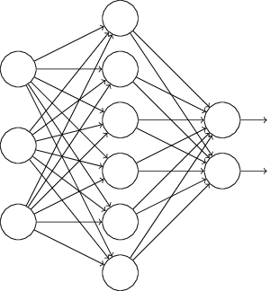
从实际上看，假设我们有了训练输入x和对应的期望输出y。通常的，我们会使x前向穿过这个网络，然后在反向传播来计算梯度。使用Dropout之后，这个过程有点小的改变。在开始的时候随机的(暂时)去掉一半隐藏神经元，然后保持输入输出神经元不变。然后我们的网络就会变成下面的样子。要注意那些被抛出的神经元，他们被暂时的删掉了，但是在网络中依旧存在着（阴魂不散）。
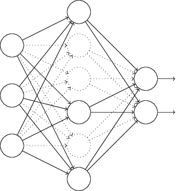
我们还是将输入x正向通过这个修改过的网络，然后反向传播计算梯度。在这样处理过一个mini-batch的输入之后，我们更新权重和偏移量。然后我们重复下面的过程，首先，我们把刚才抛出的神经元再加回来，然后重新的随机选择隐藏神经元的子集，去删掉，再重新根据新的mini-batch来计算梯度，然后更新权重偏移量。

这样重复这个过程，我们的网络可以学到一个权重和偏移量的集合。当然了哪些权重和偏移量被学习是由哪些神经元被抛出所决定的。当我们训练完整个网络，其实意味着有两倍的隐藏神经元被激活了，为了抵消这个影响，我们对于隐藏神经元的输出权重进行减半。

这个Dropout过程看起来有些奇怪，有些特别。为什么我们会认为这会帮助我们减少过拟合呢？为了解释到底会发生什么，现在先限暂时不去考虑dropout本身，相反的，假设我们在按照标准的方法去训练整个神经网络（不要dropout的）。想象一下，我们使用一样的训练集去训练不同的神经网络，当然了因为初始化的时候的不同，这些网络的结果也不一定一样。当这种不同产生的时候，我们会选用一些平均的或者投票机制去确定哪个输出是可以接受的。举个栗子，如果我们训练了5个神经网络，三个网络都把一个图片识别成3了，那么这个图片就很有可能是3，另外两个网络可能是错的。这种平均的方法通常是很有效（但是也很昂贵的）减少过拟合的方法。因为不同的网络可能在不同的地方产生过拟合，这个平均可以帮助我们消除这种过拟合。

这和Dropout有什么关系呢？简单点说，当我们Dropout了不同的神经元集合时，其实就相当于我们训练了不同的网络。那么Dropout过程其实就相当于对于大量不同的网络进行了平均。不同的网络在不同的地方产生了过拟合，那么我们通过Dropout就很有希望去减少这些过拟合。

在之前的一个使用Dropout的paper中有一关于Dropout的相关解释[ImageNet Classification with Deep Convolutional Neural Networks, by Alex Krizhevsky, Ilya Sutskever, and Geoffrey Hinton (2012)](https://papers.nips.cc/paper/4824-imagenet-classification-with-deep-convolutional-neural-networks.pdf)：“这个方法减少了神经元之间的相互影响，因为一个神经元不应该依赖于其他的神经元。所以Dropout强制神经元学习更加鲁棒的特征，能够在和其他神经元随机结合的时候更加的有用。”换言之如果我们认为我们的网络是一个用来做预测的模型，那么我们认为Dropout可以保证在缺少足够的特征的时候使得模型更加的健壮。这点上看是和L1L2正则化很像的，他们通过减小权重来使得网络对于一些独立输入丢失的情况能够更好地处理。

当然了，使用Dropout的真正用途是他可以成功的改进神经网络的表现。最初的paper[（Improving neural networks by preventing co-adaptation of feature detectors by Geoffrey Hinton, Nitish Srivastava, Alex Krizhevsky, Ilya Sutskever, and Ruslan Salakhutdinov (2012). Note that the paper discusses a number of subtleties that I have glossed over in this brief introduction.)](http://arxiv.org/pdf/1207.0580.pdf)介绍了将这个技术应用在一些不同的任务上。现在我们还是要将Dropout应用在改进MNIST图像分类上来，使用普通的前馈神经网络，按照我们之前所讨论的那样。那篇paper通过使用dropout和L2正则化，将之前的最好的98.4%的准确率提升到了98.7%，同样的在其他任务上也有着显著的提升，包括图像识别，语音识别和自然语言处理。Dropout在大规模，深度网络-过拟合很容易发生的，的训练上有着很显著的效用。

### 人工的扩展训练数据：
我们在之前的MNIST分类上已经看到了了在使用仅仅1000个训练图像的时候，准确率下降到80%左右。这并不让人感到惊讶，因为小的数据集无法让我们的网络学习到人类手写数字的多种变化。下面，来看一下，当使用不同规模的训练集，训练具有三十个隐藏节点的网络，网络的表现会有什么不同。还是使用大小为10的mini-batch，学习速度为0.5，正则化参数为5.0，使用交叉熵作为代价函数，当使用全部训练集的时候进行30次迭代，在别的时候迭代次数要乘以训练集缩小的倍数。为了保证权重衰减因子对训练集的影响是一样的，我们同样会等比例缩小正则化参数。下面是结果的图像（这个图像和往后的两幅都是使用more_data.py画出来的。）
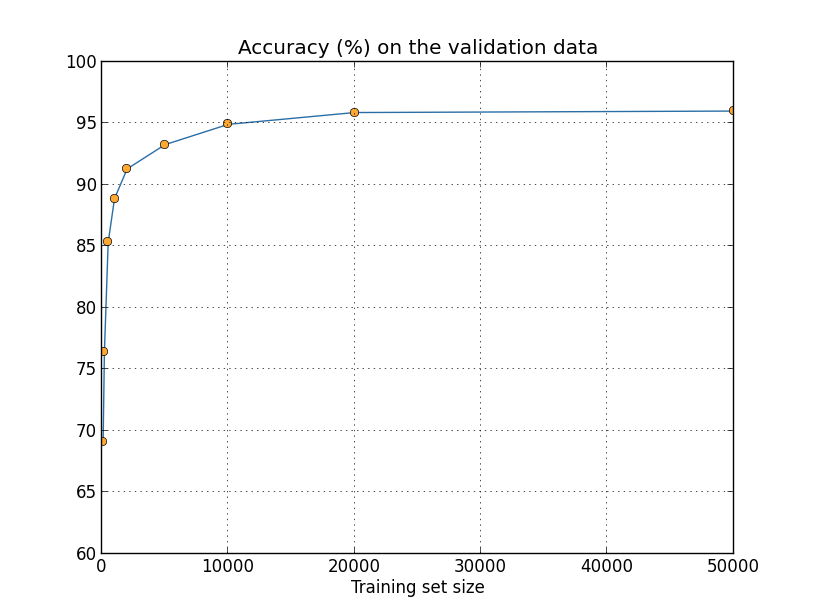
就像看到的一样，分类的准确率随着训练集的增大而增加，这个准确率还会继续随着训练集的增加而增大。当然了看上面的图像我们会发现准确率存在饱和的趋势。然而，然我们换一种度量来画这个图：

这样看起来我们的准确率在不断的提升了。这就可以看出，如果我们使用更多的极大的训练集—上百万，上千万的手写数字样本，而不是五万个，那么即使还是使用这个小网络，依旧很有可能获得更好的结果，。

可以看得出来，使用更大的训练数据集是一个好的想法，不幸的是，这个想法的代价是很高的，所以并不能经常的被用到。然而我们还是有别的办法，比如人工的扩展训练数据，假设，一个例子，我们从MNIST训练图像中选出一个数字5，我们稍微的旋转一下，比如旋转15度：

这还是一同个数字，但是，在像素层面上就会相差很大，那么把这个图片加入到训练数据上就有可能会帮助我们去改进网络的学习。另外，我们不仅仅是增加一个图片，我们可以对MNIST的所有训练数据都进行一个小的转动，那么我们就扩大了训练数据集，如果使用这个扩展的训练集，有可能会改进网络的表现。

这种思想是很有用的，也被广泛地使用。让有一个相关paper的结果[（Best Practices for Convolutional Neural Networks Applied to Visual Document Analysis, by Patrice Simard, Dave Steinkraus, and John Platt (2003).）](http://dx.doi.org/10.1109/ICDAR.2003.1227801)他们使用的网络结构和我们上面使用的很像，前馈网络有800个隐藏节点，使用交叉熵代价函数。在标准的MNIST训练集上，得到了对测试集98.4%的分类准确率。但是当他们扩展了数据集，不仅仅是上面说的旋转，还对图像进行扭曲等行为，在这个扩展的训练集上，他们得到了98.9%的准确率。他们还试验了一种他们称之为“弹性扭曲”的方法，一种特殊的扭曲图像的方法，用来模仿人们手写的时候手部肌肉的颤抖。通过使用“弹性扭曲”他们的分类准确率可以达到99.3%。他们通过找到人类手写数字的变化来扩展数据集的思想是卓有成效的。

这种扩展原始数据集的思想可以被用来改进很多学习任务的表现，而不仅限于手写数字识别。主要思想是通过在数据集上施加对于真实世界的模仿来扩展数据集。这还是比较简单的。举个例子，假设你建立了一个神经网络去进行语音识别，对于人们来说，在真实世界中即使存在一定的背景噪音，人们仍然可以很好的识别出来，同样，当人们语速提高或者减慢，我们都可以识别出来。所以这都是我们可以用来扩展数据集的方法。但是这种方法并不总是有效的，相对于增加噪音，在网络输入网络前添加一个过滤器去减少噪音显然更加有效。不过在意识中保留这种思想，并且找机会去使用它还是很有价值的。

### 练习
前面我们说了，通过小幅的旋转来扩展MNIST是很有效的，但是如果我们进行了大幅度的旋转呢？会发生什么？
``` 如果转的太大了，那比如数字1就会成了汉字1，数字5就有可能变成了数字2这是不能接受的，对于训练集而言这是完全的噪音```

### 大数据的一点介绍，以及大数据对于我们的分类准确率有什么关系：
我们来回顾一下分类准确率随数据集的增加而变化的过程吧：

假设我们使用除了神经网络之外的机器学习方法来进行图像分类。比如，我们试着使用SVM，就像第一章说的那样，如果你对svm不熟悉也不用着急，我们不需要深入的理解svm，直接使用第三方工具就好了。我们把准确率和训练集规模的关系图像画出来，为了比较我们将神经网络的结果也展示在同一张图片上：
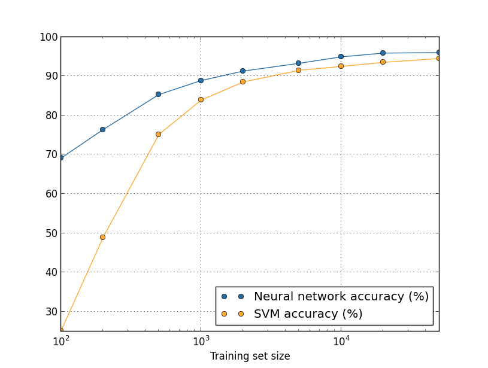
你的第一印象可能是神经网络要在具有相同数据集的情况下比svm好多了。不过也别太激动，因为我们只是使用了scikit-learn提供的SVM方法，参数都是默认的，而我们在神经网络上却一直在进行改进。一个更有意思也更值得关注的地方是如果我们用全部的5万张图片做SVM训练集，那么SVM（94.48%）要比我们使用5000张图片训练的神经网络（93.24%）好多了。换言之，数据集的增加会补偿机器学习算法的差异。

更有意思的是，假设我们尝试使用两种方法来解决问题，算法A和算法B。算法A在一个数据集上的表现可能好过算法B但是算法B在另一个数据集上的表现却会好过算法A。上面的图片中我们没有看到，这需要两个图像有交点，但是确实是存在的。[Striking examples may be found in Scaling to very very large corpora for natural language disambiguation, by Michele Banko and Eric Brill (2001).](http://dx.doi.org/10.3115/1073012.1073017)所以有的时候算法的好坏是取决于数据集的选择的。

上面这一点是需要铭记在心的，不管是在做开发还是研究的时候。很多paper都关注于寻找新的技巧，努力的提升在标准数据集上的效果。“我们的一流算法在标准集Y上得到了X%的提升”这是研究的标准说法。这是很有意思的，我们必须明白，这个是值得在很多特定的上下文的数据集下的应用。想象一下那些创造标准数据集的人，他们可能使用了很多的钱去收集训练数据。这就可能导致那些，一流的方法在别的数据集，更大的数据集上失效。换言之，这种提升有可能仅仅是由于历史原因造成的。总而言之，我们想要强调的是，在特定的应用下，我们想要得到的是好的算法以及好的训练数据，寻找好的算法是很重要的，但是不要因为关注于算法的寻找而忽略了好的数据集的构建。

### 问题
调研问题：我们的学习算法在相当大的数据集下有什么限制呢？对于任一给定的算法，想要找到在真实的大的数据集下的表现是很自然的想法。一个快速的但是不够准确的方法是尝试着拟合准确率曲线（就像上面的曲线一样），然后去推断在无限大的时候的结果。当然了使用不同的拟合方法也会有不同的结果。你能找到一个拟合曲线的原则么？如果可以尝试着去比较一下不同的算法表现。

总结：现在我们已经进入了过拟合和正则化的世界。当然了，稍后还会回到这个问题，就像我们之前提到的一样，过拟合是神经网络中重要的问题，尤其是当计算能力越来越强，我们有能力去训练更大规模的网络的时候。这也给我们了一些压力，迫使我们去研究更加强大的正则化技术来减少过拟合。这也是目前很活跃的领域。


## 权重的初始化
当我们创建神经网络的时候，我们要去选择，初始化合适的权重和偏移量。目前为止，我们的初始化方法在第一章中提到的简单方法。回顾一下，我们对权重和偏移量的选择是根据标准的高斯分布来的，均值为0标准差为1。这个方法工作的很好，也很特别，不过我们还是要看一下有没有更好的方法来初始化权重和偏移量，从而帮助我们更好的训练神经网络。

实际上有更好的初始化方法。假设我们要训练一个大规模的神经网络，比如说有1000个输入神经元。假设，我们使用标准的高斯分布来初始化连接到第一个隐藏层的权重连接上。现在我们先关注这一层连接，忽略一下其他的部分：
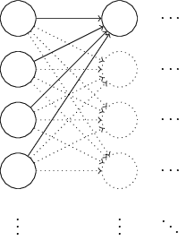

假设有一个训练样本x，这个x会激活一半的输入神经元，比如把这一半都设为1，另一半的神经元都是0。后面的说明，应用都是更加普遍的情况，不过你会从这个特殊的例子找到问题的关键点。让我们看一下隐藏神经元的加权输入$z = \sum_j w_j x_j+b$有500项消失了，因为他们相应的x都是0。所以，z其实是一个501项高斯分布下随机变量的和，因为500个权重和一个额外的偏移量，因此z本身服从均值为0标准差$\sqrt{501} \approx 22.4$为的高斯分布。z的图像是
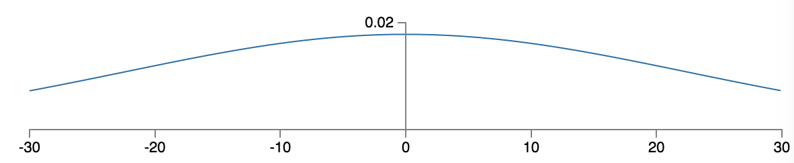
从上图中可以看到，|z|的值比较大是一个大概率的事件，就是$z>>1$或者$z << -1$是很容易发生的.如果这样的话，那么最后这个隐藏节点的输出会很接近1或者0，也就是这个神经元饱和了。当这个情况发生的时候，我们已经知道对于权重的小小的改变只会引起更小的神经元激活值的改遍，这个更小的激活值的改变会在网络中转播影响到后面的神经元，我们会在代价函数上看到更小的改变。最后的结果就是这些权重的学习在我们使用梯度下降算法的时候会非常的慢。(我们在第二章的时候有过详细的介绍在我们使用随机反向传播的时候看到了权重的很慢的学习速度)这和我们之前讨论的很像。错误的结果导致了学习速度的下降。我们通过代价函数的选择避免了那个问题。不幸的是他对输出神经元有帮助，但是对于那些隐藏节点的却没有什么帮助。

就像我们讨论了第一层的结果一样，如果我们使用标准的高斯分布来初始化，同样的问题也会发生在后面的隐藏层中，激活值总会接近0或者1，学习过程会变得缓慢。

我们有更好的初始化方法来避免这种饱和，避免学习速度的下降嘛？假设我们有一个具有$n_{in}$个输入权重的神经元。那么我们在初始化权重的时候将权重服从的高斯分布的参数设置成均值为0标准差为$1 / \sqrt{n_{in}}$，也就是对标准高斯分布进行一下缩放，对于偏移量的初始化还是服从标准高斯分布，稍后我们会说明为什么。当使用这样的高斯分布来随机初始化权重，那么神经元的加权输入$z = \sum_j w_j x_j +b$所服从的高斯分布均值仍然为0，但是这个高斯分布的图形会变得比较尖锐，也就是他的标准差会变小。假设和之前一样的，我们的输入会使得500个神经元0，500个神经元为1。这个时候$z$的标准差就是$\sqrt {3/2} \approx 1.22$，这时z所服从的高斯分布图像就变成了下面的样子:

这也就意味着z的绝对值通常情况下并不会太大，从而保证了神经元并不会轻易地在初始化后就进入饱和状态。

### 练习
推导一下上一段中的几个方程吧

上面我们说到，我们对于偏移量的初始化保持不变，依旧是均值为0，标准差为1的标准高斯分布。因为偏移量并不会造成我们上面的神经元饱和的情况。实际上权重的初始化和神经元饱和没有什么关系。一些人采用比较偏激的方法，将偏移量初始化为0，完全依赖梯度下降去学习偏移量。但是结果没什么区别，所以我们还是会使用同样的初始化过程。（我们这里稍微分析一下，这个原因其实很简单，这里我们所说的神经元的饱和状态是由神经元的激活函数也就是我们所使用的sigmoid函数的性质所引起的，当输入很大或者很小的时候都会导致函数对于输入（这个函数的输入是加权输入）的导数很小，也就是对于权重和偏移量的偏导会是很小的值，这也就意味着我们在梯度下降的时候权重和偏移量的改变很小。当我们，对于权重的分析，在上文已经看到了，但是偏移量，当偏移量服从标准高斯分布的时候，他的取值往往是在0附近的，所以，并不会引起加权输入很大或者很小的情形发生，当然，从这个角度去考虑的时候好像取0是更有道理一点。）

下面使用MNIST分类任务比较一下新旧两种初始化方法对网络学习的影响吧。和之前一样，使用30个隐藏节点的神经网络，大小为10的mini-batch，正则化参数为5.0，交叉熵做代价函数。我们将学习速度从0.5下降到0.1，这可以让我们更加明显的看到结果的改变。我们使用旧的方法来初始化权重时：
```python
>>> import mnist_loader
>>> training_data, validation_data, test_data = \
... mnist_loader.load_data_wrapper()
>>> import network2
>>> net = network2.Network([784, 30, 10], cost=network2.CrossEntropyCost)
>>> net.large_weight_initializer()
>>> net.SGD(training_data, 30, 10, 0.1, lmbda = 5.0,
... evaluation_data=validation_data,
... monitor_evaluation_accuracy=True)
```
采用新的方法来初始化网络，因为network2默认的权重初始化方法就是上面所介绍的新的初始化方法，所以这里就不调用large_weight_initializer():
```python
>>> net = network2.Network([784, 30, 10], cost=network2.CrossEntropyCost)
>>> net.SGD(training_data, 30, 10, 0.1, lmbda = 5.0,
... evaluation_data=validation_data,
... monitor_evaluation_accuracy=True)
```

可以观察到：

这两种情况下我们的分类准确率最后都到了96%左右。看起来好像两种初始化所带来的的分类准确率差不了太多。但是新的初始化方法却很快就到达了这个准确率，在第一次迭代结束后，旧的初始化方法分类准确率是87%，而使用新的初始化方法准确率达到了93%。就是说新的初始化方法可以快速的帮助我们达到想要的结果，同样的对于有100个隐藏节点的网络：
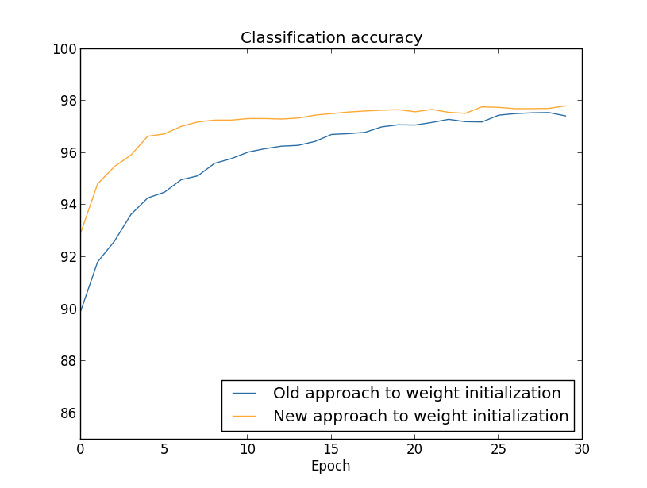
这里两个曲线好像没有完全交叉，但是从图像的趋势上看，如果我们增加迭代次数，最后他们的结果还是差不多的。根据这些实验来看，我们的新的方法仅仅是加快了训练速度，而没有提升准确率。在第四章的时候我们会接触到一些神经网络的例子，到那时，那些网络的长期行为会因为我们的初始化的改变有显著的提升。因此，好的初始化不仅仅会帮助我们提升训练速度，也会帮助我们改进学习效果。

使用新的权重初始化方法帮助我们改进了网络的学习。除了这种$q/ \sqrt{n_{in}}$之外，还存在很多其他的权重初始化方法，不过都是基于类似的思想的，这里我们就不详细叙述这些方法，因为现在的方法已经工作的很好了。如果你对这些感兴趣，那么你可以看看2012年的Yoshua Bengio的paper的14，15页。[Practical Recommendations for Gradient-Based Training of Deep Architectures, by Yoshua Bengio (2012).](http://arxiv.org/pdf/1206.5533v2.pdf)


### 问题
将正则化和权重初始化的改进方法结合起来。假设我们使用旧的权重初始化方法，L2正则化有的时候会提供给一些类似于新的权重初始化的效果。简单说一下：(1)假设$\lambda$不是太小，那么第一次迭代的结果会几乎完全被权重衰减因子决定，（2）当$\eta \lambda << n$的时候权重在每次迭代的衰减因子是$exp(-\eta \lambda / m)$，（3）假设$lambda$不是太大，那么当权重减小到$1 / \sqrt{n}$的规模时，权重的衰减会缩小，这里n是网络中权重的总数。

## 回顾手写数字识别问题：代码
现在来开始实现本章的代码吧。我们会实现一个新的程序，network2.py，这是之前的第一章的network.py的升级版。如果你还没看过那个最好还是回去看看，只有74行，很容易去理解。

和network.py一样的network2.py也是以初始化Network类开始的。我们会初始化一个Network实例，通过一个list表示网络中每层神经元的个数，并且选择一个代价函数，默认的是交叉熵：
```python
class Network(object):
  def __init__(self, sizes, cost=CrossEntropyCost):
    self.num_layers = len(sizes)
    self.sizes = sizes
    self.default_weight_initializer()
    self.cost=cost
```
最开始的几行和Network的初始化方法一样的，但是最后两行是不一样的，我们需要稍微说明一下。

我们先看default_weight_initializer方法，这里实现了我们上一节说的新的权重初始化方法，这个方法对一个神经元的输入权重进行初始化要求服从均值为0，标准差为1除以这个神经元的输入连接个数的开方。同样的，在这个方法中我们还是会使用均值为0标准差为1的标准高斯分布初始化偏移量：
```python
def default_weight_initializer(self):
    self.biases = [np.random.randn(y, 1) for y in self.sizes[1:]]
    self.weights = [np.random.randn(y, x)/np.sqrt(x)
                    for x, y in zip(self.sizes[:-1], self.sizes[1:])]
```
为了理解这段代码，我们还是要先说一下我们import了numpuy进来使用numpy提供的库函数来进行运算。同样的，注意到我们没有初始化第一层神经元的偏移量，因为那是输入层，这里偏移量没有用。

完成了默认的权重初始化方法后我们还有一个large_weight_initializer方法。这个方法使用的是第一章中我们说过的方法来初始化权重。代码和上面的很像：
```python
def large_weight_initializer(self):
        self.biases = [np.random.randn(y, 1) for y in self.sizes[1:]]
        self.weights = [np.random.randn(y, x)
                        for x, y in zip(self.sizes[:-1], self.sizes[1:])]
```
这里我们实现这个仅仅是为了方便我们比较,而并不是认为会有什么特殊的情况这种初始化会有好的效果。

Network初始化中第二个一样的地方是我们增加了一个参数，cost。为了理解这个是怎么工作的，我们还是先看一下用来表示交叉熵代价函数的类(如果你对于python的静态方法不熟悉，你可以忽略@staticmethod这个装饰器，把fn和delta当做是普通的方法就行了，如果你对这个好奇的话，所有的@staticmethod都是去告诉python解释器，下面的方法怎么都不会依赖于类的，这也就是为什么self没有给fn和delta传参的原因)
```python
class CrossEntropyCost(object):

    @staticmethod
    def fn(a, y):
        return np.sum(np.nan_to_num(-y*np.log(a)-(1-y)*np.log(1-a)))

    @staticmethod
    def delta(z, a, y):
        return (a-y)
```
我们先打断一下对于代码的分析，虽然在数学上看交叉熵是一个函数，但是我们在实现的时候使用的是python的类而不是实现一个python函数，我们为什么这么做呢？是因为在我们的网络中代价函数扮演着两个角色，最明显的是衡量网络的激活值和期望输出y的差距。这个功能是通过我们的CrossEntropyCost.fn方法实现的。（要注意，需要说明一下的是fn里面的np.nan_to_num方法保证了当log中的数很接近0的时候的结果的正确。）不过回忆一下第二章中我们进行反向传播算法的时候我们计算的输出误差$\delta ^L$，这个误差的形式由代价函数决定。对于交叉熵而言，输出误差为$\delta ^L = a^L - y \tag{99}$这就是我们定义了CrossEntropyCost.delta的原因，这是为了告诉我们的网络如何计算输出误差。然后我们把这两个方法绑到一个类里面去。

同样的，我们这里还包含着一个类用来表示二次代价函数的。这个也是为了进行比较的，同样的QuadraticCost.fn 方法就是直接衡量网络激活值和期望输出y的差距，delta方法是用来计算网络的输出错误$\delta ^L =  (a^L - y) \odot \sigma'(z^L) $
```python
class QuadraticCost(object):

    @staticmethod
    def fn(a, y):
        return 0.5*np.linalg.norm(a-y)**2

    @staticmethod
    def delta(z, a, y):
        return (a-y) * sigmoid_prime(z)
```
现在我们说明了Network和Network2的主要区别，下面的代码中还有包括L2正则化在内的很多小差别，下面我们会慢慢说，先让我们看一下network2的代码，你不需要去仔细的阅读代码，但是还是值得大概的理解整个结构的，你可以看看我们的文档说明，你就可以理解每一段是干什么的了。当然了我们也欢迎你仔细阅读。如果你又不懂的地方可以先看后面的文章然后在回来看代码。Anyway，这里是代码：
```python
"""network2.py
~~~~~~~~~~~~~~

An improved version of network.py, implementing the stochastic
gradient descent learning algorithm for a feedforward neural network.
Improvements include the addition of the cross-entropy cost function,
regularization, and better initialization of network weights.  Note
that I have focused on making the code simple, easily readable, and
easily modifiable.  It is not optimized, and omits many desirable
features.

"""

#### Libraries
# Standard library
import json
import random
import sys

# Third-party libraries
import numpy as np

#### Define the quadratic and cross-entropy cost functions

class QuadraticCost(object):

    @staticmethod
    def fn(a, y):
        """Return the cost associated with an output ``a`` and desired output
        ``y``.

        """
        return 0.5*np.linalg.norm(a-y)**2

    @staticmethod
    def delta(z, a, y):
        """Return the error delta from the output layer."""
        return (a-y) * sigmoid_prime(z)

class CrossEntropyCost(object):

    @staticmethod
    def fn(a, y):
        """Return the cost associated with an output ``a`` and desired output
        ``y``.  Note that np.nan_to_num is used to ensure numerical
        stability.  In particular, if both ``a`` and ``y`` have a 1.0
        in the same slot, then the expression (1-y)*np.log(1-a)
        returns nan.  The np.nan_to_num ensures that that is converted
        to the correct value (0.0).

        """
        return np.sum(np.nan_to_num(-y*np.log(a)-(1-y)*np.log(1-a)))

    @staticmethod
    def delta(z, a, y):
        """Return the error delta from the output layer.  Note that the
        parameter ``z`` is not used by the method.  It is included in
        the method's parameters in order to make the interface
        consistent with the delta method for other cost classes.

        """
        return (a-y)

#### Main Network class
class Network(object):

    def __init__(self, sizes, cost=CrossEntropyCost):
        """The list ``sizes`` contains the number of neurons in the respective
        layers of the network.  For example, if the list was [2, 3, 1]
        then it would be a three-layer network, with the first layer
        containing 2 neurons, the second layer 3 neurons, and the
        third layer 1 neuron.  The biases and weights for the network
        are initialized randomly, using
        ``self.default_weight_initializer`` (see docstring for that
        method).

        """
        self.num_layers = len(sizes)
        self.sizes = sizes
        self.default_weight_initializer()
        self.cost=cost

    def default_weight_initializer(self):
        """Initialize each weight using a Gaussian distribution with mean 0
        and standard deviation 1 over the square root of the number of
        weights connecting to the same neuron.  Initialize the biases
        using a Gaussian distribution with mean 0 and standard
        deviation 1.

        Note that the first layer is assumed to be an input layer, and
        by convention we won't set any biases for those neurons, since
        biases are only ever used in computing the outputs from later
        layers.

        """
        self.biases = [np.random.randn(y, 1) for y in self.sizes[1:]]
        self.weights = [np.random.randn(y, x)/np.sqrt(x)
                        for x, y in zip(self.sizes[:-1], self.sizes[1:])]

    def large_weight_initializer(self):
        """Initialize the weights using a Gaussian distribution with mean 0
        and standard deviation 1.  Initialize the biases using a
        Gaussian distribution with mean 0 and standard deviation 1.

        Note that the first layer is assumed to be an input layer, and
        by convention we won't set any biases for those neurons, since
        biases are only ever used in computing the outputs from later
        layers.

        This weight and bias initializer uses the same approach as in
        Chapter 1, and is included for purposes of comparison.  It
        will usually be better to use the default weight initializer
        instead.

        """
        self.biases = [np.random.randn(y, 1) for y in self.sizes[1:]]
        self.weights = [np.random.randn(y, x)
                        for x, y in zip(self.sizes[:-1], self.sizes[1:])]

    def feedforward(self, a):
        """Return the output of the network if ``a`` is input."""
        for b, w in zip(self.biases, self.weights):
            a = sigmoid(np.dot(w, a)+b)
        return a

    def SGD(self, training_data, epochs, mini_batch_size, eta,
            lmbda = 0.0,
            evaluation_data=None,
            monitor_evaluation_cost=False,
            monitor_evaluation_accuracy=False,
            monitor_training_cost=False,
            monitor_training_accuracy=False):
        """Train the neural network using mini-batch stochastic gradient
        descent.  The ``training_data`` is a list of tuples ``(x, y)``
        representing the training inputs and the desired outputs.  The
        other non-optional parameters are self-explanatory, as is the
        regularization parameter ``lmbda``.  The method also accepts
        ``evaluation_data``, usually either the validation or test
        data.  We can monitor the cost and accuracy on either the
        evaluation data or the training data, by setting the
        appropriate flags.  The method returns a tuple containing four
        lists: the (per-epoch) costs on the evaluation data, the
        accuracies on the evaluation data, the costs on the training
        data, and the accuracies on the training data.  All values are
        evaluated at the end of each training epoch.  So, for example,
        if we train for 30 epochs, then the first element of the tuple
        will be a 30-element list containing the cost on the
        evaluation data at the end of each epoch. Note that the lists
        are empty if the corresponding flag is not set.

        """
        if evaluation_data: n_data = len(evaluation_data)
        n = len(training_data)
        evaluation_cost, evaluation_accuracy = [], []
        training_cost, training_accuracy = [], []
        for j in xrange(epochs):
            random.shuffle(training_data)
            mini_batches = [
                training_data[k:k+mini_batch_size]
                for k in xrange(0, n, mini_batch_size)]
            for mini_batch in mini_batches:
                self.update_mini_batch(
                    mini_batch, eta, lmbda, len(training_data))
            print "Epoch %s training complete" % j
            if monitor_training_cost:
                cost = self.total_cost(training_data, lmbda)
                training_cost.append(cost)
                print "Cost on training data: {}".format(cost)
            if monitor_training_accuracy:
                accuracy = self.accuracy(training_data, convert=True)
                training_accuracy.append(accuracy)
                print "Accuracy on training data: {} / {}".format(
                    accuracy, n)
            if monitor_evaluation_cost:
                cost = self.total_cost(evaluation_data, lmbda, convert=True)
                evaluation_cost.append(cost)
                print "Cost on evaluation data: {}".format(cost)
            if monitor_evaluation_accuracy:
                accuracy = self.accuracy(evaluation_data)
                evaluation_accuracy.append(accuracy)
                print "Accuracy on evaluation data: {} / {}".format(
                    self.accuracy(evaluation_data), n_data)
            print
        return evaluation_cost, evaluation_accuracy, \
            training_cost, training_accuracy

    def update_mini_batch(self, mini_batch, eta, lmbda, n):
        """Update the network's weights and biases by applying gradient
        descent using backpropagation to a single mini batch.  The
        ``mini_batch`` is a list of tuples ``(x, y)``, ``eta`` is the
        learning rate, ``lmbda`` is the regularization parameter, and
        ``n`` is the total size of the training data set.

        """
        nabla_b = [np.zeros(b.shape) for b in self.biases]
        nabla_w = [np.zeros(w.shape) for w in self.weights]
        for x, y in mini_batch:
            delta_nabla_b, delta_nabla_w = self.backprop(x, y)
            nabla_b = [nb+dnb for nb, dnb in zip(nabla_b, delta_nabla_b)]
            nabla_w = [nw+dnw for nw, dnw in zip(nabla_w, delta_nabla_w)]
        self.weights = [(1-eta*(lmbda/n))*w-(eta/len(mini_batch))*nw
                        for w, nw in zip(self.weights, nabla_w)]
        self.biases = [b-(eta/len(mini_batch))*nb
                       for b, nb in zip(self.biases, nabla_b)]

    def backprop(self, x, y):
        """Return a tuple ``(nabla_b, nabla_w)`` representing the
        gradient for the cost function C_x.  ``nabla_b`` and
        ``nabla_w`` are layer-by-layer lists of numpy arrays, similar
        to ``self.biases`` and ``self.weights``."""
        nabla_b = [np.zeros(b.shape) for b in self.biases]
        nabla_w = [np.zeros(w.shape) for w in self.weights]
        # feedforward
        activation = x
        activations = [x] # list to store all the activations, layer by layer
        zs = [] # list to store all the z vectors, layer by layer
        for b, w in zip(self.biases, self.weights):
            z = np.dot(w, activation)+b
            zs.append(z)
            activation = sigmoid(z)
            activations.append(activation)
        # backward pass
        delta = (self.cost).delta(zs[-1], activations[-1], y)
        nabla_b[-1] = delta
        nabla_w[-1] = np.dot(delta, activations[-2].transpose())
        # Note that the variable l in the loop below is used a little
        # differently to the notation in Chapter 2 of the book.  Here,
        # l = 1 means the last layer of neurons, l = 2 is the
        # second-last layer, and so on.  It's a renumbering of the
        # scheme in the book, used here to take advantage of the fact
        # that Python can use negative indices in lists.
        for l in xrange(2, self.num_layers):
            z = zs[-l]
            sp = sigmoid_prime(z)
            delta = np.dot(self.weights[-l+1].transpose(), delta) * sp
            nabla_b[-l] = delta
            nabla_w[-l] = np.dot(delta, activations[-l-1].transpose())
        return (nabla_b, nabla_w)

    def accuracy(self, data, convert=False):
        """Return the number of inputs in ``data`` for which the neural
        network outputs the correct result. The neural network's
        output is assumed to be the index of whichever neuron in the
        final layer has the highest activation.

        The flag ``convert`` should be set to False if the data set is
        validation or test data (the usual case), and to True if the
        data set is the training data. The need for this flag arises
        due to differences in the way the results ``y`` are
        represented in the different data sets.  In particular, it
        flags whether we need to convert between the different
        representations.  It may seem strange to use different
        representations for the different data sets.  Why not use the
        same representation for all three data sets?  It's done for
        efficiency reasons -- the program usually evaluates the cost
        on the training data and the accuracy on other data sets.
        These are different types of computations, and using different
        representations speeds things up.  More details on the
        representations can be found in
        mnist_loader.load_data_wrapper.

        """
        if convert:
            results = [(np.argmax(self.feedforward(x)), np.argmax(y))
                       for (x, y) in data]
        else:
            results = [(np.argmax(self.feedforward(x)), y)
                        for (x, y) in data]
        return sum(int(x == y) for (x, y) in results)

    def total_cost(self, data, lmbda, convert=False):
        """Return the total cost for the data set ``data``.  The flag
        ``convert`` should be set to False if the data set is the
        training data (the usual case), and to True if the data set is
        the validation or test data.  See comments on the similar (but
        reversed) convention for the ``accuracy`` method, above.
        """
        cost = 0.0
        for x, y in data:
            a = self.feedforward(x)
            if convert: y = vectorized_result(y)
            cost += self.cost.fn(a, y)/len(data)
        cost += 0.5*(lmbda/len(data))*sum(
            np.linalg.norm(w)**2 for w in self.weights)
        return cost

    def save(self, filename):
        """Save the neural network to the file ``filename``."""
        data = {"sizes": self.sizes,
                "weights": [w.tolist() for w in self.weights],
                "biases": [b.tolist() for b in self.biases],
                "cost": str(self.cost.__name__)}
        f = open(filename, "w")
        json.dump(data, f)
        f.close()

#### Loading a Network
def load(filename):
    """Load a neural network from the file ``filename``.  Returns an
    instance of Network.

    """
    f = open(filename, "r")
    data = json.load(f)
    f.close()
    cost = getattr(sys.modules[__name__], data["cost"])
    net = Network(data["sizes"], cost=cost)
    net.weights = [np.array(w) for w in data["weights"]]
    net.biases = [np.array(b) for b in data["biases"]]
    return net

#### Miscellaneous functions
def vectorized_result(j):
    """Return a 10-dimensional unit vector with a 1.0 in the j'th position
    and zeroes elsewhere.  This is used to convert a digit (0...9)
    into a corresponding desired output from the neural network.

    """
    e = np.zeros((10, 1))
    e[j] = 1.0
    return e

def sigmoid(z):
    """The sigmoid function."""
    return 1.0/(1.0+np.exp(-z))

def sigmoid_prime(z):
    """Derivative of the sigmoid function."""
    return sigmoid(z)*(1-sigmoid(z))
```
这段代码中最有意思的改变就是加入了L2正则化。虽然这只是一个概念上的较大的改变，但是在代码实现上却很难被注意到。最主要的部分就是给一些方法传递了一个lmdba参数，尤其是SGD方法。其实真正的实现就是update_mini_batch方法的第四行代码。这里我们把梯度下降的权重更新规则扩展了，添加了一个权重衰减。但是，虽然代码上的变动不大，但是对于结果却有着很好的提升。

其实这种情况在神经网络中实现新方法是很常见的。关于正则我们讲了很多。概念上还是比较难理解的，但是在程序里我们仅仅做了一点点的改变。我们经常会发现这种情况，那些很精巧的方法其实实现都很短的。

另一个重要的小变化是我们的代码中，在SGD方法中加入了很多可选的小flag，这些flag可以让我们观察evaluation_data或者training_data上的代价值和准确度。我们在本章前一部分经常使用这些小flag，但是还是让我给你一个例子去回顾一下：
```python
>>> import mnist_loader
>>> training_data, validation_data, test_data = \
... mnist_loader.load_data_wrapper()
>>> import network2
>>> net = network2.Network([784, 30, 10], cost=network2.CrossEntropyCost)
>>> net.SGD(training_data, 30, 10, 0.5,
... lmbda = 5.0,
... evaluation_data=validation_data,
... monitor_evaluation_accuracy=True,
... monitor_evaluation_cost=True,
... monitor_training_accuracy=True,
... monitor_training_cost=True)
```
这里我们把evaluation_data设置成validation_data。不过我们也可以去观察在test_data或者其他数据集上的变化。这些flag默认值都是False。SGD方法返回的四元组就是这些结果。我们可以这么设置：
```python
>>> evaluation_cost, evaluation_accuracy,
... training_cost, training_accuracy = net.SGD(training_data, 30, 10, 0.5,
... lmbda = 5.0,
... evaluation_data=validation_data,
... monitor_evaluation_accuracy=True,
... monitor_evaluation_cost=True,
... monitor_training_accuracy=True,
... monitor_training_cost=True)
```
按照上面的例子，最后一次迭代结束后我们可以得到的evaluation_cost是一个有三十个元素的list。这些信息对于我们理解网络行为是很有帮助的。比如，可以画出网络学习结果随时间的变化。而且，我们就是根据这些数据画出的上面展示的图像的。要注意到，如果某一个flag为False，那么对应的list是一个空的list。

我们在network类中增加了一个save方法来保存网络模型到硬盘上，以及一个load方法用来重新加载回来，这里我们保存和装载使用的是JSON，而不是python的pickle或者cpickle，不过使用json要比pickle或者cpickle更多的代码。我们使用json的原因是因为，如果我们往后想要改变我们的网络比如不使用sigmoid神经元了，那么我们就要改变Network.__init__的属性，如果我们简单的用pickle去序列化了我们的对象，那么在我们重新load的时候就会出错。使用JSON进行序列化是为了保证旧的网络也能被成功装载。

还有一些其他的小的改动，不过都不是大问题。最后我们把我们的神经网络从74行，扩展到了152行。

### 问题
修改代码去实现L1正则化，并且用L1正则化的网络去进行训练，你能找到合适的参数让L1正则化的网络比非正则化的表现好么？

我们回顾一下network.py的cost_derivative方法，这个方法是写给二次代价函数的。你可以改写成给交叉熵代价函数的么？你会想到这样的改变有什么问题么？在network2.py中我们消除了cost_derivative这个方法，改成了CrossEntropyCost.delta，这会解决你发现的问题么？


## 怎么选择超参数
目前为止，我们还没有说明如何选择像学习速度，正则参数等等的超参数的值，仅仅是提供了一些比较好的超参数。在实际应用中，如果你要使用神经网络去解决问题，那么选择合适的超参数会是一个难点。设想一下，我们刚刚说过的MNIST分类任务，在最开始的时候，我们并不知道这些超参数。假设我们很幸运的选取了和我们试验成功的时候一样的超参数，30个隐藏神经元，mini-batch大小为10，30次迭代，使用交叉熵作为代价函数。但是我们的学习速度选了100，正则化参数选了1000，下面是我们的结果：
```python
>>> import mnist_loader >>> training_data, validation_data, test_data = \
... mnist_loader.load_data_wrapper()
>>> import network2
>>> net = network2.Network([784, 30, 10])
>>> net.SGD(training_data, 30, 10, 10.0, lmbda = 1000.0,
... evaluation_data=validation_data, monitor_evaluation_accuracy=True)
Epoch 0 training complete Accuracy on evaluation data: 1030 / 10000
Epoch 1 training complete Accuracy on evaluation data: 990 / 10000
Epoch 2 training complete Accuracy on evaluation data: 1009 / 10000
...
Epoch 27 training complete Accuracy on evaluation data: 1009 / 10000
Epoch 28 training complete Accuracy on evaluation data: 983 / 10000
Epoch 29 training complete Accuracy on evaluation data: 967 / 10000
```

可以看到，这个时候的分类准确率根本没提升。我们的网络像一个随机噪声生成器一样。

“这个很简单就能解决”，你可能会这么想“就去减少学习速度和正则化参数就行了”。不幸的是如果你并没有这些先验知识呢。会不会是30个隐藏节点的导致的？会不会是我们其实需要至少100个隐藏节点？或者300个？或者多个隐藏层？或者不同的输出方式？或者我们的网络在学习就是需要更多的迭代次数？或者我们的mini-batch 太小了？或者我们的代价函数不好？或者我们需要别的权重初始化方法？等等等等。在超参数的选择上是很容易迷失的，可能你训练了很久却没有任何结果。如果这种情况不断发生，这就有可能打击你的信心，开始怀疑是不是神经网络就不适合这个问题？

在本节，我们会提供一些超参数的选择方法。目的是为了帮助你建立自己的方法去选择超参数。当然了，我们并不能覆盖到所有的超参数优化问题。这是一个巨大的课题，而且这也不是一个有固定解的问题。总会有一些小技巧去帮助你改进你的网络，本节仅仅是帮助你进入这个领域的。

较为通用的策略：当使用神经网络去解决一个新的问题时，第一个挑战就是让神经网络取得一个较好的效果，就是说，要让网络的结果比瞎猜好。这其实并不简单，尤其是面对从未接触过的问题时。让我们先看一些相关的策略。

假设，你第一次遇到MNIST分类问题。开始的时候满怀热情，但是不幸的是，你在第一次尝试中使用的超参数就是上文中那个失败的例子，这就很让人伤心了。解决这个尴尬的境地的方法就是拆解问题，先不去考虑训练集，验证图片，先把他们抛开，仅仅保留数字0和数字1所对应的图片，先来尝试训练网络把0和1区分开来。这样，就不仅仅是简化了问题，同时也减少了80%的数据，将训练速度提升了5倍，也就意味着可以让你做更多的实验，让你有更多的直觉去建立一个好的网络。

你可以通过拆解你的网络来进一步的提升速度。如果你认为一个[784,10]的网络可以达到比瞎试更好的效果，那么你就可以开始这样的实验。这会比训练一个[784,30,10]的网络快的多，在之后你也可以回来继续尝试比较大规模的网络。

你可以通过增加观察结果的频率来加快你的实验，在network2中我们每次迭代完成后就行我们的结果输出。每次迭代有五万个图片意味着迭代要持续一会儿，大概10多秒。可能10多秒不算长，但是如果你想要尝试很多的超参数的时候就会有点烦人了。如果你想要尝试上百个上千个超参数的时候，，这就有点无力了。我们可以通过加快观察的频率来更快的得到反馈，比如我们可以训练1000个图片后就观察一次。而且，相对于使用10000个图片作为验证集，我们可以仅仅使用100个图片做验证，这就让速度变得更快了。我们只要保证网络看到足够的图片可以真正的从这些图片中学习，我们就可以放心的去估计网络的表现。当然了，我们的network2网络并没有实现这样的功能。不过，我们还是可以做到类似的效果，可以仅仅训练前1000个图片，看看会发生什么。（为了让代码不太复杂我们没有实现上面说的仅仅处理0，1的情况。不过实现起来也没那么难。）
```python
>>> net = network2.Network([784, 10])
>>> net.SGD(training_data[:1000], 30, 10, 10.0, lmbda = 1000.0, \
... evaluation_data=validation_data[:100], \
... monitor_evaluation_accuracy=True)
Epoch 0 training complete
Accuracy on evaluation data: 10 / 100

Epoch 1 training complete
Accuracy on evaluation data: 10 / 100

Epoch 2 training complete
Accuracy on evaluation data: 10 / 100
...
```
结果还是纯粹的噪音。不过这已经是一个不小的胜利了：现在我们很快就能得到这样的结论了，根本不用等上10秒。这就意味着你可以做更多的实验去选择超参数了，甚至可以同时的尝试很多超参数。

上面的例子中我们保留$\lambda$的值仍然为1000，但是改变了训练样本的大小，那么我们应该改变$\lambda$从而保持权重衰减因子不变。这需要将$\lambda$变成20，如果我们这么做了的话：
```python
>>> net = network2.Network([784, 10])
>>> net.SGD(training_data[:1000], 30, 10, 10.0, lmbda = 20.0, \
... evaluation_data=validation_data[:100], \
... monitor_evaluation_accuracy=True)
Epoch 0 training complete
Accuracy on evaluation data: 12 / 100

Epoch 1 training complete
Accuracy on evaluation data: 14 / 100

Epoch 2 training complete
Accuracy on evaluation data: 25 / 100

Epoch 3 training complete
Accuracy on evaluation data: 18 / 100
...
```
哈，我们得到了一个信号，虽然不是特别的积极，但是依然是一个还不错的消息。我们可以基于这个信号修改超参数去改进我们的结果。可能我们的学习速度应该大一点。（你可能已经意识到了，这是一个，，比较愚蠢的猜测，我们后面会说，现在还是先这样。）为了验证这个猜测，我们把eta调回100：
```python
>>> net = network2.Network([784, 10]) >>> net.SGD(training_data[:1000], 30, 10, 100.0, lmbda = 20.0, \
... evaluation_data=validation_data[:100], \
... monitor_evaluation_accuracy=True)
Epoch 0 training complete Accuracy on evaluation data: 10 / 100
Epoch 1 training complete Accuracy on evaluation data: 10 / 100
Epoch 2 training complete Accuracy on evaluation data: 10 / 100
Epoch 3 training complete Accuracy on evaluation data: 10 / 100
...
```
结果很不好，这说明了刚才的的猜测是错误的，问题并不是学习速度太低了。相反的，我们我们应当试着把它调低一点，调到1.0：
```python
>>> net = network2.Network([784, 10])
>>> net.SGD(training_data[:1000], 30, 10, 1.0, lmbda = 20.0, \
... evaluation_data=validation_data[:100], \
... monitor_evaluation_accuracy=True)
Epoch 0 training complete
Accuracy on evaluation data: 62 / 100

Epoch 1 training complete
Accuracy on evaluation data: 42 / 100

Epoch 2 training complete
Accuracy on evaluation data: 43 / 100

Epoch 3 training complete
Accuracy on evaluation data: 61 / 100

...
```
这就好多了！那么我们就可以继续，类似的对每个超参数都单独的进行尝试，逐步改进网络的表现。一旦我们找到了一个效果最好的$\eta$，接下来就可以尝试$\lambda$。之后实验更复杂的架构，比如一个有10个隐藏节点的网络。然后再次调整$\eta$和$\lambda$。然后再增加神经元个数，再去调整$\eta$和$\lambda$。每次结束之后都用我们held-out的验证集去实验，然后找到更好的超参数。当我们这样逐步的尝试的时候往往会需要更多的迭代才能确定修改的效果，这个时候就可以适当的减少观察的次数。

这都是很通用的策略。实际上，上面的讨论有点过于乐观了，在训练网络一无所获的时候人们往往会感到十分失望。你可能连续几天的调整超参数，但是一无所获。所以我们必须要强调，在早期的时候，你一定要快速的从实验中得到反馈。虽然这些简化看起来会降低你的速度，但是实际上他其实是帮助你提高速度的，因为你可以很快地获得有用的信息。一旦你获得了这样的信息，那么就可以通过慢慢调整超参数来获得更加快速的提升。就像人生一样-万事开头难。

ok，这是通用策略。让我们现在看一下一些特殊的超参数的设置策略。我们会关注于学习速度，L2正则化参数，以及mini-batch的大小。不过还有很多其他超参数的选择，比如网络结构，正则化方式，还有一些别的超参数我们稍后会在本书中看到，比如momentum co-efficient。

### 学习速度：
假设我们运行了3个不同的网络，有不同的学习速度$\eta = 0.025,\eta=0.25,\eta=2.5$。我们会将其他的超参数设置成和本节前面一样的，30次迭代，mini-batch的大小为10，正则化参数为5.0。和最开始一样，使用5万张训练图片。下面是代价函数的值随着迭代变化的曲线：
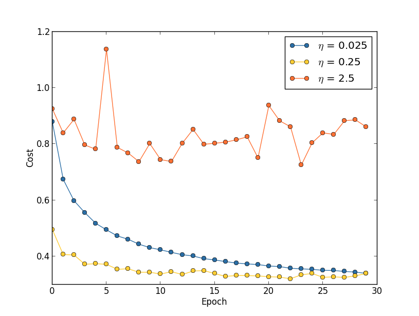
当学习速度是0.025的时候代价平稳的降低直到最后一次迭代，0.25的时候在最初的时候是降低的，但是后来，在20次左右的时候就稳定了，之后的迭代中都是在随机震荡，而学习速度是2.5的时候代价从最开始的时候就大幅震荡了。为了理解为什么会发生这样的情况，我们来回顾一下，随机梯度下降可以看做是要找到一个代价函数的山谷底部的方法：
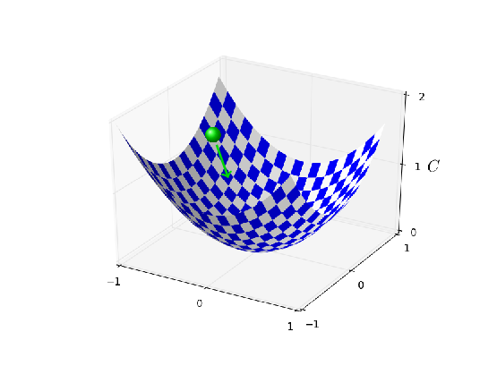

如果学习速度太大。显然很有可能越过最小值点。(这个图像很有帮助，但是这仅仅是帮助用来形成直观的印象而不是完整的解释。简单点说:一个更加完善的解释是，梯度下降使用代价函数的一阶导数来帮助减少代价函数的值。对于较大的学习速度$\eta$，代价函数中的高阶项变得更加的重要，更加能控制学习的行为，导致梯度下降失效，尤其在将要到达最小值点的时候更加容易发生，因为在这些点上一阶的梯度会变得很小，高阶项更加有控制力）在上面的例子中在η = 2.5的时候更有可能发生这种情况，当学习速度为0.25的时候我们的网络会一直帮助我们到达最小点，但是在将要到达最小值的时候，它可能会不断地带我们在最小值点附近震荡。当我们选择0.025作为我们的学习速度的时候，在前30次迭代中我们不会遇到这样的问题，当然了，选择较小的学习速度也会带来别的问题，就是他会使我们的随机梯度下降变得很慢。其实，更好的办法是先用0.25作为学习速度进行20次迭代，然后换到0.025.后面我们会讨论这种学习速度调度的算法。现在，让我们先专注于找到一个好的学习速度。

先在脑海中记住这个图像，我们可以按照下面的方法设置学习速度。首先，我们先要估计学习速度的阈值，保证这个阈值范围内的学习速度能让训练集的代价立刻下降，而不是震荡或者增加。这个估计不需要太精确。你可以先随便估计一个较小的值，比如0.01，如果代价函数在开始的几次迭代中不断减小，那么你应该再去尝试0.1，1.0，，直到你找到了一个学习速度，代价会在开始的几次迭代中震荡或者增大。反之，如果你在最初随机选择的学习速度，使得网络在开始的几次迭代中的代价不断地震荡或者增加那么你就应该尝试更小的学习速度，0.001，0.0001，直到你找到了一个学习速度，使得代价可以再最初的几次迭代中下降。按照这个过程你就可以找到一个大概的阈值的估计。可以优化你的估计过程，去找到可以使得网络在最初的几次训练中代价减小的学习速度，比如0.5或者0.2（这不必太过于准确。）这给了我们一个学习速度的阈值的估计。

很明显的，在使用的时候，所选择的学习速度$\eta$不应大于这个阈值。实际上，在多次迭代后，所选择的学习速度还是可以用的，那么这个时候倾向于选择一个再小一点的值，比如阈值的二分之一。这样的选择通常会使得我们不必去担心多次迭代后的学习速度下降（波动）问题。

在MNIST数据集上，遵循这样的策略，我们可以经过不断的尝试，得到学习速度的阈值为0.5，根据上面的原则，我们就可以使用0.25作为学习速度。实际上，我们发现0.5在前三十次迭代中表现是没问题的，所以在上文中我们并不去考虑使用更低的阈值。

上面的看起来是很直白的。然而，使用训练集的代价值去选择学习速度和我们上一节中所说的有点矛盾，就是我们其实应该使用验证集数据去选择超参数。实际上我们会使用验证集数据去估算正则化参数，mini-batch的大小，网络的层数，隐藏神经元的个数等等。为什么学习速度这么特殊呢？坦率的说，这是一种个人选择。因为超参数的选择是为了改进在测试集上的最终的分类准确率。然而学习速度仅仅是影响了到达最后分类结果的速度。我们这么做的主要的意义仅仅是控制梯度下降的步长，以及观察代价的变化去看我们步长是否太大。就像前面所说的那样，这仅仅是一个个人喜好。在神经网络训练的前期，如果验证集的准确率有所提升，训练的学习代价一般都是减少的，所以究竟用什么数据集来帮助进行学习速度的选择，并没有很大的区别。

### 通过提前停止迭代来寻找训练的迭代次数：
就像我们在本章前面所说的那样，想要提前终止训练也就意味着我们需要在每轮迭代结束后都去计算验证集的分类准确率。当分类准确率停止提升时候，我们就应该停止迭代。这使得设置迭代次数变得很简单。也就是说，我们并不需要显示的去确定迭代次数对于其他超参数的依赖。而且，提前停止可以帮助我们自动的减少过拟合。当然了，在实验的前期不使用提前停止策略会有帮助于我们找到过拟合的信号，用来帮助我们进行正则化，但是提前停止依然是一个很好的策略。

为了实现提前停止，我们需要更加明确什么意味着分类准确率的提升停滞了。就像我们看到的一样，准确率在不断提升的时候仍然有波动。如果在准确率开始下降的时候立刻停止迭代那么我们很有可能阻止了分类准确率的进一步提高。好一点的选择是我们应该观察一段时间。比如在进行MNIST分类任务的时候。我们可能会选择当准确率在近十次迭代中不再提升的时候停止训练。这保证了不会因为太早的停止而错过更好的训练结果，而且也不会有太多无意义的等待。

这个十次迭代不提升的准则对于在早期探索MNIST的时候是很有帮助的。然而网络训练中有时会度过一段平缓期才会继续的提升。如果你想要得到更好的效果，那么，十次这个准则可能就有点太过于激进了。在这种情况下我们建议在最初的时候按照10次进行，但是当你更好的理解了网络的训练过程之后，可以逐渐的改成20次，30次。当然了，这好像变成了一个新的要优化的超参数了。实际上这个还是很好确定的，对于MNIST分类以外的任务，十次不提升就停止的规则可能会有点激进或者太过于保守了，这都取决于问题的本身。然而一些小实验就会帮助我们找到合适的时机去停止训练。

在之前的试验中我们并没有提前停止训练，这是因为我们是在不同的方法之间进行比较，对于这样的比较和测试使用一样的迭代次数是很有帮助和意义的，不过修改network2.py来实现提前停止还是很有意义的。

### 练习
修改network2.py来实现n次不提升就停止的迭代策略，这里n是一个可以被设置的参数。

你可以找到除了n次迭代没有提升就停止训练之外的更好的策略么？理想情况下，这个策略要在获得较高的准确率和训练时间之间进行权衡。将你的规则添加到network2.py中，然后进行试验，验证一下结果和10次停止进行一下比较。

### 学习速度调度：
在训练过程中，我们一直使用一个固定的学习速度。然而使用不同的学习速度是一种更好的方法。在实验的早期，我们的权重距正确答案很远，这个时候最好还是选择一个较大的学习速度，来使得权重可以快速的改变，然后我们应该随着权重的调整来减小学习速度。

那么应该如何去设置我们的学习速度调度呢？很多方法都是可以用的。一个很简单的想法就是使用和提前停止类似的思路。就是先保持学习速度不变，直到验证集的准确率变差。然后就通过一定的值去减小学习速度，比如除以2或者除以10.重复多次，直到学习速度变成最初的1024分之一或者1000之一。

这种使用不同的学习速度的调度方法可以改进网络在训练中的表现，但是同时也给我们打开了一个选择学习速度调度方法的新世界。这样的选择有的时候也是会让人感到头疼的--你可以一直尝试着优化学习调度。在实验的开始我们还是建议使用恒定的学习速度，这会帮助你找到一个好的网络，然后如果你想要优化网络的表现，那么就值得试试学习调度了。 (一个最近的在MNIST分类任务中提到了从变化的学习速度调度中受益的paper是 [Deep, Big, Simple Neural Nets Excel on Handwritten Digit Recognition, by Dan Claudiu Cireșan, Ueli Meier, Luca Maria Gambardella, and Jürgen Schmidhuber (2010).](http://arxiv.org/abs/1003.0358))

### 正则化参数lambda：
我们建议在初始化网络的时候还是不要使用正则化(正则化参数为0)，在按照上面的思路确定了学习速度的值以后。使用选择的学习速度，再根据验证集去选择一个合适的正则化参数。开始可以先尝试正则化参数为1，然后以10为倍数去增大或者减小正则化参数来提升网络在验证集上的表现。一旦你找到了一个关于正则化参数的合适的数量级，然后再继续的优化。（在开始的时候设置的正则化参数我们并没有好的公认的准则，如果你有的话可以按照你的想法去做。）

## 练习
使用梯度下降来尝试找到合适的超参数比如学习速度，正则化参数是很诱人的想法。你能想到这样做之后里面的坑么？

在前面我们是怎么选择超参数的呢？如果你使用了我们说的这些选择超参数的方法来做MNIST分类，那么很有可能你得到的结果和我们之前的超参数是不一样的。原因是因为本书中有的地方的超参数的选择是为了突出或者说放大一些别的参数的或者网络结构的优化效果的。回想一下，我们在前面所做的所有的比较，比如比较交叉熵和二次代价函数，比较不同的权重初始化方法，比较是否正则化，为了使这些比较变得有意义，我们经常会保持超参数不变，或者按照一些原则去进行缩放。当然了，我们并没有理由对于所有不同的优化方法都保持一样的超参数，但是我们仅仅是，，控制变量。

我们可以试着去用每个方法的最优化的效果来进行比较。事实上，如果这样做了也更有道理，会使得我们的效果更好，我们可以看到不同方法下的最优的结果。然而，实际上我们也进行了很多次比较，但是我们发现这样做，计算代价太昂贵了，所以我们放弃了。

### Mini-batch的的大小：
我们应该怎么设置mini-batch的大小呢？为了回答这个问题，首先我们假设我们在进行在线学习，就是mini-batch的大小为1.

在线学习看起来是有些让人难以信赖的的，每次我们都根据一个训练样本去训练的话会在梯度估计上会有很大的误差。实际上这在训练中并不是一个问题，因为独立的梯度估计并不需要十分准确。我们所需的仅仅是保证我们的估计能够让我们的代价不断下降。就像你尝试去北极点的时候，每次确定方向的时候你的罗盘都偏差了10-20度。你不断的去看，罗盘指示的平均方向还是会指引你到达北极。

基于这样的假设，好像我们应该使用在线学习。实际上，真实的情况还是挺复杂的。在上一章的问题中我们曾经提出要使用矩阵一次计算一个mini-batch中的所有样本，而不是一个一个样本的计算。基于你的硬件性能以及不同的线性代数库，去对mini-batch进行矩阵要比一个一个的来快得多。

现在看起来上面这段并没有对我们有多大的帮助，如果我们的mini-batch大小选择为100，那么权重的学习规则会变成：
$ w \rightarrow w' = w-\eta \frac{1}{100} \sum_x \nabla C_x, \tag{100}$
这里的求和是对整个mini-batch里的所有样本的。相对的，在线学习是：
$ w \rightarrow w' = w-\eta \nabla C_x, \tag{101}$
就算我们使用矩阵可以在一个mini-batch上可以比在线学习速度快到50倍，看起来还是用在线学习好一点，因为使用在线学习的过程中，我们不断地的在升级我们的权重，假设把mini-batch的学习速度扩大100被，那么更新规则就变成了：
$ w \rightarrow w' = w-\eta \sum_x \nabla C_x, \tag{101}$
这就和我们进行100次单独的以eta为学习速度的在线学习很像了。但是仅仅使用了在线学习一半的时间。当然了，这个结果并不能和100次在线学习等价，因为在mini-batch中梯度都是针对于同一个权重的集合，而不是在线学习中的累积。不过这还是明确的表示出了使用大的mini-batch会明显的提高速度。

脑海中有这样的概念的时候，选择一个好的mini-batch大小其实是一种妥协。太小了，就不能获得矩阵运算所带来的速度提升。太大了，就不能让权重进行足够的更新。我们只能在这两者之间进行妥协。幸运的是，对mini-batch的大小的选择对于速度的提升和网络中其他的超参数是相对独立的（除了网络结构），所以你不必为了找到合适的mini-batch大小来调整其他的网络参数。一个方法就是使用一些可以接受的（但不必要是最优的）其他的超参数，然后初始化一个mini-batch大小，然后和我们对于学习速度eta做的那样进行缩放。然后可以画出验证准确率相对于时间的图，这里时间是真正的时间而不是迭代，然后选择一个给准确率带了最快速度提升的mini-batch大小。然后就可以再去选择，优化其他的参数了。

你肯定已经意识到了，我们并没有完成我们的优化工作。确实，在上面的例子中，我们的实现并没有使用速度最快的mini-batch大小，而是一直在使用10，也没有一点说明解释的。当然了，我们可以通过调整mini-batch的大小来加速我们的学习速度，我们没有这么做一方面是因为我们想要说明mini-bach的大小要比1大的，还有一方面是因为我们的初步试验速度还是适中比较好。在真正的试验中我们必然要选择最优的，最快的。

### 自动化超参数选择技术：
在上面所说的都是手动优化超参数的一些启发式的方法了，手动调参是建立其对于网络行为的认知的好方法。不过，意料之中的是将这些工作自动化是一个很实用的办法。一个通用的自动化方法就是grid search，系统化的搜索超参数空间。关于grid search的优点和限制的讨论可以在[Random search for hyper-parameter optimization, by James Bergstra and Yoshua Bengio (2012)。](http://dl.acm.org/citation.cfm?id=2188395)中看到。还有别的很多自动化方法都是可用的，我们在这里就不展开了，不过还是要提一下12年的一篇论文使用了贝叶斯方法来进行自动优化，这个论文的代码是开源的，所以被很多其他的研究者所使用。[Practical Bayesian optimization of machine learning algorithms, by Jasper Snoek, Hugo Larochelle, and Ryan Adams.](http://papers.nips.cc/paper/4522-practical-bayesian-optimization-of-machine-learning-algorithms.pdf)

### 总结：
依据我们上面所描述的经验法则，并没能给出一个最好的可能的结果。但是会给你一个好的开始和在后续任务中不断提升的基础。尤其是我们所讨论的超参数都是那些比较独立的。实际上，在超参数之间还是有一定的相互影响。你可能通过实验找到了一个好的学习速度，然后开始优化正则化参数，但是却发现正则化参数的调整影响了你优化过后的学习速度。实际上，不断地返回去调整还是对参数值的选择有帮助的。要记住我们上面所说的都只是经验之谈，并不是真正的科学准则。你应该从网络的结果中找到哪里不对的信号，然后去实验。所以，要注意观察网络的行为，尤其是验证集准确率。

选择超参数的过程被选择超参数的方法太多所阻挠，在很多的工程，论文中，还有很多人的经验之谈都有关于超参数选择的介绍。很多很多的论文中都推荐了处理超参数的方法，其中有一些还是相互矛盾的。不过还是有一些很有用的[Practical recommendations for gradient-based training of deep architectures, by Yoshua Bengio (2012).](http://arxiv.org/abs/1206.5533)给出了很多实际的关于使用反向传播和梯度下降训练神经网络，甚至是深度网络中超参数选择方法的推荐。Bengio讨论了很多我没说的东西，包括怎么系统的搜寻超参数。另一个好的文论是[Efficient BackProp, by Yann LeCun, Léon Bottou, Genevieve Orr and Klaus-Robert Müller (1998)](http://yann.lecun.com/exdb/publis/pdf/lecun-98b.pdf)这两篇论文都被收集在了[Neural Networks: Tricks of the Trade, edited by Grégoire Montavon, Geneviève Orr, and Klaus-Robert Müller](http://www.springer.com/computer/theoretical+computer+science/book/978-3-642-35288-1)这本书中，这本书很贵，不过很多文章都被原始作者公开发表了。

当你读了这些文章之后尤其是你自己通过实验之后，超参数的优化就不再是一个问题了。还有很多的小技巧你可以用来提高网络的表现。就像俗话说的那样，不能完成的书只能放弃。同样的，对于超参数的优化来说，超参数空间太大了是绝对不可能真正的验证完的，只能去放弃掉一些。所以我们的目标应该是建立一个工作流，可以让你快速的完成优化，留下一定的空间可以进行进一步的优化。

超参数设置的困难让很多人认为神经网络和其他机器学习技术相比要复杂的多了。我们听到过很多如下的抱怨：“是的，一个训练好的神经网络能有一个好的表现。但是，我试了随机森林（或者svm，或者别的）然后结果就挺好的了。我没有时间去找到合适的神经网络”。当然了，从实际角度出发，用简单的方法去解决问题是很好的。这在你刚开始处理某个问题时尤其如此，因为那时候，你都不确定机器学习算法能够解决问题。但是，如果获得最优的性能是最重要的目标的话，你就可能需要尝试更加复杂精妙的知识和方法了。如果机器学习总是简单的话那是太好不过了，但并没有理由说机器学习非得这么简单。

## 其他技术
本章中的每一个技术都是了解价值的，不过这不是我们在这里解释他们的唯一原因。更主要的是想要让你去熟悉一下神经网络中可能会发生的问题，并且帮助你建立一个解决问题的直觉。从某种角度上而言，我们已经学会了如何思考神经网络。在本章的其余部分我将简单的介绍一下其他技术。这里的介绍要粗略的多，不过还是可以表达一下多种网络中使用的技术的。

### 随机梯度下降的多样性
反向传播的随机梯度下降是我们一直解决MNIST分类的主力。不过还是有很多方法可以用来优化代价函数的，而且有的时候别的方法会有比mini-batch随机梯度下降更好的表现。在本节我们会简单的说两个，Hessian和动量方法。
### Hessian
在开始我们的讨论之前，我们暂且先把我们的神经网络放到一边。先简单的抽象出来最小化代价函数C，C是一个有很多变量的函数，$w = w_1,w_2,.....$，$C = C(w)$。通过泰勒级数展开
$\begin{eqnarray}
  C(w+\Delta w) & = & C(w) + \sum_j \frac{\partial C}{\partial w_j} \Delta w_j
  \nonumber \\ & & + \frac{1}{2} \sum_{jk} \Delta w_j \frac{\partial^2 C}{\partial w_j
    \partial w_k} \Delta w_k + \ldots
\tag{103}\end{eqnarray}$
我们来用矩阵和梯度表示重写一下：
$\begin{eqnarray}
  C(w+\Delta w) = C(w) + \nabla C \cdot \Delta w +
  \frac{1}{2} \Delta w^T H \Delta w + \ldots,
\tag{104}\end{eqnarray}$
这里$\nable C$是梯度向量，H是一个矩阵被称为海森矩阵(Hessian),他的第jk项是$\partial^2
C / \partial w_j \partial w_k$，假设我们忽略掉更高次的项来估计这里C的值，那么：
$\begin{eqnarray}
  C(w+\Delta w) \approx C(w) + \nabla C \cdot \Delta w +
  \frac{1}{2} \Delta w^T H \Delta w.
\tag{105}\end{eqnarray}$
通过简单的代数计算我们就可以得到使得$C(w+ \Delta w)$最小的$\Delta w$应该是：
$\begin{eqnarray}
  \Delta w = -H^{-1} \nabla C.
\tag{106}\end{eqnarray}$
(严格点说，为了让这里是最小值而不是极小值，我们要假设海森矩阵为正，也就是说，我们的C的函数图像是一个山谷，而不是山峰或者马鞍形的)
方程(105)是一个很好的估计代价函数的表达式，然后我们想要从w点向$w+ \Delta w =w -H^{-1} \nabla C.$移动就可以满足减小代价函数。这就是一个可能的最小化代价函数的方法：
  1. 选择起点$w$
  2. 更新$w$至$w' = w -H^{-1} \nabla C$这里的海森矩阵和梯度都可以算出来的
  3. 继续更新$w'$至$w'' = w' -H'^{-1} \nabla' C$
  ...

实际上（105）仅仅是个大概，我们还是最好还是小步走，我们可以不断地通过$\Delta w = - \eta H ^{-1} \nable C$改变w这里$\eta$还是我们的学习速度。

这就叫做海森方法或者海森优化，有理论证明海森方法要比随机梯度下降到达最小值更快。尤其是结合了二阶导数的变数，可以避免随机梯度下降中的一些问题。并且反向传播在这里也是可以使用的。

如果海森优化这么好，为什么我们不在我们的神经网络中使用呢？不幸的是，虽然他具有很多优秀的性质，却还有一个不好的性质：他很难实现。因为海森矩阵的大小，假设我们的神经网络具有10的七次方的数量级的权重和偏移量，那么我们的海森矩阵就会有10的14次方的数量级。而且，计算海森矩阵的逆乘上梯度也是很难实现的。不过这也并不是意味着海森矩阵没有用。实际上，有很多梯度下降的变种是基于海森优化的，不过就是避开了这个巨大的矩阵。我们看下面这个方法，基于动量的梯度下降。

### Momentum-based gradient descent：
从直觉上看，海森优化的优点是它不仅仅包含了梯度的信息，同时也包含了梯度的变化信息（就是海森矩阵，梯度我们可以看做是一阶导数的话，海森矩阵就是二阶的）。基于动量的梯度下降是使用同样的想法，但是绕过了二阶导数的巨大矩阵。为了理解动量技术，我们先想一下梯度下降的原始图片，我们的梯度下降过程有点像一个小球滚到山谷的底部。基于动量的方法通过增加两种改变来模仿物理世界。首先，引入了一个记号“速度”，就是我们想要去优化的参数，梯度的作用是用来改变速度，而不是位置，这就很像物理上的力用来改变速度一样，梯度仅仅是用来间接地改变位置的。第二点就是引入了摩擦力项，用来减少速度的。

让我们用一种更加数学的形式来描述，我们引入速度变量，$v=v_1,v_2,...$每一个$v$都对应着一个梯度$w_j$，然后我们就可以将梯度下降的更新规则$w \rightarrow w' = w-\eta \nable C$表示成：
$\begin{eqnarray}
  v & \rightarrow  & v' = \mu v - \eta \nabla C \tag{107}\\

  w & \rightarrow & w' = w+v'.
\tag{108}\end{eqnarray}$
在这个方程中，$\mu$是一个超参数表示的是系统中的阻力。为了理解这个方程所表达的意义，我们先看一下$\mu = 1$的情况，这个时候其实就是没有阻力，当这个情况发生的时候，就表明“力”$\nable C$在改变着速度v，而速度v表示的是权重的改变情况。从直觉上看，我们的速度是通过不断地叠加梯度而形成的。也就是说，如果梯度基本上保持一个方向的话，那么我们就可以得到相应方向上比较大的动量。举个栗子，想想一下，当我们沿着一个斜坡不断下降会是什么样呢？


每一次更新，速度都会沿斜坡方向不断增大，这时我们就会越来越快的移动到谷底。这就使得基于动量的方法可以比标准的梯度下降快很多。当然了，这里存在一个问题，如果我们到达了谷底，那么我们还会越过这个谷底继续前进。或者因为梯度的不断改变，我们可能会发现我们沿着错误的方向运动。这也就是为什么会有$\mu$这个超参数的原因了。之前我们说过$\mu$这个超参数表示的是系统中的阻力，或者说是摩擦力；为了更清晰一点，你可以将$1-\mu$当做是这个系统中的阻力系数。当$\mu = 1$的时候，就像我们看到的一样，系统中不存在阻力，速度完全由梯度所决定。相比之下，当$\nable C = 0$的时候表示系统中存在大量的阻力，速度不可能增加，方程107和108结合起来就变成了普通的梯度下降，。实际应用中，我们可以通过选择一个合适的在0，1之间的μ值来帮助我们进行加速，而不会引发越过最小值的情况。和上面的正则化参数，以及学习速度的选择一样，我们可以用同样的方法来选择$\mu$。

我们还没有对这个超参数$\mu$进行命名。因为它的标准名称并不是很好：他被称作是momentum co-efficient。这是很让人困惑的，因为$\mu$并不是物理意义上的动量，相对而言，他看起来命名更像是阻力。不过这个名称被人们广泛地使用，所以，我们还是会使用它。

这种机遇动量的方法的优点是，我们几乎不需要在梯度下降的基础上改动太多就可以实现动量技术。我们可以和之前一样，继续使用反向传播来计算动量，并且和之前一样的，我们也可以使用随机的选择mini-batch。这样就引入了海森优化的优点，将梯度是如何改变的信息引入进来，但是不会带来不好的地方--太过庞大的计算量，而且不会在我们的代码上改动太多。实际上，动量技术是被广泛地应用的，并且经常用来加速我们的学习。

### 练习与问题
如果$\mu > 1$ 会发生什么？如果$\mu < 0$会发生什么？

把基于动量的随机梯度下降加到我们的代码中去。

### 一些其他的方法：
还有很多其他的方法来最小化代价函数，也没有关于什么技术是最好的统一意见。当你深入的学习神经网络的时候，去研究一下其他的技术是很有价值的，理解一下他们是怎么工作的，有什么优点，有什么缺点，并且尝试着实现他们。之前我们提到的一个论文[Efficient BackProp, by Yann LeCun, Léon Bottou, Genevieve Orr and Klaus-Robert Müller (1998).](http://yann.lecun.com/exdb/publis/pdf/lecun-98b.pdf)介绍并比较了一些技术，包括共轭梯度下降，BFGS方法（可以看一下相关的[limited-memory BFGS，L-BFGS](http://en.wikipedia.org/wiki/Limited-memory_BFGS)）。一些其他的方法，最近被发现时很有前途的，比如[On the importance of initialization and momentum in deep learning, by Ilya Sutskever, James Martens, George Dahl, and Geoffrey Hinton (2012).nesters](http://www.cs.toronto.edu/~hinton/absps/momentum.pdf)的加速技术。不过对于很多问题，最简单的梯度下降就很好了。尤其是当我们加入了动量机制就完全够用了。所以我们还是在本书的后面继续使用随机梯度下降。

## 其他的神经元
目前为止我们都是在使用sigmoid神经元构造我们的神经网络(当然了，我们之前还尝试过使用softmax作为输出层神经元)。理论上一个通过sigmoid神经元构造的神经网络可以拟合很多函数。虽然如此，还有很多别的神经元，有时候使用别的神经元可以构建出比使用sigmoid效果更好的网络。根据应用场景的不同，使用其它神经元的神经网络可能更快速地学习，有更好的泛化能力，或者两者都有。我们简单的看一下其他的神经元，在以后的实验中也可以有更多的选择。

### tanh
其中最简单的就是tanh神经元，它把sigmoid函数变成了hyperbolic tangent（双曲正切）函数。对于输入x，权重w，偏移量b而言，tanh的输出是：
$tanh(w\odotx+b), \tag{109}$
这里的tanh就是双曲正切函数，你会发现他的代数形式和sigmoid神经元很像，我们看一下tanh函数定义：
$tanh(z) = \frac {e^z-e^{-z}}{e^z+e^{-z}}. \tag{110}$
通过简单的代数运算我们就可以得到
$\sigma(z) = \frac {1+tanh(z/2)}{2}, \tag {111}$
也就是说，其实tanh仅仅是对sigmoid的一种缩放。我们可以看到tanh的图像有和sigmoid一样的形状：
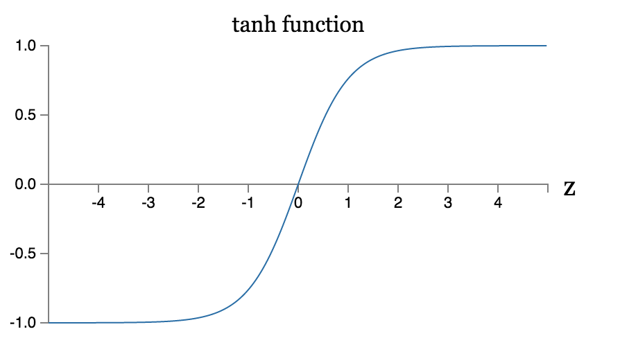
不同之处在于tanh的输出在-1到1之间而不是0到1.这意味着如果你要使用tanh神经元，那么你就要对你的输出做归一化（具体还是取决于你的具体应用）。

和sigmoid神经元一样，一个tanh神经网络可以，原则上，可以计算所有的将输入映射到-1和1之间的函数。而且像随机梯度下降，反向传播之类的方法都可以轻易的使用在tanh上。

### 练习
证明方程111

应该在什么时候使用tanh什么时候sigmoid呢？并没有一个很明显的先验答案。有一些理论和实验说，在某些情况下tanh会表现的好一点[Efficient BackProp, by Yann LeCun, Léon Bottou, Genevieve Orr and Klaus-Robert Müller (1998)](http://yann.lecun.com/exdb/publis/pdf/lecun-98b.pdf), [Understanding the difficulty of training deep feedforward networks, by Xavier Glorot and Yoshua Bengio (2010).](http://jmlr.org/proceedings/papers/v9/glorot10a/glorot10a.pdf)。我们简单的看一个理论。假设，使用sigmoid神经元，这时网络中所有的激活值都是正的。我们看一下向第l+1层的第j个神经元的输入权重$w^{l+1}_{jk}$。通过反向传播，我们可以知道相对应的梯度应该是$a^l_k \delta^{l+1}_j$，因为激活函数的值是正的，那么梯度的符号就和$\delta^{l+1}_j$的符号一致。也就是说，如果$\delta^{l+1}_j$是正数，那么权重$w^{l+1}_{jk}$就会在梯度下降期间减小，反之会增加。换言之所有的权重都会同时增加或者减少。这就带来了一个问题，因为有一些权重是需要增加的，有一些是需要减少的，只有当激活值有正有负的时候才会发生(对于输入到j的所有k神经元)，这个时候使用tanh做激活函数才会满足这个条件。而且，因为tanh是关于原点对称的，就是tanh(-z) = -tanh(z), 这对于我们而言也是一个很好的性质，大概说就是我们希望网络中的激活值是正负均衡的，这可以保证权重的更新不会发生偏置。

我们应该如何看待这个观点呢？这个观点仅仅是建议性质的，并没有严格的证明，可能sigmoid存在某些特征要比tanh在某些问题上好很多。实际上很多任务中tanh仅仅提供了很小的或者并没有提供性能上的提高。不幸的是在很多问题上，我们也没有那种很明确，很清晰的规则去说明哪种神经元更快，或者具有更强的泛化能力。

### ReLU
另一种神经元是修正线性rectified linear神经元或者修正线性单元。简称ReLU。ReLU对于输入x，w，b的输出是：
$max(0,w\odot x+ b).  \tag{112}$
ReLU的函数图像如下：
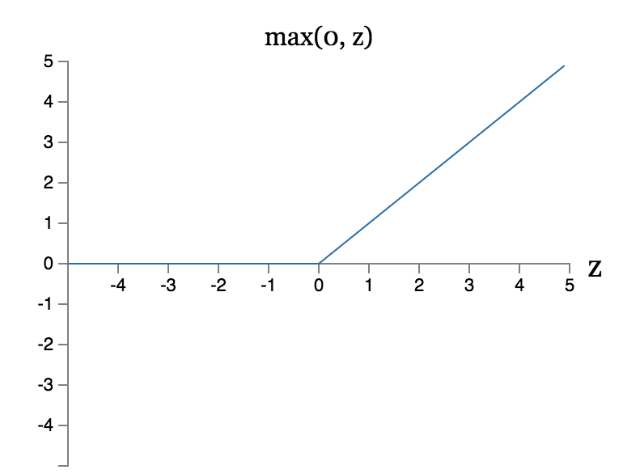
显然，这样的神经元和我们之前所看到的sigmoid和tanh都不太一样。然而像tanh和sigmoid一样ReLU可以被用来拟合多种函数，也可以使用反向传播以及随机梯度下降。

什么时候应该使用ReLU替代sigmoid和tanh神经元呢？一些最近的图像识别上的工作[What is the Best Multi-Stage Architecture for Object Recognition?, by Kevin Jarrett, Koray Kavukcuoglu, Marc'Aurelio Ranzato and Yann LeCun (2009)](http://yann.lecun.com/exdb/publis/pdf/jarrett-iccv-09.pdf), [Deep Sparse Rectifier Neural Networks, by Xavier Glorot, Antoine Bordes, and Yoshua Bengio (2011)](http://www.jmlr.org/proceedings/papers/v15/glorot11a.html), 以及[ImageNet Classification with Deep Convolutional Neural Networks, by Alex Krizhevsky, Ilya Sutskever, and Geoffrey Hinton (2012)](https://papers.nips.cc/paper/4824-imagenet-classification-with-deep-convolutional-neural-networks.pdf)。要注意的是，这些论文详细的讲述了他们是如何在使用ReLU神经元的前提下去设置输出层，代价函数以及网络中的正则化的。而我们这里简单的介绍中忽略了所有的这些细节。这些论文也详细的阐述了使用ReLU能为反向传播带来什么好处。还有一个教育性质的论文[Rectified Linear Units Improve Restricted Boltzmann Machines, by Vinod Nair and Geoffrey Hinton (2010)](https://www.cs.toronto.edu/~hinton/absps/reluICML.pdf), 简述了一些关于ReLU对于神经网络提升的证明。通过ReLU神经网络取得了很大的进展。不过和tanh神经元一样，我们还没明确的结果说什么时候适合使用RuLU，更别说为什么了。不过还是有一些简单的理论的，回想一下，当神经元饱和的时候sigmoid神经元会停止学习，就是输出在0或1附近的时候。就像我们在本章中不断重复说明的一样，减小了梯度，从而减慢了学习。tanh神经元也存在一样的问题。而ReLU则不存在这样的问题，因此也就没有学习速度的降低。但是，另一方面讲，当权重的输入时负值的时候，梯度会消失，从而学习会完全停止。这应该勉强算是两点使用ReLU的建议吧。

这里我们说明了选择的不确定性，并且要记住我们并没有一个健全的理论依据可以用来选择激活函数。实际上这个问题要比我们所描述的还要难。对于给定问题，哪个是最好的，哪个是最快的，哪个是最准确的？实际上并没有一个细致的深入研究。理想情况下，会存在一个理论，可以详细的告诉我们怎么去选择我们的激活函数。但是，我们不能让理论的缺乏阻止我们。我们有很强大的工具在手中，用这些工具我们可以取得很好的进展。在本书后面的部分，我们还是会继续使用sigmoid因为sigmoid已经足够强大了，并且有丰富的理论体系。但是要记住，那些想法也是可以用在其他神经元的，并且，这有时会有更好的效果。

### 有关神经网络的故事
```问题：你是怎么看待那些完全由实验效果而非数据依据支撑的机器学习技术呢？同样的，在应用中，你是如何注意到这些技术失效了？
回答：你应该知道我们缺乏足够的理论依据。有时，我们有数学的直觉，关于那些技术有可能是有用的。有时我们的直觉可能是错误的。其实真正的问题是在这个问题上，我们的方法有多好？可以适用这些方法的问题范围有多大？
```

有一次在参加量子计算的报告时，我注意到了一个让我感到好奇的习惯：当演讲结束的时候，人们总会说“我很同意你的观点，但是…”。量子计算并不是我熟悉的领域，我注意到了这样的提问,我很少在其他的科学会议上听到提问者表示他们的赞同。所以我开始思考这样的问题，为什么呢？可能是因为在量子计算中很少有重大的发现，重大的进步。后来我觉得这样的说法有点太刻薄了，演讲者正在与一些难题进行争斗。进展当然会缓慢，但是去听一下人们是如何思考的，即使并没有新的进展，也是很有帮助的。

你可能已经注意到了类似于“我们赞同，，，”在本书中我经常说“启发式的.....”,”大概的说…..”，然后是一些解释现象的或者怎么想的小故事。这些故事貌似合理，但都是以经验为依据的，我们的理论解释并不充分，如果你经常研读文献，你会发现在神经网络的研究中有很多类似的表达，基本上都是没有很充分的证据支撑的。所以，我们应该怎么看待这样的故事呢？

在很多科学领域-尤其是处理那些简单现象的领域-还是很有可能去建立一个很严谨很可靠的通用的假说。但是，在神经网络中存在着大量的参数，超参数,而且，他们之间有着很复杂的相互影响。在这样异常复杂的系统中，是很难对状态有着准确的表述的。理解神经网络的一般性原则就像量子计算一样，是在挑战人类思想的极限。相对于找到一个通用的状态，我们还是经常去找一些特例。所以，有的时候，当新的证据被发现了以后，我们的理解会被修正，甚至放弃。

对于这种情况，任何启发式的讨论都会带来新的挑战。比如，在之前的时候我们说为什么Dropout有用的时候：From ImageNet Classification with Deep Convolutional Neural Networks by Alex Krizhevsky, Ilya Sutskever, and Geoffrey Hinton (2012).“这个方法减少了神经元之间的相互影响，因为神经元不能依赖特定的神经元。因此这就强迫神经元学习一些更加鲁棒的特征，可以和其他神经元的随机结合”这是一个富有争议的陈述，我们可以根据这个来调研，去搞清楚什么是真的什么是假的，什么是需要关注的。现在确实是有一些工业界的研究者在对dropout进行研究，尝试去搞清楚他是怎么工作的，尝试去知道dropout的极限是什么。这就跟随者我们的启发式讨论。每一个启发式的讨论与其说是一种解释，不如算是一种挑战。

当然了，并没有时间让某一个人去深度的调查清楚所有的启发式的解释。这需要消耗数十年的神经网络调查者的社区来建立一个有力的，真实的神经网络是如何学习的理论。难道这意味着你需要去拒绝这些启发式的解释么？并不是这样的，实际上我们需要这些启发式的思考，来鼓励，指引我们的思考。就像探索大发现时代一样：早期的探险家们依据的是一些简单的想法，实际上却是错的很严重的，然后这些错误被我们的知识所修正。当你理解一些证据--就像那些探险家理解地理，和我们现在理解神经网络的时候一样--去大胆的尝试要比严谨的要求每一步都是正确的要重要。所以你应该将这些故事当做是一种理解神经网络的有效的指引，不过还是要在头脑中保留一个清醒的认识，并且小心的跟随那些明显的证据。简单点说，我们需要好的故事来鼓励我们，但是也要严谨的求证去发现真实的情况。
