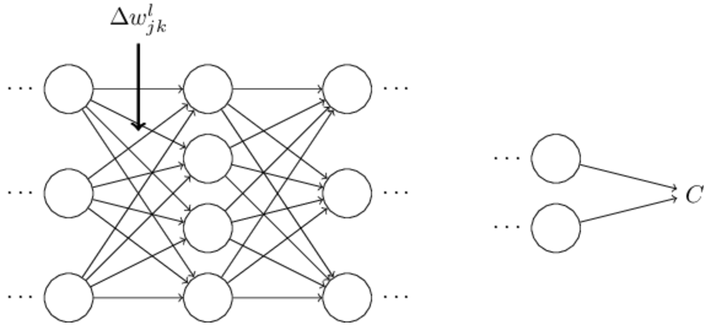
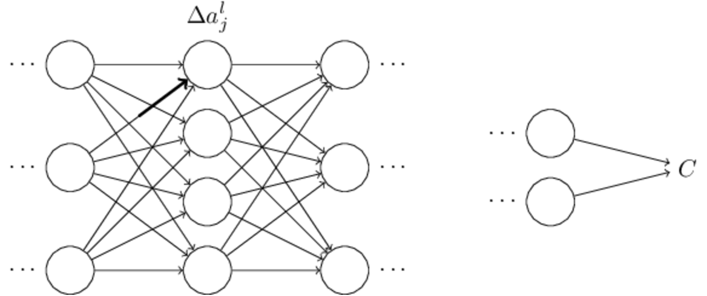
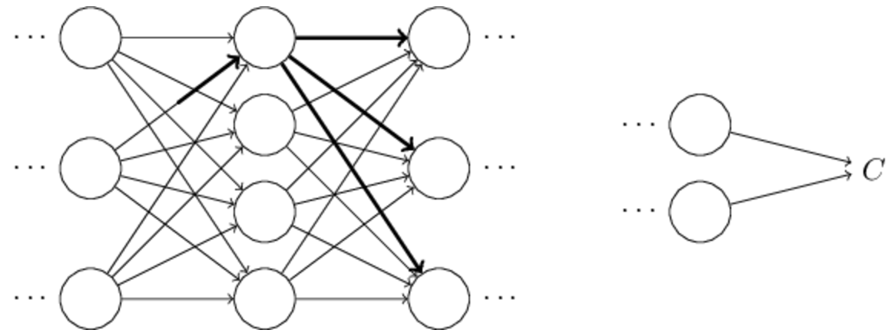
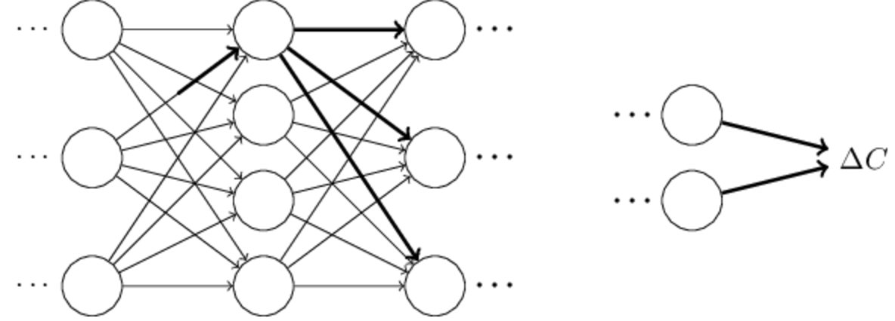
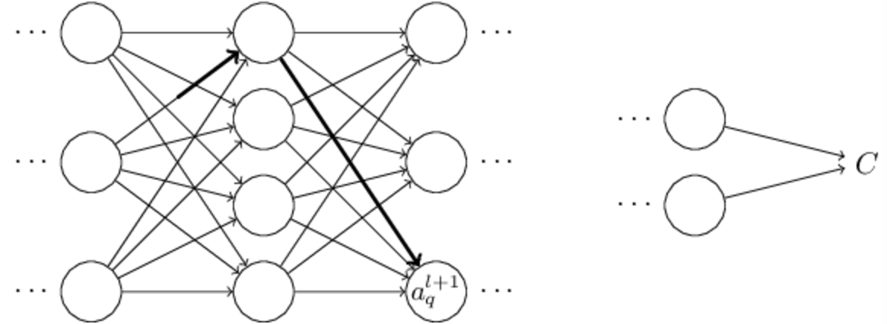
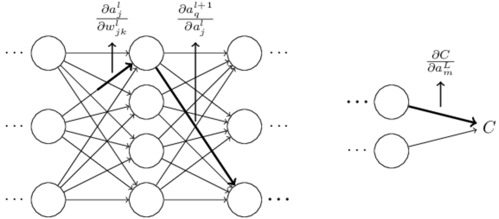

## 四个基本公式的证明和优化

现在，我们来证明这四个公式BP1-BP4.其实，这四个公式都是多元微积分的链式法则的应用结果。如果你熟悉链式法则，我觉得你还是先自己推导一下比较好。

让我们先从BP1开始，这是一个关于输出误差$\delta^L$的表达式。为了证明BP1的正确性，我们先来看一下关于误差的定义:
$
\begin{eqnarray}
  \delta^L_j = \frac{\partial C}{\partial z^L_j}.
\tag{36}\end{eqnarray}
$
通过应用链式法则，我们就可以得到代价关于神经元的激活值得偏导关系：
$\begin{eqnarray}
  \delta^L_j = \sum_k \frac{\partial C}{\partial a^L_k} \frac{\partial a^L_k}{\partial z^L_j},
\tag{37}\end{eqnarray}$

这里，求和是对于整个输出层上的k个神经元。当然了，第k个神经元的激活值$a^L_k$仅仅依赖于第j个神经元的加权输入$z^L_j$这里$j = k$，而且当$j \ne k$的时候这一项$\partial a^L_k / \partial z^L_j$并不存在。所以，我们其实可以对上面这个表达式进行一下化简，结果就是：
$\begin{eqnarray}
  \delta^L_j = \frac{\partial C}{\partial a^L_j} \frac{\partial a^L_j}{\partial z^L_j}.
\tag{38}\end{eqnarray}$

然后呢，当我们定义$a^L_j = \sigma(z^L_j)$的时候，等式右边的第二项$\frac{\partial a^L_j}{\partial z^L_j}$其实就变成了$\sigma'(z^L_j)$，这个方程就变成了:
$\begin{eqnarray}
  \delta^L_j = \frac{\partial C}{\partial a^L_j} \sigma'(z^L_j),
\tag{39}\end{eqnarray}$
这不就是BP1的组成形式嘛。

然后我们来证明BP2，通过BP2我们可以根据$\delta^{l+1}$来计算$\delta^l$，同样的，我们来使用链式法则：
$\begin{eqnarray}
  \delta^l_j & = & \frac{\partial C}{\partial z^l_j} \tag{40}\\
  & = & \sum_k \frac{\partial C}{\partial z^{l+1}_k} \frac{\partial z^{l+1}_k}{\partial z^l_j} \tag{41}\\
  & = & \sum_k \frac{\partial z^{l+1}_k}{\partial z^l_j} \delta^{l+1}_k,
\tag{42}\end{eqnarray}$
(上式成立的关键是神经网络的特殊性质，及第l+1层神经元的加权输入，其实就是由第l层神经元的激活值$a^l$组成的也就是说其实$z^{l+1}$和$a^l$是相关的，而$a^l$是关于$z^l$的函数，所以我们的链式法则就这么成立了)在最后一次变换中，我们交换了等式右侧的两项的位置，并且将其中的$\frac {\partial C}{\partial z^{l+1}_j}$替换成了$\delta^{l+1}_j$(这个是根据$\delta^l$的定义得来的)。

接下来我们来看一下$\frac {\partial z^{l+1}_k}{\partial z^l_j}$还记得上一段中我们说的$z^l$和$z^{l+1}$的关系嘛，我们用数学形式写一下：
$\begin{eqnarray}
  z^{l+1}_k = \sum_j w^{l+1}_{kj} a^l_j +b^{l+1}_k = \sum_j w^{l+1}_{kj} \sigma(z^l_j) +b^{l+1}_k.
\tag{43}\end{eqnarray}$
根据求导法则，我们可以得出：
$\frac {\partial z^{l+1}_k}{\partial z^l_j} = w^{l+1}_{kj}\sigma'(z^l_j) \tag{44}$
(这里留意下z的下标，回想一下我们上面的定义，你应该可以理解的到这个其实是对于l和l+1层之间的所有k个神经元的)
将43带回到42式中我们就能得到：
$\begin{eqnarray}
  \delta^l_j = \sum_k w^{l+1}_{kj}  \delta^{l+1}_k \sigma'(z^l_j).
\tag{45}\end{eqnarray}$
这个就是我们的BP2$\begin{eqnarray}
  \delta^l = ((w^{l+1})^T \delta^{l+1}) \odot \sigma'(z^l) \nonumber\end{eqnarray}$的组成形式了

同样的，根据链式法则我们就能顺利的求解出BP3和BP4了，不过，我们把这两个公式的证明留作练习。

### 练习
证明BP3和BP4
$\frac {\partial C}{\partial b^l_j} = \delta^l_j \tag{BP3}$

$\frac {\partial C}{\partial w^l_{jk}} = a^{l-1}_k\delta^l_j \tag{BP4}$

#### 证明
  1（BP3）
    $\frac {\partial C}{\partial b^l_j}={\frac {\partial C}{\partial z^l_j} }\cdot \frac {\partial z^l_j}{\partial b^l_j}$
    上式中：
    $\frac {\partial z^l_j}{\partial b^l_j} = 1$
    $\therefore \frac {\partial C}{\partial b^l_j}={\frac {\partial C}{\partial z^l_j} }=\delta^l_j$
  2(BP4)
    $\frac {\partial C}{\partial w^l_{jk}}={\frac {\partial C}{\partial z^l_j} }\cdot \frac {\partial z^l_j}{\partial w^l_{jk}}$
    上式中：
    $\frac {\partial z^l_j}{\partial w^l_{jk}} = a^{l-1}_k$
    $\therefore \frac {\partial C}{\partial w^l_{jk}}={\frac {\partial C}{\partial z^l_j} }\cdot a^{l-1}_k=\delta^l_j \cdot a^{l-1}_k$
至此，我们完成了对于这四个反向传播的基本公式证明了，可能看起来有点复杂，但本质上就是最简单的链式法则的应用。

所以，我们可以将反向传播算法当做是通过逐步的应用多元微积分的链式法则去计算代价函数的梯度。这就是反向传播的本质，剩下的就是实现上的技术细节了。


## 反向传播算法
反向传播公式给我们提供了一种计算代价函数梯度的方法(这里你可能会有点好奇了，为什么要反向传播呢，为什么不能正向传播呢，就像我们网络工作的那样，前馈。首先我们可以看到，根据上面的公式我们都是从最后一层的误差开始计算，然后L-1一直到第1个隐藏层，根据每一层的误差我们来计算网络中的每一个参数，（权重和偏移量）这种方法就是反向传播的名字的由来，因为我们让误差反向的通过了这个网络。你也可以看到每一个节点都只用经过一次就可以了。但是如果我们使用和神经网络的行为一样的算法来计算梯度的时候，我们要先从第1个隐藏层开始计算，然后计算到最后一个隐藏层，这个时候你会发现从第一个神经元开始计算偏导数这是无从下手的，因为他经过了那么多层（其实就是在后面经过了那么多的函数的影响）这个计算式相当庞大的，然后又要去计算第2层等等，虽然计算第一层的时候中间结果也已经包含了部分在后面所要求解的值，但是，，，anyway不如反向传播来的这么明了)。让我们明确的用算法的形式来写下来整个过程吧：

  1. 输入数据x:根据输入的x设置相应的输入层神经元激活值$a^1$
  2. 前馈：对于输入层之后的每一层$l=2,3,,,,L$计算加权输入$z^l=w^la^{l-1}+b^l$,同时计算激活值$a^l=\sigma(z^l)$
  3. 就算输出层的误差$\delta^L$:计算向量$\delta^L=\nabla_aC\odot \sigma'(z^L) \tag{BP1}$
  4. 将误差反向传播通过整个网络：从后向前，对于每一层$l=L-1,L-2,,,,2$计算$\delta^l = ((w^{l+1})^T \delta{l+1})\odot \sigma'(z^l)$
  5. 最后的输出:通过$\frac {\partial C}{\partial w^l_{jk}} = a^{l-1}_k\delta^l_j$和$\frac{\partial C}{\partial b^l_j} = \delta^l_j$计算代价函数的梯度。

我们看一下整个算法过程就会明白为什么我们的算法叫做反向传播。我们从最后一层开始倒着计算每一层的误差$\delta ^l$

我们这么反向的穿过整个网络看起来是有点奇怪的。但是，如果你思考一下我们的方向传播的计算过程，这个反向移动其实是因为代价$C$是整个网络的输出函数。为了搞清楚代价$C$是如何被早先的权重和偏移量所影响，我们需要去反复的应用链式法则，让误差$C$反向的穿过整个网络的各层，才能去得到有用的关于梯度的表达式（其实就是代价$C$对于权重和偏移量的偏导）。

### 练习
###### 当某一个神经元被改变后反向传播会怎样：
假设，我们修改了神经网络中的某一个神经元，将这个神经元变成$f(\sum_j w_jx_j+b)$，这里的$f$是一个sigmoid函数以外的函数，这个时候我们的反向传播会发生什么呢？
```
因为我们在整个反向传播的过程中都没有用到sigmoid函数的具体表达式，所以。

除了这个神经元之外的别的神经元还会保持不变，对于这个改变了的神经元其实也不会发生太大的改变，就是该神经元的误差中的导数变成了f的导数而不是sigmoid的导数。
```
###### 线性神经元的反向传播：
假设我们将网络中所有的非线性的sigmoid函数替换成线性函数，重写这个情况下的反向传播。

    首先推导BP1：
  $\delta ^L = \frac {\partial C}{\partial z^L} = \frac{\partial C}{\partial a^L} \cdot \frac {\partial a^L}{\partial z^L} =\frac{\partial C}{\partial a^L} \cdot f'(z^L) $

    然后BP2：

  $\begin{eqnarray}
      \delta^l_j & = & \frac{\partial C}{\partial z^l_j} \tag{40}\\
      & = & \sum_k \frac{\partial C}{\partial z^{l+1}_k} \frac{\partial z^{l+1}_k}{\partial z^l_j} \tag{41}\\
      & = & \sum_k \frac{\partial z^{l+1}_k}{\partial z^l_j} \delta^{l+1}_k,
    \tag{42}\end{eqnarray}$
  $\begin{eqnarray}
      z^{l+1}_k = \sum_j w^{l+1}_{kj} a^l_j +b^{l+1}_k = \sum_j w^{l+1}_{kj} f(z^l_j) +b^{l+1}_k.
    \tag{43}\end{eqnarray}$
  $\frac {\partial z^{l+1}_k}{\partial z^l_j} = w^{l+1}_{kj} f'(z^l_j) \tag{44}$
  然后BP3和BP4其实都一样了，这里不再继续推导。


## 反向传播的代码
现在，我们完成了对于反向传播的数学推导和概念理解，我们可以开始来真正的研究一下反向传播的代码实现了。在Network这个类里面有update_mini_batch和backprop这两个方法。这两个方法的代码其实就完全是实现我们在上文中描述的步骤。update_mini_batch方法是通过计算当前的mini_batch的梯度来改变网络的权重和偏移量的。
```python
class Network(object):
···
  def update_mini_batch(self, minibatch,eta):
    """Update the network's weights and biases by applying
    gradient descent using backpropagation to a single mini batch.
    The "mini_batch" is a list of tuples"(x,y)",and "eta"
    is the learning rate"""
    nabla_b = [np.zeros(b.shape) for b in self.biases]
    nabla_w = [np.zeros(w.shape) for w in self.weights]
    for x,y in mini_batch:
      delta_nabla_b, delta_nabla_w = self.backprop(x,y)
      nabla_b = [nb+dnb for nb,dnb in zip(nabla_b,delta_nabla_b)]
      nabla_w = [nw+dnw for nw,dnw in zip(nabla_w,delta_nabla_w)]
    self.weights = [w-(eta/len(mini_batch))*nw
              for w,nw in zip(self.weights,nabla_w)]
    self.baises = [b-(eta/len(mini_batch))*nb
              for b,nb in zip(self.baises,nabla_b)]
```
这里最重要的工作就是计算delta_nabla_w和delta_nabla_b,
```delta_nabla_b, delta_nabla_w = self.backprop(x, y)```
这行代码通过使用backprop方法来计算偏导数$\partial C_x / \partial b^l_j$以及$\partial C_x/ \partial w^l_{jk}$。backprop其实就是实现了上一节中描述的算法，不过，有那么一丢丢的不一样，因为python语言的特性，list中的元素下标从0开始，而且，list的下标（索引）可以是负数，比如list[-3]表示的是list的导数第三个元素。下面的代码也包含有一些用来帮助我们计算反向传播的比如计算sigmoid函数的，比如计算sigmoid函数的导数的，下面的代码还是很简单易懂的，如果有一些不明了的地方可以参考注释，同时回想一下我们反向传播的算法。
```python
class Network(object):
...
  def backprop(self, x, y):
    """Return a tuple "(nabla_b,nabla_w)" representing the
    gradient for the cost function C_x. "nabla_b" and
    "nabla_w" are layer-by-layer lists of numpy arrays, similar
    to "self.biases" and "self.weights"."""
    nabla_b = [np.zeros(b.shape) for b in self.biases]
    nabla_w = [np.zeros(w.shape) for w in self.weights]
    # feedforward
    activation = x
    activations = [x] # list to store all the activations, layer by layer
    zs = [] # list to store all the z vectors, layer by layer
    for b, w in zip(self.biases, self.weights):
      z = np.dot(w,activation) + b
      zs.append(z)
      activation = sigmoid(z)
      activations.append(activation)
    # backward pass
    delta = self.cost_derivative(activations[-1], y) * sigmoid_prime(zs[-1])
    nabla_b[-1] = delta
    nabla_w[-1] = np.dot(delta, activations[-2].transpose())
    # Note that the variable l in the loop below is used a little
    # differently to the notation in CHapter 2 of the book. Here,
    # l = 1 means the last layer of neurons, l = 2 is the
    # second-last layer, and so on. It's arenumbering of the
    # scheme in the book, used here to take advantage of the fact
    # that Python can use negative indices in lists.
    for l in xrange(2, self.num_layers):
      z = zs[-l]
      sp = sigmoid_prime(z)
      delta = np.dot(self.weights[-l+1].transpose(), delta) * sp
      nabla_b[-l] = delta
      nabla_w[-l] = np.dot(delta, activations[-l+1].transpose())
    return (nabla_b,nabla_w)

...
  def cost_derivative(self, output_activations, y):
    """Return the vector of partial derivatives \partial C_x / \
    partial a for the output activations."""
    return (output_activations-y)

def sigmoid(z):
  """The sigmoid function"""
  return 1.0/(1.0+np.exp(-z))

def sigmoid_prime(z):
  """Derivative of the sigmoid function."""
  return sigmoid(z)*(1-sigmoid(z))
```

### 问题
###### 使用完全的矩阵计算方法来进行一个mini-batch上的反向传播
我们所实现的梯度下降算法是在一个mini-batch上对于该mini-batch上的每一个训练样本进行计算。其实是可以同时，一次性的计算整个mini-batch上的所有训练样本的。我们可以通过使用一个输入矩阵$X = [x_1x_2,...x_m]$来代替上面代码中的单一输入向量。我们一次性的将权重矩阵乘在输入矩阵的每一项上，然后加上一个合适的偏移量矩阵，然后再应用sigmoid函数。然后我们的反向传播也是根据这样的思路进行。这样的话，我们就可以完全的使用线性代数的思想去进行操作，而这会比在一个mini-batch上进行不断地循环要快许多。


## 怎么去理解反向传播是一个快速的算法。
怎么去理解反向传播是一个快速的算法？为了回答这个问题，我们先来看一下别的计算梯度的方法。想象一下，现在是神经网络研究的初期阶段。大概，十九世纪五六十年代吧，你是世界上第一个采用梯度下降来学习的人，但是为了让你的设想能够真正的运作起来，你需要一个方法来计算代价函数的梯度。于是你回顾你所具有的微积分知识，然后决定试试看，使用链式法则来计算。但是在尝试了一下以后，你发现代数计算看起来很复杂，这就很让人感到很受挫，很灰心。然后你就试着找一些别的方法，你决定先单独的将代价函数看作是权重的函数C = C(w)—稍后我们再回来看偏移量。你对权重进行了标记w1，w2,…,然后想要对于每一个wj单独计算。要做这个，最显而易见的方法是使用近似计算：
$\begin{eqnarray}  \frac{\partial
    C}{\partial w_{j}} \approx \frac{C(w+\epsilon
    e_j)-C(w)}{\epsilon},
\tag{46}\end{eqnarray}$

这里，$\epsilon$是一个绝对值很小的正数，$e_j$是j向量上的单位向量。换言之，我们可以通过（46）计算两个略有差别的权重的代价函数的差值来估计代价函数对于权重的偏导$\partial C/ \partial w_j$。同样的思想，我们也可以估算$\partial C / \partial b_j$。

这样的方法看起来是很有用的。在概念上很简单，而且实现起来也不难，仅仅使用几行代码就行。而且这看起来要比我们使用链式法则更加简单明了。

不幸的是，这个虽然看起来很好很简单，但是问题在于，当你真正实现了代码以后，你会发现他的运算速度是非常的慢的。假设我们的网络中存在一百万个权重。对于每一个$w_j$我们都要去计算$C(w+\epsilon e_j)$。也就是说，为了计算梯度，我们需要计算一百万次代价函数（对于每一个训练样本都要做这样的估计）。而且我们还要计算C(w)。也就是说我们需要让网络运行一百万加一次。

反向传播的聪明之处就在于它使得我们可以在一次正向穿过网络后再额外的进行一次反向通过网络，就可以同时的计算出所有的偏导数，简单点说，就是反向的穿过网络的计算消耗和正向通过是一样的。(这个看起来很合理，但是还是需要分析一下，做一个严谨的陈述比较好。看起来很合理的原因是在正向通过神经网络时主要的计算代价是和权重矩阵的乘法，反向的时候是和权重矩阵的转置的乘法。显然他们的计算消耗是一样的)。所以，反向传播中总的计算消耗和两次正向通过网络大体上一样的。和上面的那个(46)一百万零一次的比较一下，这多快啊。虽然反向传播的表达复杂一些，但是，速度却是快了很多很多很多。

使用反向传播来加速网络的训练，首次在1986年被正式使用的，随后就使得很多问题都能用神经网络来解决了。这也让很多人开始使用神经网络。当然了，反向传播并不是万金油。在1980s后期人们还是遇到了瓶颈，尤其是在训练深度神经网络的时候。本书的后面，我们会看现代计算机硬件和一些非常棒的思想，是怎么使得我们使用反向传播算法来训练深度神经网络成为可能。


## 对于反向传播的一个整体描述：
我们之前提到过，反向传播有两个神秘的地方。首先，这个算法到底是做什么的？我们建立过一个整体的描绘，讲的是如何让“误差”从网络的输出层反向的传播通过整个网络。但是我们可以再深入一点么，建立一个更加直观的关于我们进行的那些矩阵，向量操作的认识？第二个谜团就是到底人们是怎么样的从无到有的建立的这个反向传播算法？按照算法一步一步的来，去证明这个算法，是一回事儿。但是这不意味着你完全的理解明白这个算法，能让你从无到有的去发现他。是否会存在一个合理的指引，能帮助人去发现反向传播算法？本节中，我们会讨论这两个问题。

为了加强理解反向传播算法到底是怎么工作的，让我们来想象一下，我们对于某个权重做了一个小小的改变：

这个神经元权重上小小的改变会影响到这个神经元的输出-激活值。

然后因为这个神经元的激活值会输入到下一层所有的神经元中，那么这就会影响下一层的所有神经元的激活值。

这种影响会继续传播下去，到下一层神经元，下下层神经元，，，一直到穿过整个网络，改变整个网络的输出，最后改变代价函数的值。

那么这里因为这个权重的改变所引起的代价的改变$\Delta C$就是：
$\begin{eqnarray}
  \Delta C \approx \frac{\partial C}{\partial w^l_{jk}} \Delta w^l_{jk}.
\tag{47}\end{eqnarray}$
这里就给出了一种可能的方法，我们可以计算出$\frac{\partial C}{\partial w^l_{jk}}$一个权重上小小的改变是如何影响到最后的代价函数C的。如果我们可以非常认真的计算出表达式中的每一项，那我们就可以得出$\frac{\partial C}{\partial w^l_{jk}}$的值。

现在我们试着实现一下这个思路。$\Delta w^l_{jk}$会引起第l层的第j可神经元的激活值的改变$\Delta a^l_j$,这个改变的大小我们可以这么去衡量：
$
\begin{eqnarray}
  \Delta a^l_j \approx \frac{\partial a^l_j}{\partial w^l_{jk}} \Delta w^l_{jk}.
\tag{48}\end{eqnarray}
$
这个改变$\Delta a^l_j$会引起下一层的所有神经元激活值的改变，我们先随机挑取其中的一个比如说第q个，那么就会有如下所示的变化：

这个神经元的变化就是：
$\Delta a^{l+1}_q \approx \frac{\partial a^{l+1}_q}{\partial a^l_j} \Delta a^l_j \tag{49}$
这是把方程48带入上式就可以得到：
$\Delta a^{l+1}_q \approx \frac{\partial a^{l+1}_q}{\partial a^l_j} \frac{\partial a^l_j}{\partial w^l_{jk}} \Delta w^l_{jk} \tag{50}$
然后呢，这个神经元的改变$\Delta a^{l+1}_q$同样的会引起下一层神经元激活值的改变，实际上，我们可以假想一下，有一条路径，从$w^l_j$一直通向$C$，在这个路径上，每一个激活值的改变，都会引起下一个激活值的改变，最后会引起输出的改变，引起代价函数的值得改变，当我们假设，这个路径是$a^l_j, a^{l+1}_q, \ldots, a^{L-1}_n, a^L_m$时，那代价函数的值的改变就是：
$\begin{eqnarray}
  \Delta C \approx \frac{\partial C}{\partial a^L_m}
  \frac{\partial a^L_m}{\partial a^{L-1}_n}
  \frac{\partial a^{L-1}_n}{\partial a^{L-2}_p} \ldots
  \frac{\partial a^{l+1}_q}{\partial a^l_j}
  \frac{\partial a^l_j}{\partial w^l_{jk}} \Delta w^l_{jk},
\tag{51}\end{eqnarray}$
这里，每一项都是$\partial a / \partial a$的形式，只有最后一项是$\partial C / \partial a$。这样就表示出了代价C因为这条路径上的权重的改变而产生了多大的变化。当然了，还有很多的因为这一个权重$w^l_{jk}$变化引起改变的路径会影响最后的代价，我们仅仅讨论了其中的一条。为了计算所有的路径对C的改变，从$w^l_{jk}$到最后的C之间的所有存在的路径进行计算：
$\begin{eqnarray}
  \Delta C \approx \sum_{mnp\ldots q} \frac{\partial C}{\partial a^L_m}
  \frac{\partial a^L_m}{\partial a^{L-1}_n}
  \frac{\partial a^{L-1}_n}{\partial a^{L-2}_p} \ldots
  \frac{\partial a^{l+1}_q}{\partial a^l_j}
  \frac{\partial a^l_j}{\partial w^l_{jk}} \Delta w^l_{jk},
\tag{52}\end{eqnarray}$
然后我们结合一下公式(47)$\Delta C \approx \frac{\partial C}{\partial w^l_{jk}} \Delta w^l_{jk}$就可以得到：
$\begin{eqnarray}
  \frac{\partial C}{\partial w^l_{jk}} = \sum_{mnp\ldots q} \frac{\partial C}{\partial a^L_m}
  \frac{\partial a^L_m}{\partial a^{L-1}_n}
  \frac{\partial a^{L-1}_n}{\partial a^{L-2}_p} \ldots
  \frac{\partial a^{l+1}_q}{\partial a^l_j}
  \frac{\partial a^l_j}{\partial w^l_{jk}}.
\tag{53}\end{eqnarray}$

现在，方程(53)看起来是有点复杂的，但是却是给了我们一个很好的，很直观的解释。我们在计算代价函数$C$由网络中某个权重改变引起的改变速率。方程其实告诉了我们网络中每两个神经元之间的边都和变化速率是相关联的，这个变化速率其实就是一个神经元的激活值对于另一个神经元的激活值的偏导数。权重和第一个神经元的变化速率我们用$\partial a^l_j / \partial w^l_{jk}$来表示。整条路径上的变化速率其实就是这些变化速率(激活值和激活值之间的变化速度)之间的乘积，总的变化速率${\partial C}/{\partial w^l_{jk}}$就是各个路径上的变化速率的总和，我们下面画出一个路径：


到现在为止，我们做的都是启发性的论述，一种对于某个权重发生改变后，网络会发生什么改变的思考。下面我们描述一个大概思路，你可以根据这个思路得到一些结论。首先，你可以获得方程53中所有的独立的偏导数，这仅仅需要一点点单数计算就行了。做完这个以后你可以尝试着去求出怎么把所有的矩阵相乘的结果都加起来。这个会非常无聊但是也不需要那么深入。做完了这些，然后你就发现，，，你完成了反向传播算法。然后你就会发现，反向传播算法其实就提供了一个计算所有路径上变化速率之和的方法。或者，，稍微有点不一样，反向传播算法是一个非常天才的想法，可以跟踪网络中的权重和偏移量的改变传播过整个网络，最后输出，影响代价。

不过现在，我不打算全都讲了，这里是有点混乱的，并且需要去考虑很多细节工作，如果你寻找挑战，你可以尝试着去做一下。如果你不想做的话，我们也希望这个指导会给你一些直观的认识。

另一个谜团呢，反向传播是怎么被人发现的？实际上，如果你完整的跟随了了我们上边说的算法思路，你就能有一个对于反向传播的证明，不幸的是，这个证明太长了还有一点点复杂（对于我们上面说到的那个）。那么这个短的证明（我们本章中讲到的）是如何被发现的呢？当你写下了所有的长证明中的细节之后，你会有看到几个重点，然后简化证明。然后一些显而易见的思想就出来了，你去重新尝试一下，在这样几次迭代之后就会得到我们最初的那个，短的证明(这里需要有一个很聪明的步骤，在方程53中中间变量是这个聪明的想法是使用加权输入来代替激活值作为中间变量。如果你不理解，没有想到这一步而坚持做下去的话你会得到一个稍微有点复杂的证明)，就是可能有点晦涩，因为所有的提示都被移除了。当然了，你可以相信我们，对于最初的证明其实没有那么多的神秘之处，仅仅是一些刻苦的工作。
