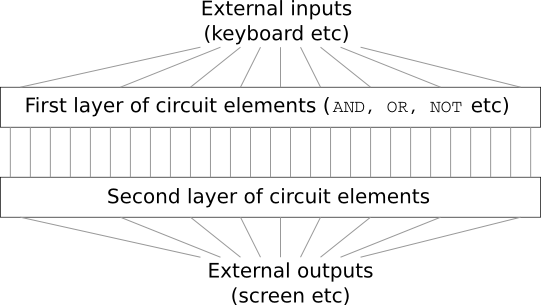
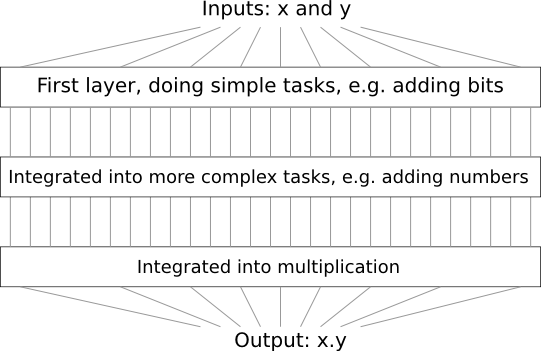
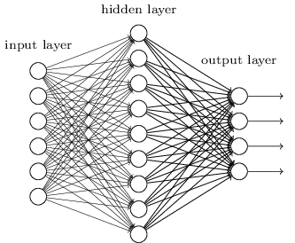
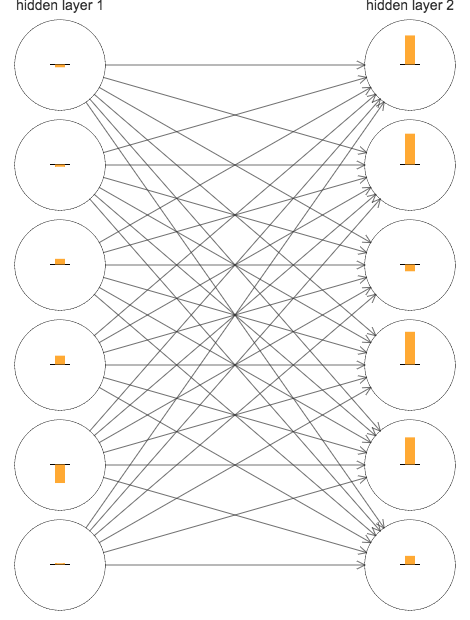
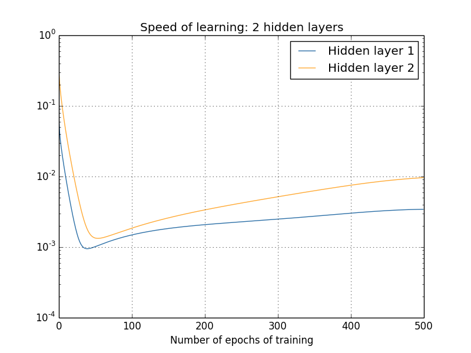
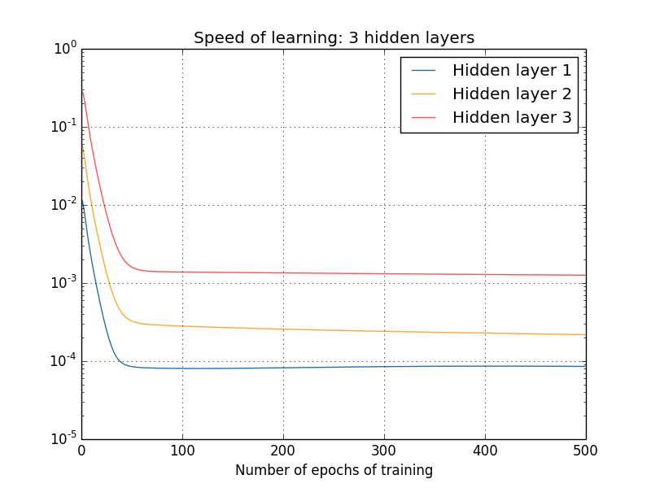
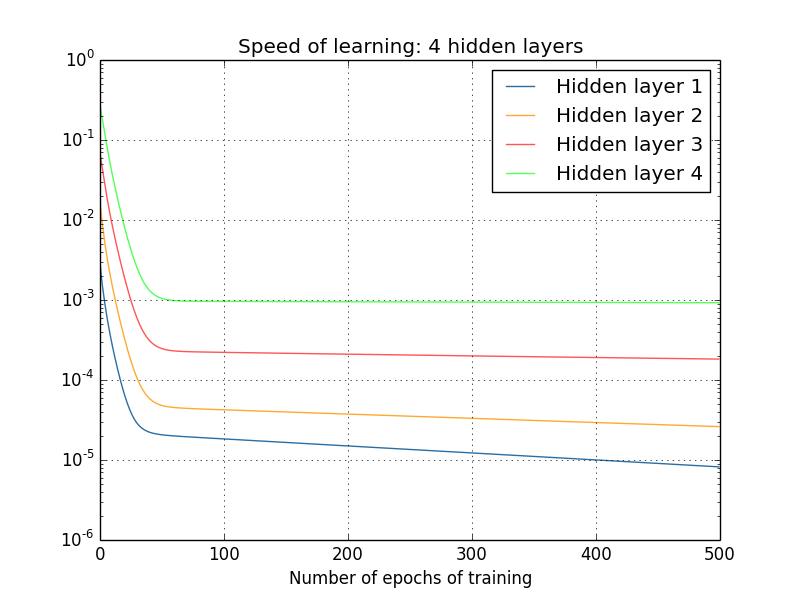
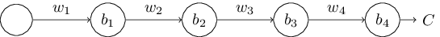
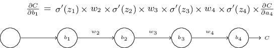

# Ch5 为什么深度神经网络很难训练
想想一下，你是一个工程师，老板安排了一个任务，要求你从无到有的设计一个计算机。一天你在办公室工作在设计逻辑电路，设置与门，或门,等等，然后你的老板带着一个坏消息过来了。客户刚刚增加了一个很让人震惊的需求：整个计算机的逻辑只能有两层：

你惊呆了，告诉你的老板：“这哥们疯了”

你老板说：“我也觉得他们疯了，但是客户就是上帝”

实际上，从某种角度而言客户还是没有疯的。假设你可以使用一种特殊的逻辑门，可以让你的与门接手多个输入。同时也允许存在有多个输入的“与非门”,就是一个门可以对多个输入进行“与”操作，然后进行取反。有这样一个特殊的门我们就有可能通过使用只有两层的逻辑电路来计算任何函数了。

但是，可能并不意味着是一个好的想法。实际上，当解决这种电路设计问题（或者多数算法问题），我们习惯于从解决子问题开始，然后将结果整合起来。换言之，我们可以通过多层的抽象来解决问题。

假设我们设计了一个逻辑电路来对两个数求乘积。我们可以通过建立一些子逻辑电路，通过对两个数求和来完成。这个子的求和的逻辑电路可以通过对位进行求和的子-子电路组成，就是说我们的网络大概是下面这样：

这就是我们最后的逻辑电路了，它包含至少三层逻辑电路。实际上他可能包含有更多的层，就像我们说过的拆分子问题。不过我们仅仅是传达这么个想法。

这样的多层逻辑电路使得设计变得很容易了。而且，它不仅仅是对设计起到了帮助。实际上存在数学证明对于计算一些函数，浅层的逻辑电路相比与深层的逻辑电路需要更多的电路门。上个世纪八十年代的一系列论文(这段历史其实有点复杂，所以我们不会做详细的说明，可以看一下Johan Håstad's 2012的论文[On the correlation of parity and small-depth circuits](http://eccc.hpi-web.de/report/2012/137/) 有对这段历史的说明)说明了通过使用浅层的结构来计算位的集合需要的是指数级的逻辑门。换言之，如果你是用多层逻辑，这个计算就不需要那么多的逻辑门：一层层的叠加就行了。深度的逻辑电路要比浅层的强大很多。

目前为止，本书构造神经网络的方法就像那个疯狂的顾客一样。我们所使用的几乎所有神经网络，仅仅是一个隐藏层（再加上一个输入层，一个输出层）：

出乎意料的是，这个网络还挺好用的：在前面的章节中，我们使用这样的网络对手写数字进行识别可以达到超过98%的准确率！不过，从直觉上讲，多层的网络会更加的强大：

这样的网络可以使用中间的层进行多层的抽象，就像我们使用门电路一样。举个栗子，如果我们做一些图像模式识别，那么第一层的网络有可能会学习到识别边界，第二层的神经元可能学习到更复杂的形状，比如三角形，正方形。第三层的就更复杂。等等。这个多层的抽象看起来强行给了深度网络一点优势，让它能解决复杂的模式识别问题。并且，就像逻辑电路的例子一样，深层的网络比浅层的网络更强大是有依据的。

我们应该如何训练这样一个深度的网络呢？在本章中，我们会尝试使用SGD和反向传播来训练一些更深层的网络。但是会遇到麻烦，我们的深度网络不会比浅层的好很多。

这个失败看起来和我们的讨论有点不一样，这有点震惊。相对于放弃深度网络，我们会深入研究并且理解是什么使得我们的深度网络训练起来很难。当我们深入观察之后会发现我们网络中不同层的学习速度相差很大，前面的层会被卡住，在训练中几乎什么都学不到。这个卡壳并不能简简单单的归结于运气不好。其实我们会发现很多因为我们使用基于梯度的学习技术引起的问题。

当我们更加深入的去研究问题时，我们会发现相反的结果：早期的层能学习的非常好，而后面的却不好。实际上，我们会发现，在使用梯度下降对深度，多层神经网络进行学习的时候会有不稳定的状态，正式因为这种不稳定行，导致了我们会在前面的层，或者后面的层中卡住。

这听起来不是什么好消息。但是在解决这些困难的时候,我们对有效的训练深度网络需要什么有一个良好的认知。这种研究对于下一章，我们使用深度网络解决图像识别问题，也是一个准备。


## 梯度消失问题
所以，在我们尝试训练深度网络的时候究竟发生了什么呢？

为了回答这个问题，我们要先回到仅有一层隐藏层的神经网络的例子中。就像之前一样，我们还是使用MNIST数字分类问题作为我们的实验。

如果你想，你可以跟着下面的指导在自己的电脑上训练神经网络。如果仅仅是看也是没问题的。

你需要到我们的代码目录下。
然后在python shell中加载MNIST数据集：
```python
>>> import mnist_loader
>>> training_data, validation_data, test_data = \
... mnist_loader.load_data_wrapper()
```
对网络进行初始化：
```python
>>> import network2
>>> net = network2.Network([784, 30, 10])
```
这个网络在输入层有784个神经元，对应着28*28 = 784个输入图像的像素。我们使用30个隐藏神经元，还有10个输出神经元来对应十个可能的MNIST数字图像分类结果(‘0,1,2,3,4,5,6,7,8,9')。

让我们试着训练我们的网络完成30次迭代，mini-batch的大小为10，学习速度0.1，正则化参数0.5。同时，在训练的时候我们使用验证集来监视我们的分类准确率：(要注意网络有可能需要一些时间去训练，具体取决于你的机器。所以，如果你要跑代码的话，最好先跑着，回来继续看，一会儿再看结果的)
```python
>>> net.SGD(training_data, 30, 10, 0.1, lmbda=5.0,
... evaluation_data=validation_data, monitor_evaluation_accuracy=True)
```
我们可以得到96.48%左右的准确率。和之前的实验结果差不多的。

现在，让我们加入一个隐藏层，也是30个神经元，然后用一样的参数去进行训练：
```python
>>> net = network2.Network([784, 30, 30, 10])
>>> net.SGD(training_data, 30, 10, 0.1, lmbda=5.0,
... evaluation_data=validation_data, monitor_evaluation_accuracy=True)
```

这可以让我们的分类准确率提升到96.90%。这还是比较鼓舞人心的:深度是有帮助的。让我们再加入一个30个隐藏神经元的隐藏层吧：
```python
>>> net = network2.Network([784, 30, 30, 30, 30, 10])
>>> net.SGD(training_data, 30, 10, 0.1, lmbda=5.0,
... evaluation_data=validation_data, monitor_evaluation_accuracy=True)
```

分类的准确率却降了下来。这可能不是很重要，但真的不是太好。

这种行为看起来很奇怪。从直觉上讲额外的隐藏层可以让网络学习更复杂的分类函数，因此可以做到更好的分类效果。讲道理的话效果不应该变差，因为就算在最坏的情况下，额外的层最多什么都不做。但是好像事情不是这样的。

那么到底发生了什么呢？让我们先假设额外的层在理论上是会有帮助的，那么问题就是我们的学习算法并没有找到合适的权重和偏移量。我们需要搞明白到底在我们的算法中哪里出了错，然后怎么去改进。

为了得到这种哪里出错的直觉，让我们来可视化这个网络的学习。下面，我们画了一个[784，30，30，10]的网络，一个有两层隐藏层，均含有30个隐藏节点的网络，图中的每一个神经元都有一个小条，表示在网络学习过程中这个神经元改变的速度。大的小条表示神经元的权重和偏移量变化的快，小的条表示权重和偏移量变化的慢。更准确一点的话，这个小条表示的是每一个神经元的梯度，就是代价关于神经元偏移量的变化速度$\partial C / \partial b$。回忆一下第二章的内容，我们看到这个梯度不仅仅是控制着由学习中偏移量的改变，也控制权重的改变。如果你没回想起来也不要紧：只要记住这些小条表示的是每个神经元的权重和偏移量在网络学习中改变的速度。

为了让图变得简单一点，我们只画了两个隐藏层中的前6个神经元。忽略了输入神经元，因为他们没有什么权重和偏移量可以学。我们也忽略了输出神经元，因为我们是做的层之间的比较，这个时候有一样神经元个数的层之间的比较就更有意义了。我们这个图是在网络刚开始训练的时候画的，就是刚完成初始化的时候的(画出来的数据是generate_gradient.py 提供的本节后面的图也是这样的)


网络是随机初始化的，所以他们之间有很大的不同也不是什么了不起的事儿。不过我们还是可以很明显的看到，第二层网络中的条要明显的比第一层的大。也就是说第二层的神经元学习速度要比第一层的快一些。这是一个巧合还是正常的现象呢？

为了探究这个问题，使用一种全局的方法来比较第一个和第二个隐藏层神经元的速度是很有帮助的。为了做这个，我们将梯度表示为$\delta^l_j = \partial C / \partial b^l_j$，第l层的第j个神经元(在 Chapter 2 中我们提到过这个“误差”，但是在这里我们将这个信息叫做梯度。我们称之为信息是因为这并不能明确的表示代价关于权重的偏导$\partial C / \partial w$)。我们认为梯度是一个向量$\delta^1$表示我们整个第一个隐藏层的学习速度，$\delta^2$表示的是第二个隐藏层的学习速度。我们使用这些向量的模来表示（粗略的）整个一层的学习速度。所以$\parallel \delta^1 \parallel$表示第一个隐藏层神经元的学习速度。$\parallel \delta^2 \parallel$表示第二层的。

使用这些定义，以及和上图中一样的数据，我们可以得到 $\parallel \delta^1 \parallel = 0.07$，$\parallel \delta^2 \parallel = 0.31$，这也就证明了我们之前的看法，第二层网络中的神经元要比第一层网络中的神经元学习的快。

当我们加入更多的隐藏层呢？如果我们有三个隐藏层呢，在[784,30,30,30,10]的网络中，那么学习速度就是0.012，0.060和0.283。可以看到前面的隐藏层要比后面的隐藏层学习速度慢。假设我们再加一个30个神经元的隐藏层进去呢？这样的时候我们得到的是0.003，0.017，0.070和0.285。结果还是这样：前面的层要比后面的层慢。

我们所看的是开始的时候的速度。那么当我们进行几次训练以后的呢？

为了产生这样的结果，我使用了1000个训练图片，经过500次迭代。这和我们之前地训练不太一样，我们没有使用mini-batches，仅仅使用了1000个训练图片，而不是所有的50000个训练图片的完整集合。我们并不准备做一些暗箱操作，或者掩饰什么，但是实际情况是使用mini-batch随机梯度下降会有很多噪声（尽管我们通过求均值等降噪之后结果会很相似）
使用我们选择的参数会使得事情更简单，更容易看到到底发生了什么。

无论如何，你可以看到，这个两层在开始的时候学习速度相差很大（我们已经知道了），他们的学习速度也在飞快的下降。但是在最后，第一层还是比第二层慢很多。

那么更复杂的网络呢？我们使用一样的实验，但是这次我们使用3层隐藏层[784，30，30，30，10]：

再次，一样的结果，前面的比后面的慢，最后我们再加一层（[784，30，30，30，30，10]）看一下我们训练的时候发生什么呢：

再次，一样的结果，前面的比后面的慢。这种情况下，第一层要比最后一层慢100倍左右。也就不奇怪为什么之前我们训练的时候会发生那样的效果了。

我们可以观察到一些重要的现象：在一些深度神经网络中，当我们反向穿过隐藏层的时候，梯度会变得越来越小。这就意味着前面的层要比后面的层的神经元的学习慢上很多。虽然，我们仅仅在一个网络中看到了，不过这里是有一个通用的理论来解释这些网络中到底发生了什么的。这个现象被称为“梯度消失问题”可以看[Gradient flow in recurrent nets: the difficulty of learning long-term dependencies, by Sepp Hochreiter, Yoshua Bengio, Paolo Frasconi, and Jürgen Schmidhuber (2001)](http://citeseerx.ist.psu.edu/viewdoc/summary?doi=10.1.1.24.7321)。 虽然这篇论文所讲述的是循环神经网络，但是同样的现象在我们目前所研究的前向传播网络中是一样存在的。类似的还有 Sepp Hochreiter的早期毕业论文,[Untersuchungen zu dynamischen neuronalen Netzen (1991, in German).](http://www.idsia.ch/~juergen/SeppHochreiter1991ThesisAdvisorSchmidhuber.pdf)

为什么梯度消失问题会发生？我们有什么办法去避免它么？在训练深度神经网络的时候我们应该怎么处理这个问题？实际上我们很快就会知道这并不是必然发生的，虽然选择并不是很好：有的时候前面的层的梯度会变得很大。这叫做梯度爆炸问题，这相对于梯度消失问题来说，并没有好到哪去。更通用的说明是，深度网络中的梯度是不稳定的，在前面的层的梯度不是爆炸就是消失。这种不稳定是深度神经网络学习中的最基本的问题。这个问题是我们需要理解的，并且，如果可能的话要一步一步的去解决它。

一个要面对的问题是，消失（或者说不稳定的）梯度是否真的是一个大问题。我们先暂时不说神经网络，想象一下我们试着去计算f(x)这个具有一个变量的函数的最小值。如果他的导数f’(x)很小，这会是一个好消息么？这是不是意味着我们已经在目标附近了呢？同样的，深度网络中前面的层的小梯度是否就意味着我们不需要对于权重和偏移量做过多的调整了呢？

当然了，实际上不是这样的。回忆一下我们随机的初始化了网络的权重和偏移量，没可能我们随机的结果就这么好。考虑一下我们三个隐藏层的情况[784，30，30，30，10]，随机初始化的结果意味着第一层丢掉了绝大多数的信息。即使后面的层学的很好，还是很难去识别输入。如果我们要训练深度网络，我们就需要弄清楚如何去解决梯度消失问题。


## 什么引起了梯度消失问题？深度网络中不稳定的梯度
为了建立为什么梯度消失问题会发生的直觉，我们先来考虑最简单的深度神经网络：每一层中只有一个神经元。下面是有三个隐藏层的神经网络：

这里$w_1，w_2，.....$是权重，$b_1，b_2,....$是偏移量，C是某一种代价函数。仅仅是为了提醒一下你这是怎么工作的，第J层的神经元的输出$a_j$是$\sigma(z_j)$，这里$\sigma$通常是sigmoid函数，$z_j = w_ja_{j-1}+b_j$是神经元的加权输入。在最后的地方我画了一个C是为了强调代价是网络输出$a_4$的一个函数：如果网络的实际输出和期望输出很接近，那么代价就会很低。如果相差很远，那么代价就会很高。

我们将要去研究梯度$\partial C/ \partial b_1$，来和第一个隐藏神经元建立联系。我们会弄清楚$\partial C/ \partial b_1$的表达式，通过研究这个表达式，我们会理解为什么梯度消失问题会发生。

我们会先简单的展示一下的$\partial C/ \partial b_1$表达式，它看起来是有点复杂的，但是实际上结构很简单的，稍后我们会描述这个，下面是表达式（暂时的先忽略一下网络，并且注意下，$\sigma '$仅仅是$\sigma$的导数）：

表达式的结构其实很简单：对于每一个神经元都有一个$\sigma'(z_j)$，还有对于网络中每一个权重都有权重项，最后的$\partial C / \partial a_4$对应的是最后的代价函数。要注意到，我们把每一项都对应的放到了他在网络的位置中。所以网络本身是对于记忆表达式有帮助的。

你可以跳过这个表达的讨论部分，直接跳到针对梯度消失问题的讨论上。这么做是没有什么坏处的，因为这个表达式其实是我们之前讨论反向传播的一个特例。但是，还是来看一下这个是很有意思的。

想想一下，我们在偏移量b1上做了一个小小的改变，$\Delta b_1$，这会使得网络剩余部分发生级联效果的改变，首先，他会引起第一个隐藏神经元的输出的小小的改变$\Delta a_1$，然后是第二个隐藏神经元的加权输入的改变$\Delta z_2$，然后就会改变了第二个隐藏神经元的输出$\Delta a_2$，一直到最后改变整个网络输出的代价值$\Delta C$，然后我们就可以得到：
$\begin{eqnarray}
  \frac{\partial C}{\partial b_1} \approx \frac{\Delta C}{\Delta b_1}.
\tag{114}\end{eqnarray}$

这其实就给了我们一个提示，我们可以通过仔细的跟踪级联中每一步的变化的影响，最后来搞清楚梯度$\partial C/ \partial b_1$的表达。

为了达到这个目的，我们首先要分析一下$\Delta b_1$是如何影响第一个隐藏神经元的输出$a_1$的，根据定义，我们有：$a_1 = \sigma(z_1) = \sigma(w_1a_0 + b_1)$，那么就有：
$\begin{eqnarray}
  \Delta a_1 & \approx &
  \frac{\partial \sigma(w_1 a_0+b_1)}{\partial b_1} \Delta b_1 \tag{115}\\
  & = & \sigma'(z_1) \Delta b_1.
\tag{116}\end{eqnarray}$

这里的$\sigma'(z_1)$看起来就很熟悉了：就是我们上面的表达式的第一项。从直观上来讲，我们可以看到这一项把$\Delta b_1$这个偏移量的改变，转移到了神经元的激活值的改变$\Delta a_1$上来。这个$\Delta a_1$的改变又引起了第二个神经元的加权输入$z_2 = w_2a_1 +b_2$的改变：
$\begin{eqnarray}
  \Delta z_2 & \approx &
  \frac{\partial z_2}{\partial a_1} \Delta a_1 \tag{117}\\
  & = & w_2 \Delta a_1.
\tag{118}\end{eqnarray}$
通过将$\Delta a_1 $和$\Delta z_2$的表达式结合起来就可以看到，偏移量$b_1$上的变化会影响$z_2$:
$\Delta z_2 \approx \sigma(z_1) w_2 \Delta b_1 \tag{119}$
这个呢，看起来是不是更熟悉了，前两项在之前的$\partial C / \partial b_1$表达式中也出现过的

我们按照这个节奏进行下去，跟踪这个改变穿过整个网络。在每一个神经元中我们都能得到一个$\sigma'(z_j)$和一个$w_j$。最后就能得到这么一个结果，最终的$\Delta C$的改变和最初的$\Delta b_1$的关系：
$\begin{eqnarray}
\Delta C & \approx & \sigma'(z_1) w_2 \sigma'(z_2) \ldots \sigma'(z_4)
\frac{\partial C}{\partial a_4} \Delta b_1.
\tag{120}\end{eqnarray}$
在方程连边同时除以$\Delta b_1$就有了：
$\begin{eqnarray}
\frac{\partial C}{\partial b_1} = \sigma'(z_1) w_2 \sigma'(z_2) \ldots
\sigma'(z_4) \frac{\partial C}{\partial a_4}.
\tag{121}\end{eqnarray}$

### 为什么梯度消失会发生呢？
要理解为什么梯度消失问题会发生我们要先准确的写下这个梯度表达式：
$\begin{eqnarray}
\frac{\partial C}{\partial b_1} = \sigma'(z_1) \, w_2 \sigma'(z_2) \,
 w_3 \sigma'(z_3) \, w_4 \sigma'(z_4) \, \frac{\partial C}{\partial a_4}.
\tag{122}\end{eqnarray}$
除了最后一项，这整个表达式其实就是$w_j \sigma ' (z_j)$组成的乘积了。为了理解每一项的行为，我们来看一下$\sigma '$的图像：
这个sigmoid函数的导数最大值是$\sigma'(0) = 1/4$。现在，如果我们使用之前的标准方法来初始化我们的网络权重，我们就会随机的选择权重，权重分布符合标准高斯分布。所以，大部分的权重都满足$|w_j| < 1$。将我们所观察到的结合在一起的话，我们可以发现，$w_j \sigma'(z_j)$在绝大多数的情况下都会满足$|w_j \sigma'(z_j)|< 1 / 4$然后，我们对这样的项进行乘法操作以后就会发现最后的结果是随着项的增多而呈指数级下降。这看起来是梯度消失问题的一个合理解释。

为了让解释更加明确一些，我们来比较一下$\partial C / \partial b_1$和靠后一点的偏移量的梯度的表达式$\partial C / \partial b_3$进行比较。当然了，我们还没有详细的说明的$\partial C / \partial b_3$表达式，但是这其实是和$\partial C / \partial b_1$遵循一样的模式。下面就是两个表达式的比较：

可以看到这两个表达式具有很多共同的项。但是$\partial C / \partial b_1$包含两个额外的$w_j \sigma'(z_j)$项。就像我们看到的一样这些项的值基本上都不会超过1/4的边界情况。所以，梯度基本上都会（至少）小16倍。这就对梯度消失问题有了一个解释了。
```
这里要注意这个词，是基本上不会超过
```
当然，这并不是一种关于梯度消失问题的严谨证明。我们还是绕开了一些问题。实际上我们可能会有点疑惑$w_j$会不会在训练期间增大，如果增加的话，有可能$w_j \sigma'(z_j)$项，不再满足$|w_j \sigma'(z_j)|< 1 / 4$。确实，如果这项足够大了-大于1-那么我们就不会遇到梯度消失问题了。相对的梯度不会随着反向传播而减小而是几何倍数的增加了，这就成了梯度爆炸问题了。

### 梯度爆炸问题
我们来看一下下面的例子，这个例子中会发生梯度爆炸问题，例子其实是有点意思的：我们想要去找到一个合适的参数，可以保证我们可以得到梯度爆炸，但是就算是这样，这个例子也完全的证实了，梯度爆炸不仅仅是一个假设，而是真实发生的。

为了得到梯度爆炸，有两步。首先，我们将网络中的所有权重都设很大，比如$w_1=w_2=w_3=w_4=100$。然后，我们选择偏移量，让$\sigma'(z_j)$不能太小的偏移量。这个也不难，我们只用保证选择的偏移量可以使得加权输入$z_j = 0$ 就行了，（保证 $\sigma'(z_j)$= 1/4）。所以就是说我们想要得到$z_j = w_1a_0+b_1 = 0$，我们可以通过设置$b1 = - 100a_0$就行了。对于后面的每一个神经元都是用同样的思想去设置，最后得到了每一个神经元的梯度都是$100 \times 1/4 = 25$.当有了这样的选择以后，我们就得到了一个爆炸的梯度了。

### 梯度不稳定问题：
这里的基本问题不是梯度消失问题或者梯度爆炸问题。而是前面的层的梯度实际上都是由后面的层的梯度组成的。当网络总有很多层的时候就会导致不稳定的状况。使得网络各层以相似的速度去学习的唯一方法就是使得，上面我们一直说的那些项的乘积能够达到一种平衡的状态。如果不使用一些机制或者去理解平衡的原因，仅仅靠运气是不太可能的。简言之，神经网络的真实困扰是因为不稳定的梯度。也就说，如果我们使用标准的基于梯度的学习算法，那么不同的层之间的学习速度会相差很大。

### 练习
我们讨论梯度消失问题的时候，我们使用了sigmoid的一个性质就是$|\sigma'(z)| < 1/4$。假设我们使用一个新的激活函数，这个函数的导数很大，这会帮助我们避免不稳定的梯度问题么？
```
导数很大有可能引起梯度爆炸
```

### 梯度消失问题的普遍存在：
我们已经看到了，在深度网络的前几层中，梯度可以消失也可以爆炸。实际上使用sigmoid神经元的时候，梯度大多数情况都会消失。为了明白为什么，先来回想一下的$w \sigma'(z)$表达式，为了避免梯度消失问题，我们需要使得 $|w \sigma'(z)|>= 1$。你可能会认为这其实挺简单的，只要有一个足够大的w就行了。但是实际上要比看起来难的多了。原因是$\sigma'(z)$也依赖于w：$\sigma'(z) = \sigma'(wa+b)$，这里a是神经元的输入激活值。所以当我们增加w的时候，我们需要很小心的，因为我们不想同时缩小$\sigma'(wa+b)$。这个其实是一个很大的限制了。是因为当我们使w变大的时候，我们就会使得wa+b变大了。看一下$\sigma'$的函数图像就可以发现这会让我们的值到达函数图像的两个尾巴上，这里就变得很小了。避免这种情况的发生的话，就需要去减少输入的激活值(在下面的问题会对这个进行量化的分析)。有的时候，这种情况会发生，但是绝大多是不会发生的。所以，在通常的情况下，我们需要去面对梯度消失问题。

### 问题
思考一下有关$|w\sigma'(wa+b)|$的问题吧
假设$|w \sigma'(wa+b)| \geq 1$
1)仅当 $|w| \geq 4$的时候上式才有可能为真。（因为$\sigma'$的值一定是小于等于1/4的）
2）假设现在有$|w| \geq 4$，并且存在有一组输入激活值，满足$|w \sigma'(wa+b)| \geq 1$，证明，这个输入激活值a的集合满足之间的间隔都不会超过：
$\begin{eqnarray}
    \frac{2}{|w|} \ln\left( \frac{|w|(1+\sqrt{1-4/|w|})}{2}-1\right).
  \tag{123}\end{eqnarray}$
3)从数学上计算上面的表达式在$|w|$约为6.9的时候取得最大值0.45。所以就算这些数据排列都很整齐，我们仍然没有讨多的选择，可以避免梯度消失问题。

### identity 神经元：
考虑一下，一个神经元仅有一个输入x，一个对应的权重$w_1$，一个偏移量b，以及输出的权重$w_2$.证明通过选择合适的权重和偏移量，我们能保证网络的输出满足$w_2 \sigma(w_1
x+b) \approx x ，x \in [0, 1]$。这样的一个神经元被称作是识别神经元，就是一个神经元的输出（取决于那个权重的倍书）和输入是一样的。提示：将x重写成$1/2+\Delta$，假设$w_1$很小，然后使用泰勒级数展开。


## 复杂网络中不稳定的梯度
我们之前一直是在研究我们的玩具网络，每个隐藏层仅仅含有一个神经元。那么，那些更复杂的深度网络呢，每一层中都含有很多神经元呢？

实际上，在这种网络中的行为和我们之前看到的差不多。在前面的章节，讲反向传播的时候，我们看到了在一个L层网络中第l层的梯度是：
$\begin{eqnarray}
  \delta^l = \Sigma'(z^l) (w^{l+1})^T \Sigma'(z^{l+1}) (w^{l+2})^T \ldots
  \Sigma'(z^L) \nabla_a C
\tag{124}\end{eqnarray}$
这里$\Sigma'(z^l)$是一个对角矩阵，里面的项是$\sigma'(z)$是对于l层的加权输入的。$w^l$是不同层的权重矩阵。$\nabla_aC$是C对于输出激活值a的偏导向量。

这相对于单一神经元的情况是一个更加复杂的表达式。如果你仔细观察的话，他们的基本形式是很相似的，有很多$(w^j)^T \Sigma'(z^j)$的组成。并且，矩阵$\Sigma'(z^j)$在对角线上的值很小，不大于1/4。如果权重矩阵$w^j$不会太大，每一个$(w^j)^T \Sigma'(z^j)$项都使得梯度向量变小，最后导致梯度消失。并且表达式里众多的项更会导致梯度的不稳定，就像我们早先的例子一样。实际上从经验来看，sigmoid网络前几层的梯度总会快速的消失。导致这些层的学习速度很慢，这种变慢不仅仅会导致一些事故或者不变：这个问题已经成为了我们所面临的需要研究的基本问题。


## 深度学习中的其他障碍
本章中，我们关注于梯度消失问题—-更加普遍一点，梯度不稳定—-是我们深度学习中的一种障碍。实际上，不稳定的梯度仅仅是一个障碍，尽管是一个很基本的障碍。有很多持续的研究都想要去理解训练深度网络中会遇到的挑战。这里我们不打算过多的介绍，仅仅是列出一些论文，如果你有兴趣的话可以看看。

第一个是2010年Glorot和Bengio[Understanding the difficulty of training deep feedforward neural networks, by Xavier Glorot and Yoshua Bengio (2010)](http://jmlr.org/proceedings/papers/v9/glorot10a/glorot10a.pdf). 还有一些早期的关于sigmoid的讨论 [Efficient BackProp, by Yann LeCun, Léon Bottou, Genevieve Orr and Klaus-Robert Müller (1998)](http://yann.lecun.com/exdb/publis/pdf/lecun-98b.pdf).发现了证据，使用sigmoid作为激活函数可以导致在深度网络训练中的一些问题。实际上，他们发现了使用sigmoid会导致最后一层的神经元的激活值在训练中会在0附近过早的饱和。会相当的减慢学习。他们给出了一些替代的激活函数，从而避免饱和问题。

作为第二个例子，2013年Sutskever，Martens，Dahl和Hinton[On the importance of initialization and momentum in deep learning, by Ilya Sutskever, James Martens, George Dahl and Geoffrey Hinton (2013)](http://www.cs.toronto.edu/~hinton/absps/momentum.pdf).研究了深度学习中的随机初始化和基于动量的随机梯度下降的动量调度。这两种情况在训练深度网络中都有着良好的选择能力。

这些例子说明“什么使得深度网络难以训练”是一个复杂的问题。在本章中，我们关注于深度网络中基于梯度的学习和不稳定性的关系。在前两段其实可以看出，权重初始化，激活函数的选择，梯度下降的具体实现其实都是有影响的。当然，网络结构的选择和其他超参数也同样重要。因此，很多因素都使得深度网络难以被训练，并且理解这些因素也是一个很长期的研究。这看起来是有点悲观的。但是下一章中会有一些好消息，会有一些方法可以让我们在训练深度网络中绕过这些挑战。
