# Ch6 深度学习
在上一章中，我们学习到深度网络相对于浅层网络而言很难训练。太不幸了，因为我们有很多好的理由去相信，如果我们能够训练一个深度网络，他要比浅层网络更加强大。虽然上一章后面的消息很让人失望，但是我们不能让这来阻止我们。在本章中，我们会构建一些新技术，可以用来帮助我们训练深度网络，并且实际应用中能够使用到他们。我们同样会把眼光放长远，简单的回顾深度网络在图像识别，语音识别和其他应用中的最新进展。我们也会简单的对未来进行一个展望。

本章比较长。为了帮助你理解，我们先来一个小的引导。本章中的小节之间并没有太多的联系，所以如果你对神经网络有了基本的了解，你就可以去看你所感兴趣的地方。

本章的主要部分都在介绍一种被最广泛应用的深度网络：深度卷积网络。我们会有详细的例子--所有的代码的--使用深度卷积网络来解决手写数字分类问题：
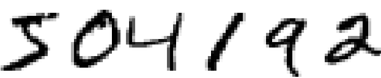
我们会从前面用到的浅层网络来慢慢开始我们的卷积网络。伴随着多次迭代，我们会建立一个越来越强有力的网络。我们会探索很多有力的技术：卷积，池化，使用GPU加速我们的训练，训练集的算法扩展（来减少过拟合），Dropout（也是减少过拟合），以及其他。最后是我们的系统可以达到人类识别的水平。对于10000个MNIST测试图片-—在训练中没有见到过的图片-—我们的分类可以达到99.67%的准确率。下面是被误分的33幅图片，其中右上角的是正确的，程序的分类结果在右下角：
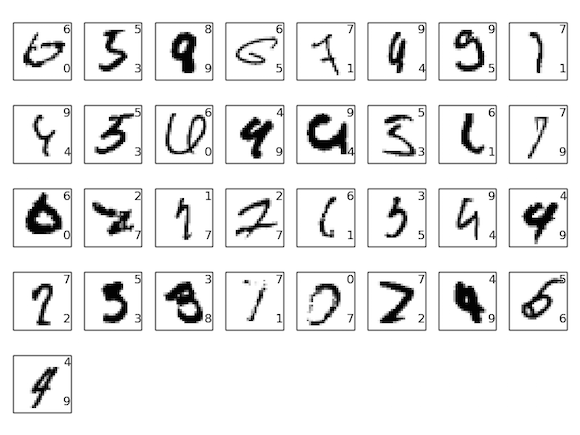
其中很多对于人类而言都难以识别。比如上面从左开始数的第三个图片。看起来明明更像“9”而不是“8”。我们的网络也将他识别成9。这样的错误是可以被理解的，甚至应该被认同的。我们将通过一些图像识别的新技术的讨论来解说我们关于图像识别的部分。

本章剩下的部分将会讨论一些更加广阔的领域中的进展。我们会简单的介绍一些神经网络模型的新技术，比如RNN，LSTM以及这些技术如何被应用到了语音识别和nlp领域中。然后，我们会猜测一下神经网络和深度学习的未来趋势，主要是意识驱动的用户接口，以及深度学习在人工智能中所扮演的角色。

本章建立在本书之前的章节基础出上，使用了一些之前所提到的到的东西，比如反向传播，正则化，softmax 函数等等。不过，为了看懂本章，你并不需要仔细的研究之前的章节。但是看看第一章，了解一下基本的神经网络还是很有帮助的，对于那些2到5章中所出现的概念，我会提供链接，你可以自己去熟悉一下。

本章并不是最新的最好的神经网络库的指导，也不是我们我们会训练一个具有几十层的网络来解决一些边界问题。相对而言，关注于理解深度神经网络的很，并且尽量的简单的易懂的使用它，是我们关注的。换一个角度：本章并不会带领你学习更多。只不过在前面关注的都是基础，本章会进行扩展。

本章还在测试中，应该会有bug什么的，所以有意见就说。

## 卷积神经网络简介
在之前的章节中，我们已经让现有的简单的的神经网络对于手写数字识别得到了一个很好的效果：

我们之前使用的网络每一层的神经元都和邻近层的所有神经元相连接。
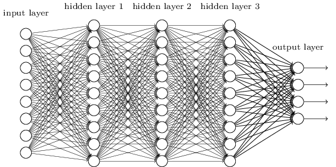
实际上，对于输入图像的每一个像素，我们对每一个像素都进行编码，然后作为对应的输入层的值。对于我们使用的28*28像素的图像，也就是说我们的网络要有784个输入神经元。然后，我们训练网络的权重和偏移量，最后，网络的输出--我们希望--应该是输入图像的正确类别：’0’，’1’，’2’,…’8’或者’9’。

之前的网络效果很好：我们看到了，在MNIST手写数字图像集合上，测试集的分类准确率可以超过98%。但是反过来想想，使用这么一个全连接层来进行图像分类是有点奇怪的。因为这个网络并没有去描述图像的空间结构。相反的他把每个像素都当做紧密排列的独立部分。网络从训练集中得到的是这样的概念。但是如果我们并不凭空构造网络，而是使用一种结构，让网络能够学习到图像的空间结构呢？本节中我们描述了一种卷积神经网络。(最初的卷积神经网络可以追溯到上个世纪70年代，不过卷积网络的重大进展是在1998年的一篇论文上[Gradient-based learning applied to document recognition, by Yann LeCun, Léon Bottou, Yoshua Bengio, and Patrick Haffner.LeCun](http://yann.lecun.com/exdb/publis/pdf/lecun-98.pdf) 曾经有一个关于卷积网络的[观点](https://www.facebook.com/yann.lecun/posts/10152348155137143)“相对于生物神经元而言，我们的神经元是很脆弱的，所以我称卷积网络而不是卷积神经网络”在这篇文章中之处，卷积网络使用和神经网络一样的思想，那些我们目前为止遇到的：比如反向传播，正则化，梯度下降，非线性的激活函数等等，所以我们还是会继续使用之前的思想，把卷积网络当做是一种神经网络。我们会同时使用“卷积神经网络”和“卷积网络”，“神经元”和单元)--这种网络使用一种专门被调整，用来分类图像的空间结构。使用这种结构使得卷积网络学习速度很快。反过来这就会帮助我们来训练深层的，更多层的网络，更好地进行图像分类。现在，深层神经网络，或者一些很相似的变种广泛地应用在了图像识别上。

卷积网络有三个主要的思想：局部感受野local receptive fields，共享权重shared weights，池化。我们一个一个的看这三个思想。

### 局部感受野local receptive fields：
在之前的全连接层中，输入是一行神经元，在卷积网络中，如果把网络的输入想象成一个28 * 28的正方形的神经元是有助于我们思考的，每一个神经元对应的也是我们输入的28*28个像素中的一个
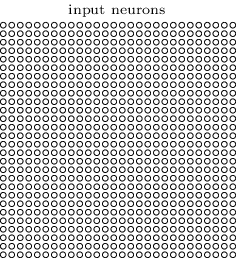
像之前一样，我们把输入的像素连接到隐藏层神经元上。不过，我们不会将每一个像素连接到每一个隐藏神经元上。相反的，我们仅仅是把很小一部分连接上。

更清晰一点的描述是。每一个隐藏层的神经元都仅仅会连接一个小区域内的输入神经元，比如一个5*5的区域内，就对应着25个输入神经元。所以，对于某一个特定的神经元，我们会得到如下的链接：

这个区域内的输入图像就被称之为那个隐藏神经元的局部感受野。就相当于输入像素上的一个小窗户。每一个链接都有一个权重，隐藏神经元也会学习到一个小窗内的偏移量。你可以认为是一个特定的隐藏神经元来学习一个特定的局部感受野。

然后我们在整个输入图像中滑动局部感受野。每一个局部感受野都对应着第一个隐藏层中的一个神经元。为了详细的描述这个，我们先看最左上角的局部感受野。
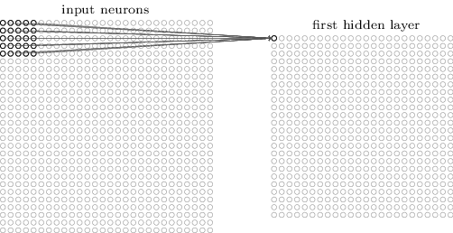

然后我们向右滑动这个局部感受野一个像素（这里就是一个神经元），然后连接到第二个隐藏神经元。
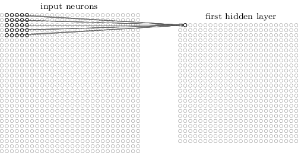
然后继续，建立第一个隐藏层。说明一下，如果我们有一个28 * 28的输入图像，5 * 5的局部感受野，那么我们会得到24 * 24个隐藏层的神经元。这是因为我们在到达最右和最下之前，在每一个方向上都移动了23次。

这里展示了局部感受野每次只移动一个像素。实际上，有些时候，可以使用不同的跨步stride长度。比如说，我们可以每次向右(或者向下)跨过两个像素，这里我们的步长就是2.在本章中我们会严格的使用1作为步长，但是还是有必要说一下，经常有人用别的步长(就像我们在之前的章节所做的一样，如果我们想要尝试不同的步长，那么我们可以使用验证集来选择最优的结果。更细节的地方可以参照之前的讨论，如何选择神经网络中的超参数。我们也可以使用同样的方法来选择局部感知野的大小。当然了，我们选择的5 * 5的局部感受野并没有什么特别之处。通常而言，在比我们的28 * 28的MNIST图像更大的输入图像时，选择更大的局部感知野会更有帮助一些)。

### 共享权重和偏移量shared weights and biases：
我们曾经说过，每一个隐藏神经元都有一个偏移量和5 * 5的权重连接到他的局部感受野当中。我们没有提到的是我们将在所有的24 * 24个隐藏神经元上使用一样的权重和偏移量。也就是说对于第j，k个神经元，输出是：
$\begin{eqnarray}
  \sigma\left(b + \sum_{l=0}^4 \sum_{m=0}^4  w_{l,m} a_{j+l, k+m} \right).
\tag{125}\end{eqnarray}$
这里的$\sigma$是神经元激活函数--有可能是我们之前一直使用的sigmoid，b是共享的偏移量，$w_{l.m}$是一个5*5的数组，表示的是共享的权重。最后我们使用$a_{x,y}$来表示x，y位置上的输入激活值。

也就是说，第一个隐藏层的神经元其实探测的是同样的特征(我们还没有明确的说过关于特征的定义。简单点说，我们可以把神经元的特征探测当做是一种可以让神经元激活的输入模式：这个特征可能是图像的边界，或者一些形状。)只不过第一层的不同神经元，仅仅是探测图像中的不同位置。为了看一下这为什么是有道理的，我们假设隐藏神经元的权重和偏移量可以使得神经元能够选择出，比如说，特定的局部感受野中的垂直线。这样的能力在图像中的其他地方也是有帮助的。所以将同样的特征探测应用在图像中的所有部分是有用的。为了让他更加抽象一点，卷积网络可以很好的适用于改变过的图像上，比如将图像中的一只猫移动一点，他还是一只猫。(实际上，对于MNIST数字图像分类问题，图像是确定的，并且大小一样的。所以相对于实际的图片，MNIST没有那么多变化。不过那些边和角的特征在整个输入空间还是很有意义的。)

也正是因为这个原因，我们有的时候将从输入层到隐藏层的图像称为特征图。我们将定义特征图的权重称为共享权重。把这个偏移量称为共享偏移量。共享权重和偏移量经常被称为核或者过滤器。在一些资料中，人们有时会对这些项有着不同的使用，不过我们这里就不展开了，稍后会有具体的例子。

我们所描述的网络结构仅能探测一种局部特征。为了识别图像，我们需要更多的特征图，所以，一个完整的卷基层应该包含着不同的特征图。
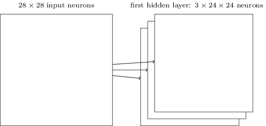
上图所展示的是一个有三个特征图的隐藏层。每个特征图都由一个5*5的共享权重和一个共享偏移量确定。最后的结果就是这个隐藏层可以探测3个不同的特征，每个特征都是在整个图像上可以被观测到的。

在上面的图像中我们仅仅画了3个特征图，这是为了保证我们所画出来的网络结构足够清晰。然而，在实际应用中，我们往往使用更多的特征图（很多的）。一个早期的卷积网络，LeNet-5，使用6个特征图，每个都有一个5*5的局部感受野，来识别MNIST数字图像。所以上面的插图其实很接近LeNet-5.在后面的章节中，我们将使用20到40个特征图的卷积层。我们可以先选择一些我们学习到的特征来看看。(这些特征图是我们从最后的训练好的卷积网络中抽出来的，具体可以看[这里](http://neuralnetworksanddeeplearning.com/chap6.html#final_conv))
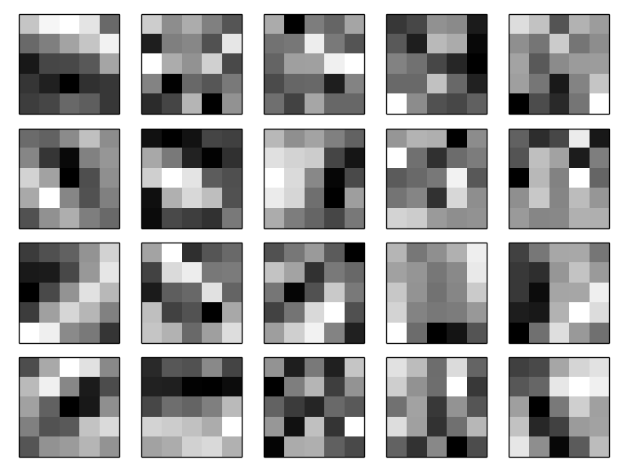
这20个图像，对应的是20个不同的特征图(我们也可以称之为过滤器或者核)。每一个图都表示了一个5 * 5大小的图像。对应的是5 * 5的局部感受野的权重。白一点的小块意味着小的（或者负的）权重，这样特征图对于对应的像素响应就很小。深一点的块表示的是大一点的权重，这样，网络对于对应的输入像素的响应就大一些。非常粗略的看，上面的图像表示的是卷积层所对应的不同类型的特征。

那么，我们能够从这些特征图中得到什么呢？很明显的，这里是有一些特殊的结构的：很多特征都有很明显的黑白边缘结构。也就是说，我们的网络其实真的是在学到一些特殊结构。然而，其实是很难看到到底学到了什么特征。当然了，我们学的肯定不是加博滤波器[Gabor filters](https://en.wikipedia.org/wiki/Gabor_filter) 这个在传统的图像识别方法中被广泛的使用。实际上，现在为了更好的理解卷积网络识别出的特征很多人都有很多的工作，我们建议可以从[这篇](http://arxiv.org/abs/1311.2901)论文开始看起。

共享权重和偏移量的一个大的优点就是可以大量的减少网络中的参数数量。对于每一个特征图我们仅仅需要25=5 * 5的共享权重和一个共享偏移量就可以了。所以每一个特征图需要的是26个参数。如果我们有20个特征图的话，我们需要的也仅仅是20 * 26= 520个参数就可以定义这个卷积层了。相对而言，如果我们使用的是全连接层，那么，对于拥有784=28 * 28个输入神经元，连接到有30个隐藏神经元的隐藏层时，就像我们在之前一直所使用的那样，那么我们的网络一共有784*30个权重，再加上额外的30个偏移量，也就是总够有23，550个参数。换言之，全连接层会有40倍于卷积层的参数。

当然，我们不能仅仅是比较参数的个数，因为这两个模型是完全不同的。但是，从直觉而言，使用这种具有“转移不变的”卷积层相对于得到同样效果的全连接层需要更少的参数。那么卷积模型的训练速度就会变得更快，会帮助我们建立深度网络。

顺便说一下，卷积这个词是因为方程(125)
$\begin{eqnarray}
  \sigma\left(b + \sum_{l=0}^4 \sum_{m=0}^4  w_{l,m} a_{j+l, k+m} \right).
\tag{125}\end{eqnarray}$
有的时候会被称为卷积，或者，更加严谨一点的说，人们有的时候会把那个方程写作$a^1 = \sigma (b+w*a^0)$，这里$a^1$表示从一个特征图中得到的输出激活值的集合，表示输入激活值的集合，“*”称为卷积操作。我们并不会过多的从数学上对卷积进行说明，所以你也不用太过担心。但是还是知道一点比较好。

### 池化层 pooling layers：
通常，人们在使用卷积层的时候也会同时使用池化层。池化层通常紧接着卷积层，它所做的事情是简化卷积层的输出信息。

详细一点说，池化层接受所有的卷积层的特征图(这里的命名并不是很严肃。要说明一下，这里我们使用的“特征图”并不表示输入到卷积层的，而是隐藏层的激活值。这种命名的乱用在研究时还是比较常见的。) 输出，然后将它压缩。池化层的每一个单元都是在处理一个范围（比如说）2 * 2内的上一层神经元。具体点的例子就是，一个很常用的池化操作被称为max-pooling，在max-pooling中一个池化单元仅仅是求着2*2的输入区域中的最大值，就像下面这样：
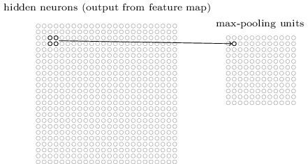
注意到，我们的卷积层得到的输出是24 * 24，那么，按照上面的2 * 2 的池化操作后得到的结果就是12*12的。

就像我们之前提到的，卷积层通常包含不仅一个特征图。我们对于每一个特征图都使用独立的max-pooling所以，如果我们有3个特征图，那么，连接上max-pooling层就能得到下面的结构：
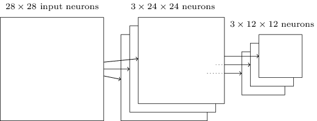

我们可以认为max-pooling是一种神经网络判断特征是否可以在所有的图像范围内都能找到的标准。他会把其余位置上的信息丢掉。直觉告诉我们，一旦特征被找到，其余的位置就不是那么重要了。这带来了一个巨大的好处，就是池化后的特征会减少很多，这就帮助我们减少后面的层中的参数的数量。

max-pooling并不是池化的唯一方法。还有一种比较常见的池化方法被称作L2 pooling。这里，相对于取2 * 2区域中的最大值，我们取区域中所有项的平方和的平方根。虽然实现细节不一样，但是L2池化和max pooling还是挺相似的，L2是一种将卷积层后的所有信息都压缩的方法。两种池化方法都被广泛的应用。有些时候人们会采用不同的池化方法。如果你想更加优化网络的表现，那么就可以使用验证集来测试这些池化的方法，并且找到哪种池化效果最好。

结合起来：我们现在可以把这些思想结合在一起得到一个完整的卷积神经网络。就像我们之前看到的结构一样，不过增加了一个10个神经元的输出层，对应着MNIST数字图像分类结果的十个可能（’0’，’1’，’2’，等）：

网络开始的地方有28 * 28个输入神经元，这是用来对于MNIST图像进行编码。紧接着是一个具有5 * 5的局部感受野的3个特征图，结果就是这一层有3 * 24 * 24个隐藏的特征神经元。下一步是maxpooling层，池化的是一个具有2 * 2范围的区域，3个特征图每个都要池化，最后的结果就是这一层有3 * 12 * 12个隐藏特征神经元。

最后一层是一个全连接层。全连接的意思就是这一层上的神经元，都和池化层的神经元相连接，这种全连接的结构和我们之前的结构是一样的。注意到，在上面的图中我们为了画图方便，仅仅使用了一个箭头，而不是画出所有的链接。当然了，，你可以轻易地想到这个连接情况。

这个卷积结构和我们之前的网络结构是很不一样的。但是还是有一些相似之处，网络都是通过很简单的单元组成，每个单元的行为都是由权重和偏移量所决定。整体的目标还是一样的：使用训练数据集训练网络的权重和偏移量，让网络可以很好的处理数字图像分类问题。

就像之前一样，我们还是会使用随机梯度下降和反向传播来训练我们的网络。这和我们之前的做法是一模一样的。不过具体上还是要有一些小的改动的，因为我们之前的反向传播其实是全连接层的。如果你想要详细的了解，那么我们希望你可以看一下下面的题。不过这是很要时间的，除非你已经完全的掌握了反向传播。

### 问题
卷积网络的反向传播，全连接层中的反向传播的核心方程是
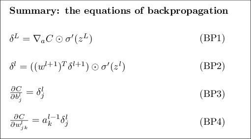
假设，我们有一个卷积层，max pooling 层，和一个全连接层，就像我们上面讨论的一样。那么这时候，反向传播的方程要怎么改呢？


## 应用中的卷积神经网络
在上文中已经看到了卷积神经网络的核心思想。我们通过实现这样的卷积网络，然后应用到MNIST数字图像分类上，来看一下实际是怎么工作的。我们将要实验的程序是network3.py，这是前面的network.py和network2.py的升级(需要说一下，network3.py其实是组合了Theano库的卷积网络的思想(尤其是是[LeNet-5](http://deeplearning.net/tutorial/lenet.html) 的实现) 以及Misha Denil的[implementation of dropout](https://github.com/mdenil/dropout), 以及 Chris Olah.)，如果你想跟着做下来那么可以看一下git上的代码。不过我们在下一节才会具体的去实现这个代码，目前我们先把他当做黑盒。

程序network.py和network2.py都是通过py和矩阵运算的库Numpy实现的。这些程序都实现的挺好的。现在我们已经知道了这些实现的细节，对于network3.py，我们会使用叫做[Theano](http://deeplearning.net/software/theano/)的机器学习库，使用Theano使得实现卷积神经网络的反向传播更加简单，因为它自动的计算了所有的图。Theano的实现也比我们之前的代码运算速度要快上很多（之前的代码只是为了理解，而没有考虑速度），这也就让我们能够实现更复杂的网络。Theano的另一个优点就是它可以进行CPU运算，也可以使用GPU运算(如果有GPU可用)。在GPU上运行可以得到显著地速度提升，并且进一步的帮助我们训练复杂的网络。

如果你想一直跟着做，那么你需要在你的系统中部署好Theano。为了安装Theano，你可以去看一下项目的主页 。我们的代码运行在0.6版本上(0.7上也好使)。有人在Mac os下运行，这是没有GPU的，有人在Ubuntu下用英伟达的GPU，这个实验在两种环境下都能运行。不过为了让network3能运行，你需要根据自己的运行环境去设置GPU的开关。如果你要在GPU上运行，可以看一下这里。同时网上还有很多指导。如果你没有本地的GPU你可以去亚马逊云上看看，他们的EC2 G2实例。要注意，即使使用GPU去运算。很多实验也需要几分钟甚至小时才能完成。在CPU上需要很多天才能完成最复杂的计算。就像之前的章节一样我们还是建议代码跑起来以后就先往下继续看吧。如果你仅仅使用CPU进行运算，你可能在某些实验时需要减少迭代的次数。

为了得到baseline，我们会开始使用一个浅的网络结构仅仅使用一个包含有100个隐藏神经元的隐藏层。我们会进行60次迭代，学习速度0.1，mini-batch大小为10，并且不使用正则化(这些参数什么的都是我们经过尝试所确定好的，在你真正进行实验的时候还是要使用我们之前介绍的方法来自己确定参数)
```python
>>> import network3
>>> from network3 import Network
>>> from network3 import ConvPoolLayer, FullyConnectedLayer, SoftmaxLayer
>>> training_data, validation_data, test_data = network3.load_data_shared()
>>> mini_batch_size = 10
>>> net = Network([
        FullyConnectedLayer(n_in=784, n_out=100),
        SoftmaxLayer(n_in=100, n_out=10)], mini_batch_size)
>>> net.SGD(training_data, 60, mini_batch_size, 0.1,
            validation_data, test_data)
```
我们这里可以得到的最好的结果是97.90%。这是我们在测试数据上得到的准确率，我们还是使用验证数据来评估每次迭代的效果。使用验证集来判断每次迭代的效果可以避免在测试数据上发生过拟合。后面我们也是使用这样的方法。你的结果可能有一点不同，这是因为我们的网络权重和偏移量是随机的。(实际上，我们在这个网络结构下进行了三次独立的训练。然后我们选择了三次训练中最好的一次，使用多次实验的方法在很多网络结构的情况下，都可以帮助我们较少实验结果的变化，除了那些特别说明的地方，我们还是会进行一样的实验方法)

这个97.80%的准确率和之前第三章的98.04%的准确率是很相似的，都是使用一样的网络结构，一样的超参数。具体一点就是这两个例子都是用浅层的网络，仅有100个隐藏神经元的隐藏层。都经过了60次迭代，都是用大小为10的mini-batch，以及0.1的学习速度。

不过还是有两个不同之处，首先，在之前的网络中，我们使用了正则化来帮助减小过拟合的影响。正则化可以帮助我们的网络提高准确率，但是并不多，所以我们回来再说正则化的事儿。第二点，我们之前的网络，最后一层用的是sigmoid激活函数，交叉熵代价函数，现在的网络我们用的是softmax做激活函数，对数似然函数做代价函数，这不是什么大的改变。这是应为softmax+对数似然函数做代价函数在现代的图像分类网络中被广泛的使用。

那么我们用深度神经网络的架构可以得到更好的效果么？

我们从在网络最开始的地方插入卷积层开始。我们使用5 * 5的局部感受野，步长为1，20个特征图。我们也插入一个max-pooling层，通过一个2 * 2的池化窗口组合特征。所以，整体的网络结构和我们上面的讨论很相似，除了一个额外的全连接层：
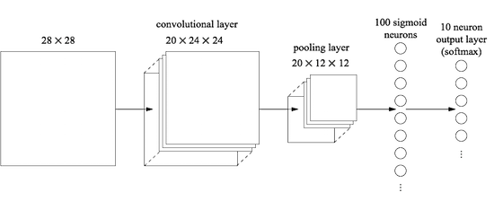
在这样一个结构中，我们可以认为卷积网络和池化层是在学习训练图像的局部特征结构，全连接层是更加抽象的整合整个图片的信息。这是卷积神经网络中常见的模式。

我们训练这样一个网络，然后来看看他的表现(这里还是使用大小为10的mini-batch，实际上，我们之前说过使用更大的mini-batch可以加速网络的训练，不过，目前为止还是使用大小为10从而可以和之前的实验进行对比)
```
>>> net = Network([
        ConvPoolLayer(image_shape=(mini_batch_size, 1, 28, 28),
                      filter_shape=(20, 1, 5, 5),
                      poolsize=(2, 2)),
        FullyConnectedLayer(n_in=20*12*12, n_out=100),
        SoftmaxLayer(n_in=100, n_out=10)], mini_batch_size)
>>> net.SGD(training_data, 60, mini_batch_size, 0.1,
            validation_data, test_data)
```
这可以得到98.78%的准确率，这结果比我们之前的都好。我们大幅的减少了错误率，这是一个很大的进步。

这里需要说明的是，很多时候人们把卷积和池化看做一层，其实池化和卷积到底是不是一层并没有太大的影响。这里把它们当做是一层仅仅是为了让代码更加简洁。把它们变成两层其实也不难。

### 问题
仅仅使用卷积和池化以及最后一个softmax层，我们的准确率会发生什么改变？这里的全连接层的引入是否有意义？

那么98.87%的准确率能否得到进一步的提升呢？

我们在现有的卷积池化层和全连接层之间引入第二层卷积-池化层。同样的，我们使用5 * 5的局部感受野，使用2 * 2的池化区域，看一下当使用类似的超参数的时候我们可以得到什么样的结果。
```python
>>> net = Network([
        ConvPoolLayer(image_shape=(mini_batch_size, 1, 28, 28),
                      filter_shape=(20, 1, 5, 5),
                      poolsize=(2, 2)),
        ConvPoolLayer(image_shape=(mini_batch_size, 20, 12, 12),
                      filter_shape=(40, 20, 5, 5),
                      poolsize=(2, 2)),
        FullyConnectedLayer(n_in=40*4*4, n_out=100),
        SoftmaxLayer(n_in=100, n_out=10)], mini_batch_size)
>>> net.SGD(training_data, 60, mini_batch_size, 0.1,
            validation_data, test_data)
```
效果得到了进一步的提升，准确率可以达到99.06%

不过，这也带来了两个问题。首先是，加的这一层卷积有什么意义呢？实际上，你可以认为第二个卷积池化层的输入是12*12的“图像”，每一个“像素”都代表着原始输入图像中特定区域内或区域外的特征。你可以把这一层的输入当做是原始输入图像的另一个版本。这个版本是更加抽象的和压缩过的，但是还是有很多独特的特征，所以这就让我们使用第二层卷积-池化层有道理了。

这个观点让我们可以解释第一个问题，但是也就带来了第二个问题。首层的输出带有20个独立的特征图，所以第二个卷积-池化层有20 * 12 * 12的输入。这里，我们的卷积层就有了20个独立的输入图像，而不是第一种情况下的1个图像。神经元会怎么处理这种多个输入图像的情况呢？实际上，我们让第二个卷积层的神经元具有的局部感受野为20 * 5 * 5。更详细一点：第二个卷积池化层的特征探测器会学习上一层的所有特征，但仅仅是特定的局部感受野内的。(当输入图像是彩色的时候在第一个卷积池化层也会发生这样的事情。当输入是彩色的时候，每一个输入像素都具有三个特征，分别对输入图像中红绿蓝三种信道。这时，我们让特征探测器可以在这三种特征上都进行工作，但是仅仅在给定的局部感受野内。)

### 问题
使用tanh激活函数：在本书早些时候，我曾经提到过tanh 函数相对于sigmoid函数来说有可能取得更好的效果。我们并没有真正的尝试过使用tanh，因为我们使用sigmoid函数已经取得了很大的进展。但是，现在，让我们尝试使用tanh作为我们的激活函数。尝试使用tanh作为卷积层和全连接层的激活函数(代码已经实现了，指定参数activation_fn=tanh就行)。使用一样的超参数，除了迭代次数为20而不是60次迭代，看看网络的效果什么样吧。试着画出来每次迭代后的准确率，如果你的结果和我的很相似，那么，就会发现，使用tanh作为激活函数会使得训练的速度变快，但是最后的结果却没有太大的改变。你能解释为什么tanh作为激活函数的网络训练会更快？你可以通过改变改学习速度或者对sigmoid函数进行一些缩放得到一样的速度么？尝试使用不同的网络结构或者超参数来找到一种使得tanh明显比sigmoid好的方法,这是一个开放性的问题。我们试了几次，但是没找到，可能你会找到。不过无论如何，我们稍后会发现更好的激活函数ReLU，所以，在tanh的问题上我们就不去纠结那么多了。

### 使用ReLU：
我们建立的网络实际上是1998年的一篇介绍MNIST问题的一个网络，LeNet-5的变种，这是后续试验的良好基础，并且帮助我们理解和建立自己的直觉。实际上也存在着很多方法可以让我们去提高网络的效果。

首先，我们先来改变我们的网络结构，使用ReLU作为激活函数而不是sigmoid。就是说我们的激活函数是$f(x) \equiv max(0,x)$，我们依旧进行60次迭代，不过这里学习速度变成0.03，这里加入一点l2正则化还是有帮助的，正则化参数我们使用0.1：
```python
>>> from network3 import ReLU
>>> net = Network([
        ConvPoolLayer(image_shape=(mini_batch_size, 1, 28, 28),
                      filter_shape=(20, 1, 5, 5),
                      poolsize=(2, 2),
                      activation_fn=ReLU),
        ConvPoolLayer(image_shape=(mini_batch_size, 20, 12, 12),
                      filter_shape=(40, 20, 5, 5),
                      poolsize=(2, 2),
                      activation_fn=ReLU),
        FullyConnectedLayer(n_in=40*4*4, n_out=100, activation_fn=ReLU),
        SoftmaxLayer(n_in=100, n_out=10)], mini_batch_size)
>>> net.SGD(training_data, 60, mini_batch_size, 0.03,
            validation_data, test_data, lmbda=0.1)
```
可以看到分类准确率达到了99.23%，这相对于我们之前的sigmoid的结果提升没有太大。然而，在所有的实验中，我们发现基于ReLU的网络效果一直都比sigmoid要好。

是什么使得ReLU效果比sigmoid和tanh函数要好呢？目前为止，关于这个问题的答案，我们还没有很深的理解。在过去几年中ReLU开始被人们广泛地应用。选择使用ReLU很多时候都是因为经验主义：有一小部分人通常因为直觉或者一些启发式的原因(目前有一些比较广泛被接受的解释是max(0,z)在z很大的极限情况下不像sigmoid一样会饱和，这就帮助了ReLU可以继续学习。这个解释目前为止还是挺好的，但是却不能有更进一步的说明。)尝试了ReLU。他们在标准数据集上取得了良好的效果。然后实践中ReLU就被推广了。在理想情况下，我们应该根据实际应用选择激活函数。但是，实际上我们离理想世界还是差的有点远的。当这种因为激活函数的选择导致的很多领域上的进步是不用太过于惊讶的。同时我们也期望后面的几十年会有相对完整和强大的关于激活函数的理论体系。现在，我们还是只能根据这一点点的理解和我们的经验。

### 扩展训练数据：
还有一种方法可以改进我们的结果，就是通过一些算法扩展训练数据集。一个扩展训练数据集的简单方法是对原始数据集进行简单的移动，向上一个像素，向下一个像素，向左一个像素，向右一个像素。我们可以使用expand_mnist.py来实现：
```python
$ python expand_mnist.py
```
这个程序可以对我们的50000个MNIST训练图片进行扩展，扩展到250，000个训练图片。然后我们可以使用这个扩展后的训练图片集来训练我们的网络，我们继续使用上面的网络结构，使用ReLU作为激活函数。在最开始的时候，我们减少了迭代次数—因为我们使用了5倍的训练数据，但是实际上，训练数据的增加，最主要的影响是减少过拟合所以，在经过一些实验之后，我们还是改回了60次迭代。：
```python
>>> expanded_training_data, _, _ = network3.load_data_shared(
        "../data/mnist_expanded.pkl.gz")
>>> net = Network([
        ConvPoolLayer(image_shape=(mini_batch_size, 1, 28, 28),
                      filter_shape=(20, 1, 5, 5),
                      poolsize=(2, 2),
                      activation_fn=ReLU),
        ConvPoolLayer(image_shape=(mini_batch_size, 20, 12, 12),
                      filter_shape=(40, 20, 5, 5),
                      poolsize=(2, 2),
                      activation_fn=ReLU),
        FullyConnectedLayer(n_in=40*4*4, n_out=100, activation_fn=ReLU),
        SoftmaxLayer(n_in=100, n_out=10)], mini_batch_size)
>>> net.SGD(expanded_training_data, 60, mini_batch_size, 0.03,
            validation_data, test_data, lmbda=0.1)
```
使用扩展的训练数据集我们可以得到99.37%的准确率。所以这个小的改变带来了还算可观的提升。确实，就像我们之前所说的那样，训练数据的扩展可以帮助我们走的更远。仅仅是为了提醒一下：2003年Simard，Steinkraus和Platt的论文[Best Practices for Convolutional Neural Networks Applied to Visual Document Analysis, by Patrice Simard, Dave Steinkraus, and John Platt (2003)](http://dx.doi.org/10.1109/ICDAR.2003.1227801).在MNIST上得到了99.6%的准确率，他们使用和我们一样的网络结构—除了ReLU--但是他们效果改进的关键就是对训练数据集进行了扩展。除了我们介绍，使用过的方法以外，他们使用了一种“弹性扭曲的方法”，一种模仿人们手写时肌肉随机的抖动。通过组合这些方法，最后达到了99.6%的分类准确率。

### 问题
卷积层的的思想是想要对整个图像中那些不改变的特征进行表示。当我们对输入图像进行某种变换之后我们的神经网络可以学习到更多信息是一件很让人惊讶的事情。你能解释为什么这是合理的么？

### 引入额外的全连接层：
我们是否可以做得更好呢？一个可行的办法是我们可以仿照上面的过程，不过这次是增加全连接层的大小。我曾经尝试过300和1000个神经元，分别得到99.46%和99.43%的准确率。这很有趣，但是并没有完全的超过之前的99.37%。

那么，再加一个全连接层呢？我们试着引入一个额外的全连接层。
```python
>>> net = Network([
        ConvPoolLayer(image_shape=(mini_batch_size, 1, 28, 28),
                      filter_shape=(20, 1, 5, 5),
                      poolsize=(2, 2),
                      activation_fn=ReLU),
        ConvPoolLayer(image_shape=(mini_batch_size, 20, 12, 12),
                      filter_shape=(40, 20, 5, 5),
                      poolsize=(2, 2),
                      activation_fn=ReLU),
        FullyConnectedLayer(n_in=40*4*4, n_out=100, activation_fn=ReLU),
        FullyConnectedLayer(n_in=100, n_out=100, activation_fn=ReLU),
        SoftmaxLayer(n_in=100, n_out=10)], mini_batch_size)
>>> net.SGD(expanded_training_data, 60, mini_batch_size, 0.03,
            validation_data, test_data, lmbda=0.1)
```
这么做了以后我们可以观察到测试准确率达到99.43%。再一次，这个扩展的网络好像也没什么太大的提升不过，相比于之前的300个1000个神经元，也算是不错的了。但还不是很好。

这里发生了什么呢？是额外的神经元和额外的全连接层对于MNIST没有帮助么？或者是我们的网络其实可以学习到更好的结果，只是我们的学习方法选择有问题？可能我们需要更大一点的正则系数来减少过拟合？一个可能性是我们需要第三章中介绍的Dropout技术。回忆一下，Dropout的基本思想是在网络训练的时候随机去掉一些神经元，这会使得网络更加健壮，并且减少神经元之间的相互依赖。让我们在最后一个全连接层中加入droput：
```python
>>> net = Network([
        ConvPoolLayer(image_shape=(mini_batch_size, 1, 28, 28),
                      filter_shape=(20, 1, 5, 5),
                      poolsize=(2, 2),
                      activation_fn=ReLU),
        ConvPoolLayer(image_shape=(mini_batch_size, 20, 12, 12),
                      filter_shape=(40, 20, 5, 5),
                      poolsize=(2, 2),
                      activation_fn=ReLU),
        FullyConnectedLayer(
            n_in=40*4*4, n_out=1000, activation_fn=ReLU, p_dropout=0.5),
        FullyConnectedLayer(
            n_in=1000, n_out=1000, activation_fn=ReLU, p_dropout=0.5),
        SoftmaxLayer(n_in=1000, n_out=10, p_dropout=0.5)],
        mini_batch_size)
>>> net.SGD(expanded_training_data, 40, mini_batch_size, 0.03,
            validation_data, test_data)
```
使用这样的网络可以让我们得到99.60%的准确率，相对于我们之前的实验结果而言，这是一个很可观的提升了，尤其是我们的那个基准的100个隐藏神经元的网络—我们达到了99.37%的准确率。

这里有两个地方的改变其实没有太大的意义。

首先我们的迭代减少到了40次，这是因为dropout减少了过拟合，所以我们能够学习的更快。

其次，全连接层有1000个神经元而不是100个。当然了，dropout在训练中有效的忽略了一些神经元，所以一些实验结果会很好。实际上，我们曾经尝试过300个和1000个隐藏神经元，并且发现1000个隐藏神经元结果更好。

### 使用神经网络组合：
一个提升网络效果的简单方法就是使用多个神经网络，然后使用它们投票选择出最好的分类结果。假设，我们使用上面的神经网络结构训练了5个不同的网络，每一个网络的结果都能够达到99.6%的准确率。虽然他们的准确率很接近，但是由于我们初始化的时候是随机初始化的，那么他们的错误是有可能不一样的。所以，我们可以使用这5个网络进行投票，这样会得到一个比独立的神经网络更好的结果。

这看起来很好，很有用，但是这种组合只不过是在神经网络和其他机器学习方法中常见的技术。不过，他还是有一些提升的，最后可以得到99.67%的准确率。换言之，我们的网络组合在10000个测试图片中仅仅错了33个。

这33个错误的图片在下面。右上角的标签是MNIST提供的正确结果，右下方的是我们的网络组合给出的结果：

这还是值得我们仔细看一下的，在前两幅图片中，6和5中，这是分错的。但是其实是有一些不能理解的错误的，这些错误人们也有可能犯下。比如那个6确实挺像0的，那个5确实挺像3的，后面的8，也很像9.所以，对于我们的网络组合而言，我们认为他的结果是很好的。不过确实还是有一些真正的错误的，比如第四幅。

不过，在大多数情况下我们的网络都在选择一些看似合理的结果，并且，在很多情况下，他们的选择都还挺好的。整体来看，我们的网络提供了一个很好的表现。尤其是考虑到我们在一万张图片上9967张都对了，这是可以理解的，即使是细心的人也偶尔会犯一些错误，所以我们可以认为这个情况下，我们的任务已经接近人类的识别水平了。

为什么我们仅仅在全连接层添加dropout呢？如果你仔细的看了上面的代码，你会发现，我们仅仅在网络的全连接部分加入了dropout，卷积层没有加。原则上来讲，我们在卷积层也是可以应用类似的处理的。但是，实际上是没必要的：卷积层本身就有着很强的避免过拟合的能力，因为共享权重意味着卷积核其实被强迫从整张图上学习了。这就使得他们不会学习训练数据中的局部特征，所以也就不是很有必要去添加正则化的方法了。

### 深入一点：
我们还是有可能继续改进MNIST的结果的。Rodrigo Benenson 完成了一个[总结](http://rodrigob.github.io/are_we_there_yet/build/classification_datasets_results.html)，展示了近年来的进展。并且有paper的连接的。这些paper中很多都使用了深度卷积网络，和我们之前的类似的。如果你深入的研究这些paper会发现很多有趣的技术，你也会对其中的一些技术实现感兴趣。如果你打算这么做的话，可以从实现一个简单的网络开始，这会帮助你理解。

大多数情况下，我们不会深入的审视这些网络，不过有一个例外。2012年Ciresan Meier Gambardella和Schmidhuber的paper  [Deep, Big, Simple Neural Nets Excel on Handwritten Digit Recognition, by Dan Claudiu Cireșan, Ueli Meier, Luca Maria Gambardella, and Jürgen Schmidhuber (2010).](http://arxiv.org/abs/1003.0358)。我们喜欢这个paper是因为它很简单，网络是一个多层的神经网络，仅仅使用全连接层（没有卷积）。他们最成功的网络含有2500，2000，1500，1000，500个神经元的隐藏层。他们使用类似于Simard metal的思想来扩展他们的训练数据。不过也使用了一些卷积以外的其他的技巧：就是一个普通的网络，有足够的耐心，足够的计算能力。他们达到了99.65%的准确率，这和我们的结果是很接近的了。他们的关键就是使用了GPU，训练了一个很大的，很深的网络。这也让他们能够进行很多次迭代。并且，将学习速度从10的负三次方降到10的负六次方。类似于这样的实验是很有意思的。

### 为什么我们可以训练？
在上一章的后面我们看到了在训练深度多层网络的时候的一些阻碍。尤其是我们看到了梯度是很不稳定的：爆炸或者消失。因为梯度是我们训练的信号，这就导致了很多问题。

我们应该如何避免这种问题？

当然了，答案是我们还没能避免。相对的，我们通过一些别的方法来帮助我们处理这种情况。(1)使用卷积层来减少后面层的参数，让学习变得简单。(2)使用更强大的正则化技术（尤其是dropout和卷积层）来减少过拟合，这在更复杂的网络中也是有效的；(3)使用线性修正单元来加速训练—从经验上看，通常能够提高3-5倍;(4)使用GPU来加速训练。就像我们最后那次实验，40次迭代，使用扩展了5倍的神经网络，进行30次迭代，结合上面的(3)(4)我们可以提速30倍。

你的反应可能是“就这样了？这就是我们训练深度神经网络所要做的么？这有什么值得大惊小怪的”

当然了，我们也会使用一些其他的方法：使用足够大的数据集(避免过拟合)；使用正确的代价函数(避免学习速度下降)；使用好的权重初始化(同样是避免学习速度下降)；使用算法来扩展训练集。在之前的章节中，我们讨论过这些思想，并且这些方法只需要一点点的改变，我们就能在本章中继续使用。

其实就是这些很简单的思想的集合。简单但是有效，这就让我们的深度学习变得很简单了。

这些网络到底有多深？把卷积-池化算作一层的话，我们最后的那个结构有4个隐藏层。这样的网络，称之为深度网络合适么？当然了4层隐藏层的网络要比我们之前研究的浅层网络要深多了，我们之前的神经网络最多也就一两层。不过在2015年的研究情况，看起来大家都在使用数十层的隐藏层，而且，我们也曾经听过一些像是“只有更深”的态度，就像是如果你不使用很多层的网络，那你就不能说是在做深度学习。我们并不是很赞同这些态度，一部分是因为，这使得深度学习成为了一时的结果。深度学习的突破点是发现了在浅层的网络之上还有很多的空间可以让我们去研究，这是很伟大的突破，可以让我们创造更多的模型。但是在这之上，“层数”并不是主要的贡献。而且，使用深度网络是作为一个工具来帮助我们达到其他的目的-就像是提高分类准确率一类的。

### 总结：
在本节中，我们平滑的从单一隐藏层的浅层网络过渡到多层卷积网络，这看起来很简单！我们做了一些改变，在大多数情况都是改进的。如果你开始试验，不会这么平滑，因为我们其实是经过了很多实验--包括很多失败的实验，才得到这样的结果。这都是为了帮助你能清楚地理解基本思想。不过也会留下一种不完整的印象。在网络训练中存在着很多错误，失望。你应该从实验中的进步得到鼓励。为了加速这样的过程，你可以看一下第三章的讨论，并且看一下里面提到的论文，会有一些帮助。


## 卷积网络的代码
好了，我们还是来看一下我们的程序，network3.py。在结构上，它和我们在第三章中写的network2.py很相似，细节上因为我们是用了Theano而有一点不同。我们从全连接层FullConnectedLayer 类开始看，这和我们之前的代码是很相似的：(先看代码稍后讨论)
```python
class FullyConnectedLayer(object):

  def __init__(self, n_in, n_out, activation_fn=sigmoid, p_dropout=0.0):
      self.n_in = n_in
      self.n_out = n_out
      self.activation_fn = activation_fn
      self.p_dropout = p_dropout
      # Initialize weights and biases
      self.w = theano.shared(
          np.asarray(
              np.random.normal(
                  loc=0.0, scale=np.sqrt(1.0/n_out), size=(n_in, n_out)),
              dtype=theano.config.floatX),
          name='w', borrow=True)
      self.b = theano.shared(
          np.asarray(np.random.normal(loc=0.0, scale=1.0, size=(n_out,)),
                     dtype=theano.config.floatX),
          name='b', borrow=True)
      self.params = [self.w, self.b]

  def set_inpt(self, inpt, inpt_dropout, mini_batch_size):
      self.inpt = inpt.reshape((mini_batch_size, self.n_in))
      self.output = self.activation_fn(
          (1-self.p_dropout)*T.dot(self.inpt, self.w) + self.b)
      self.y_out = T.argmax(self.output, axis=1)
      self.inpt_dropout = dropout_layer(
          inpt_dropout.reshape((mini_batch_size, self.n_in)), self.p_dropout)
      self.output_dropout = self.activation_fn(
          T.dot(self.inpt_dropout, self.w) + self.b)

  def accuracy(self, y):
      "Return the accuracy for the mini-batch."
      return T.mean(T.eq(y, self.y_out))
```
__init__方法中很多代码都是自解释的，但是多说明一下还是会帮助我们理解代码的。就像平常一样，我们随机初始化了权重和偏移量按照高斯分布和一些合适的标准差。那行代码看起来可能有点难看。不过最不好理解的地方应该就是将权重和偏移量转载到Theano中成为共享的变量。这保证了这些变量可以在GPU上被处理(如果有一个能用的GPU)。我们不会在这里深挖，不过如果你有兴趣了解详情，你可以研究一下Theano 的文档，要注意到，这里的权重和偏移量都是为了sigmoid激活函数初始化的。理想情况下，我们应该可以为不同的激活函数提供不同的初始化方法。稍后我们会讨论这个问题。到最后self.params = [self.W, self.b]，我们的__init__方法就结束了。这种将一层中所有的可以学习的参数捆在一起是很好的方法。稍后再Network.SGD方法中我们会使用params属性来看明白在一个Network实体中有什么是可以学习的。

set_input方法用来将输入数据输入到层中，然后计算对应的输出，我们这里用inpt命名而不是input,是因为input是python的一个内建方法，使用和内建方法重名的的时候会产生一些不可预知的行为和一些难以解决的bug。注意到我们实际上是将输入塞入了两个独立的“通道”里：self.inpt和self.inpt_dropout。这是因为在训练中我们可能想要去使用droput。当这种情况发生的时候其实就是我们想要去掉一部分self.p_dropout的神经元。这其实就是set_input方法中的倒数第二行中的droput_layer函数的作用。所以self.inpt_dropout和self.output_dropout是在训练中使用的，而self.input和self.output是用于其他的情境下，比如评估验证集和测试集上的准确率。

卷积层和SoftmaxLayer类和全连接层的类的定义很相似。实际上，他们太相似了，所以这里我们不会贴出代码。如果你感兴趣，那么你可以看一下network3.py的代码。

不过还是有一些小的差异需要提一下的。最明显的地方时，在卷积层和SoftmaxLayer我们都要计算合适该层的激活值。幸运的是，Theano提供了一些内置的方法使得计算卷积，池化，和softmax变得很简单。

还有就是在我们介绍softmax 层的时候我们没说过怎么去初始化权重和偏移量。我们曾说过，在初始化sigmoid层的权重时使用一些调整过参数的正态分布，但是这种启发式的讨论其实是针对sigmoid神经元的（改进一下也可以用在tanh神经元上）。无论如何，并没有特定的理由说这样的方法在softmax层这也是可以用的。所以，这里没有任何先验的理由让我们再一次使用这样的初始化方法。所以，相对于那么做，我们在这里将所有的权重和偏移量初始化为0。这虽然不是一个很特殊的设定，但是在实验中被证明是很有用的。

好了，我们已经看过了所有的层的类了。那么Network类呢？我们先从__init__方法开始看：
```python
class Network(object):

    def __init__(self, layers, mini_batch_size):
        """Takes a list of `layers`, describing the network architecture, and
        a value for the `mini_batch_size` to be used during training
        by stochastic gradient descent.

        """
        self.layers = layers
        self.mini_batch_size = mini_batch_size
        self.params = [param for layer in self.layers for param in layer.params]
        self.x = T.matrix("x")
        self.y = T.ivector("y")
        init_layer = self.layers[0]
        init_layer.set_inpt(self.x, self.x, self.mini_batch_size)
        for j in xrange(1, len(self.layers)):
            prev_layer, layer  = self.layers[j-1], self.layers[j]
            layer.set_inpt(
                prev_layer.output, prev_layer.output_dropout, self.mini_batch_size)
        self.output = self.layers[-1].output
        self.output_dropout = self.layers[-1].output_dropout
```
大多数的代码都是自解释的，或者差不多是。其中self.params = [param for layer in …]是将每一层的参数都放到一个列表中。之后Network.SGD方法会使用self.params来搞清楚网络学习了什么参数。self.x = T.matrix("x") 和self.y = T.ivector("y")
定义了Theano的符号变量x和y用来表示网络的输入和期望输出。

现在，我们不是在做Theano指南，所以我们不会深入的解释这些符号变量的意思*The Theano documentation provides a good introduction to Theano. And if you get stuck, you may find it helpful to look at one of the other tutorials available online. For instance, this tutorial covers many basics.不过大概的意思就是这是一种数学变量，而不是明确的值。我们可以对他们进行日常的操作，比如加，减，乘，函数等。实际上，Theano提供了很多方法来操作这些符号变量，像卷积，池化等等。不过最大的好处是可以使用一般的反向传播来进行快速的对符号微分。这对于使用随机梯度下降是很有帮助的。实际上，后面的几行·定义了网络输出的符号。我们先通过设置到初始化层的输入开始：
```python
        init_layer.set_inpt(self.x, self.x, self.mini_batch_size)
```
输入每次都只会设置一个mini-batch，也就是为什么这里会有mini-batch。注意到，我们将self.x输入了两次。这是因为我们可能会用两种方法来使用网络（droput或者不droput）。for循环将读好变量self.x向前传递过整个Network的层。然后我们就可以定义网络输出的符号表示，output和output_dopout.

现在，我们明白了如何初始化一个网络，然后我们来看一下怎么使用SGD训练这个网络。代码看起来很长，但是结构却很简单，我们先看代码再来解释：
```python
def SGD(self, training_data, epochs, mini_batch_size, eta,
            validation_data, test_data, lmbda=0.0):
        """Train the network using mini-batch stochastic gradient descent."""
        training_x, training_y = training_data
        validation_x, validation_y = validation_data
        test_x, test_y = test_data

        # compute number of minibatches for training, validation and testing
        num_training_batches = size(training_data)/mini_batch_size
        num_validation_batches = size(validation_data)/mini_batch_size
        num_test_batches = size(test_data)/mini_batch_size

        # define the (regularized) cost function, symbolic gradients, and updates
        l2_norm_squared = sum([(layer.w**2).sum() for layer in self.layers])
        cost = self.layers[-1].cost(self)+\
               0.5*lmbda*l2_norm_squared/num_training_batches
        grads = T.grad(cost, self.params)
        updates = [(param, param-eta*grad)
                   for param, grad in zip(self.params, grads)]

        # define functions to train a mini-batch, and to compute the
        # accuracy in validation and test mini-batches.
        i = T.lscalar() # mini-batch index
        train_mb = theano.function(
            [i], cost, updates=updates,
            givens={
                self.x:
                training_x[i*self.mini_batch_size: (i+1)*self.mini_batch_size],
                self.y:
                training_y[i*self.mini_batch_size: (i+1)*self.mini_batch_size]
            })
        validate_mb_accuracy = theano.function(
            [i], self.layers[-1].accuracy(self.y),
            givens={
                self.x:
                validation_x[i*self.mini_batch_size: (i+1)*self.mini_batch_size],
                self.y:
                validation_y[i*self.mini_batch_size: (i+1)*self.mini_batch_size]
            })
        test_mb_accuracy = theano.function(
            [i], self.layers[-1].accuracy(self.y),
            givens={
                self.x:
                test_x[i*self.mini_batch_size: (i+1)*self.mini_batch_size],
                self.y:
                test_y[i*self.mini_batch_size: (i+1)*self.mini_batch_size]
            })
        self.test_mb_predictions = theano.function(
            [i], self.layers[-1].y_out,
            givens={
                self.x:
                test_x[i*self.mini_batch_size: (i+1)*self.mini_batch_size]
            })
        # Do the actual training
        best_validation_accuracy = 0.0
        for epoch in xrange(epochs):
            for minibatch_index in xrange(num_training_batches):
                iteration = num_training_batches*epoch+minibatch_index
                if iteration
                    print("Training mini-batch number {0}".format(iteration))
                cost_ij = train_mb(minibatch_index)
                if (iteration+1)
                    validation_accuracy = np.mean(
                        [validate_mb_accuracy(j) for j in xrange(num_validation_batches)])
                    print("Epoch {0}: validation accuracy {1:.2
                        epoch, validation_accuracy))
                    if validation_accuracy >= best_validation_accuracy:
                        print("This is the best validation accuracy to date.")
                        best_validation_accuracy = validation_accuracy
                        best_iteration = iteration
                        if test_data:
                            test_accuracy = np.mean(
                                [test_mb_accuracy(j) for j in xrange(num_test_batches)])
                            print('The corresponding test accuracy is {0:.2
                                test_accuracy))
        print("Finished training network.")
        print("Best validation accuracy of {0:.2
            best_validation_accuracy, best_iteration))
        print("Corresponding test accuracy of {0:.2
```
前几行是很简单的，将数据集分成x和y，然后计算每个数据集中有几个mini-batch。后面几行就比较有意思了，展示了用theano是挺有意思的。我们摘出来解释一下：
```python
# define the (regularized) cost function, symbolic gradients, and updates
      l2_norm_squared = sum([(layer.w**2).sum() for layer in self.layers])
      cost = self.layers[-1].cost(self)+\
             0.5*lmbda*l2_norm_squared/num_training_batches
      grads = T.grad(cost, self.params)
      updates = [(param, param-eta*grad)
                 for param, grad in zip(self.params, grads)]
```
在这些行中，我们符号化了正则化的对数似然代价函数，计算函数对应的导师，同时也更新了参数。Theano帮助我们仅仅用几行就能完成这些事情。唯一隐藏起来的是计算代价需要滴啊用输出层的cost方法，这个代码在network3.py的其他部分。不过代码不是很长，而且很简单。当这些事情都做完以后，现在就是要定义traing_mini_batch函数了，一个Theano的符号函数使用updates根据mini-batch的索引来更新网络的参数。类似的，validate_mb_accuracy和test_mb_accuracy计算网络在对应的验证集和测试集的mini-batch上的准确率。通过对这些结果求均值，我们就可以计算整个验证集和测试集上的准确率。

SGD方法余下的部分都是自解释的-我们就是遍历每一次迭代，不断地在训练数据集上的每个mini-batch上训练网络，然后计算验证集和测试集上的准确率。

现在，我们已经理解了整个network3.py的代码了，我们来简单的看一下整个程序，你不必要仔细的研究每一行代码，不过最好的理解方法就是通过修改，增加额外的代码。在代码后面会有一些问题，你可以尝试实现他们：
```
Using Theano on a GPU can be a little tricky. In particular, it's easy to make the mistake of pulling data off the GPU, which can slow things down a lot. I've tried to avoid this, but wouldn't be surprised if this code can be sped up further. I'd appreciate hearing any tips for further improvement (mn@michaelnielsen.org).
```

```python
"""network3.py
~~~~~~~~~~~~~~

A Theano-based program for training and running simple neural
networks.

Supports several layer types (fully connected, convolutional, max
pooling, softmax), and activation functions (sigmoid, tanh, and
rectified linear units, with more easily added).

When run on a CPU, this program is much faster than network.py and
network2.py.  However, unlike network.py and network2.py it can also
be run on a GPU, which makes it faster still.

Because the code is based on Theano, the code is different in many
ways from network.py and network2.py.  However, where possible I have
tried to maintain consistency with the earlier programs.  In
particular, the API is similar to network2.py.  Note that I have
focused on making the code simple, easily readable, and easily
modifiable.  It is not optimized, and omits many desirable features.

This program incorporates ideas from the Theano documentation on
convolutional neural nets (notably,
http://deeplearning.net/tutorial/lenet.html ), from Misha Denil's
implementation of dropout (https://github.com/mdenil/dropout ), and
from Chris Olah (http://colah.github.io ).

"""

#### Libraries
# Standard library
import cPickle
import gzip

# Third-party libraries
import numpy as np
import theano
import theano.tensor as T
from theano.tensor.nnet import conv
from theano.tensor.nnet import softmax
from theano.tensor import shared_randomstreams
from theano.tensor.signal import downsample

# Activation functions for neurons
def linear(z): return z
def ReLU(z): return T.maximum(0.0, z)
from theano.tensor.nnet import sigmoid
from theano.tensor import tanh


#### Constants
GPU = True
if GPU:
    print "Trying to run under a GPU.  If this is not desired, then modify "+\
        "network3.py\nto set the GPU flag to False."
    try: theano.config.device = 'gpu'
    except: pass # it's already set
    theano.config.floatX = 'float32'
else:
    print "Running with a CPU.  If this is not desired, then the modify "+\
        "network3.py to set\nthe GPU flag to True."

#### Load the MNIST data
def load_data_shared(filename="../data/mnist.pkl.gz"):
    f = gzip.open(filename, 'rb')
    training_data, validation_data, test_data = cPickle.load(f)
    f.close()
    def shared(data):
        """Place the data into shared variables.  This allows Theano to copy
        the data to the GPU, if one is available.

        """
        shared_x = theano.shared(
            np.asarray(data[0], dtype=theano.config.floatX), borrow=True)
        shared_y = theano.shared(
            np.asarray(data[1], dtype=theano.config.floatX), borrow=True)
        return shared_x, T.cast(shared_y, "int32")
    return [shared(training_data), shared(validation_data), shared(test_data)]

#### Main class used to construct and train networks
class Network(object):

    def __init__(self, layers, mini_batch_size):
        """Takes a list of `layers`, describing the network architecture, and
        a value for the `mini_batch_size` to be used during training
        by stochastic gradient descent.

        """
        self.layers = layers
        self.mini_batch_size = mini_batch_size
        self.params = [param for layer in self.layers for param in layer.params]
        self.x = T.matrix("x")
        self.y = T.ivector("y")
        init_layer = self.layers[0]
        init_layer.set_inpt(self.x, self.x, self.mini_batch_size)
        for j in xrange(1, len(self.layers)):
            prev_layer, layer  = self.layers[j-1], self.layers[j]
            layer.set_inpt(
                prev_layer.output, prev_layer.output_dropout, self.mini_batch_size)
        self.output = self.layers[-1].output
        self.output_dropout = self.layers[-1].output_dropout

    def SGD(self, training_data, epochs, mini_batch_size, eta,
            validation_data, test_data, lmbda=0.0):
        """Train the network using mini-batch stochastic gradient descent."""
        training_x, training_y = training_data
        validation_x, validation_y = validation_data
        test_x, test_y = test_data

        # compute number of minibatches for training, validation and testing
        num_training_batches = size(training_data)/mini_batch_size
        num_validation_batches = size(validation_data)/mini_batch_size
        num_test_batches = size(test_data)/mini_batch_size

        # define the (regularized) cost function, symbolic gradients, and updates
        l2_norm_squared = sum([(layer.w**2).sum() for layer in self.layers])
        cost = self.layers[-1].cost(self)+\
              0.5*lmbda*l2_norm_squared/num_training_batches
        grads = T.grad(cost, self.params)
        updates = [(param, param-eta*grad)
                  for param, grad in zip(self.params, grads)]

        # define functions to train a mini-batch, and to compute the
        # accuracy in validation and test mini-batches.
        i = T.lscalar() # mini-batch index
        train_mb = theano.function(
            [i], cost, updates=updates,
            givens={
                self.x:
                training_x[i*self.mini_batch_size: (i+1)*self.mini_batch_size],
                self.y:
                training_y[i*self.mini_batch_size: (i+1)*self.mini_batch_size]
            })
        validate_mb_accuracy = theano.function(
            [i], self.layers[-1].accuracy(self.y),
            givens={
                self.x:
                validation_x[i*self.mini_batch_size: (i+1)*self.mini_batch_size],
                self.y:
                validation_y[i*self.mini_batch_size: (i+1)*self.mini_batch_size]
            })
        test_mb_accuracy = theano.function(
            [i], self.layers[-1].accuracy(self.y),
            givens={
                self.x:
                test_x[i*self.mini_batch_size: (i+1)*self.mini_batch_size],
                self.y:
                test_y[i*self.mini_batch_size: (i+1)*self.mini_batch_size]
            })
        self.test_mb_predictions = theano.function(
            [i], self.layers[-1].y_out,
            givens={
                self.x:
                test_x[i*self.mini_batch_size: (i+1)*self.mini_batch_size]
            })
        # Do the actual training
        best_validation_accuracy = 0.0
        for epoch in xrange(epochs):
            for minibatch_index in xrange(num_training_batches):
                iteration = num_training_batches*epoch+minibatch_index
                if iteration % 1000 == 0:
                    print("Training mini-batch number {0}".format(iteration))
                cost_ij = train_mb(minibatch_index)
                if (iteration+1) % num_training_batches == 0:
                    validation_accuracy = np.mean(
                        [validate_mb_accuracy(j) for j in xrange(num_validation_batches)])
                    print("Epoch {0}: validation accuracy {1:.2%}".format(
                        epoch, validation_accuracy))
                    if validation_accuracy >= best_validation_accuracy:
                        print("This is the best validation accuracy to date.")
                        best_validation_accuracy = validation_accuracy
                        best_iteration = iteration
                        if test_data:
                            test_accuracy = np.mean(
                                [test_mb_accuracy(j) for j in xrange(num_test_batches)])
                            print('The corresponding test accuracy is {0:.2%}'.format(
                                test_accuracy))
        print("Finished training network.")
        print("Best validation accuracy of {0:.2%} obtained at iteration {1}".format(
            best_validation_accuracy, best_iteration))
        print("Corresponding test accuracy of {0:.2%}".format(test_accuracy))

#### Define layer types

class ConvPoolLayer(object):
    """Used to create a combination of a convolutional and a max-pooling
    layer.  A more sophisticated implementation would separate the
    two, but for our purposes we'll always use them together, and it
    simplifies the code, so it makes sense to combine them.

    """

    def __init__(self, filter_shape, image_shape, poolsize=(2, 2),
                activation_fn=sigmoid):
        """`filter_shape` is a tuple of length 4, whose entries are the number
        of filters, the number of input feature maps, the filter height, and the
        filter width.

        `image_shape` is a tuple of length 4, whose entries are the
        mini-batch size, the number of input feature maps, the image
        height, and the image width.

        `poolsize` is a tuple of length 2, whose entries are the y and
        x pooling sizes.

        """
        self.filter_shape = filter_shape
        self.image_shape = image_shape
        self.poolsize = poolsize
        self.activation_fn=activation_fn
        # initialize weights and biases
        n_out = (filter_shape[0]*np.prod(filter_shape[2:])/np.prod(poolsize))
        self.w = theano.shared(
            np.asarray(
                np.random.normal(loc=0, scale=np.sqrt(1.0/n_out), size=filter_shape),
                dtype=theano.config.floatX),
            borrow=True)
        self.b = theano.shared(
            np.asarray(
                np.random.normal(loc=0, scale=1.0, size=(filter_shape[0],)),
                dtype=theano.config.floatX),
            borrow=True)
        self.params = [self.w, self.b]

    def set_inpt(self, inpt, inpt_dropout, mini_batch_size):
        self.inpt = inpt.reshape(self.image_shape)
        conv_out = conv.conv2d(
            input=self.inpt, filters=self.w, filter_shape=self.filter_shape,
            image_shape=self.image_shape)
        pooled_out = downsample.max_pool_2d(
            input=conv_out, ds=self.poolsize, ignore_border=True)
        self.output = self.activation_fn(
            pooled_out + self.b.dimshuffle('x', 0, 'x', 'x'))
        self.output_dropout = self.output # no dropout in the convolutional layers

class FullyConnectedLayer(object):

    def __init__(self, n_in, n_out, activation_fn=sigmoid, p_dropout=0.0):
        self.n_in = n_in
        self.n_out = n_out
        self.activation_fn = activation_fn
        self.p_dropout = p_dropout
        # Initialize weights and biases
        self.w = theano.shared(
            np.asarray(
                np.random.normal(
                    loc=0.0, scale=np.sqrt(1.0/n_out), size=(n_in, n_out)),
                dtype=theano.config.floatX),
            name='w', borrow=True)
        self.b = theano.shared(
            np.asarray(np.random.normal(loc=0.0, scale=1.0, size=(n_out,)),
                      dtype=theano.config.floatX),
            name='b', borrow=True)
        self.params = [self.w, self.b]

    def set_inpt(self, inpt, inpt_dropout, mini_batch_size):
        self.inpt = inpt.reshape((mini_batch_size, self.n_in))
        self.output = self.activation_fn(
            (1-self.p_dropout)*T.dot(self.inpt, self.w) + self.b)
        self.y_out = T.argmax(self.output, axis=1)
        self.inpt_dropout = dropout_layer(
            inpt_dropout.reshape((mini_batch_size, self.n_in)), self.p_dropout)
        self.output_dropout = self.activation_fn(
            T.dot(self.inpt_dropout, self.w) + self.b)

    def accuracy(self, y):
        "Return the accuracy for the mini-batch."
        return T.mean(T.eq(y, self.y_out))

class SoftmaxLayer(object):

    def __init__(self, n_in, n_out, p_dropout=0.0):
        self.n_in = n_in
        self.n_out = n_out
        self.p_dropout = p_dropout
        # Initialize weights and biases
        self.w = theano.shared(
            np.zeros((n_in, n_out), dtype=theano.config.floatX),
            name='w', borrow=True)
        self.b = theano.shared(
            np.zeros((n_out,), dtype=theano.config.floatX),
            name='b', borrow=True)
        self.params = [self.w, self.b]

    def set_inpt(self, inpt, inpt_dropout, mini_batch_size):
        self.inpt = inpt.reshape((mini_batch_size, self.n_in))
        self.output = softmax((1-self.p_dropout)*T.dot(self.inpt, self.w) + self.b)
        self.y_out = T.argmax(self.output, axis=1)
        self.inpt_dropout = dropout_layer(
            inpt_dropout.reshape((mini_batch_size, self.n_in)), self.p_dropout)
        self.output_dropout = softmax(T.dot(self.inpt_dropout, self.w) + self.b)

    def cost(self, net):
        "Return the log-likelihood cost."
        return -T.mean(T.log(self.output_dropout)[T.arange(net.y.shape[0]), net.y])

    def accuracy(self, y):
        "Return the accuracy for the mini-batch."
        return T.mean(T.eq(y, self.y_out))


#### Miscellanea
def size(data):
    "Return the size of the dataset `data`."
    return data[0].get_value(borrow=True).shape[0]

def dropout_layer(layer, p_dropout):
    srng = shared_randomstreams.RandomStreams(
        np.random.RandomState(0).randint(999999))
    mask = srng.binomial(n=1, p=1-p_dropout, size=layer.shape)
    return layer*T.cast(mask, theano.config.floatX)

```


### 问题
现在SGD方法需要手动选择训练的迭代次数，在之前，我们讨论过自动的选择迭代次数的方法，称之为“提前停止”，修改network3.py的代码来实现提前停止。

为Network增加一个方法，可以让他返回当前数据集上的准确率。

修改SGD方法，使得学习速度可以是迭代次数的方程

在本章之前的时候我们讨论过扩展训练集的方法。修改代码实现训练集扩展。

增加方法，是的network3.py可以载入或者保存网络。

现在代码的缺点是没有提供太多的可以用来判断的方法，你可以想到一些方法来判断当前的网络是否过拟合么？

我们对于ReLU和sigmoid（包括tanh）神经元使用一样的初始化方法。我们之前第三章的讨论都是针对于sigmoid的。思考一下，一个网络完全由ReLU神经元组成（包括输出神经元）。证明当网络的所有权重都缩放了c倍，输出也会缩放c倍。如果最后一层是softmax呢？你是认为用sigmoid初始化过程初始化ReLU怎么样呢？你能想到更好的初始化过程么？

我们关于不稳定的梯度问题的讨论多是关于sigmoid神经元的。如果网络是ReLU的话那么分析会发生什么变化？你能想到一种网络可以避免不稳定的梯度问题么？
