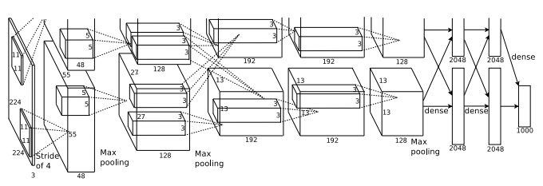

## 近期图像识别的进展
在1998年，MNIST被人提出，然后用了几周的时间训练了一个当时水平很高的网络，得到了一个大体上还行，但是比我们用GPU不到一个小时就训练出来的网络要差。因此，现在MNIST不是我们推进技术发展的问题了，不过因为训练的速度MNIST对于我们学习和实验而言，依然是一个很好的选择。同时，研究的关注点在改变，现代的工作更多的是关注于更加复杂的图像识别问题。在本节中，我们会简要的说明一下现在使用神经网络进行图像识别的发展。

本节和本书的大部分并不一样。在本书中，我们一直都关注于一些很有意思的思想--比如反向传播博，正则化，卷积网络。我一直在避免写一些很新颖的但是无法确认长期价值的东西。虽然严格点说，这些结果可能不只是一时的，会造成一些冲击。有一些怀疑论者可能会说“近期图像识别上的进展会是这种一时的结果么？两三年后，随着时间的推移，技术也在进步。这些结果很可能就是一些专家在某些特定领域上的技术进步，为什么我们还要花费时间来看，学习呢？”

这些怀疑论有些是正确的的，在时间推进中，一些近期的论文会变得不是那么的重要。近年来在图像识别上，深度神经网络取得了重大的突破。想象一下在2100年的计算视觉相关的历史性论文中，他们可能会把2011年到2015年认为是深度网络驱使下的重大突破。但是这并不意味着2100年人们依旧会使用卷积网络，或者dropout，ReLU等。但是这确实是一种重要的过渡。这大概就像是原子的发现或者抗生素的发现一样，这种历史级别的发现发明。所以我们并不会深入的研究一些细节，但是还是需要理解其中的一些重要思想。

### The 2012 LRMD paper:
我们先从一篇2012年的由一群斯坦福和google的研究者们发表的论文开始（[Building high-level features using large scale unsupervised learning, by Quoc Le, Marc'Aurelio Ranzato, Rajat Monga, Matthieu Devin, Kai Chen, Greg Corrado, Jeff Dean, and Andrew Ng (2012).](http://research.google.com/pubs/pub38115.html) 这篇论文中的网络结构和我们之前所研究的结构相差很大。 Broadly speaking, however, LRMD is based on many similar ideas.）我们在这里将这片论文称作LRMD，这个取自于前四个作者的姓。LRMD使用神经网络对ImageNet图像进行分类，这是一个很有挑战性的图像识别任务。2011年ImageNet数据有2万种类别的一千六百万彩色图片。图片全部从网络上爬取，由亚马逊的人提供的分类服务。下面是几张图片（这些图片来自于2014年的数据集和2011年的有所不同不过都是很相似的，具体的信息可以这个paper [ImageNet: a large-scale hierarchical image database, by Jia Deng, Wei Dong, Richard Socher, Li-Jia Li, Kai Li, and Li Fei-Fei (2009).](http://www.image-net.org/papers/imagenet_cvpr09.pdf)）：

这些图片分别是，圆线刨（？），洋葱根，热牛奶，蚯蚓。如果你想要尝试一下，你可以看看ImageNet的[hand tools](http://www.image-net.org/synset?wnid=n03489162)列表，这里面有一些圆线刨，横纹刨，倒棱刨，以及其他十几种刨子。我们不知道你怎么样，反正我们是没什么信心分辨这些工具的。这比MNIST可难多了。LRMD网络可以得到ImageNet图像集上15.8%的分类准确率。这个听起来没有那么的好看，但是相对于之前的最好的9.3%的准确率是一个巨大的进步。这种进步说明神经网络在ImageNet这种富有挑战的图像识别任务上是一个很有力的方法。

### The 2012 KSH paper:
LRMD被一篇2012年的Krizhevesky，Sutskever和Hinton(KSH).([ImageNet classification with deep convolutional neural networks, by Alex Krizhevsky, Ilya Sutskever, and Geoffrey E. Hinton (2012).](http://www.cs.toronto.edu/~fritz/absps/imagenet.pdf))KSH在一些受限制的ImageNet数据集上使用深度卷积网络训练和测试。这些子集来自于一个比较出名的机器学习竞赛—the ImageNet Large-Scale Visual Recognition Challenge（ILSVRC）。使用一个竞赛的数据集可以让他们和别的新技术有良好的对比。ILSVRC-2012训练数据集包含有12玩的ImageNet图像，分为1000类。验证集和测试集分别包括50000和150000个图片，也都来自对应的1000个目录。

在ILSVRC竞赛中一个不太一样的地方是很多图像都有多个物体。假设一个图片是一直拉布拉多追着一个球，那么正确的分类是拉布拉多。将这个图片标记为球是否会有惩罚呢？因为有这种歧义，每个图片会有5个分类标签，如果算法识别出其中一个就算是正确的，在这种情况下，KSH的深度卷积网络可以达到84.7%的准确率。这比比赛的第二名73.8%好多了。当完全的限制了分类标签时，KSH网络可以达到63.3%。

由于他的卓越功效，他还是值得我们在这里简单的说明一下的。这和我们之前的网络挺像的，补货更加的精细。KSH使用了深度卷积网络使用两个GPU进行训练。他们使用两个GPU（GTX580）是因为一个芯片的显存太小，没办法完整的存储整个网络。所以他们将网络划分成两部分，使用两个GPU来训练他们。

KSH网络有7层隐藏神经元，前5层全都是卷积层（一些带着池化），最后两层是全连接层，输出层是一个具有1000个单元的softmax层，对应着1000个图像分类。下面是网络的架构（从KSH论文中抄出来的）。详细信息在下面。注意到很多层都被分成了两部分，对应两个GPU。

输入层是3 * 224 * 224个神经元，对应的是224 * 224图片的RGB值。回忆一下，我们之前所说的，ImageNet的图片分辨率是不同的，这就带来了一个问题，因为神经网络的输入层通常会是一个固定的大小。KSH通过将每个图片进行缩放让最短的边的长度达到256，然后呢在缩放后的图像中心选出256 * 256大小的区域。最后KSH随机的从256 * 256的图像中选择了一个224 * 224的子图。他们将这种随机选择作为一种对于训练集的扩展，也以此来减少过拟合。这在类似于KSH这样的大型网络中是很有用的。然后这个224*224的图像作为网络的输入。绝大多数情况下，这个抽出的图像仍显包含着原图中的主要物体。

继续来看KSH网络的隐藏层。第一个隐藏层是一个卷积层，包括一步max—pooling。使用了11 * 11的局部感受野，滑动长度为4（每次移动4个像素）。一共有96个特征图。特征图划分成两组，每组48个，前48个放在一个GPU里面，后48个在另一个GPU里。这一层和下一层的max-pooling区域为3*3，不过这里的池化区域允许重叠，每次相隔两个像素。

第二个隐藏层依然是一个卷积层，有一个max-pooling。使用5*5的局部感受野，有256个特征图，每个GPU处理128个。要注意，特征图仅仅有48个输入信号，而不是之前一层的全部96个输出（通常情况下是全部）。这是因为每个特征图都使用单一GPU的输入。所以，网络结构和我们之前所说的不一样了，不过，基本思想还是一样的。

第三，四，五个隐藏层依旧是卷积层，不过和之前的不一样，这里的卷积没有max-pooling。他们的参数分别是：（3）384个特征图，3 * 3的局部感受野，256个输入信号；（4）384个特征图，有3 * 3的局部感受野，192个输入信号；（5）256个特征图，3*3的局部感受野，192个输入信号。注意第三层为了使用全部的256个输入信号，包含了GPU间的通信（可以看看图）。

第六层和第七层是全连接层，每层有4096个神经元。

输出层是1000个softmax。

KSH使用了很多技术的优点。他们没有使用sigmoid或者tanh作为激活函数，而是选择了ReLU，这显著地加速了训练过程。KSH 的网络有接近6千万个参数要学习，因此就算训练集很大依然容易产生过拟合。为了克服这个他们使用了我们之前说过的随机生成策略。他们也使用了l2正则化和droput来解决过拟合问题。网络使用mini-batch随机梯度下降。

这是对于KSH的一个概述，我们忽略了一些细节，如果感兴趣的话可以直接看论文，你也可以看看Alex Krizhevshky的 [cuda-convent](https://code.google.com/p/cuda-convnet/)（以及后面的文章），里面有很多他们的思想的代码实现。一个基于Theano的实现（[Theano-based large-scale visual recognition with multiple GPUs, by Weiguang Ding, Ruoyan Wang, Fei Mao, and Graham Taylor (2014)]（http://arxiv.org/abs/1412.2302））也有的，代码公开在[这里](https://github.com/uoguelph-mlrg/theano_alexnet)。代码的主要思想和本章中所说的是一样的，虽然使用多个GPU是有点复杂的，还有基于Caffe的神经网络结构可以看看他们的“[模型乐园](http://caffe.berkeleyvision.org/model_zoo.html)”。

### The 2014 ILSVRC competition:
从2012年开始，人们实现了各种突破。要提一下2014年的ILSVRC比赛。和2012年一样，包含有120万的从属于1000个目录的图片，评价手段是前5个预测出来的类别是否包含有正确的类别。获胜队伍主要来自google（[Going deeper with convolutions, by Christian Szegedy, Wei Liu, Yangqing Jia, Pierre Sermanet, Scott Reed, Dragomir Anguelov, Dumitru Erhan, Vincent Vanhoucke, and Andrew Rabinovich (2014).](http://arxiv.org/abs/1409.4842)）使用深度卷积网络，有22层的神经元，他们称之为GoogLeNet,致敬LeNet-5.GoogLeNet在top-5的评价手段下，达到了93.33%的准确率，相对于13年的胜利者（Clarify,88.3%）和2012年的KSH 84.7 有着巨大的提升。

所以GoogLeNet到底有多好？在2014年，一组研究人员写了一篇关于ILSVRC的调查论文（[ImageNet large scale visual recognition challenge, by Olga Russakovsky, Jia Deng, Hao Su, Jonathan Krause, Sanjeev Satheesh, Sean Ma, Zhiheng Huang, Andrej Karpathy, Aditya Khosla, Michael Bernstein, Alexander C. Berg, and Li Fei-Fei (2014).](http://arxiv.org/abs/1409.0575)）其中指出的一个问题就是人类在ILSVRC上的表现是怎么样。他们建立了一个系统让人类进行ILSVRC图像分类。其中的一个作者，Andrej Karpathy，在这个[博客](http://karpathy.github.io/2014/09/02/what-i-learned-from-competing-against-a-convnet-on-imagenet/)中有详细的信息，让人类识别超过GoogLeNet十很有难度的：
     ...从1000个目录中给一副图片打5个标签是很难得，对于那些一直研究ILSRVC的同学也是需要一些时间去分类的。首先，我们先找了一些很熟悉数据的人（Amazon Mechanical Turk），然后找了一些不太熟悉的人,然后我们组织了一个标注活动，然后我们对GoogLeNet进行了一些改进，输出前100个让人们在这100个中标。但是这依旧是很难得，人们依然有错，错误率在13-15%左右。最后我们意识到了其实要去接近GoogLeNet是一件挺困难的事情，最有效的就是和训练GoogLeNet一样忍受痛苦的漫长的训练过程，最后我们可以减少个几分钟，大概一分钟一张图片，一些很复杂的就需要多一些时间去标注了。我最后很熟练的识别狗的品种了，在我所选出来的样本中，GoogLeNet的错误率6.8%，我自己的错误率最后达到了5.1%。

换言之，一个专家，很细心的工作，很努力，最后也只是险胜神经网络。实际上，Karoathy提到了第二名专家的错误率有12.0%这就比GoogLeNet差多了。专家有近一半的错误都是由于他们错误的将正确答案当做备选了。

这是令人惊讶的结果。当然了，后来又有一些研究团队说他们的标注错误率要比5.1%要好。在有些媒体上人们称之为机器比人好的论证。当然了，结果是很振奋人心的，就是其实还是有些误导的地方。ILSVRC是一个很有限的问题，开放网络中爬到的图片并不能代表人们所真正能接触到的。而且，这个top-5的规则太人为了，我们在图像识别上还是有很长的路要走的，更广义一点，在计算视觉上。在近几年中我们在这个极富挑战的问题上收获了了这么大的进步还是很有意义的。

### Other activity:
我们一直关注于ImageNet，但是还是有很多其他的使用神经网络进行图像识别的活动。我们简单的说一下近期的有趣的结果。

一个解决实际问题的，效果也不错的实践，来自google的团队，他们使用深度卷积网络来识别谷歌街景中的门牌号([Multi-digit Number Recognition from Street View Imagery using Deep Convolutional Neural Networks, by Ian J. Goodfellow, Yaroslav Bulatov, Julian Ibarz, Sacha Arnoud, and Vinay Shet (2013).](http://arxiv.org/abs/1312.6082))。在他们的论文中，提到了在自动的转写一亿个门牌号上，准确率已经很接近于人类操作员了。这个系统速度很快：他们的系统识别整个法国的门牌号可以在不到一个小时完成。他们说“这个新的数据集显著地增加了google地图在很多国家，尤其是没有其他好的地图编码的国家，的地图编码的质量。….我们也相信这种能够解决短序列图像识别的模型可以有很多应用"

我们说的应该都是鼓舞人心的结果。当然了还有很多有趣的工作,不过我们还不是很懂他们的基础。比如2013年的paper（[Intriguing properties of neural networks, by Christian Szegedy, Wojciech Zaremba, Ilya Sutskever, Joan Bruna, Dumitru Erhan, Ian Goodfellow, and Rob Fergus (2013)](http://arxiv.org/abs/1312.6199)），展示了深度网络可能收到盲点的影响，下面的图片中，左侧的是正确识别出的图像，右侧的是做了一些改变的图片，中间的是变化，经过一些小的改变，网络分类结果就错了，作者发现这是一个普遍现象。

这个结果是很令人不安的。论文使用的网络基于KSH网络--这种网络应用越来越广泛，理论上来讲，这些网络的计算函数是连续的但是实际上结果却是不连续的。更糟糕的是，这和我们的直觉是相违背的。这很让人担心。而且，我们不清楚为什么会发生这种不连续：是因为代价函数？激活函数？网络结构？还是别的什么？我们无从知晓。

现在，这些结果并没有那么的可怕了。虽然，这种“对抗”的图片很常见，不过在实际上很少存在，论文提到了：
     这种对立的反例和网络衡量网络表现不是一回事。虽然，如果网络的泛化能力足够好，那么就不会因为这种对立而困扰，因为这个和正常的图片是很接近的。不过这种对立结合是很难出现的，测试集中几乎无法观察到。

即使如此，这也很让我们痛苦，我们对于神经网络的理解真的是太可怜了以至于最近我们才发现这种问题。不过这种问题还是有很多好处的，他们激发了我们继续探索后续工作。比如，一个最近的论文（[Deep Neural Networks are Easily Fooled: High Confidence Predictions for Unrecognizable Images, by Anh Nguyen, Jason Yosinski, and Jeff Clune (2014).](http://arxiv.org/abs/1412.1897)）可以生成人们认为是白噪音但是却可以被神经网络是别的图片。这从另一方面说明了我们在使用深度神经网络进行图像是别的路上还有很多路要走。

尽管有这样那样的结果，总的而言，结果还是振奋人心的，我们可以看到在不同基准下的巨大进步，比如ImageNet。我们也看到了在解决实际问题上的巨大图片，比如街景上的的门牌号识别。但是这种鼓励，鼓舞还不足以让我们在现实应用中使用。还存在很多基本问题我们难以理解。就像那个对立的图片。当这些基本的问题不断地被发现（都不用去想解决），说我们已经解决图像识别还是太早了。同时这些问题还会不断地刺激后续工作。

## 别的使用深度神经网络的方法
贯穿本书，我们都关注于一个问题：MNIST数字分类问题，这是一个很有趣的问题，贯穿其中我们涉及到了很多有意思的想法：随机梯度下降，反向传播，卷积网络，正则化等等。但是这依然是一个比较狭隘的问题。如果你读过一些神经网络的文章，你会接触到诸如递归神经网络，玻尔兹曼机，生成模型，迁移学习，强化学习等等，等等，等等。神经网络是一个很广泛的领域。不过很多思想其实都是我们之前讨论过的思想的变种，稍微努力一点就能理解的。在本节中，我们简单的介绍一下。这里的讨论都是简单的说明，不具体也不全面--就是一种扩展。我们仅作简单的介绍，并帮助你完成一些概念上的联系。我们会提供一些连接到其他资源的链接，你可以从中学习。当然了，这些东西很快就会过时，你也可以去找新的东西，不过我们希望尽可能的提供最新的介绍。

### Recurrent neural networks (RNNs):
在前馈神经网络中，我们使用一次输入作为整个网络的激活信号。这是一个较为静态的过程，网络中的所有都是固定的，冻结的。但是，假设我们允许网络中的元素可以以一种动态的方式不断地改变呢。比如一个隐藏神经元不仅仅接受他前一层的激活值，也接受更早时候的激活值。也就是说，一个神经元会被它在之前时候的激活值所影响。这在前馈神经网络中是不会发生的。也就是说，隐藏层和输出层的神经元不仅仅被当前输入所影响，也会被之前的输入影响。

拥有这种时序行为的神经网络被称为循环神经网络或者RNN。上一段中我们所给出的描述其实有很多不同的数学表达方法，你可以在[wiki](http://en.wikipedia.org/wiki/Recurrent_neural_network)上看到一些数学表达。wiki中列出了不下13中不同的模型，但是抛开数学细节，RNN的主要思想就是神经网络会随着时间动态变化。而且，在对于那种时序方面的数据是很有用的。比如语音和自然语言等。

RNN的另一个用途在于将神经网络和传统算法的思考过程链接更为紧密，主要基于图灵机和传统的编程语言。一个2014年的[论文](http://arxiv.org/abs/1410.4615)，建立了一个RNN可以一个字符一个字符的接受一段非常简单的Python代码，然后根据代码预测输出。通俗点说就是，网络学会了“理解”python程序。2014年的另一篇[论文](http://arxiv.org/abs/1410.5401)，使用RNN作为起点建立神经元图灵机（NTM）。这是一种通用计算机结构，可以使用梯度下降来训练。他们训练了NTM可以用来推理一些简单问题，比如排序和复制等。

实际上，这些都只是很简单的玩具模型。学习执行python程序 print(398345+42598) 并不能使得我们的网络成为一个有用的python解释器。我们并不清楚这些想法可以推进多远。然而结果还是很有意思的。从历史上看，神经网络在模式识别问题上做的很好，传统方法就有些不怎么样了。反之，传统方法在解决神经网络不太擅长的问题上还是有优势的。至少现在还没人用神经网络去做一个web服务或者数据库。如果能够将传统算法和神经网络结合起来会是很有力的。而RNN可以帮助我们做这些事。

RNN在近几年很多问题上都被使用。尤其是在语音识别上。比如，被用来识别录音集合中的音效准确度，也被用来[改进人们讲话时的语言模型](http://www.fit.vutbr.cz/~imikolov/rnnlm/thesis.pdf)。更好的语言模型可以用来帮助我们消岐。一个好的语言模型可以告诉我们一段录音，到底说的是“to infinity and beyond”还是“two infinity and beyond”RNN开始不断地在这些领域和场景下打破记录。

这些工作仅仅是深度神经网络各种应用中的一种而已。比如一种基于深度神经网络的方法可以得到[大量词汇集下的连续语音识别上的出色结果](http://arxiv.org/abs/1309.1501)。另一个基于深度网络的系统被应用在google的android操作系统中（相关的工作可以参看[这里](http://research.google.com/pubs/VincentVanhoucke.html)）

我们介绍了一些RNN可以做的事，但是没有说具体是怎么工作的。也许这不会让你感到惊讶，很多在前馈网络中的思想也可以在RNN中应用。比如在训练RNN的时候我们可以简单地修改一下梯度下降和反向传播就能用了。很多其他前馈网络中好用的思想，在RNN中也可以被很好的使用,比如正则化等等。本书中提到的很多技术都可以在RNN中使用。

### Long short-term memory units (LSTMs):
RNN中一个不太好的地方就是靠前的神经元很难得到好的训练，比前馈神经网络难多了。原因就是我们在第五章中讨论过的不稳定的梯度问题。回忆一下,这个问题最明显的症状就是梯度在反向传播过各层的时候越来越小。这就导致了前面的层的训练变得很慢很慢。问题在RNN中变得愈发明显了。因为梯度不仅仅是在网络的层之间反向传播，梯度还跟随时间传播。如果网络训练了很长时间，那么梯度就会变得极度不稳定，就很难学习了。幸运的是，我们可以将长短期记忆单元合并到RNN中。这个单元在1997年由[Hochreiter和Schmidhuber](http://dx.doi.org/10.1162/neco.1997.9.8.1735)提出详细的说明了怎么直接的帮助解决不稳定的梯度问题。LSTM 使得训练RNN变得比较容易的得带好的结果。很多最近的论文（包括我们之前所提到的）都使用了LSTM或者相关的思想。

### Deep belief nets, generative models, and Boltzmann machines:
现代人们对于深度学习的兴趣起始于2006年的一篇论文，解释了如何训练一种叫做深度置信网络（DBN( [A fast learning algorithm for deep belief nets, by Geoffrey Hinton, Simon Osindero, and Yee-Whye Teh (2006)](http://www.cs.toronto.edu/~hinton/absps/fastnc.pdf), 还有 [Reducing the dimensionality of data with neural networks, by Geoffrey Hinton and Ruslan Salakhutdinov (2006).)](http://www.sciencemag.org/content/313/5786/504.short)）DBN在一段时间很有影响力，但是没有前馈神经网络和递归神经网络一样流行。不过即使如此，DBN还是有一些特性使得他们很有意思的。

DBN有趣的一点是他是一种我们称之为生成模型。在前馈网络中，我们给定输入的激活值，然后这些激活值会决定网络后面的特征神经元的激活值。像DBN一样的生成模型可以应用在类似的场景下，但是也可以指定一些特征神经元的值，然后“反向的运行网络”，生成输入值。更准确一点，一个在手写数字图像上训练的DBN也可以用来生成类似于手写数字的图片。换言之，DBN可以学会写字。从这种角度来说，一个生成模型很像人类的大脑：不仅仅可以读，也可以写。用Hinton的话说，[学会识别要先学会生成图片](http://www.sciencedirect.com/science/article/pii/S0079612306650346)。

DBN另一个有趣的地方是它可以用来作无监督和半监督学习。比如，当训练图像数据时，DBN可以从理解其他图像中学到有用的特征，即使训练图像是没有标签的。而且，这种能够进行无监督学习的能力是很有趣的，从基础研究和应用上来说都是很有趣的。

既然，拥有这么多吸引人的特性，为什么DBN没有成为一种很受欢迎的深度学习模型呢？一部分原因是一些诸如前馈网络，递归网络在图像和语音识别上已经取得了巨大的突破。对于这些模型人们投入了大量的关注是很正常的。不过，不幸的是，在思想交流上，现在有着一种“胜者为王”的想法，而且，在很多领域上，大家都关注于时下最流行的想法。这对于那些致力于不是很流行的思想研究上的人们，就变得很困难了，即使是这些思想看起来很有长期价值。我个人认为，DBN和其他的生成模型还是值得人们投入研究的。如果DBN或者相关的模型在未来某天变得十分流行的话，我们也不会感到意外。如果你对DBN有兴趣的话可以看看[这里](http://www.scholarpedia.org/article/Deep_belief_networks)，[这个](http://www.cs.toronto.edu/~hinton/absps/guideTR.pdf)也很有帮助。后面那篇文章并没有主要关注于深度置信网络，但是它所讲述的玻尔兹曼机是DBN的关键。

### Other idea：
还有别的什么在深度学习和神经网络上的进展么？其实还有很多有趣的工作的。其实在[NLP](http://machinelearning.org/archive/icml2008/papers/391.pdf)（[这里也有](http://arxiv.org/abs/1103.0398)）领域和[机器翻译](http://papers.nips.cc/paper/5346-information-based-learning-by-agents-in-unbounded-state-spaces)领域深度学习都很活跃的，更惊奇的还有[music informatics](http://yann.lecun.com/exdb/publis/pdf/humphrey-jiis-13.pdf)。还有很多别的领域。大多数情况下，看完本书，你应该可以能跟上一些最新的研究了，虽然，你可能还是缺少一些必要的知识。

我们还是通过一些有意思的论文来结束本节。有一种结合了深度卷积网络的技术，增强学习，被用来学习如何玩[游戏](http://yann.lecun.com/exdb/publis/pdf/humphrey-jiis-13.pdf)，这个是一些[后续研究](http://www.nature.com/nature/journal/v518/n7540/abs/nature14236.html)。他的思想是使用卷积网络来简化游戏中的图像信息数据，转化成为一种更简单的特征集合，然后使用这些特征集合进行决策，“向左”，“向右”，“开火”，等等。特别要指出的是，他们使用一个网络来学习七种不同类别的游戏，而且效果很好，在三个游戏中都超过了人类的表现。现在，这些看起来都像是噱头一样，而且，因为题目“使用增强学习来玩雅丽达游戏”。但是越过表面之后，我们想一下，这个系统仅仅接受一些像素信息，他们根本不知道游戏规则，而却能够从这些书中学习到不同场景下的决策，每一个都是很复杂的集合。这是很神奇的。

## 神经网络的未来
Intention-driven user interfaces（意图驱动的用户接口）：有一个很老的笑话：一个急躁的教授对一个困惑中的学生说“不要听我所什么，而要听我的意思。”很多时候，计算机很像是那个困惑的学生，不能够理解用户的意图。不过这种状况正在被改善。我还记得第一次在google上输错了关键词，但是google却提示“你是不是想要[正确的关键词]”然后提供了正确的答案。Google 的CEO 拉里佩奇曾经说，[完美的搜索引擎应该是理解你的查询的意思，并且返回给你想要的结果](http://googleblog.blogspot.ca/2012/08/building-search-engine-of-future-one.html)。

这就是一种关于意图驱动的用户接口的愿景。在这个愿景中，搜索引擎并不是仅仅去返回对于用户查询的字面的反馈，而是去理解一些模糊的语义，用户的意图。

这种意图驱动的接口的思想，可以在搜索之外的很多领域应用。过几十年后，上千家公司会使用机器学习来构建产品的用户接口，可以从比较模糊的情况下获得用户的真实意图。我们已经见到过一些早期的意图驱动的用户接口了，比如苹果的siri，wolfram 的alpha，IBM的watson，以及可以[标注照片视频的系统](http://arxiv.org/abs/1411.4555)，等等。

这些产品大部分会失败。好的用户接口的设计并不简单，不过我们希望很多公司可以使用有力的机器学习技术来构建好的用户接口。如果你的用户接口设计不好，就算是最好的机器学习方法也没有用。但是，会有一些成功的产品存活下来。假以时日，我们和计算机之间的沟通方式会发生巨大的改变。并没有很远以前—2005年吧—人们理所应当的认为和计算机之间的沟通应该十分精确。诚然，计算机本身是很精确的符号表示，一个错误的分号都会导致系统的崩溃。但是经过十几年以后我们期望可以有许多成功的意识驱动的用户接口，可以改变我们和计算机之间的交流方式。

### Machine learning,data science, and the virtuous circle of innovation:
机器学习并不仅仅是用来建立用户接口。另一个重要的应用是在数据科学上，机器学习被用来学习隐藏在数据后面的位置的知识“known unknown”。这是一个很流行的领域，已经有很多地方都写了，所以我们不会说很多，不过要提的是，很多地方并没有说过，这种流行会导致一种结果：假以时日，机器学习上的重大突破不会是某个概念的突破，而是通过在数据科学上的应用，机器学习的研究会获益良多。如果一个公司可以在机器学习上得到10%的收益，那么会有很多钱投入到机器学习的研究上。换言之，机器学习会成为驱动技术突破的引擎，创造更多的机会和市场。结果就是大量在机器学习上有专长的人会收获巨大的资源，这会进一步的推进机器学习，然后创造更多的机会和市场。

### The role of neural network and deep learning:
我们一直在说机器学习会是新技术和机会的创造者。那么神经网络和深度学习在这里究竟扮演着什么样的角色呢？

为了回答这个问题，看一下历史是很有帮助的。回到上个世纪80年代人们对于神经网络的发展都表示乐观，尤其是反向传播被广泛地认识之后。到了90年达，这种激动逐渐褪去，人们开始将注意力转移到了其他的一些技术上，诸如SVM等。直到今天，神经网络重新被人们所重视，刷新了多项记录，在很多问题上都取得了成功。但是，谁能说明天不会有一种新的技术大白神经网络呢？或者神经网络的研究停滞不前了呢？

出于这种原因，去思考整个机器学习的未来，要比单独的思考神经网络的未来简单一些。一部分原因是因为我们对于神经网络的理解太浅显了。为什么神经网络可以有很好的泛化能力？为什么它可以在具有大量参数的情况下还能避免过拟合？为什么随机梯度下降可以工作的这么好？随着数据集的扩大，神经网络到底可以有多么好的表现？比如，当ImageNet的数据集扩大10被，神经网络的改进会比其他机器学习方法好还是差？还有一些别的简单，基础的问题。目前为止，我们还不能很好的理解这些问题。所以，神经网络在机器学习的未来中到底会扮演怎样的角色是很难预测的。

我们仅仅做一个预测：我们相信，深度学习会发展至此：对于不同层级概念的学习，构建多层的抽象，看起来是这个世界的基本。这并不意味着明天的深度学习会和今天的截然不同。我们会看到组成单元（神经元？）的改变，架构的改变，或者算法的改变。这些改变可能很戏剧性，戏剧性到我们不在认为这是神经网络。但是本质上，还是在进行深度学习。

### Will neural network and deep learning soon lead to artificial intelligence?:
我们在本书中主要关注于使用神经网络处理诸如图像分类等特殊任务，我们来开一下脑洞：计算机的通用目标是什么？神经网络和深度学习可以帮助我们解决人工智能问题么？如果可以的话，结合近期深度学习的进展，我们可以期待通用的人工智能会很快就到来么？

全面的回答这些问题可能需要整本书的篇幅。我们仅仅能够提供一些挂念，基于[Conway’s law](http://en.wikipedia.org/wiki/Conway%27s_law):
     一个公司所设计的系统的架构，必然会反应公司的交流架构。

所以，按照Conway’s law 的建议，波音747的设计其实反映了在波音747设计时波音公司的结构。或者，简单点的例子，比如有个公司设计了一个复杂的软件应用。如果应用的看板支持机器学习算法，那么简历看板的人肯定要和公司的机器学习专家有沟通。Conway’s law就是这么的显而易见。

很多人听到Conway’s law的第一反应就是“这真的这么显而易见？”或者“这是真的么？”。我们先从这种反对意见—这是错的--开始。作为反对的一个例子，思考一下：波音公司的会计部门在747的设计中何处体现了？家具部门呢？内勤部门呢？答案是可能根本没有。所以我们应该理解，Conway’s law 仅仅是用于那些设计，实施，工程部门。

那么其他的反对意见呢？Conway’s law是平庸的，显而易见的么？这个可能是正确的，但是我们不这么认为。对于组织，公司而言大家通常会忽视Conway’s law。团队在设计构建新的产品的时候往往会利用一些遗留系统，或者相反的，缺少那些必须的专家。想一下那些有着无用的复杂特点的产品，或者那些有着明显缺点的产品，比如一个糟糕的用户接口。这两种情况往往是因为真正需要好产品的团队和真正实施的团队之间缺乏必要的沟通。Conway’s law可能是显而易见的，但是并不意味着人们都会注意到。

Conway’s law应用在设计和实施系统上，给了我们一个理解各个组件和构建的好方法。虽然他不能直接的应用在人工智能上，因为AI（目前而言）并不是这样的一个问题：我们并不知道各个组件是什么。何况，我们甚至都不知道问题是什么。换言之，相对于工程，AI更像是一个科学问题。想想一下在没有喷气引擎和空气动力学的时候我们如何设计波音747。你不知道你的公司需要什么样的人才，就像沃纳·冯·布劳恩说的：“问题的关键是在我不知道我做什么的时候我在做什么”。有没有一种Conway’s law可以应用在更偏向科学而不是工程的问题上呢？

为了更好的理解问题，我们回顾一下医学的历史。在在早期的时候，医学人员，像Galen和Hippocrates一样，研究整个人体。但是随着我们的知识增加，人们更加关注于特定领域。我们发现了很多深入的新思想（My apologies for overloading "deep". I won't define "deep ideas" precisely, but loosely I mean the kind of idea which is the basis for a rich field of enquiry. The backpropagation algorithm and the germ theory of disease are both good examples.）：比如病症的微生物体系，或者抗体的研究，或者心，肺，血管，动脉等。这种深入的研究往往是基于一些子领域诸如流行病学，免疫学以及内科等等。这种认知的结构反映了我们的社会结构。比如免疫学：意识到了免疫系统的存在，并且意识到这个系统使得研究，这是很了不起的发现。所以，我们的医学领域—包括专家，会议，甚至奖项等等--这种结构往往是不可见，没有实体的。

这是一种通用的模式，在很多科学都是这样的：不仅仅是医学，包括物理学，数学，化学等等。领域最初是巨大的，有很少的深入的思想。早期的专家可以掌握整个学科的思想。但是随着时间的推移，这种巨大发生了改变。我们发现了很多深入的的新思想，多到一个人根本不能完全掌握。结果就是这个领域的社会结构发生重组和划分。相对于整体，我们有了一个个领域包含着小的领域包含着更小的领域，一种复杂的，递归的，自包含的社会结构。这种结构反映了我们人类之间的联系。所以我们对于知识的结构反映了我们的社会结构。但是这种社会结构又帮助我们继续深入的研究。这就是科学版的conway’s law。

那么这对于深度学习和AI有什么用呢？

早期的时候AI界存在着大量的争论，一方说“这不会很难得，我们有着一种超级武器”通过这种“超级武器”反击并不足够。深度学习是最新的争论中的超级武器（Interestingly, often not by leading experts in deep learning, who have been quite restrained. See, for example, this [thoughtful post](https://www.facebook.com/yann.lecun/posts/10152348155137143) by Yann LeCun. This is a difference from many earlier incarnations of the argument.）早些时候的争论中多是逻辑，概率图，或者专家系统，或者别的。这些争论的问题在于，他并不会告诉你这种方法到底比别的方法好多少，好哪里。当然了我们刚刚用了一整章来书名深度学习可以用来解决一些极富挑战的任务。这看起来确实是很激动人心的。但是这和概率图和[Eurisko](http://en.wikipedia.org/wiki/Eurisko)或者那些年的专家系统一样的。所以，仅仅有的事实是一些看起来很好的思想其实并不能说明太多。我们能否说深度学习真的就和早期的一些思想完全不一样呢？有没有一种方法来很亮一种思想到底有多可靠多有理呢？Conway’s law给了我们一种建议，可以通过对社会体系复杂度和这些思想进行关联。

所以，这里就有两个问题要说了。首先，按照社会复杂读的衡量，这些深度学习的思想有有效？第二，为了构建一个通用的人工智能，我们需要一个多强大的理论？

对于第一个问题：我们审视今天的深度学习，这是激动人心的，快速发展的，但是一个关联的整体的。有一些深度的思想，一些主要的会议，但是会议之间有着明显的重叠。有着一篇接一篇的论文，却是借助同样的思想：使用随机梯度下降，或者一些变种来优化代价函数。看到这些思想获得成功是很棒的，但是我们没能看到一些建设好的子领域，每个领域都在研究者自己的一些思想，并在不同方向上共同推动深度学习。所以，参考社会复杂度这个衡量法则，深度学习仍然是一个很浅的领域。仍然是有人可以称为整个领域的专家。

对于第二个问题：为了构建一个通用的人工智能，我们需要一个多强大的理论体系？当然了，这个问题的答案是：没人有确切答案。但是在附录中我们提到了一些这个问题上存在的证据。总结一下就是我们还是需要很多很多很多很深入的思想才能构建一个人工智能。所以根据Conway’s law 我们必然会看到很多相互关联的学科的出现，反应我们的思想结构。但是我们还没能从深度学习和神经网络中看到这种结构。所以我们认为，还是至少需要几十年时间才能使用深度学习简历一个通用的人工智能的。

我们在这个含糊的，有争议的结尾上遇到了很多麻烦。这无疑会困扰那些学习的人。在线阅读中，我看到很多人大声的，坚定地断言一些有关人工智能的观点，但是这些观点的背后理由没有那么的见识。我们的奇怪观点是：这些还太早了。就像一个老笑话说的那项，如果你问一个科学家离发现还有多久，他们说“10年”或者更久，往往意味着，我不知道。人工智能，就像可控的核聚变以及其他一些技术一样，还有60+年以上的10年。反过来说，我们在深度学习上的发展还远没到极限，有很多开放的基本问题仍然等待解答。这是富有挑战的机会。
