# Ch4 神经网络可以拟合任何函数的可视化证明
```
本章有很多可视化的例子，主要是关于函数图像的，在原文中这些例子都是js写的，可以自己进行操控，不过在这里用md我还不太会实现，所以就仅仅截了几个图，建议可以回去看原文，自己动手会更加的有效果的。
http://neuralnetworksanddeeplearning.com/chap4.html
```
关于神经网络的一个最重要的事实是，神经网络可以计算拟合任意函数。假设有人给了你一个复杂的，波动的函数 f(x)

无论是怎么样的一个函数，都会有一个神经网络对于每一个可能的输入x，得到输出f(x)或者某种近似：
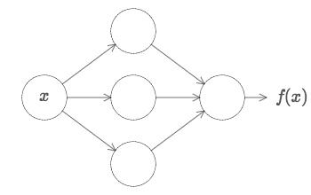
如果函数有多个输入多个输出，神经网络也是可以处理的，比如下面的网络可以计算一个有3个输入和2个输出的函数：
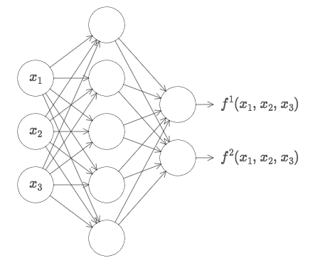
这表明神经网络具有一种普适性，无论我们想要计算什么样的函数，都可以通过神经网络达到这样的目标。

而且，这种普适性在我们限制网络的输入输出层之间仅有一层隐藏层的时候依旧是有用的。所以，就算网络的结构非常简单但是网络依然可以非常强大。

使用神经网络的人都很了解这种普适性。但是关于这种普适性的证明却很少有人知道。很多解释都是很技术性质的。比如一个最初的证明这个性质的论文[Approximation by superpositions of a sigmoidal function, by George Cybenko (1989)](http://www.dartmouth.edu/~gvc/Cybenko_MCSS.pdf).这个论文的结果在当时广为流传，同时期有不少别的研究者也发现了类似的结果， 另一篇论文则是[Multilayer feedforward networks are universal approximators, by Kurt Hornik, Maxwell Stinchcombe, and Halbert White (1989)](http://www.sciencedirect.com/science/article/pii/0893608089900208). 这篇论文使用了Stone-Weierstrass定理得到了类似的结果，使用了Hahn-Banach理论，Riesz Representation 理论和一些傅里叶分析。如果你是一个数学家，那么这看起来就不难，但是对于大多数人还是很难理解的。不过还好，我们还是可以有一种简单的好方法来理解这种普适性的。

本章中，我们会给出一种简单的基本的可视化的解释。我们会一步一步的来讲述这个思想。你会理解为什么神经网络会具有这种计算所有函数的普适性。你会理解这里面的一些限制。你也会理解这个结论对于深度神经网络有什么作用。

为了理解本章中的材料，你不需要回过头去看之前的内容。本章的结构是自包含的。你仅仅需要对神经网络稍微熟悉就可以跟的上我们的思路。不过我们还是会偶尔的补充一下相关的链接，以防你忘掉了。

普适性原理在计算机科学中是广泛存在的，太多了，所以有的时候我们看到了都不以为然。但是还是值得说明一下的就是：计算特定函数的能力是很重要的。几乎所有的你能想到的过程都可以认为是在计算一个函数。你可以把给音乐起名字当做是在计算一个函数，可以把将英文翻译成中文当成是一种函数（实际上应该是许多函数之一，因为有很不同的翻译方式）。甚至，也可以把给一个视频文件生成描述当做是一个函数。普适性的意思是，原则上讲，神经网络几乎可以做所有这些事情，甚至更多。

当然了仅仅是因为我们知道存在这样的可以做翻译的神经网络，并不意味着我们有足够好的方法可以构造或者去识别出这样的一个网络。这对于一些传统的算法也是一样的，比如Boolean circuits。但是我们在本书之前的部分已经见证过了，神经网络对于拟合函数有一种强大的算法。这种学习算法+普适性是一种很有吸引力的组合。目前为止，本书都关注于学习算法，在本章，我们会关注于普适性，和普适性意味着什么。

## 两个警告
在开始解释为什么普适性是正确的之前，我想要先对于我们之间说的“一个神经网络可以拟合任何函数”做出两点说明。

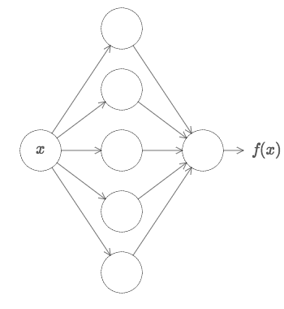
如果我们继续增加隐藏神经元的个数，就能得到更好的结果。

为了让我们的陈述更加的清晰，假设现在有一个函数f(x)，我们希望去拟合这个函数，同时保证准确率在$\epsilon$的误差，我们可以通过使用最够多的隐藏节点来保证我们可以找到一个满足,对于所有输入x，输出g(x)，$|g(x) - f(x)| < \epsilon$的网络。换言之，对于所有的输入，都要保证网络的输出误差小于$\epsilon$。

第二点就是我们所能近似计算的函数，必须是连续函数。如果函数是不连续的，比如间断的，那么通常情况下是不太可能用一个神经网络进行计算的。不过，如果我们想要计算的函数真的是不连续的，那么即使使用神经网也不是不行。不过这不是重点。

总结一下，对于我们的神经网络的普适性的更加严谨的说法是拥有一个隐藏层的神经网络可以对连续函数进行计算，并且保证结果在一定的准确范围内。在本章中我们会提供一个弱一点的版本的证明，我们将使用2个隐藏层，而不是一个。在问题中我们会简单的说一下我们可以通过一点变化让我们的证明适应于一个隐藏层的神经网络。

## 在只有一个输入一个输出情况下的普适性
为了理解为什么神经网络上的普适性是正确的，我们可以先从构建一个计算具有单一输入输出的函数f(x)的神经网络开始。

这其实是我们理解普适性问题的核心，一旦我们理解了这种特殊情况，那么就很简单的去将它扩展到具有多个输入输出的情况了。

为了建立一个如何拟合计算函数f的直觉，我们从构造一个仅仅含有两个隐藏节点，一个输出节点的网络开始：
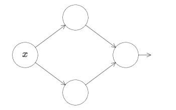
为了建立构建神经网络的直觉，我们先关注于最上面的神经元，在下面的图中你会看到输出随着权重的变化：
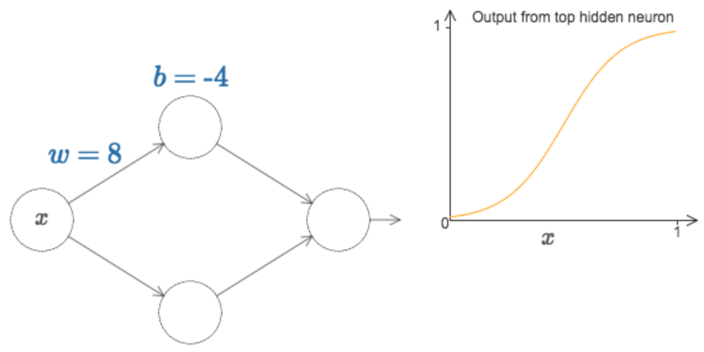
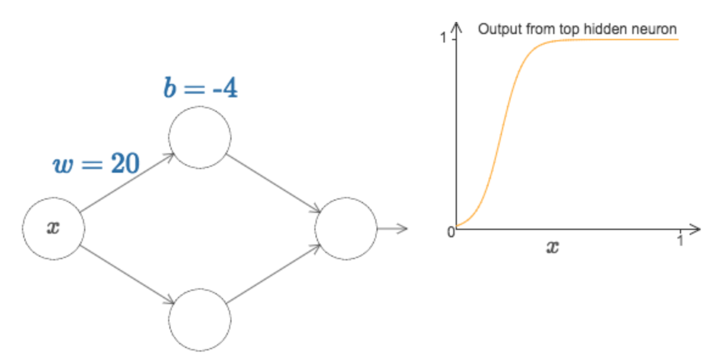
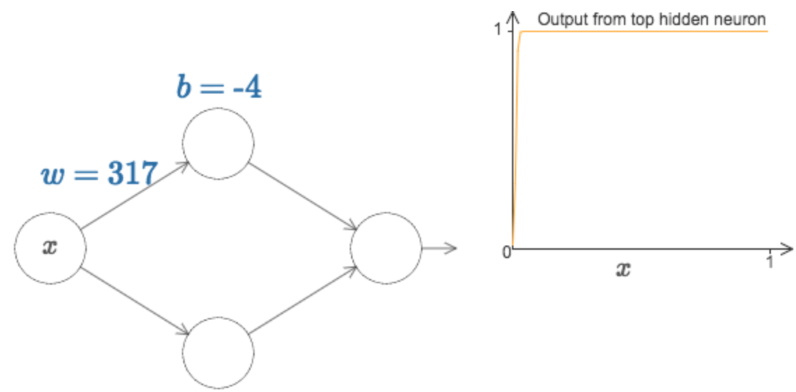
和前面的章节一样，这里的神经元是sigmoid神经元$\sigma(wx+b)$,其中$\sigma(z) \equiv 1/(1+e^{-z})$。目前为止，大家应该已经习惯了这样的代数表达。但是为了证明普适性，我们需要忽略这里的代数表示观察上面的图像来得到一种更加直观的表示。它不仅仅给了我们更好的关于接下来会发生什么的解释，也给我们了一个证明(严格来讲，这里我们所采用的可视化的方法并不像传统方法一样是个严格的证明，不过我们认为这种可视化的证明给了我们更直观的理解。并且，这种直观的解释的目的是证明。个别情况下，我们所说的一些理论是有漏洞的：这些做可视化的地方看似合理但是并不严谨，所以如果有地方让你感到困扰，那么可以试着去填上我们所缺失的部分，不过不要忘了，我们的目的是去理解普适性的正确)，证明我们的神经网络的激活函数可以得到的不仅仅是sigmoid函数。

对于上面所展示的，如果我们增大偏移量，那么你会看到这时的我们的图像整体左移了，但是形状并没有发生改变。
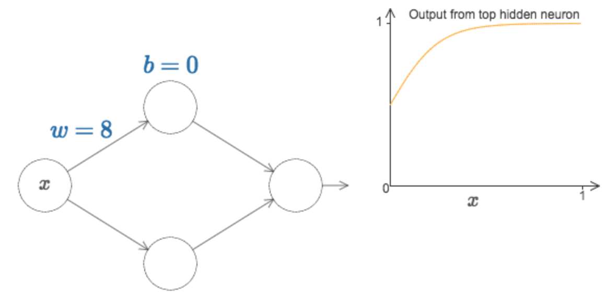
当我们减小偏移量的时候：图像右移，同样的，形状并没有发生改变
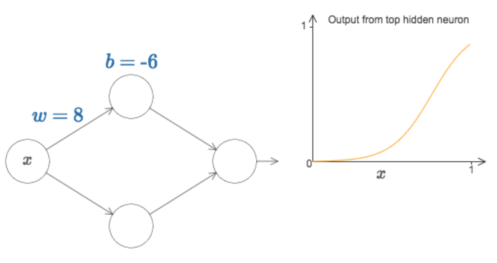
然后我们把权重减小一点到2或者3，你会看到曲线变得平缓了，不过同时，你要去改变偏移量这样才能看到曲线完整的形状。

最后我们把权重增加到100，当你这么做了以后，曲线会变得很陡峭
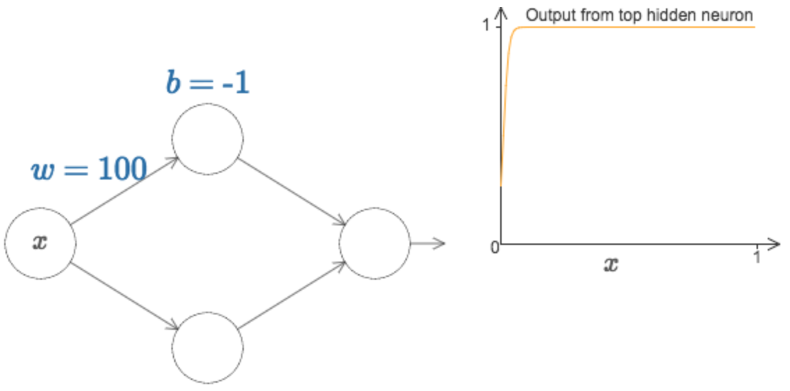
开始看起来像一个阶梯函数.

我们可以通过大幅增加权重来调整我们的神经元输入使得他真的很像一个阶梯函数。下面我们画出当我们把隐藏层神经元的权重增大到999的时候：
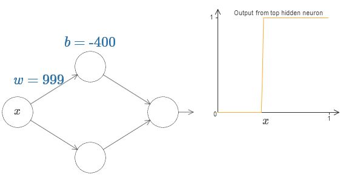
使用阶梯函数其实要比使用sigmoid函数简单得多，这是因为所有的隐藏神经元都对输出神经元有贡献，去计算分析一大堆阶梯函数要比分析一大堆sigmoid函数简单得多。所以如果我们假设所有的隐藏神经元都输出的是阶梯函数就让后续工作变得简单得多。具体一点说就是我们先把权重w变得很大，让我们的隐藏神经元输出变得像阶梯函数一样，然后通过调整偏移量，来调整阶梯的位置。当然了把输出当做是阶梯函数仅仅是一种近似，不过这是一个很好的近似，现在，我们将它当做是一种准确的计算。稍后我们会回来讨论这种近似所造成的影响。

当阶梯发生的时候我们的x是什么值呢？或者说，当阶梯发生的时候，这个点和我们的权重以及偏移量有什么关系呢？

为了回答这个问题，我们可以通过修改上图中的权重和偏移量来观察，你会发现发生解题的点的大小和偏移量正相关，和权重负相关。实际上，这个阶梯的位置是：$s = -b/w$：
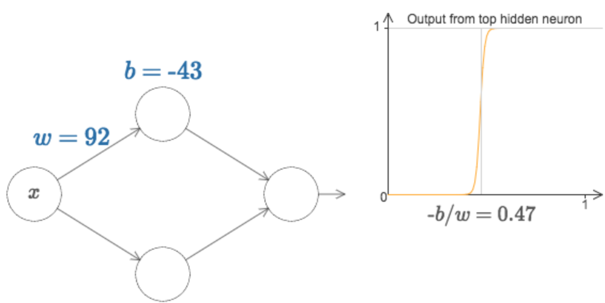
当我们使用一个参数来描述隐藏神经元,事情就变得很简单了。
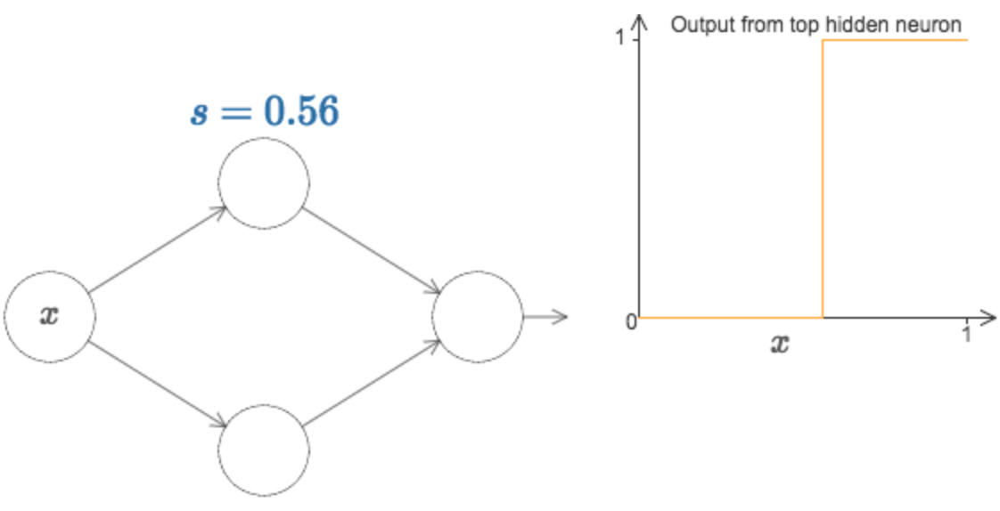
就像上文所说到的一样，我们把神经元的输入权重设置为一个很大的值，大到可以保证我们对阶梯函数有一个好的近似。然后根据所想的到的s通过$b=-ws$求出b的值，从而将sigmoid神经元转化成所希望得到的阶梯函数。

目前为止，我们仅仅是在关注最上面的隐藏神经元，现在让我们看一下整个网络的行为。要说明的是，我们假设隐藏神经元是计算阶梯函数的，参数是s1（上面的神经元的），s2（下面的神经元的）然后我们就得到了这样的输出：
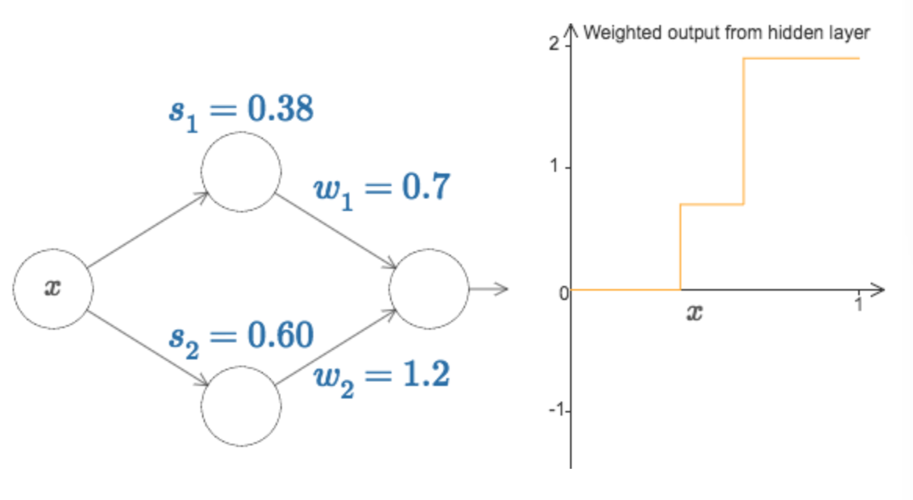
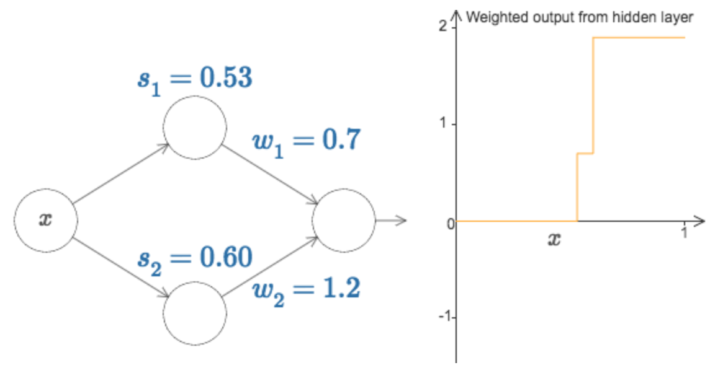
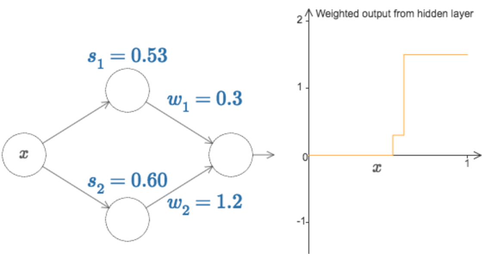
上面的图像中的右半部分其实描绘的是$w_1a_1+w_2a_2$是整个隐藏层的加权输出，这里，$a_1$，$a_2$分别对应的是上面的和下面的隐藏神经元的输出，要注意的是整个网络的输出是 $y =  \sigma(w_1a_1+w_2a_2+b)$, 这里，b是输出神经元的偏移量,显然，和我们在这里所画的隐藏层的加权输出是不一样的. 现在我们先关注于隐藏层的加权输出，在稍后的地方，稍后我们就会去讨论整个网络的输出和我们这里的加权输出的关系。这也就是我们经常提到的神经元的激活值。

试着去增加减少最上面的神经元的阶梯点，会帮助你理解输出结果是怎么改变的。

最后，我们把$w_1$设为0.8，$w_2$设成-0.8你会得到一个“跳跃的”函数，从阶梯点1开始到阶梯点2结束，高度为0.8.
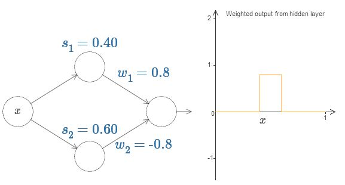
当然了我们可移动过改变参数使得我们的这个跳跃的高度发生改变：
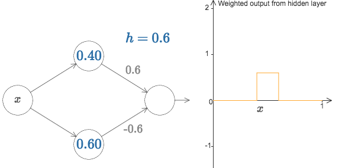
你会发现这个时候，我们的神经网络不仅仅可以作为一种数学上的，图形化的表示，同时也可以表示成程序的格式，一种if-then-else形式的声明：
```
    if input >= step point:
        add 1 to the weighted output
    else:
        add 0 to the weighted output
```
虽然大多数的地方我们使用图形化的表示，但是其实有的时候使用这种类似于if-then-else的表达相对会更加容易帮助我们理解。

我们可以通过增加两个隐藏神经元来得到一个两次“跳跃”的网络：
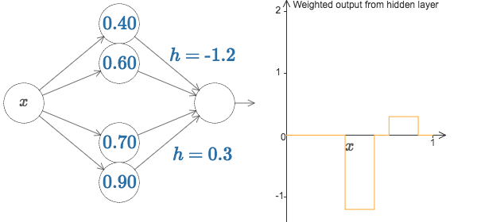
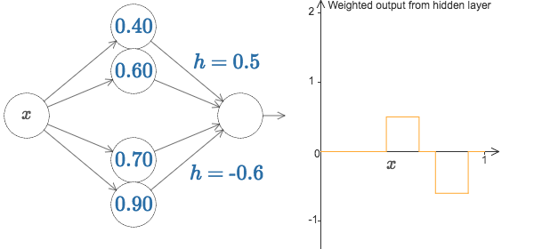
这里我们简化了一下表示，简单的用一个h来表示一对神经元，我们可以通过增加或者减少h值来改变图像中“跳跃的高度”。

而且，我们可以使用这种思想去加入多个我们想要的“跳跃”，以及他们的高度。要说明的是，我们可以将区间[0,1]划分成很多，N，个区间，使用N对隐藏神经元来设置我们想要的对应的高度。我们看一下N=5的情况。因为这并不是很多，所以我就画出来了，但是图像有点复杂，其实我们可以更加抽象一点，不过这样完全的展示出来会对理解上有很大的帮助：
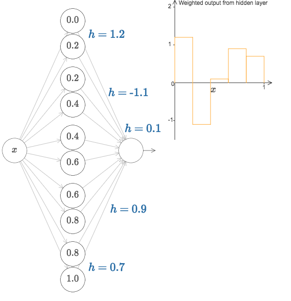
你可以看到，这里有5对隐藏神经元，他们的阶梯点分别是0，1/5,然后是1/5和2/5，直到最后的4/5和5/5。还记得上面所说过的阶梯发生的点s么，这里就是通过对这5对神经元的s进行设置，从而得到了这样的固定区间。

每一对神经元都有一个对应的h值，要记住，每一对的神经元和输出神经元之间连接的权重是h和-h。然后我们就可以通过改变h的值来改变隐藏层的加权输出结果了。

下面就是有难度的地方了。

我们回到本章最初所画的图像：

这幅图像实际上是下面的函数的图像：
$\begin{eqnarray}
f(x) = 0.2+0.4 x^2+0.3x \sin(15 x) + 0.05 \cos(50 x),
\tag{113}\end{eqnarray}$
图中的x轴和y轴表示的范围都是从0到1的。

使用这么一个函数并不是完全随机选择的，我们将会一步步的使用神经网络来拟合这个函数。

在上面的网络中，我们已经分析了隐藏层神经元的加权输出的组合$\sum_j w_ja_j$，现在已经知道怎么去控制它的值，但是我们也曾经说过，这个值并不是网络最终的输出，网络真正的输出是$\sigma(\sum_jw_ja_j+b)$这里b是输出神经元的偏移量。那么有什么方法能让我们真正的控制网络的实际输出么？

方法是有的，我们可以设计一个神经网络，使得这个网络的隐藏层节点的加权输出是$\sigma^{-1}\odotf(x)$，这里$\simga^{-1}$就是函数$\sigma$的反函数。也就是说我们希望隐藏层的加权输出是：
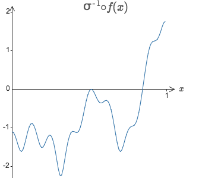
如果我们可以做到这一点的话，那么就可以让整个网络的输出变成对于f(x)的一个很好的相似。(要注意的是这里我们把输出神经元的偏移量设为了0)

现在，你所面临的挑战就是设计一个神经网络来估计上面的目标函数。尽可能的学习，我们希望你可以尝试解决两次。第一次，就先在我们上面设计的网络中调整不同的“跳跃”的高度，我们很简单的就能找到一个相对较好地对于目标函数的估计。我们可以使用平均误差来衡量我们的估计的好坏，所面临的挑战是希望这个误差尽可能的小，对于这个函数来说，我们可以做到的是能达到0.4左右的误差。(下图是我自己调整的一个结果，你可以来[这里](http://neuralnetworksanddeeplearning.com/chap4.html)自己手动的调整一下这个五个"跳跃"函数所组成的函数图像，如果有足够的耐心的话，完全能够达到更好的结果)
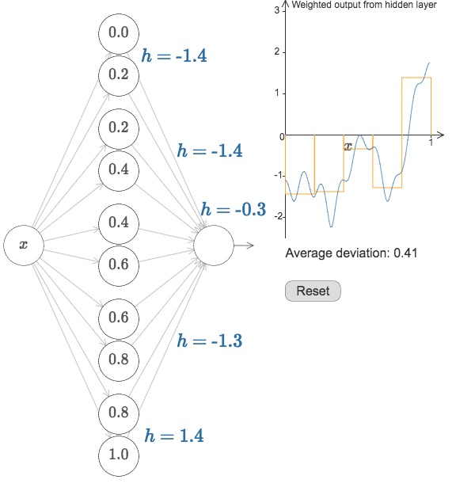
现在应该已经明白了使用神经网络来计算函数f(x)的所有的必须的元素。这仅仅是一个粗略的估计，不过我们可以通过增加神经元的个数来得到更多的“跳跃”从而得到更好的近似。

要说明一下，将我们在上面得到的所有的数据转换回标准的神经网络的参数是很简单的，下面来简单的看一下。

第一层的权重都要设的很大的常量，比如说w = 1000

隐藏层节点的偏移量就是b = -ws。比如说我们的第二个神经元s = 0.2，那么偏移量就是b = - 1000*0.2 = -200.

到输出层的权重就是h的值。所以，举个栗子，我们设计的第一个h,h=-1.4，就是说这两个隐藏节点的输出权重分别是-1.4和1.4，等等。

最后，输出层的偏移量是0.

这基本上就是所有了：现在，我们有了一个完整的描述，描述一个在拟合我们原始的目标函数$f(x) = 0.2+0.4 x^2+0.3x \sin(15 x) + 0.05 \cos(50 x)$时效果很好的神经网络，同时我们也明白了可以通过增加隐藏层的神经元的个数来改进我们的这种近似计算的方法。

而且，我们的原始目标函数并没有什么特别之处，我们可以使用一样的处理过程处理任何[0,1]区间内的函数。本质上而言，我们通过使用一个简单的单层神经网络建立了一个函数表。接下来就可以继续进行关于普适性的更加通用的证明了。


## 多元输入的情况
现在让我们把上面的结论扩展到输入是多元变量的情况下中去。这个看起来很复杂，但是我们所需要的仅仅是理解有两个输入的情况，然后就可以进行推广。所以，就直从处理两个输入的情况开始吧。

我们先看一下当一个神经元拥有两个输入的时候：
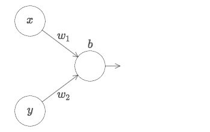
这里我们有输入x和y，他们对应的权重分别是$w_1$和$w_2$，以及这个神经元的偏移量$b$。我们先将权重$w_2$设为0，然后调整第一个权重$w_1$和偏移量$b$来看一下是怎么影响神经元的输出的：
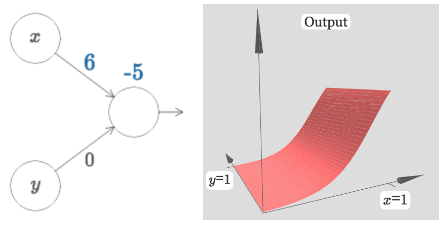
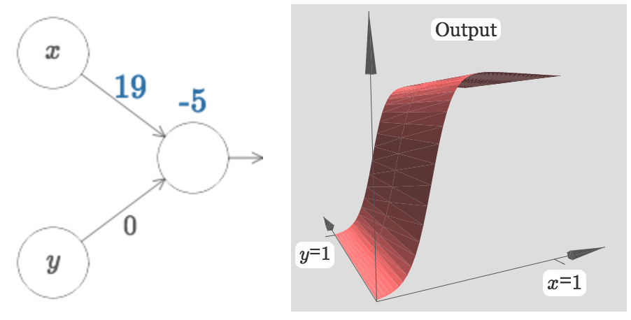
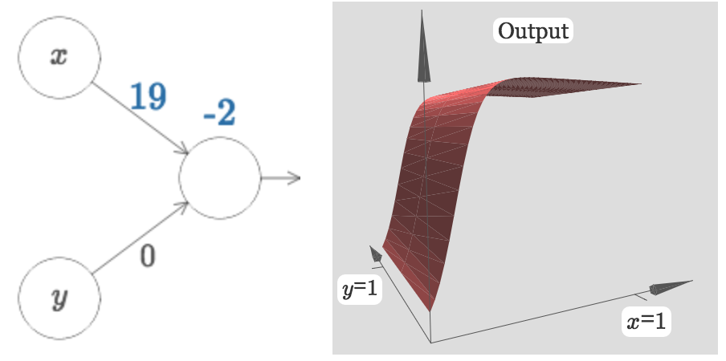

你可以看到，当$w_2$为0的时候输入y并会不对于神经元的输出造成影响，这个时候其实就是只有x一个输入(只不过我们将之前的二维平面扩展到了三维空间)。

你认为当我们把$w_1$增大到100，$w_2$还是0的时候会发生什么呢？
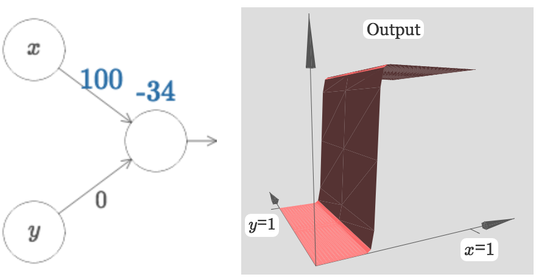
你一定能猜到，就和我们之前所讨论的一样，当权重变得很大的时候我们的图像就很接近于阶梯函数。不同之处在于现在我们的阶梯函数是一个三维的。和之前一样的，可以通过改变偏移量来移动我们的阶梯函数的阶梯点。不过在这里关于阶梯点的准确描述应该是：$s_x \equiv -b/w$。

现在，我们重复之前的步骤，使用阶梯点作为函数的参数(或者严格一点的说应该是阶梯函数的那个阶梯发生的位置)：

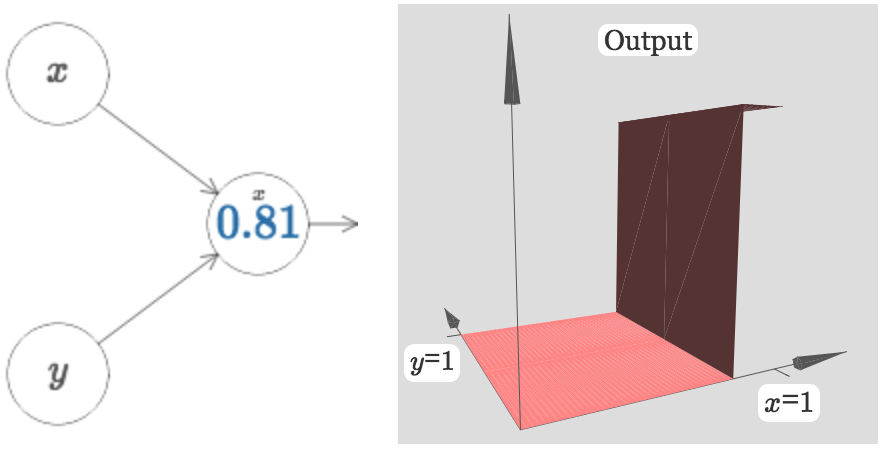
这里，假设在x上的权重是一个很大的值，这里使用的值是$w_1 = 1000$，$w_2 = 0$。神经元上的数就表示阶梯点，上面的小x表示这是x方向上的阶梯，同样的我们也可以做在y方向上的阶梯函数，就是把$w_2$变得很大，然后$w_1$设为0就行了：
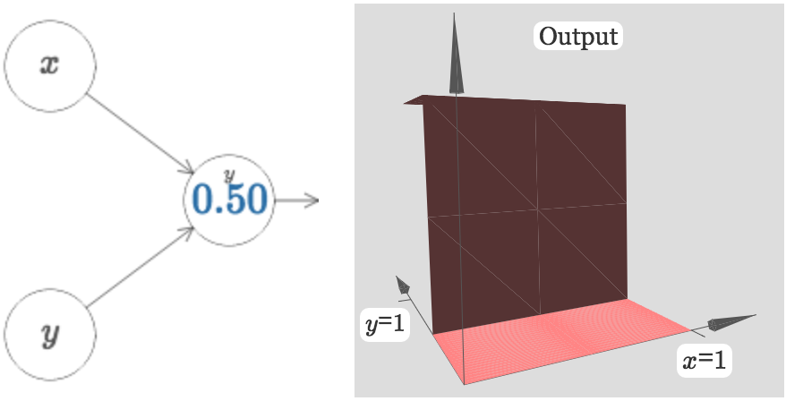
神经元上的数就表示阶梯点，神经元上的小y就表示了这个是y的阶梯点，其实我们可以在图上表示出对应的权重，但是那样会导致图像变得很难看，所以就先用这样的表示方式，但是要记得，这意味着我们的y的权重很大，x的权重为0.

同样的，和在之前对于一个输入的时候操作一样，通过增加一个隐藏神经元就可以得到一个三维空间上的“跳跃函数”。不过为了达到这样的目标，需要两个神经元分别都表示x方向上的阶梯函数，有着对应的输出权重h和-h，这里h是对于”跳跃”高度的值。那么，很简单的就可以得到下面的图像：
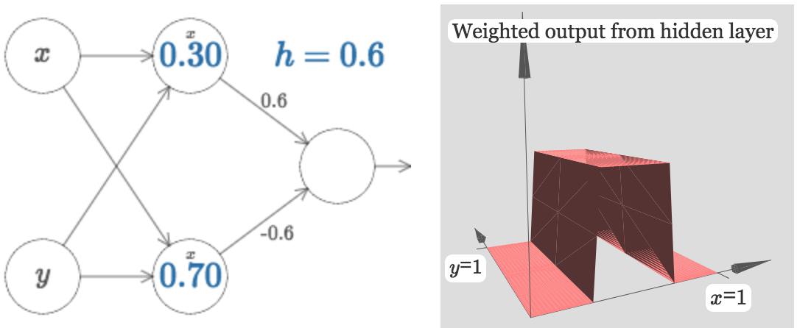
同样的，也是可以得到在y方向上的"跳跃函数"：
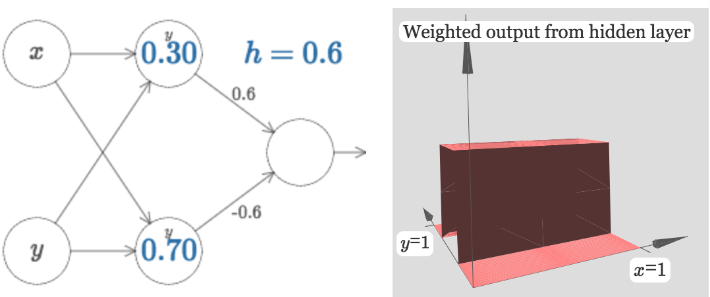
这和上面的x的很像，唯一不同的就是这里神经元上的小字母变成了y，重新强调一下，现在我们处理的是y方向上的阶梯函数，不是x方向上的，所以y所对应的权重$w_2$很大，而x对应的权重$w_1$应该是0.

下面就是一个有意思的事情了，当我们把y方向上的跳跃函数和x方向上的跳跃函数组合起来会发生什么呢？
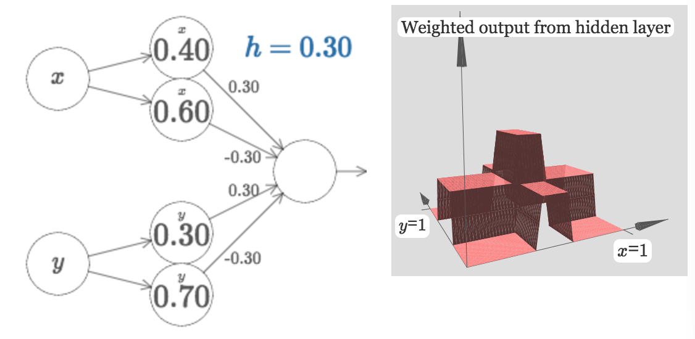
为了方便画图，在这里，暂且忽略掉了权重为零的链接。不过还是保留神经元上的小标志，这是为了提醒你这个神经元对于加权输出方向上的影响，或者说这个神经元是作用在哪个方向上的“跳跃函数”。稍后的时候我们会把这些小标记都去掉。

大家应该很快就能想到，随着对于权重的不断调整，我们可以得到如下的函数图像一个像塔一样的函数：
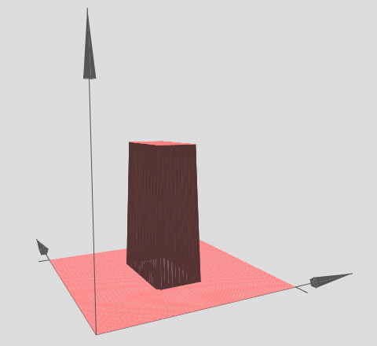

如果我们可以得到这样一个小塔一样的函数，那么我们就可以通过对这样的小塔进行不断地叠加，从而得到对任意函数的一种估计或者说拟合：

当然了，目前还没有说明如何去创建这样的小塔，在上面，通过组合x和y方向上的"跳跃"函数，我们得到的是一个高2h周围四面的高为h的一个函数图像。

不过，很明显的是我们还是可以通过一定的参数选择从而得到这样的一个函数图形。回忆一下在前面的描述中，我们将一个"跳跃"函数用if-then-else语句进行了描述：
```
if input >= threshold:
    output 1
else:
    output 0
```
这是在神经元有一个输入的情况下发生的，如果我们把它扩展到有多个输入的时候就是下面的行驶了：
```
if combined output from hidden neurons >= threshold:
      output 1
else:
      output 0
```
通过对于阈值的选择，比如将阈值设为3h/2，这正好是我们的塔的高度和平台的高度中间的值，这样就可以保留着塔而让平台消失。

你可以想明白这是怎么发生的么？下面的网络会给出一点启示，要注意这里和之前不一样的地方是，这里的图像所画出的是整个网络的输出，而不仅仅是隐藏层的加权输出，也就是说，我们对隐藏层的加权输出加上了偏移量，然后我们在使用$\sigma$函数。你能找到合适的h和b从而得到一个塔么？这需要点技巧，如果你还是感到困惑，那么这里有两个提示：(1)为了使输出神经元能够有类似于if-then-else的行为发生，我们需要输入权重（所有的h或者-h）很大；(2)偏移量b其实就是if-then-else：中的阈值：
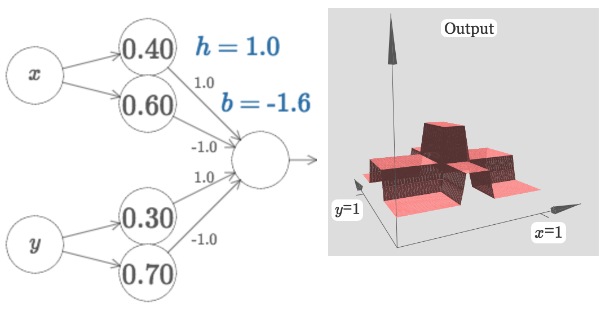
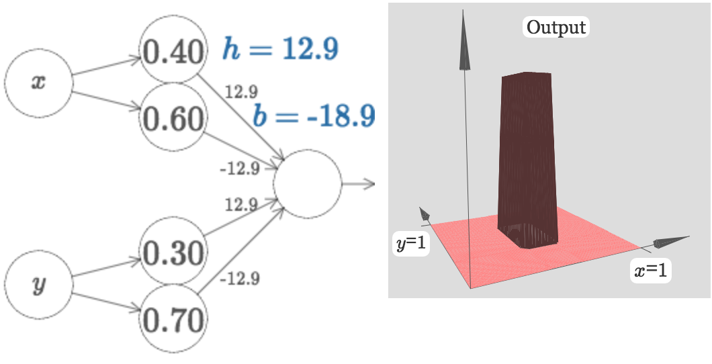
在我们的初始化的参数下我们的图像看起来像是之前的那个图形的压缩版，有塔有平台。我们可以通过增加h来让图像变高，然后选择$b \approx -3h/2$，就可以得到一个纯粹的塔了。

可以看到，即使是一个相对较小的h，我们都得到了很好的结果，当然了，我们也可以通过继续增加我们的h，保持$b \approx -3h/2$来让我们的塔更高。

现在，让我们试着把两个这样的网络组合起来，来计算一个有两个塔的函数为了让他们看起来更清晰，我们把相应的神经元圈起来，放到一个框框里：


你可以看到通过改变最后一层的输入权重来改变塔的高度。

使用同样的想法，我们就能得到一个计算多个塔的函数，可以通过调整参数使得这些塔的形状变细，也可以让他们达到我们想要的高度，从而就可以使得网络的输出达到我们所期望的效果：
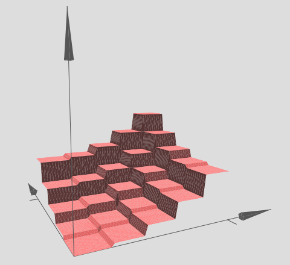

在这里，还需要强调的一点是还记得在神经元有一个输入的时候我们最后做的事情么？为了保证整个网络最后的输出是对于$f$的一种拟合，我们需要让输出层神经元的输入是$\sigma^{-1} \odot f$(这可能看起来有点拗口，不过意思你一定能明白的)。

那么，对于拥有两个以上的输入的情况呢？

我们可以看一下简单的三个输入$x_1,x_2,x_3$。这其实表示的是一个4维空间的函数：

这里，$x_1，x_2，x_3$表示网络的输入。$s_1，t_1$表示网络的阶梯点--就是网络中第一层所有的权重都很大，偏移都设置成使得阶梯点为s1，t1,s2,.....第二层的权重分别是+h，-h，这里h是一个很大的数，输出的偏移量是-5h/2。

这个网络的结果是当x1在s1和t1之间并且x2在s2和t2之间，并且x3在s3和t3之间的时候，网络的结果是1，其他时候都是0。通过把很多这样的网络组合起来，那么我们想要多少塔就要多少，经过这样的组合，就可以去估计任意一个具有三元输入的函数了。同样的，这样的想法在m维空间上也是可以用的。就是需要注意的是，要把偏移量设为(-m+1/2)h。

现在为止，我们知道怎么用神经网络去估计一个多元实数函数，那对于那种在空间$R^n$上的向量函数呢？其实，这样的函数完全可以当做n个独立的实数函数去计算，然后我们就可以把它们组合在一起了。所以这还是很简单的。

### 问题
我们已经看到了怎么使用有两个隐藏层的神经网络去估算一个函数，你能找到使用一层的证明么？作为提示，试着去处理仅有两个输入的情况，并且试着去证明：(a)不仅仅可以在x，y方向上得到阶梯函数，而可以在任意方向上。(b)通过叠加多个（a）可以得到一个圆形的塔；(c)使用圆形的塔可以得到任何函数。本章后面的部分讨论会对这个问题有帮助。


## Sigmoid 的扩展
我们已经简单的用可视化的方式证明了sigmoid神经元组成的网络可以计算任意函数。回想一下sigmoid神经元的形式，对于输入$x_1,x_2,,,,,,$sigmoid神经元的输出是$\sigma(\sum_j w_j x_j + b)$，和以前一样，这里的$w_j$是对应的权重$b$是神经元对应的偏移量，$sigma$就是sigmoid函数。
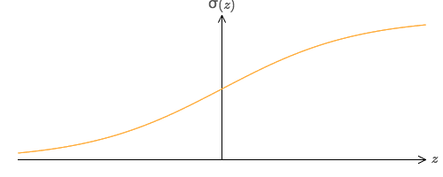
现在，让我们把情况推广一下，当使用别的激活函数的时候会怎么样呢，假设现在使用一个激活函数$s(z)$
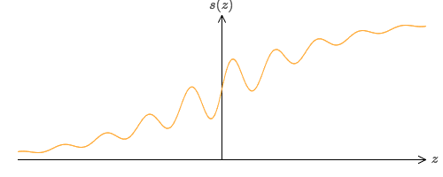
和使用sigmoid的时候情况很像，就是在这里神经元的输出变成了$s(\sum_j w_j x_j + b)$这种情况下我们还能够得到阶梯函数么？答案是可以的，而且和sigmoid神经元的处理是一样的，将$w$增大，然后调整偏移量b就可以了：
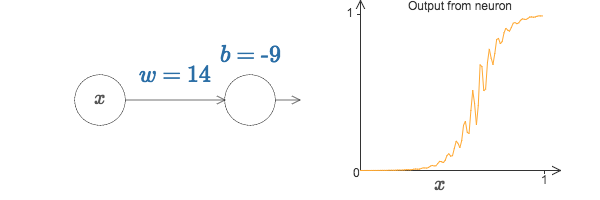
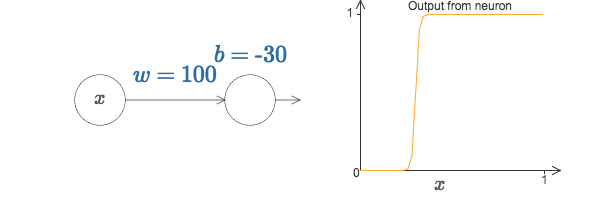

就像sigmoid一样的，这让新的激活函数变成了阶梯函数的一个很好的近似。试着去改变偏移量你就会发现我们可以改变函数的阶梯点。所以我们就可以继续使用类似于上问中的证明中的技巧了。

$s(z)$需要有什么性质才能让神经元这样呢？我们需要假设s（z）在z趋于正无穷或负无穷的时候都是有极限的。这两个极限就是我们的阶梯函数呈现的根本原因了。我们也需要假设这两个极限是不一样的。如果他们是一样的话，那么就不是一个阶梯就是一个水平线了。但是当激活函数满足上述的条件的时候这样的神经元就有了拟合上的普遍性。

## 问题
1）：我们在本书前面的部分看过另一种神经元——线性修正单元ReLU，解释一下为什么这样的神经元不满足普适性的条件。
```
因为ReLU在输入趋近于正无穷的时候没有极限
```
2）：假设我们来讨论一个线性神经元，比如神经元的激活函数是s(z) = z,解释为什么线性神经元不满足普适性的条件。
```
类似的，他没有极限。
```


## 阶梯函数的修正
目前为止，我们都是在假设神经元都是在准确的处理阶梯函数，这是个挺好的近似，但是仅仅是个近似。实际上还是有一些误差的，下图就是一个说明：
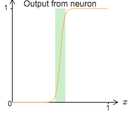
可以看到，如果当输入落在这个窗口的范围呢，上文所说的对于拟合的普适性就有了问题。

不过这并不是一个很恐怖的错误。通过将神经元的输入权重增加到足够大，我们可以将这个错误的窗口变得尽可能的小，基本上我们可以让窗口变得很小，甚至小到我们肉眼无法识别。所以看起来这并不是一个太大的问题。

不过，如果能真正的解决这个问题还是最好的。

实际上这个问题很好解决。我们先来看一下一个输入神经元和一个输出的时候。同样的这个想法可以扩展到更多的输入和输出上去。

假设，我们想要神经网络去计算某个函数f。就像我们之前一样。我们要试着去设计一个网络使得隐藏层的加权输出是$\sigma^{-1} \odot f(x)$:


使用上面的方法，就是要用一系列的由隐藏层组成的跳跃函数来拟合这个函数：
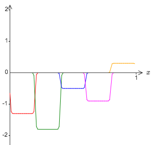
不过，在这里，为了方便观察，我们对会引起误差的窗口进行了一下扩大。如果我们把这些跳跃函数加起来，那么我们就能得到一个对于$\sigma^{-1} \odot f(x)$的合理的估计，除了那些错误窗口里面的部分。

假设，现在我们不使用上文所说的那种估计的方法，而是使用一个隐藏神经元的集合去估算我们的原始目标函数的一半$\sigma \odot f(x) /2$。这个时候的结果和上面的结果其实很像，只不过就是把输出缩小了一下：
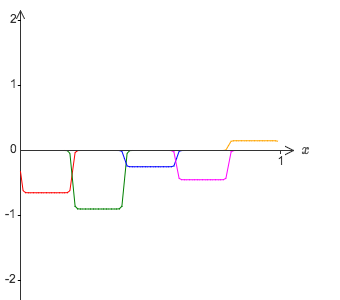

然后呢，使用另一个神经元的集合去计算$\sigma \odot f(x) /2$。不过，这里不仅仅缩放输出了，而且还把整个输出向右移动了半个区间。
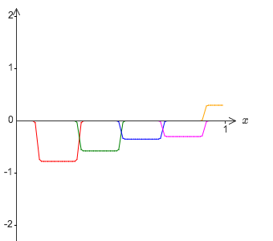

现在，我们有两种不同的方法去估计\sigma \odot f(x) /2$。如果我们把这两种估计加起来，那么我们就得到了一个对于\sigma \odot f(x)$的估计。这个估计还是会有小的错误窗口，但是会比之前小很多。这是因为一个方法的错误窗口并不是另一个的。

我们可以使用一个很大的数M，去设置M个近似方法，这样就会保证误差的窗口足够的小，从而达到一种更加良好的估计。

## 结论
我们所讨论的普适性，并不是一个指导如何使用神经网络的说明。从某种意义上看，和与非门的普适性挺像的。所以我们在本章的讨论都是尽可能的简单清晰。并没有关注于这个过程的细节。不过，如果你认为这很有意思，那么自己去改进我们的过程也是很有意义的。

虽然，在构造网络的时候，我们的结论并不会被直接用到，但是这个结论之所以重要到我们用一整章去描述，是因为他表明了任何函数都可以用神经网络去拟合，从而试图告诉我们，在使用神经网络去拟合的过程中，我们不需要去关心网络是否能够拟合，而是如何得到一个好的方法去拟合，

我们仅仅用两个隐藏层就计算了任意函数。同样的，我们也可以用一层隐藏神经元得到类似的结果。那么你可能会好奇，既然如此我们为什么还有多层网络呢？为什么我们不能仅仅使用一层的呢？

理论上讲，是可以的，但是使用深度网络是有很多好处的。就像我们第一章讲的一样，深度网络有一种启发式的结构，使得他在处理真实世界的问题上显得很有意义。更加确定的是，当解决比如图像识别等问题时，使用一个不仅仅是能够处理独立的像素，更能够处理一些复杂概念的组合：图形的边，多个对象的。在后面的章节中，我们将会看到一些使用深度网络能够比使用浅层网络更好的证据，更能学习到一些启发式的知识的证据。

总结一下：普适性告诉我们神经网络可以计算任何函数，从经验上看，在解决真实问题时，深度网络要比浅层网络有更好的适应性。
